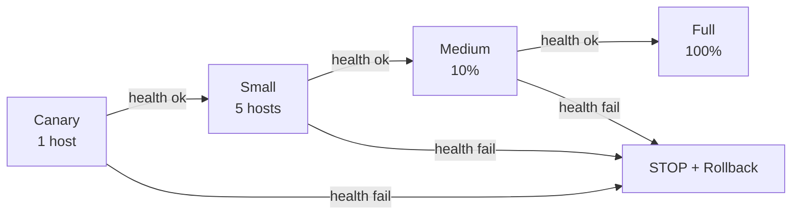

# How to Implement Progressive Rollouts with Ansible

Author: [nawazdhandala](https://www.github.com/nawazdhandala)

Tags: Ansible, Progressive Rollout, Canary, Deployment, DevOps

Description: Implement progressive rollouts with Ansible using canary deployments, incremental batch sizing, health checks, and automated rollback on failure.

---

A progressive rollout deploys changes to your infrastructure gradually, starting with a single host and expanding to larger groups as confidence builds. If something goes wrong, the damage is limited to the hosts already updated. Ansible provides all the building blocks for this pattern through serial, max_fail_percentage, health checks, and error handling.

## The Progressive Rollout Pattern

The idea is simple:

1. Deploy to 1 host (canary)
2. Run health checks
3. If healthy, deploy to a small group
4. Run health checks again
5. If healthy, deploy to a larger group
6. Repeat until all hosts are updated
7. If any step fails, stop and optionally rollback

## Basic Progressive Rollout

```yaml
# progressive-rollout.yml
---
- name: Progressive application rollout
  hosts: webservers
  serial:
    - 1        # Canary
    - 5        # Small batch
    - "10%"    # Medium batch
    - "25%"    # Large batch
    - "100%"   # Remaining hosts
  max_fail_percentage: 0  # Zero tolerance

  pre_tasks:
    - name: Announce batch start
      debug:
        msg: >
          Starting batch {{ ansible_play_batch }}:
          {{ ansible_play_hosts | join(', ') }}
      run_once: true

  tasks:
    - name: Pull new Docker image
      docker_image:
        name: "myapp:{{ deploy_version }}"
        source: pull

    - name: Stop current container
      docker_container:
        name: myapp
        state: stopped

    - name: Start new container
      docker_container:
        name: myapp
        image: "myapp:{{ deploy_version }}"
        state: started
        ports:
          - "8080:8080"
        env:
          APP_VERSION: "{{ deploy_version }}"

    - name: Wait for application to be ready
      uri:
        url: "http://localhost:8080/ready"
        status_code: 200
      retries: 12
      delay: 5
      register: readiness
      until: readiness.status == 200

    - name: Run smoke tests
      command: /opt/tests/smoke-test.sh
      register: smoke
      changed_when: false

  post_tasks:
    - name: Announce batch complete
      debug:
        msg: "Batch {{ ansible_play_batch }} complete, all hosts healthy"
      run_once: true
```

## Progressive Rollout with Rollback

Add automatic rollback when health checks fail:

```yaml
# progressive-with-rollback.yml
---
- name: Progressive rollout with automatic rollback
  hosts: webservers
  serial:
    - 1
    - 5
    - "20%"
    - "100%"
  max_fail_percentage: 0

  vars:
    previous_version: "{{ lookup('file', '/opt/app/current-version.txt') | default('unknown') }}"
    new_version: "{{ deploy_version }}"

  tasks:
    - name: Deploy with rollback capability
      block:
        # Save current version for rollback
        - name: Record current version
          copy:
            content: "{{ new_version }}"
            dest: /opt/app/deploying-version.txt

        # Deploy new version
        - name: Deploy application
          copy:
            src: "releases/app-{{ new_version }}.tar.gz"
            dest: /opt/app/
          register: deploy_result

        - name: Extract new version
          unarchive:
            src: "/opt/app/app-{{ new_version }}.tar.gz"
            dest: /opt/app/current/
            remote_src: true

        - name: Restart application
          service:
            name: myapp
            state: restarted

        # Health checks
        - name: Wait for application readiness
          uri:
            url: "http://localhost:8080/health"
            status_code: 200
            timeout: 10
          retries: 12
          delay: 5
          register: health
          until: health.status == 200

        - name: Run integration tests
          command: /opt/tests/integration-test.sh
          changed_when: false

        # Mark as successful
        - name: Update current version file
          copy:
            content: "{{ new_version }}"
            dest: /opt/app/current-version.txt

      rescue:
        # Automatic rollback on failure
        - name: Rollback notification
          debug:
            msg: "ROLLBACK: Deployment of {{ new_version }} failed on {{ inventory_hostname }}, reverting to {{ previous_version }}"

        - name: Restore previous version
          unarchive:
            src: "/opt/app/app-{{ previous_version }}.tar.gz"
            dest: /opt/app/current/
            remote_src: true
          when: previous_version != 'unknown'

        - name: Restart with previous version
          service:
            name: myapp
            state: restarted
          when: previous_version != 'unknown'

        - name: Verify rollback health
          uri:
            url: "http://localhost:8080/health"
            status_code: 200
          retries: 6
          delay: 5
          register: rollback_health
          until: rollback_health.status == 200

        - name: Fail the play to stop rollout
          fail:
            msg: "Deployment failed and was rolled back on {{ inventory_hostname }}"
```

## Progressive Rollout with Load Balancer

Coordinate with a load balancer for zero-downtime rollouts:

```yaml
# progressive-lb.yml
---
- name: Progressive rollout with load balancer
  hosts: webservers
  serial:
    - 1
    - 3
    - "25%"
    - "100%"
  max_fail_percentage: 0

  pre_tasks:
    - name: Drain connections from load balancer
      uri:
        url: "https://lb-api.example.com/backends/{{ inventory_hostname }}/drain"
        method: POST
        headers:
          Authorization: "Bearer {{ lb_token }}"
      delegate_to: localhost

    - name: Wait for connections to drain
      uri:
        url: "https://lb-api.example.com/backends/{{ inventory_hostname }}/connections"
        headers:
          Authorization: "Bearer {{ lb_token }}"
        return_content: true
      delegate_to: localhost
      register: connections
      until: (connections.content | from_json).active == 0
      retries: 30
      delay: 2

  tasks:
    - name: Deploy and configure
      include_role:
        name: deploy

  post_tasks:
    - name: Re-enable in load balancer
      uri:
        url: "https://lb-api.example.com/backends/{{ inventory_hostname }}/enable"
        method: POST
        headers:
          Authorization: "Bearer {{ lb_token }}"
      delegate_to: localhost

    - name: Verify traffic is flowing
      uri:
        url: "https://lb-api.example.com/backends/{{ inventory_hostname }}/health"
        headers:
          Authorization: "Bearer {{ lb_token }}"
        return_content: true
      delegate_to: localhost
      register: lb_health
      until: (lb_health.content | from_json).status == "healthy"
      retries: 10
      delay: 5
```

## Manual Approval Gates

Add manual approval between critical phases:

```yaml
- name: Progressive rollout with approvals
  hosts: webservers
  serial:
    - 1
    - 5
    - "100%"

  tasks:
    - name: Deploy application
      include_role:
        name: deploy

    - name: Run health checks
      include_role:
        name: verify

    # Manual gate after canary and small batch
    - name: Pause for manual approval
      pause:
        prompt: >
          Batch {{ ansible_play_batch }} complete on {{ ansible_play_hosts | join(', ') }}.
          Check dashboards before continuing.
          Press Enter to proceed or Ctrl+C to abort.
      run_once: true
      when: ansible_play_batch | int < 3  # Only pause for first 2 batches
```

## Monitoring During Rollout



Track metrics during the rollout:

```yaml
  post_tasks:
    - name: Record rollout metrics
      uri:
        url: "https://metrics.example.com/api/push"
        method: POST
        body_format: json
        body:
          metric: ansible_rollout_progress
          value: "{{ (ansible_play_batch | int + 1) * 100 / 5 }}"
          tags:
            playbook: "{{ ansible_play_name }}"
            version: "{{ deploy_version }}"
      delegate_to: localhost
      run_once: true
```

## Tips for Production Progressive Rollouts

Start your canary with the most heavily loaded or most critical host. If it works there, it will likely work everywhere.

Set health check thresholds appropriately. An application might return 200 but have degraded performance. Check response time, not just status:

```yaml
- name: Verify response time
  uri:
    url: "http://localhost:8080/health"
    status_code: 200
    timeout: 5  # Fail if response takes more than 5 seconds
```

Keep a clear rollback path. Every progressive rollout should have an automated rollback that can restore the previous version on affected hosts.

Monitor business metrics, not just health endpoints. An application can be "healthy" but return wrong data. If you have access to error rate metrics, check them between batches.

Progressive rollouts are the gold standard for production deployments. They give you confidence that changes work before committing to the entire fleet, and they limit damage when things go wrong.
