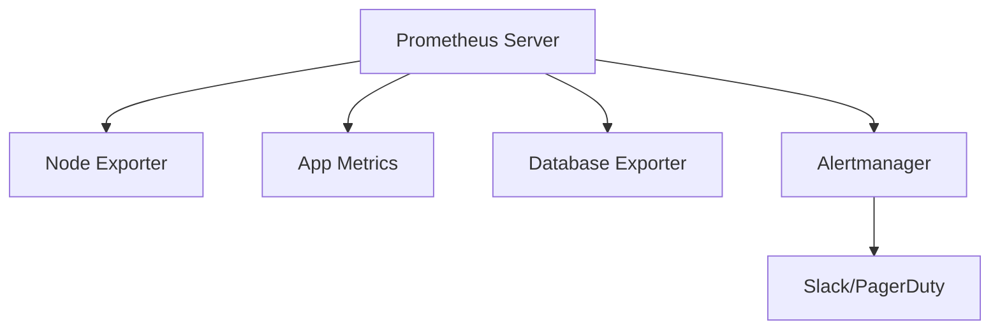

# How to Use Ansible with Prometheus for Monitoring Setup

Author: [nawazdhandala](https://www.github.com/nawazdhandala)

Tags: Ansible, Prometheus, Monitoring, DevOps

Description: Deploy and configure Prometheus monitoring infrastructure with Ansible including exporters, alerting rules, and service discovery.

---

Prometheus is the standard open-source monitoring system for cloud-native infrastructure. Setting up Prometheus involves deploying the server, configuring scrape targets, installing exporters on monitored hosts, defining alerting rules, and setting up Alertmanager. Ansible can automate all of this.

## Monitoring Architecture



## Deploying Prometheus Server

```yaml
# roles/prometheus/tasks/main.yml
# Install and configure Prometheus
---
- name: Create prometheus user
  ansible.builtin.user:
    name: prometheus
    system: true
    shell: /bin/false

- name: Create Prometheus directories
  ansible.builtin.file:
    path: "{{ item }}"
    state: directory
    owner: prometheus
    group: prometheus
    mode: '0755'
  loop:
    - /etc/prometheus
    - /var/lib/prometheus
    - /etc/prometheus/rules

- name: Download Prometheus
  ansible.builtin.get_url:
    url: "https://github.com/prometheus/prometheus/releases/download/v{{ prometheus_version }}/prometheus-{{ prometheus_version }}.linux-amd64.tar.gz"
    dest: /tmp/prometheus.tar.gz
    mode: '0644'

- name: Extract Prometheus
  ansible.builtin.unarchive:
    src: /tmp/prometheus.tar.gz
    dest: /tmp/
    remote_src: true

- name: Install Prometheus binaries
  ansible.builtin.copy:
    src: "/tmp/prometheus-{{ prometheus_version }}.linux-amd64/{{ item }}"
    dest: "/usr/local/bin/{{ item }}"
    remote_src: true
    mode: '0755'
  loop:
    - prometheus
    - promtool

- name: Deploy Prometheus configuration
  ansible.builtin.template:
    src: prometheus.yml.j2
    dest: /etc/prometheus/prometheus.yml
    owner: prometheus
    mode: '0644'
    validate: "promtool check config %s"
  notify: restart prometheus

- name: Deploy alerting rules
  ansible.builtin.template:
    src: alert_rules.yml.j2
    dest: /etc/prometheus/rules/alerts.yml
    owner: prometheus
    mode: '0644'
    validate: "promtool check rules %s"
  notify: reload prometheus

- name: Deploy systemd service
  ansible.builtin.template:
    src: prometheus.service.j2
    dest: /etc/systemd/system/prometheus.service
    mode: '0644'
  notify:
    - daemon reload
    - restart prometheus

- name: Ensure Prometheus is running
  ansible.builtin.service:
    name: prometheus
    state: started
    enabled: true
```

## Prometheus Configuration Template

```yaml
# roles/prometheus/templates/prometheus.yml.j2
# Prometheus configuration - managed by Ansible
global:
  scrape_interval: {{ prometheus_scrape_interval | default('15s') }}
  evaluation_interval: {{ prometheus_eval_interval | default('15s') }}

alerting:
  alertmanagers:
    - static_configs:
        - targets: ['{{ alertmanager_host }}:9093']

rule_files:
  - /etc/prometheus/rules/*.yml

scrape_configs:
  - job_name: 'prometheus'
    static_configs:
      - targets: ['localhost:9090']

  - job_name: 'node'
    static_configs:

      - targets: ['{{ hostvars[host].ansible_host }}:9100']
        labels:
          instance: '{{ host }}'
          role: '{{ hostvars[host].server_role | default("unknown") }}'


  - job_name: 'app'
    static_configs:

      - targets: ['{{ hostvars[host].ansible_host }}:{{ app_metrics_port | default(9090) }}']
        labels:
          instance: '{{ host }}'

```

## Deploying Node Exporter

```yaml
# roles/node_exporter/tasks/main.yml
# Install node_exporter on all monitored hosts
---
- name: Download node_exporter
  ansible.builtin.get_url:
    url: "https://github.com/prometheus/node_exporter/releases/download/v{{ node_exporter_version }}/node_exporter-{{ node_exporter_version }}.linux-amd64.tar.gz"
    dest: /tmp/node_exporter.tar.gz
    mode: '0644'

- name: Extract and install node_exporter
  ansible.builtin.unarchive:
    src: /tmp/node_exporter.tar.gz
    dest: /tmp/
    remote_src: true

- name: Copy binary
  ansible.builtin.copy:
    src: "/tmp/node_exporter-{{ node_exporter_version }}.linux-amd64/node_exporter"
    dest: /usr/local/bin/node_exporter
    remote_src: true
    mode: '0755'
  notify: restart node_exporter

- name: Create systemd service
  ansible.builtin.copy:
    content: |
      [Unit]
      Description=Node Exporter
      After=network.target
      [Service]
      User=prometheus
      ExecStart=/usr/local/bin/node_exporter
      [Install]
      WantedBy=multi-user.target
    dest: /etc/systemd/system/node_exporter.service
    mode: '0644'
  notify:
    - daemon reload
    - restart node_exporter

- name: Ensure node_exporter is running
  ansible.builtin.service:
    name: node_exporter
    state: started
    enabled: true
```

## Alert Rules Template

```yaml
# roles/prometheus/templates/alert_rules.yml.j2
groups:
  - name: instance_alerts
    rules:
      - alert: InstanceDown
        expr: up == 0
        for: 5m
        labels:
          severity: critical
        annotations:
          summary: "Instance {{ '{{' }} $labels.instance {{ '}}' }} is down"

      - alert: HighCPU
        expr: 100 - (avg by(instance)(rate(node_cpu_seconds_total{mode="idle"}[5m])) * 100) > 80
        for: 10m
        labels:
          severity: warning

      - alert: DiskSpaceLow
        expr: (node_filesystem_avail_bytes / node_filesystem_size_bytes) * 100 < 15
        for: 5m
        labels:
          severity: warning
```

## Key Takeaways

Ansible makes Prometheus deployment repeatable and consistent. Deploy the server with validated configuration, install exporters on all hosts, and manage alerting rules as templates. Use the Ansible inventory to automatically generate Prometheus scrape targets so new servers are monitored immediately. Validate configuration with promtool before applying changes to catch errors early.

## Common Use Cases

Here are several practical scenarios where this module proves essential in real-world playbooks.

### Infrastructure Provisioning Workflow

```yaml
# Complete workflow incorporating this module
- name: Infrastructure provisioning
  hosts: all
  become: true
  gather_facts: true
  tasks:
    - name: Gather system information
      ansible.builtin.setup:
        gather_subset:
          - hardware
          - network

    - name: Display system summary
      ansible.builtin.debug:
        msg: >-
          Host {{ inventory_hostname }} has
          {{ ansible_memtotal_mb }}MB RAM,
          {{ ansible_processor_vcpus }} vCPUs,
          running {{ ansible_distribution }} {{ ansible_distribution_version }}

    - name: Install required packages
      ansible.builtin.package:
        name:
          - curl
          - wget
          - git
          - vim
          - htop
          - jq
        state: present

    - name: Configure system timezone
      ansible.builtin.timezone:
        name: "{{ system_timezone | default('UTC') }}"

    - name: Configure hostname
      ansible.builtin.hostname:
        name: "{{ inventory_hostname }}"

    - name: Update /etc/hosts
      ansible.builtin.lineinfile:
        path: /etc/hosts
        regexp: '^127\.0\.1\.1'
        line: "127.0.1.1 {{ inventory_hostname }}"

    - name: Configure SSH hardening
      ansible.builtin.lineinfile:
        path: /etc/ssh/sshd_config
        regexp: "{{ item.regexp }}"
        line: "{{ item.line }}"
      loop:
        - { regexp: '^PermitRootLogin', line: 'PermitRootLogin no' }
        - { regexp: '^PasswordAuthentication', line: 'PasswordAuthentication no' }
      notify: restart sshd

    - name: Configure firewall rules
      community.general.ufw:
        rule: allow
        port: "{{ item }}"
        proto: tcp
      loop:
        - "22"
        - "80"
        - "443"

    - name: Enable firewall
      community.general.ufw:
        state: enabled
        policy: deny

  handlers:
    - name: restart sshd
      ansible.builtin.service:
        name: sshd
        state: restarted
```

### Integration with Monitoring

```yaml
# Using gathered facts to configure monitoring thresholds
- name: Configure monitoring based on system specs
  hosts: all
  become: true
  tasks:
    - name: Set monitoring thresholds based on hardware
      ansible.builtin.template:
        src: monitoring_config.yml.j2
        dest: /etc/monitoring/config.yml
      vars:
        memory_warning_threshold: "{{ (ansible_memtotal_mb * 0.8) | int }}"
        memory_critical_threshold: "{{ (ansible_memtotal_mb * 0.95) | int }}"
        cpu_warning_threshold: 80
        cpu_critical_threshold: 95

    - name: Register host with monitoring system
      ansible.builtin.uri:
        url: "https://monitoring.example.com/api/hosts"
        method: POST
        body_format: json
        body:
          hostname: "{{ inventory_hostname }}"
          ip_address: "{{ ansible_default_ipv4.address }}"
          os: "{{ ansible_distribution }}"
          memory_mb: "{{ ansible_memtotal_mb }}"
          cpus: "{{ ansible_processor_vcpus }}"
        headers:
          Authorization: "Bearer {{ monitoring_api_token }}"
        status_code: [200, 201, 409]
```

### Error Handling Patterns

```yaml
# Robust error handling with this module
- name: Robust task execution
  hosts: all
  tasks:
    - name: Attempt primary operation
      ansible.builtin.command: /opt/app/primary-task.sh
      register: primary_result
      failed_when: false

    - name: Handle primary failure with fallback
      ansible.builtin.command: /opt/app/fallback-task.sh
      when: primary_result.rc != 0
      register: fallback_result

    - name: Report final status
      ansible.builtin.debug:
        msg: >-
          Task completed via {{ 'primary' if primary_result.rc == 0 else 'fallback' }} path.
          Return code: {{ primary_result.rc if primary_result.rc == 0 else fallback_result.rc }}

    - name: Fail if both paths failed
      ansible.builtin.fail:
        msg: "Both primary and fallback operations failed"
      when:
        - primary_result.rc != 0
        - fallback_result is defined
        - fallback_result.rc != 0
```

### Scheduling and Automation

```yaml
# Set up scheduled compliance scans using cron
- name: Configure automated scans
  hosts: all
  become: true
  tasks:
    - name: Create scan script
      ansible.builtin.copy:
        dest: /opt/scripts/compliance_scan.sh
        mode: '0755'
        content: |
          #!/bin/bash
          cd /opt/ansible
          ansible-playbook playbooks/validate.yml -i inventory/ > /var/log/compliance_scan.log 2>&1
          EXIT_CODE=$?
          if [ $EXIT_CODE -ne 0 ]; then
            curl -X POST https://hooks.example.com/alert \
              -H "Content-Type: application/json" \
              -d "{\"text\":\"Compliance scan failed on $(hostname)\"}"
          fi
          exit $EXIT_CODE

    - name: Schedule weekly compliance scan
      ansible.builtin.cron:
        name: "Weekly compliance scan"
        minute: "0"
        hour: "3"
        weekday: "1"
        job: "/opt/scripts/compliance_scan.sh"
        user: ansible
```

