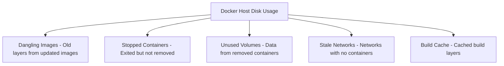

# How to Use Ansible to Prune Docker Resources

Author: [nawazdhandala](https://www.github.com/nawazdhandala)

Tags: Ansible, Docker, Cleanup, Maintenance, DevOps

Description: Automate Docker resource cleanup with Ansible to reclaim disk space by pruning unused images, containers, volumes, and networks.

---

Docker hosts accumulate unused resources over time. Stopped containers, dangling images, orphaned volumes, and stale networks quietly eat disk space until someone notices the disk is nearly full at 2 AM. Automating cleanup with Ansible prevents this problem and keeps your Docker hosts lean.

## What Gets Left Behind

Every time you pull a new image version, the old layers stick around. Every stopped container remains on disk with its writable layer. Every `docker-compose down` might leave behind networks and volumes. On a busy CI server or a host with frequent deployments, this adds up fast.

Here is what typically accumulates:



## The docker_prune Module

The `community.docker` collection includes a `docker_prune` module that wraps Docker's pruning functionality. It can clean up containers, images, volumes, networks, and build cache in a single task:

```yaml
# prune_all.yml - Clean up all unused Docker resources
---
- name: Prune All Docker Resources
  hosts: docker_hosts
  become: true

  tasks:
    - name: Prune all unused Docker resources
      community.docker.docker_prune:
        containers: true
        images: true
        networks: true
        volumes: true
        builder_cache: true
      register: prune_result

    - name: Report what was cleaned up
      ansible.builtin.debug:
        msg:
          - "Containers removed: {{ prune_result.containers | default([]) | length }}"
          - "Images removed: {{ prune_result.images | default([]) | length }}"
          - "Networks removed: {{ prune_result.networks | default([]) | length }}"
          - "Volumes removed: {{ prune_result.volumes | default([]) | length }}"
          - "Space reclaimed: {{ prune_result.images_space_reclaimed | default(0) | human_readable }}"
```

## Selective Pruning

You do not always want to prune everything. Maybe you want to keep recent images but remove old ones, or prune containers but leave volumes alone. The module supports filters for fine-grained control.

### Pruning Only Old Resources

Use the `until` filter to only remove resources older than a certain age:

```yaml
# prune_old.yml - Only prune resources older than 24 hours
---
- name: Prune Old Docker Resources
  hosts: docker_hosts
  become: true

  tasks:
    - name: Remove containers stopped more than 24 hours ago
      community.docker.docker_prune:
        containers: true
        containers_filters:
          until: "24h"
        images: false
        networks: false
        volumes: false

    - name: Remove images not used in the last 7 days
      community.docker.docker_prune:
        images: true
        images_filters:
          until: "168h"  # 7 days in hours
          dangling: "false"  # Include non-dangling unused images too
        containers: false
        networks: false
        volumes: false
```

### Pruning by Label

Labels let you protect important resources from pruning. Tag resources you want to keep, then prune everything else:

```yaml
# prune_by_label.yml - Prune resources that lack a keep label
---
- name: Prune Unlabeled Docker Resources
  hosts: docker_hosts
  become: true

  tasks:
    - name: Prune images without the 'keep' label
      community.docker.docker_prune:
        images: true
        images_filters:
          label!: "keep=true"
        containers: false
        networks: false
        volumes: false
      register: image_prune

    - name: Report removed images
      ansible.builtin.debug:
        msg: "Removed {{ image_prune.images | default([]) | length }} images, reclaimed {{ image_prune.images_space_reclaimed | default(0) | human_readable }}"
```

When you deploy containers, add the `keep` label to images you want to protect:

```yaml
    - name: Deploy protected container
      community.docker.docker_container:
        name: critical-service
        image: myapp:latest
        labels:
          keep: "true"
          environment: "production"
```

## Pruning Individual Resource Types

Sometimes you need more control over what gets cleaned up. Here are playbooks for each resource type.

### Pruning Stopped Containers

```yaml
# prune_containers.yml - Remove stopped containers
---
- name: Clean Up Stopped Containers
  hosts: docker_hosts
  become: true

  tasks:
    - name: Get list of all containers
      community.docker.docker_host_info:
        containers: true
      register: docker_info

    - name: Count running vs stopped
      ansible.builtin.set_fact:
        running_count: "{{ docker_info.containers | selectattr('State', 'equalto', 'running') | list | length }}"
        stopped_count: "{{ docker_info.containers | rejectattr('State', 'equalto', 'running') | list | length }}"

    - name: Report container status
      ansible.builtin.debug:
        msg: "Running: {{ running_count }}, Stopped: {{ stopped_count }}"

    - name: Prune stopped containers
      community.docker.docker_prune:
        containers: true
        images: false
        networks: false
        volumes: false
      register: container_prune
      when: stopped_count | int > 0
```

### Pruning Dangling Images

Dangling images are layers that are no longer referenced by any tagged image. They are safe to remove:

```yaml
# prune_dangling.yml - Remove dangling images only
---
- name: Remove Dangling Images
  hosts: docker_hosts
  become: true

  tasks:
    - name: Check for dangling images
      ansible.builtin.command:
        cmd: docker images -f dangling=true -q
      register: dangling_images
      changed_when: false

    - name: Report dangling image count
      ansible.builtin.debug:
        msg: "Found {{ dangling_images.stdout_lines | length }} dangling images"

    - name: Prune dangling images
      community.docker.docker_prune:
        images: true
        images_filters:
          dangling: "true"
        containers: false
        networks: false
        volumes: false
      when: dangling_images.stdout_lines | length > 0
```

### Pruning Unused Volumes

Be careful with volume pruning. Volumes often contain database data. Only prune volumes when you are sure the data is no longer needed:

```yaml
# prune_volumes.yml - Remove unused volumes (with safety checks)
---
- name: Prune Unused Volumes
  hosts: docker_hosts
  become: true

  tasks:
    - name: List all volumes
      community.docker.docker_volume_info:
      register: all_volumes

    - name: Identify volumes by label
      ansible.builtin.debug:
        msg: "Volume {{ item.Name }} labels: {{ item.Labels | default({}) }}"
      loop: "{{ all_volumes.volumes }}"
      loop_control:
        label: "{{ item.Name }}"

    - name: Prune only volumes without the 'persistent' label
      community.docker.docker_prune:
        volumes: true
        volumes_filters:
          label!: "persistent=true"
        containers: false
        images: false
        networks: false
```

## Scheduled Cleanup with Ansible

Set up a cron job to run cleanup regularly:

```yaml
# schedule_prune.yml - Schedule regular Docker cleanup
---
- name: Schedule Docker Cleanup
  hosts: docker_hosts
  become: true

  tasks:
    - name: Create cleanup script
      ansible.builtin.copy:
        dest: /opt/scripts/docker-cleanup.sh
        mode: '0755'
        content: |
          #!/bin/bash
          # Remove stopped containers older than 12 hours
          docker container prune -f --filter "until=12h"
          # Remove dangling images
          docker image prune -f
          # Remove unused networks
          docker network prune -f
          # Log the cleanup
          echo "$(date): Docker cleanup completed" >> /var/log/docker-cleanup.log

    - name: Schedule daily cleanup at 3 AM
      ansible.builtin.cron:
        name: "Docker resource cleanup"
        minute: "0"
        hour: "3"
        job: "/opt/scripts/docker-cleanup.sh"
        user: root
```

## Disk Space Monitoring Before Pruning

Only prune when disk usage exceeds a threshold:

```yaml
# conditional_prune.yml - Prune only when disk usage is high
---
- name: Conditional Docker Pruning
  hosts: docker_hosts
  become: true
  vars:
    disk_threshold: 80  # Percentage

  tasks:
    - name: Check disk usage on Docker data root
      ansible.builtin.command:
        cmd: df --output=pcent /var/lib/docker
      register: disk_usage
      changed_when: false

    - name: Parse disk percentage
      ansible.builtin.set_fact:
        docker_disk_percent: "{{ disk_usage.stdout_lines[-1] | trim | replace('%', '') | int }}"

    - name: Report disk usage
      ansible.builtin.debug:
        msg: "Docker disk usage: {{ docker_disk_percent }}% (threshold: {{ disk_threshold }}%)"

    - name: Prune if over threshold
      community.docker.docker_prune:
        containers: true
        images: true
        networks: true
        volumes: false  # Keep volumes even in cleanup
        builder_cache: true
        images_filters:
          until: "48h"
      when: docker_disk_percent | int >= disk_threshold

    - name: Aggressive prune if critically full
      community.docker.docker_prune:
        containers: true
        images: true
        networks: true
        volumes: true
        builder_cache: true
      when: docker_disk_percent | int >= 95
```

## Build Cache Cleanup

CI/CD servers accumulate huge amounts of build cache:

```yaml
# prune_build_cache.yml - Clean Docker build cache
---
- name: Clean Build Cache
  hosts: build_servers
  become: true

  tasks:
    - name: Check build cache size
      ansible.builtin.command:
        cmd: docker system df --format "{{.Size}}" -v
      register: system_df
      changed_when: false

    - name: Prune build cache older than 7 days
      community.docker.docker_prune:
        builder_cache: true
        containers: false
        images: false
        networks: false
        volumes: false
      register: cache_prune

    - name: Report cache cleanup
      ansible.builtin.debug:
        msg: "Build cache cleaned up"
```

## Summary

Regular pruning of Docker resources is one of those maintenance tasks that is easy to forget until disk space problems force you to deal with it in a rush. Ansible lets you automate pruning with precise control over what gets removed, when it gets removed, and under what conditions. The `docker_prune` module handles the heavy lifting, while filters and labels protect important resources from accidental deletion. For most environments, a scheduled daily prune of old containers and dangling images, combined with threshold-based cleanup for images and volumes, keeps Docker hosts running smoothly without manual intervention.
