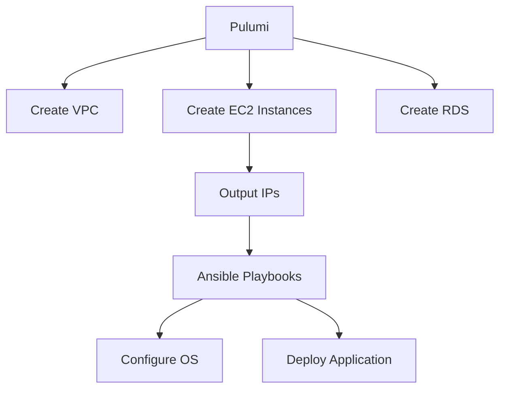

# How to Use Ansible with Pulumi for Infrastructure

Author: [nawazdhandala](https://www.github.com/nawazdhandala)

Tags: Ansible, Pulumi, Infrastructure as Code, DevOps

Description: Combine Ansible with Pulumi for infrastructure provisioning and configuration management using general-purpose programming languages.

---

Pulumi provisions cloud infrastructure using real programming languages like Python, TypeScript, and Go. Ansible configures what runs on that infrastructure. Together they form a complete automation stack where Pulumi handles cloud resources and Ansible handles OS and application configuration.

## How They Work Together



## Pulumi Program with Ansible Outputs

Here is a Pulumi program in Python that provisions infrastructure and exports values for Ansible:

```python
# __main__.py
import pulumi
import pulumi_aws as aws

# Create VPC
vpc = aws.ec2.Vpc("main-vpc",
    cidr_block="10.0.0.0/16",
    tags={"Name": "main-vpc"})

# Create subnet
subnet = aws.ec2.Subnet("web-subnet",
    vpc_id=vpc.id,
    cidr_block="10.0.1.0/24",
    availability_zone="us-east-1a")

# Create security group
sg = aws.ec2.SecurityGroup("web-sg",
    vpc_id=vpc.id,
    ingress=[{"protocol": "tcp", "from_port": 22,
              "to_port": 22, "cidr_blocks": ["10.0.0.0/8"]}])

# Create instances
web_servers = []
for i in range(3):
    server = aws.ec2.Instance(f"web-{i}",
        instance_type="t3.medium",
        ami="ami-0abcdef1234567890",
        subnet_id=subnet.id,
        vpc_security_group_ids=[sg.id],
        key_name="deploy-key",
        tags={"Name": f"web-{i}", "Role": "webserver"})
    web_servers.append(server)

# Export for Ansible inventory generation
pulumi.export("web_ips", [s.private_ip for s in web_servers])
pulumi.export("vpc_id", vpc.id)
```

## Generating Ansible Inventory

Create a script that reads Pulumi outputs and generates inventory:

```python
# generate_inventory.py
# Convert Pulumi outputs to Ansible inventory
import json
import subprocess
import yaml

# Get outputs from Pulumi
result = subprocess.run(
    ["pulumi", "stack", "output", "--json"],
    capture_output=True, text=True
)
outputs = json.loads(result.stdout)

# Build inventory
inventory = {
    "all": {
        "children": {
            "webservers": {
                "hosts": {}
            }
        },
        "vars": {
            "ansible_user": "ubuntu",
            "ansible_ssh_private_key_file": "~/.ssh/deploy-key"
        }
    }
}

for i, ip in enumerate(outputs.get("web_ips", [])):
    inventory["all"]["children"]["webservers"]["hosts"][f"web-{i}"] = {
        "ansible_host": ip
    }

with open("inventories/pulumi-generated.yml", "w") as f:
    yaml.dump(inventory, f, default_flow_style=False)

print(f"Generated inventory with {len(outputs.get('web_ips', []))} hosts")
```

## Full Workflow

```bash
# 1. Provision infrastructure with Pulumi
pulumi up --yes

# 2. Generate Ansible inventory from Pulumi outputs
python3 generate_inventory.py

# 3. Configure instances with Ansible
ansible-playbook playbooks/site.yml -i inventories/pulumi-generated.yml
```

## Pulumi Automation API Integration

For fully programmatic workflows:

```python
# deploy_all.py
# End-to-end deployment with Pulumi and Ansible
import subprocess
from pulumi import automation as auto

def deploy():
    # Pulumi provisioning
    stack = auto.create_or_select_stack(
        stack_name="production",
        project_name="myinfra",
        work_dir="./pulumi"
    )
    stack.up(on_output=print)
    outputs = stack.outputs()

    # Generate inventory
    web_ips = outputs["web_ips"].value
    generate_ansible_inventory(web_ips)

    # Run Ansible
    subprocess.run([
        "ansible-playbook",
        "playbooks/site.yml",
        "-i", "inventories/pulumi-generated.yml"
    ], check=True)

def generate_ansible_inventory(web_ips):
    import yaml
    inventory = {"all": {"children": {"webservers": {"hosts": {}}}}}
    for i, ip in enumerate(web_ips):
        inventory["all"]["children"]["webservers"]["hosts"][f"web-{i}"] = {"ansible_host": ip}
    with open("inventories/pulumi-generated.yml", "w") as f:
        yaml.dump(inventory, f)

if __name__ == "__main__":
    deploy()
```

## Teardown

```bash
# Tear down infrastructure
ansible-playbook playbooks/pre-teardown.yml -i inventories/pulumi-generated.yml
pulumi destroy --yes
```

## Key Takeaways

Pulumi and Ansible serve different purposes and work well together. Pulumi excels at cloud resource provisioning with real programming languages. Ansible excels at OS and application configuration. Connect them by exporting Pulumi outputs as Ansible inventory. Automate the full workflow with scripts or the Pulumi Automation API. This gives you the expressiveness of a general-purpose language for infrastructure with Ansible's extensive module ecosystem for configuration.

## Common Use Cases

Here are several practical scenarios where this module proves essential in real-world playbooks.

### Infrastructure Provisioning Workflow

```yaml
# Complete workflow incorporating this module
- name: Infrastructure provisioning
  hosts: all
  become: true
  gather_facts: true
  tasks:
    - name: Gather system information
      ansible.builtin.setup:
        gather_subset:
          - hardware
          - network

    - name: Display system summary
      ansible.builtin.debug:
        msg: >-
          Host {{ inventory_hostname }} has
          {{ ansible_memtotal_mb }}MB RAM,
          {{ ansible_processor_vcpus }} vCPUs,
          running {{ ansible_distribution }} {{ ansible_distribution_version }}

    - name: Install required packages
      ansible.builtin.package:
        name:
          - curl
          - wget
          - git
          - vim
          - htop
          - jq
        state: present

    - name: Configure system timezone
      ansible.builtin.timezone:
        name: "{{ system_timezone | default('UTC') }}"

    - name: Configure hostname
      ansible.builtin.hostname:
        name: "{{ inventory_hostname }}"

    - name: Update /etc/hosts
      ansible.builtin.lineinfile:
        path: /etc/hosts
        regexp: '^127\.0\.1\.1'
        line: "127.0.1.1 {{ inventory_hostname }}"

    - name: Configure SSH hardening
      ansible.builtin.lineinfile:
        path: /etc/ssh/sshd_config
        regexp: "{{ item.regexp }}"
        line: "{{ item.line }}"
      loop:
        - { regexp: '^PermitRootLogin', line: 'PermitRootLogin no' }
        - { regexp: '^PasswordAuthentication', line: 'PasswordAuthentication no' }
      notify: restart sshd

    - name: Configure firewall rules
      community.general.ufw:
        rule: allow
        port: "{{ item }}"
        proto: tcp
      loop:
        - "22"
        - "80"
        - "443"

    - name: Enable firewall
      community.general.ufw:
        state: enabled
        policy: deny

  handlers:
    - name: restart sshd
      ansible.builtin.service:
        name: sshd
        state: restarted
```

### Integration with Monitoring

```yaml
# Using gathered facts to configure monitoring thresholds
- name: Configure monitoring based on system specs
  hosts: all
  become: true
  tasks:
    - name: Set monitoring thresholds based on hardware
      ansible.builtin.template:
        src: monitoring_config.yml.j2
        dest: /etc/monitoring/config.yml
      vars:
        memory_warning_threshold: "{{ (ansible_memtotal_mb * 0.8) | int }}"
        memory_critical_threshold: "{{ (ansible_memtotal_mb * 0.95) | int }}"
        cpu_warning_threshold: 80
        cpu_critical_threshold: 95

    - name: Register host with monitoring system
      ansible.builtin.uri:
        url: "https://monitoring.example.com/api/hosts"
        method: POST
        body_format: json
        body:
          hostname: "{{ inventory_hostname }}"
          ip_address: "{{ ansible_default_ipv4.address }}"
          os: "{{ ansible_distribution }}"
          memory_mb: "{{ ansible_memtotal_mb }}"
          cpus: "{{ ansible_processor_vcpus }}"
        headers:
          Authorization: "Bearer {{ monitoring_api_token }}"
        status_code: [200, 201, 409]
```

### Error Handling Patterns

```yaml
# Robust error handling with this module
- name: Robust task execution
  hosts: all
  tasks:
    - name: Attempt primary operation
      ansible.builtin.command: /opt/app/primary-task.sh
      register: primary_result
      failed_when: false

    - name: Handle primary failure with fallback
      ansible.builtin.command: /opt/app/fallback-task.sh
      when: primary_result.rc != 0
      register: fallback_result

    - name: Report final status
      ansible.builtin.debug:
        msg: >-
          Task completed via {{ 'primary' if primary_result.rc == 0 else 'fallback' }} path.
          Return code: {{ primary_result.rc if primary_result.rc == 0 else fallback_result.rc }}

    - name: Fail if both paths failed
      ansible.builtin.fail:
        msg: "Both primary and fallback operations failed"
      when:
        - primary_result.rc != 0
        - fallback_result is defined
        - fallback_result.rc != 0
```

### Scheduling and Automation

```yaml
# Set up scheduled compliance scans using cron
- name: Configure automated scans
  hosts: all
  become: true
  tasks:
    - name: Create scan script
      ansible.builtin.copy:
        dest: /opt/scripts/compliance_scan.sh
        mode: '0755'
        content: |
          #!/bin/bash
          cd /opt/ansible
          ansible-playbook playbooks/validate.yml -i inventory/ > /var/log/compliance_scan.log 2>&1
          EXIT_CODE=$?
          if [ $EXIT_CODE -ne 0 ]; then
            curl -X POST https://hooks.example.com/alert \
              -H "Content-Type: application/json" \
              -d "{\"text\":\"Compliance scan failed on $(hostname)\"}"
          fi
          exit $EXIT_CODE

    - name: Schedule weekly compliance scan
      ansible.builtin.cron:
        name: "Weekly compliance scan"
        minute: "0"
        hour: "3"
        weekday: "1"
        job: "/opt/scripts/compliance_scan.sh"
        user: ansible
```

