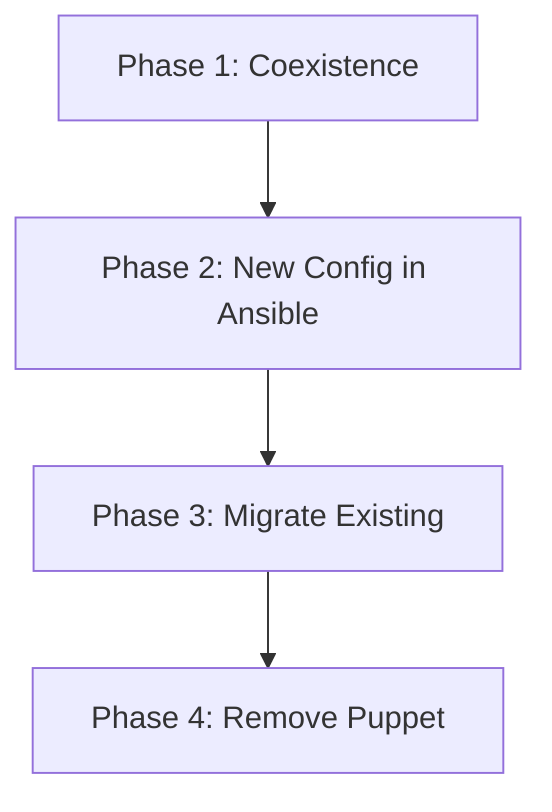

# How to Use Ansible with Puppet for Migration

Author: [nawazdhandala](https://www.github.com/nawazdhandala)

Tags: Ansible, Puppet, Migration, Configuration Management

Description: Migrate from Puppet to Ansible incrementally by running both tools side-by-side and gradually moving configuration to Ansible playbooks.

---

Migrating from Puppet to Ansible does not need to happen all at once. You can run both tools in parallel, gradually moving configuration from Puppet manifests to Ansible playbooks until Puppet is fully replaced.

## Migration Strategy



## Phase 1: Run Both Tools

```yaml
# playbooks/install-ansible-alongside-puppet.yml
---
- name: Install Ansible on Puppet-managed hosts
  hosts: puppet_managed
  become: true
  tasks:
    - name: Install Ansible
      ansible.builtin.pip:
        name: ansible
        state: present

    - name: Deploy Ansible cron for pull mode
      ansible.builtin.cron:
        name: "ansible-pull"
        minute: "*/30"
        job: >
          /usr/local/bin/ansible-pull
          -U {{ ansible_repo }}
          -d /opt/ansible
          playbooks/local.yml
          >> /var/log/ansible-pull.log 2>&1
```

## Phase 2: Convert Puppet Modules

Convert Puppet modules to Ansible roles one at a time:

```puppet
# Puppet manifest (before)
class nginx {
  package { 'nginx':
    ensure => installed,
  }
  file { '/etc/nginx/nginx.conf':
    ensure  => file,
    content => template('nginx/nginx.conf.erb'),
    notify  => Service['nginx'],
  }
  service { 'nginx':
    ensure => running,
    enable => true,
  }
}
```

```yaml
# Ansible role equivalent (after)
# roles/nginx/tasks/main.yml
---
- name: Install nginx
  ansible.builtin.apt:
    name: nginx
    state: present

- name: Configure nginx
  ansible.builtin.template:
    src: nginx.conf.j2
    dest: /etc/nginx/nginx.conf
    mode: '0644'
  notify: restart nginx

- name: Ensure nginx is running
  ansible.builtin.service:
    name: nginx
    state: started
    enabled: true
```

## Phase 3: Disable Puppet for Migrated Components

```yaml
# tasks/disable-puppet-module.yml
---
- name: Disable Puppet management of migrated component
  ansible.builtin.lineinfile:
    path: /etc/puppet/puppet.conf
    regexp: "^\s*{{ item }}"
    state: absent
  loop: "{{ migrated_puppet_classes }}"
  notify: restart puppet
```

## Phase 4: Remove Puppet

```yaml
# playbooks/remove-puppet.yml
---
- name: Remove Puppet from servers
  hosts: all
  become: true
  tasks:
    - name: Stop Puppet agent
      ansible.builtin.service:
        name: puppet
        state: stopped
        enabled: false

    - name: Remove Puppet packages
      ansible.builtin.apt:
        name:
          - puppet-agent
          - puppet
        state: absent
        purge: true

    - name: Remove Puppet directories
      ansible.builtin.file:
        path: "{{ item }}"
        state: absent
      loop:
        - /etc/puppet
        - /opt/puppetlabs
        - /var/log/puppet
```

## Key Takeaways

Migrating from Puppet to Ansible works best incrementally. Start by running both tools, then move new configuration to Ansible. Convert Puppet modules to Ansible roles one at a time. Disable Puppet management of migrated components. Finally, remove Puppet entirely once everything is in Ansible. This gradual approach minimizes risk and lets the team learn Ansible while maintaining the existing Puppet infrastructure.

## Common Use Cases

Here are several practical scenarios where this module proves essential in real-world playbooks.

### Infrastructure Provisioning Workflow

```yaml
# Complete workflow incorporating this module
- name: Infrastructure provisioning
  hosts: all
  become: true
  gather_facts: true
  tasks:
    - name: Gather system information
      ansible.builtin.setup:
        gather_subset:
          - hardware
          - network

    - name: Display system summary
      ansible.builtin.debug:
        msg: >-
          Host {{ inventory_hostname }} has
          {{ ansible_memtotal_mb }}MB RAM,
          {{ ansible_processor_vcpus }} vCPUs,
          running {{ ansible_distribution }} {{ ansible_distribution_version }}

    - name: Install required packages
      ansible.builtin.package:
        name:
          - curl
          - wget
          - git
          - vim
          - htop
          - jq
        state: present

    - name: Configure system timezone
      ansible.builtin.timezone:
        name: "{{ system_timezone | default('UTC') }}"

    - name: Configure hostname
      ansible.builtin.hostname:
        name: "{{ inventory_hostname }}"

    - name: Update /etc/hosts
      ansible.builtin.lineinfile:
        path: /etc/hosts
        regexp: '^127\.0\.1\.1'
        line: "127.0.1.1 {{ inventory_hostname }}"

    - name: Configure SSH hardening
      ansible.builtin.lineinfile:
        path: /etc/ssh/sshd_config
        regexp: "{{ item.regexp }}"
        line: "{{ item.line }}"
      loop:
        - { regexp: '^PermitRootLogin', line: 'PermitRootLogin no' }
        - { regexp: '^PasswordAuthentication', line: 'PasswordAuthentication no' }
      notify: restart sshd

    - name: Configure firewall rules
      community.general.ufw:
        rule: allow
        port: "{{ item }}"
        proto: tcp
      loop:
        - "22"
        - "80"
        - "443"

    - name: Enable firewall
      community.general.ufw:
        state: enabled
        policy: deny

  handlers:
    - name: restart sshd
      ansible.builtin.service:
        name: sshd
        state: restarted
```

### Integration with Monitoring

```yaml
# Using gathered facts to configure monitoring thresholds
- name: Configure monitoring based on system specs
  hosts: all
  become: true
  tasks:
    - name: Set monitoring thresholds based on hardware
      ansible.builtin.template:
        src: monitoring_config.yml.j2
        dest: /etc/monitoring/config.yml
      vars:
        memory_warning_threshold: "{{ (ansible_memtotal_mb * 0.8) | int }}"
        memory_critical_threshold: "{{ (ansible_memtotal_mb * 0.95) | int }}"
        cpu_warning_threshold: 80
        cpu_critical_threshold: 95

    - name: Register host with monitoring system
      ansible.builtin.uri:
        url: "https://monitoring.example.com/api/hosts"
        method: POST
        body_format: json
        body:
          hostname: "{{ inventory_hostname }}"
          ip_address: "{{ ansible_default_ipv4.address }}"
          os: "{{ ansible_distribution }}"
          memory_mb: "{{ ansible_memtotal_mb }}"
          cpus: "{{ ansible_processor_vcpus }}"
        headers:
          Authorization: "Bearer {{ monitoring_api_token }}"
        status_code: [200, 201, 409]
```

### Error Handling Patterns

```yaml
# Robust error handling with this module
- name: Robust task execution
  hosts: all
  tasks:
    - name: Attempt primary operation
      ansible.builtin.command: /opt/app/primary-task.sh
      register: primary_result
      failed_when: false

    - name: Handle primary failure with fallback
      ansible.builtin.command: /opt/app/fallback-task.sh
      when: primary_result.rc != 0
      register: fallback_result

    - name: Report final status
      ansible.builtin.debug:
        msg: >-
          Task completed via {{ 'primary' if primary_result.rc == 0 else 'fallback' }} path.
          Return code: {{ primary_result.rc if primary_result.rc == 0 else fallback_result.rc }}

    - name: Fail if both paths failed
      ansible.builtin.fail:
        msg: "Both primary and fallback operations failed"
      when:
        - primary_result.rc != 0
        - fallback_result is defined
        - fallback_result.rc != 0
```

### Scheduling and Automation

```yaml
# Set up scheduled compliance scans using cron
- name: Configure automated scans
  hosts: all
  become: true
  tasks:
    - name: Create scan script
      ansible.builtin.copy:
        dest: /opt/scripts/compliance_scan.sh
        mode: '0755'
        content: |
          #!/bin/bash
          cd /opt/ansible
          ansible-playbook playbooks/validate.yml -i inventory/ > /var/log/compliance_scan.log 2>&1
          EXIT_CODE=$?
          if [ $EXIT_CODE -ne 0 ]; then
            curl -X POST https://hooks.example.com/alert \
              -H "Content-Type: application/json" \
              -d "{\"text\":\"Compliance scan failed on $(hostname)\"}"
          fi
          exit $EXIT_CODE

    - name: Schedule weekly compliance scan
      ansible.builtin.cron:
        name: "Weekly compliance scan"
        minute: "0"
        hour: "3"
        weekday: "1"
        job: "/opt/scripts/compliance_scan.sh"
        user: ansible
```

