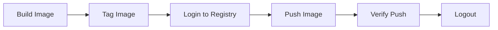

# How to Use Ansible to Push Docker Images to Registry

Author: [nawazdhandala](https://www.github.com/nawazdhandala)

Tags: Ansible, Docker, Registry, CI/CD, Automation

Description: Automate building and pushing Docker images to registries using Ansible with the community.docker collection modules.

---

Pushing Docker images to a registry is a routine part of any CI/CD pipeline. When you manage multiple services or environments, doing this manually becomes tedious and error-prone. Ansible can handle the entire workflow: logging into the registry, building images, tagging them properly, and pushing them. This post covers all the practical details.

## The Workflow at a Glance

Before diving into playbooks, here is the typical flow for building and pushing images:



Each of these steps can be handled by a specific Ansible module from the `community.docker` collection.

## Prerequisites

You need the `community.docker` collection installed, and Docker must be running on the target hosts:

```bash
# Install the community.docker collection
ansible-galaxy collection install community.docker
```

Your inventory should define which hosts will build and push images. Often this is a CI runner or a dedicated build server.

## Logging Into a Docker Registry

Before pushing, you must authenticate. The `docker_login` module handles this cleanly:

```yaml
# login_registry.yml - Authenticate to a Docker registry
---
- name: Login to Docker Registry
  hosts: build_servers
  become: true
  vars:
    registry_url: "https://registry.example.com"
    registry_user: "deployer"
    registry_password: "{{ vault_registry_password }}"

  tasks:
    - name: Log in to private registry
      community.docker.docker_login:
        registry_url: "{{ registry_url }}"
        username: "{{ registry_user }}"
        password: "{{ registry_password }}"
        reauthorize: true
```

The `reauthorize: true` flag forces a fresh login even if credentials are already cached. This is useful in CI environments where tokens might expire.

For Docker Hub, you can omit the `registry_url` entirely since it defaults to Docker Hub:

```yaml
    - name: Log in to Docker Hub
      community.docker.docker_login:
        username: "{{ dockerhub_user }}"
        password: "{{ dockerhub_token }}"
```

## Building and Pushing an Image

The `docker_image` module can build from a Dockerfile and push in a single task. This is the most common pattern:

```yaml
# build_and_push.yml - Build an image and push to registry
---
- name: Build and Push Docker Image
  hosts: build_servers
  become: true
  vars:
    registry: registry.example.com
    image_name: myapp/backend
    image_tag: "{{ lookup('pipe', 'git rev-parse --short HEAD') }}"
    build_context: /opt/builds/backend

  tasks:
    - name: Log in to registry
      community.docker.docker_login:
        registry_url: "https://{{ registry }}"
        username: "{{ registry_user }}"
        password: "{{ registry_password }}"

    - name: Build and push image
      community.docker.docker_image:
        name: "{{ registry }}/{{ image_name }}"
        tag: "{{ image_tag }}"
        source: build
        build:
          path: "{{ build_context }}"
          dockerfile: Dockerfile
          pull: true
          args:
            APP_VERSION: "{{ image_tag }}"
        push: true
        force_source: true
```

The `force_source: true` option ensures the image is rebuilt even if a local image with that name already exists. The `pull: true` inside the build options tells Docker to pull the latest base image before building.

## Tagging and Pushing Multiple Tags

Production workflows often require pushing the same image with multiple tags. For example, you might want both a specific version tag and a `latest` tag:

```yaml
# multi_tag_push.yml - Push an image with multiple tags
---
- name: Push Image with Multiple Tags
  hosts: build_servers
  become: true
  vars:
    registry: registry.example.com
    image_name: myapp/api
    version: "1.5.2"
    tags_to_push:
      - "{{ version }}"
      - "{{ version | regex_replace('\\.[0-9]+$', '') }}"  # 1.5
      - "latest"

  tasks:
    - name: Log in to registry
      community.docker.docker_login:
        registry_url: "https://{{ registry }}"
        username: "{{ registry_user }}"
        password: "{{ registry_password }}"

    - name: Build the image with version tag
      community.docker.docker_image:
        name: "{{ registry }}/{{ image_name }}"
        tag: "{{ version }}"
        source: build
        build:
          path: /opt/builds/api
        push: false

    - name: Tag and push image with all tags
      community.docker.docker_image:
        name: "{{ registry }}/{{ image_name }}"
        tag: "{{ item }}"
        source: local
        repository: "{{ registry }}/{{ image_name }}"
        push: true
        force_tag: true
      loop: "{{ tags_to_push }}"
```

## Pushing to Multiple Registries

Some organizations mirror images across registries for redundancy or to keep images close to different data centers:

```yaml
# multi_registry_push.yml - Push to multiple registries
---
- name: Push to Multiple Registries
  hosts: build_servers
  become: true
  vars:
    source_image: myapp/frontend:2.0.0
    registries:
      - url: "https://registry-us.example.com"
        prefix: "registry-us.example.com"
        user: "{{ vault_us_user }}"
        password: "{{ vault_us_password }}"
      - url: "https://registry-eu.example.com"
        prefix: "registry-eu.example.com"
        user: "{{ vault_eu_user }}"
        password: "{{ vault_eu_password }}"

  tasks:
    - name: Build image locally
      community.docker.docker_image:
        name: "{{ source_image }}"
        source: build
        build:
          path: /opt/builds/frontend

    - name: Login, tag, and push to each registry
      include_tasks: push_to_registry.yml
      loop: "{{ registries }}"
      loop_control:
        loop_var: reg
```

The included task file handles the per-registry logic:

```yaml
# push_to_registry.yml - Push to a single registry (included task)
---
- name: "Login to {{ reg.prefix }}"
  community.docker.docker_login:
    registry_url: "{{ reg.url }}"
    username: "{{ reg.user }}"
    password: "{{ reg.password }}"

- name: "Tag image for {{ reg.prefix }}"
  community.docker.docker_image:
    name: "{{ source_image }}"
    repository: "{{ reg.prefix }}/{{ source_image }}"
    source: local
    force_tag: true
    push: true
```

## Pushing Images from a CI/CD Pipeline

Here is a more complete example that integrates with a Git-based CI workflow. It checks out code, builds the image, runs basic tests, and pushes only if tests pass:

```yaml
# ci_build_push.yml - Full CI build and push pipeline
---
- name: CI Build and Push Pipeline
  hosts: build_servers
  become: true
  vars:
    repo_url: "https://github.com/myorg/myapp.git"
    branch: main
    registry: registry.example.com
    image_name: myapp/worker

  tasks:
    - name: Clone repository
      ansible.builtin.git:
        repo: "{{ repo_url }}"
        dest: /tmp/build/myapp
        version: "{{ branch }}"
        force: true

    - name: Get git commit hash for tagging
      ansible.builtin.command:
        cmd: git rev-parse --short HEAD
        chdir: /tmp/build/myapp
      register: git_hash
      changed_when: false

    - name: Set image tag fact
      ansible.builtin.set_fact:
        image_tag: "{{ git_hash.stdout }}"

    - name: Build the Docker image
      community.docker.docker_image:
        name: "{{ registry }}/{{ image_name }}"
        tag: "{{ image_tag }}"
        source: build
        build:
          path: /tmp/build/myapp
          pull: true
        push: false

    - name: Run smoke tests against the built image
      community.docker.docker_container:
        name: smoke-test
        image: "{{ registry }}/{{ image_name }}:{{ image_tag }}"
        command: "/app/run_tests.sh"
        detach: false
        cleanup: true
      register: test_result

    - name: Push image if tests passed
      community.docker.docker_image:
        name: "{{ registry }}/{{ image_name }}"
        tag: "{{ image_tag }}"
        push: true
        source: local
      when: test_result.container.State.ExitCode == 0

    - name: Clean up build directory
      ansible.builtin.file:
        path: /tmp/build/myapp
        state: absent
```

## Verifying the Push

After pushing, it is good practice to verify the image actually made it to the registry:

```yaml
# verify_push.yml - Confirm image exists in registry
---
- name: Verify Image Push
  hosts: localhost
  vars:
    registry_url: "https://registry.example.com"
    image_name: myapp/worker
    expected_tag: "abc1234"

  tasks:
    - name: Check if tag exists in registry
      ansible.builtin.uri:
        url: "{{ registry_url }}/v2/{{ image_name }}/tags/list"
        method: GET
        url_username: "{{ registry_user }}"
        url_password: "{{ registry_password }}"
        force_basic_auth: true
      register: tags_response

    - name: Verify tag is present
      ansible.builtin.assert:
        that:
          - expected_tag in tags_response.json.tags
        fail_msg: "Tag {{ expected_tag }} not found in registry"
        success_msg: "Image {{ image_name }}:{{ expected_tag }} verified in registry"
```

## Cleaning Up After Push

Always log out and clean up local images to avoid filling up disk space on build servers:

```yaml
    - name: Remove local image after push
      community.docker.docker_image:
        name: "{{ registry }}/{{ image_name }}"
        tag: "{{ image_tag }}"
        state: absent
        force_absent: true

    - name: Logout from registry
      community.docker.docker_login:
        registry_url: "https://{{ registry }}"
        state: absent
```

## Summary

Pushing Docker images with Ansible gives you a reproducible, auditable build pipeline that does not depend on shell scripts. The `community.docker` collection provides modules for every step: `docker_login` for authentication, `docker_image` for building, tagging, and pushing, and `docker_container` for running tests against the built image. Combined with Ansible Vault for credential management, you get a secure pipeline that works consistently across environments.
