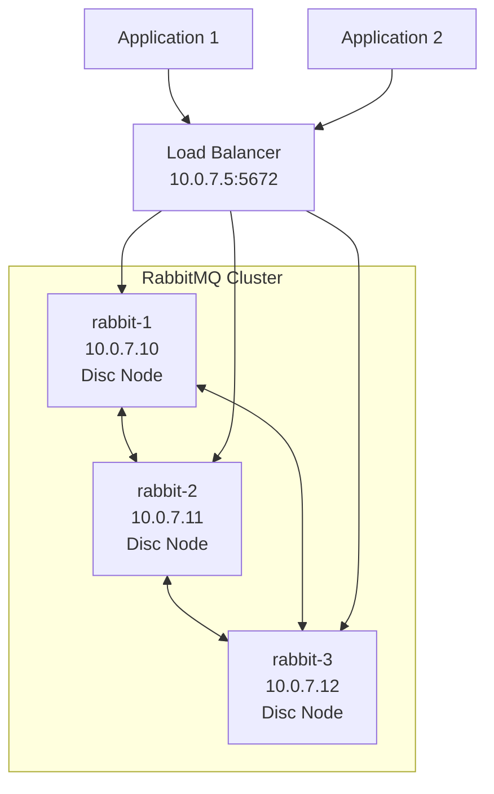

# How to Use Ansible to Set Up RabbitMQ Cluster

Author: [nawazdhandala](https://www.github.com/nawazdhandala)

Tags: Ansible, RabbitMQ, Clustering, High Availability

Description: Deploy a production-ready RabbitMQ cluster with quorum queues and automatic peer discovery using Ansible automation.

---

A standalone RabbitMQ server is a single point of failure. When it goes down, every service that depends on it stops processing messages. RabbitMQ clustering solves this by distributing the broker across multiple nodes. Combined with quorum queues, you get both high availability and data safety. Setting up a RabbitMQ cluster involves sharing Erlang cookies, configuring peer discovery, and setting up queue mirroring policies. Ansible automates all of it.

This guide walks through deploying a three-node RabbitMQ cluster using Ansible.

## Cluster Architecture

A three-node cluster provides a quorum of two, meaning the cluster continues operating if one node fails.



## Prerequisites

- All nodes must be able to resolve each other by hostname
- Port 4369 (epmd) and 25672 (Erlang distribution) must be open between nodes
- Port 5672 (AMQP) and 15672 (management) for client access
- All nodes run the same RabbitMQ and Erlang versions

## Inventory

```ini
# inventory/rabbitmq-cluster.ini
[rabbitmq_cluster]
rabbit-1 ansible_host=10.0.7.10 rabbitmq_nodename=rabbit@rabbit-1
rabbit-2 ansible_host=10.0.7.11 rabbitmq_nodename=rabbit@rabbit-2
rabbit-3 ansible_host=10.0.7.12 rabbitmq_nodename=rabbit@rabbit-3

[rabbitmq_cluster:vars]
ansible_user=ubuntu
rabbitmq_cluster_name=production-mq
```

## Step 1: Ensure Hostname Resolution

Erlang clustering requires nodes to resolve each other by hostname. Set up `/etc/hosts` entries.

```yaml
# playbooks/setup-hosts.yml
---
- name: Configure hostname resolution for RabbitMQ cluster
  hosts: rabbitmq_cluster
  become: true

  tasks:
    - name: Set the hostname on each node
      ansible.builtin.hostname:
        name: "{{ inventory_hostname }}"

    - name: Add all cluster nodes to /etc/hosts
      ansible.builtin.lineinfile:
        path: /etc/hosts
        line: "{{ hostvars[item].ansible_host }} {{ item }}"
        state: present
      loop: "{{ groups['rabbitmq_cluster'] }}"
```

## Step 2: Share the Erlang Cookie

All nodes in a RabbitMQ cluster must share the same Erlang cookie. This is a shared secret that allows Erlang nodes to communicate.

```yaml
# playbooks/setup-erlang-cookie.yml
---
- name: Distribute Erlang cookie across cluster nodes
  hosts: rabbitmq_cluster
  become: true
  vars_files:
    - ../vault/rabbitmq-secrets.yml

  tasks:
    - name: Stop RabbitMQ before updating the cookie
      ansible.builtin.systemd:
        name: rabbitmq-server
        state: stopped

    - name: Deploy the shared Erlang cookie
      ansible.builtin.copy:
        content: "{{ vault_erlang_cookie }}"
        dest: /var/lib/rabbitmq/.erlang.cookie
        owner: rabbitmq
        group: rabbitmq
        mode: "0400"
      no_log: true

    - name: Start RabbitMQ with the new cookie
      ansible.builtin.systemd:
        name: rabbitmq-server
        state: started
        enabled: true

    - name: Wait for RabbitMQ to fully start
      ansible.builtin.command:
        cmd: rabbitmqctl await_startup
      changed_when: false
      retries: 5
      delay: 10
```

## Step 3: Configure Cluster with Peer Discovery

RabbitMQ supports automatic peer discovery through configuration. This is cleaner than manually joining nodes.

```yaml
# playbooks/configure-cluster.yml
---
- name: Configure RabbitMQ cluster peer discovery
  hosts: rabbitmq_cluster
  become: true

  tasks:
    - name: Deploy cluster-aware RabbitMQ configuration
      ansible.builtin.template:
        src: ../templates/rabbitmq-cluster.conf.j2
        dest: /etc/rabbitmq/rabbitmq.conf
        owner: rabbitmq
        group: rabbitmq
        mode: "0640"
      notify: Restart RabbitMQ for clustering

    - name: Deploy advanced configuration for cluster name
      ansible.builtin.copy:
        dest: /etc/rabbitmq/advanced.config
        content: |
          [
            {rabbit, [
              {cluster_name, <<"{{ rabbitmq_cluster_name }}">>}
            ]}
          ].
        owner: rabbitmq
        group: rabbitmq
        mode: "0640"
      notify: Restart RabbitMQ for clustering

  handlers:
    - name: Restart RabbitMQ for clustering
      ansible.builtin.systemd:
        name: rabbitmq-server
        state: restarted
```

The cluster configuration template.

```jinja2
# templates/rabbitmq-cluster.conf.j2
# RabbitMQ Cluster Configuration - managed by Ansible

# Network
listeners.tcp.default = 5672
management.tcp.port = 15672

# Cluster peer discovery using classic config
cluster_formation.peer_discovery_backend = classic_config

cluster_formation.classic_config.nodes.{{ loop.index }} = rabbit@{{ host }}


# How long to wait for peer discovery before giving up
cluster_formation.node_cleanup.interval = 30
cluster_formation.node_cleanup.only_log_warning = true

# Partition handling strategy
cluster_partition_handling = pause_minority

# Memory and disk thresholds
vm_memory_high_watermark.relative = 0.6
disk_free_limit.relative = 1.5

# Statistics collection
collect_statistics = coarse
collect_statistics_interval = 5000

# Default queue type for new queues
default_queue_type = quorum

# Consumer timeout
consumer_timeout = 1800000
```

## Step 4: Manual Cluster Join (Alternative Approach)

If you prefer explicit cluster joining over peer discovery, here is the manual approach.

```yaml
# playbooks/join-cluster-manual.yml
---
- name: Join RabbitMQ nodes to the cluster manually
  hosts: rabbitmq_cluster
  become: true
  serial: 1

  tasks:
    - name: Skip the first node (it forms the initial cluster)
      when: inventory_hostname != groups['rabbitmq_cluster'][0]
      block:
        - name: Stop the RabbitMQ application on this node
          ansible.builtin.command:
            cmd: rabbitmqctl stop_app
          changed_when: true

        - name: Reset this node to clear any previous cluster state
          ansible.builtin.command:
            cmd: rabbitmqctl reset
          changed_when: true

        - name: Join the first node in the cluster
          ansible.builtin.command:
            cmd: "rabbitmqctl join_cluster rabbit@{{ groups['rabbitmq_cluster'][0] }}"
          changed_when: true

        - name: Start the RabbitMQ application
          ansible.builtin.command:
            cmd: rabbitmqctl start_app
          changed_when: true

        - name: Wait for node to synchronize
          ansible.builtin.pause:
            seconds: 15
```

## Step 5: Configure Quorum Queues

Quorum queues are the recommended way to achieve data safety in a RabbitMQ cluster. They use the Raft consensus algorithm.

```yaml
# playbooks/configure-quorum-queues.yml
---
- name: Configure quorum queue policies
  hosts: rabbitmq_cluster[0]
  become: true

  tasks:
    - name: Set a policy for quorum queues with replication
      community.rabbitmq.rabbitmq_policy:
        name: ha-quorum
        pattern: "^(?!amq\\.).*"  # All queues except built-in ones
        tags:
          queue-mode: default
          delivery-limit: 5
        vhost: /
        state: present
        apply_to: queues

    - name: Set max queue length policy to prevent unbounded growth
      community.rabbitmq.rabbitmq_policy:
        name: max-length
        pattern: ".*"
        tags:
          max-length: 1000000
          overflow: reject-publish
        vhost: /
        state: present
        apply_to: queues
```

## Step 6: Verify Cluster

```yaml
# playbooks/verify-cluster.yml
---
- name: Verify RabbitMQ cluster status
  hosts: rabbitmq_cluster
  become: true

  tasks:
    - name: Check cluster status
      ansible.builtin.command:
        cmd: rabbitmqctl cluster_status
      register: cluster_status
      changed_when: false

    - name: Display cluster status
      ansible.builtin.debug:
        msg: "{{ cluster_status.stdout_lines }}"

- name: Run cluster-wide checks from one node
  hosts: rabbitmq_cluster[0]
  become: true

  tasks:
    - name: Verify all nodes are in the cluster
      ansible.builtin.command:
        cmd: rabbitmqctl cluster_status --formatter json
      register: cluster_json
      changed_when: false

    - name: Check cluster alarm status
      ansible.builtin.command:
        cmd: rabbitmq-diagnostics check_alarms
      register: alarms
      changed_when: false

    - name: Display alarm status
      ansible.builtin.debug:
        msg: "{{ alarms.stdout_lines }}"
```

## Full Deployment Playbook

```yaml
# playbooks/deploy-rabbitmq-cluster.yml
---
- name: Step 1 - Install RabbitMQ
  import_playbook: install-rabbitmq.yml

- name: Step 2 - Configure hostname resolution
  import_playbook: setup-hosts.yml

- name: Step 3 - Distribute Erlang cookie
  import_playbook: setup-erlang-cookie.yml

- name: Step 4 - Configure cluster peer discovery
  import_playbook: configure-cluster.yml

- name: Step 5 - Configure quorum queues
  import_playbook: configure-quorum-queues.yml

- name: Step 6 - Verify cluster
  import_playbook: verify-cluster.yml
```

```bash
# Deploy the full RabbitMQ cluster
ansible-playbook playbooks/deploy-rabbitmq-cluster.yml \
  -i inventory/rabbitmq-cluster.ini \
  --ask-vault-pass
```

## Handling Network Partitions

Network partitions are the biggest challenge in RabbitMQ clustering. The `cluster_partition_handling` setting determines how the cluster responds.

- **`pause_minority`**: The nodes in the minority partition pause themselves. Best for most deployments with three or more nodes.
- **`autoheal`**: The cluster automatically picks a winner and restarts the losing partition. Simpler but can lose messages.
- **`ignore`**: Do nothing. Only appropriate if you have external monitoring and manual intervention procedures.

## Production Tips

1. **Use an odd number of nodes.** Three nodes gives you tolerance for one failure. Five nodes gives you tolerance for two.

2. **Use quorum queues, not classic mirrored queues.** Classic mirrored queues are deprecated as of RabbitMQ 3.13. Quorum queues are safer and perform better.

3. **Put a load balancer in front of the cluster.** Clients should not hardcode individual node addresses. Use a TCP load balancer that health-checks each node.

4. **Monitor queue depth.** If consumers fall behind and queues grow, you will hit memory watermarks. Set `max-length` policies to bound queue growth.

5. **Test failover regularly.** Stop a node, verify messages continue flowing, then bring it back. Do this in staging before you need to do it in production.

## Conclusion

A RabbitMQ cluster with Ansible gives you a resilient messaging infrastructure that you can deploy and rebuild reliably. The playbooks in this guide cover the full process from installation through cluster formation, quorum queue configuration, and verification. Keep the Erlang cookie in Ansible Vault, use peer discovery for clean cluster formation, and set `pause_minority` as your partition handling strategy.
