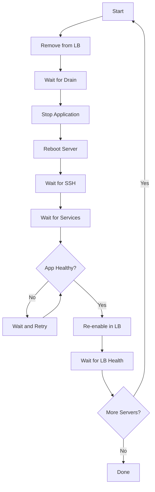

# How to Use Ansible to Reboot Servers and Wait for Return

Author: [nawazdhandala](https://www.github.com/nawazdhandala)

Tags: Ansible, Reboot, Server Management, Linux

Description: Safely reboot Linux servers with Ansible and wait for them to come back online with proper health verification checks.

---

Rebooting servers sounds trivial until you have to do it across a fleet. A careless reboot of all servers at once takes down your entire service. An unmonitored reboot might leave a server stuck in BIOS or with a kernel panic that nobody notices until users start complaining. Ansible provides a `reboot` module that handles the entire lifecycle: initiating the reboot, waiting for the server to come back, and verifying connectivity is restored.

This guide covers the various ways to handle reboots with Ansible, from simple single-server reboots to sophisticated rolling reboot strategies with health validation.

## Basic Reboot with Wait

The simplest approach uses the built-in reboot module:

```yaml
# basic-reboot.yml - Simple reboot and wait
---
- name: Reboot servers and wait for return
  hosts: "{{ target_hosts | default('staging') }}"
  become: true
  serial: 1

  tasks:
    # Reboot the server and wait for it to come back
    - name: Reboot and wait for return
      ansible.builtin.reboot:
        msg: "Ansible-initiated reboot"
        reboot_timeout: 600
        pre_reboot_delay: 5
        post_reboot_delay: 30
        connect_timeout: 5
        test_command: uptime

    # Verify the server is fully operational
    - name: Verify system is up
      ansible.builtin.command:
        cmd: uptime
      register: uptime_result
      changed_when: false

    - name: Display uptime
      ansible.builtin.debug:
        msg: "{{ inventory_hostname }} is back: {{ uptime_result.stdout }}"
```

## Conditional Reboot (Only When Needed)

Most of the time, you only want to reboot if something requires it, like a kernel update or a configuration change:

```yaml
# conditional-reboot.yml - Reboot only when necessary
---
- name: Reboot servers only when required
  hosts: all
  become: true
  serial: 3

  tasks:
    # Check if a reboot is pending on RHEL/CentOS
    - name: Check reboot requirement (RedHat)
      ansible.builtin.command:
        cmd: needs-restarting -r
      register: reboot_check_rh
      changed_when: false
      failed_when: false
      when: ansible_os_family == "RedHat"

    # Check if a reboot is pending on Debian/Ubuntu
    - name: Check reboot requirement (Debian)
      ansible.builtin.stat:
        path: /var/run/reboot-required
      register: reboot_check_deb
      when: ansible_os_family == "Debian"

    # Determine if reboot is needed
    - name: Set reboot needed fact
      ansible.builtin.set_fact:
        reboot_needed: >-
          {{ (ansible_os_family == "RedHat" and reboot_check_rh.rc | default(0) == 1) or
             (ansible_os_family == "Debian" and reboot_check_deb.stat.exists | default(false)) }}

    # Report which servers need rebooting
    - name: Report reboot status
      ansible.builtin.debug:
        msg: "{{ inventory_hostname }}: {{ 'REBOOT NEEDED' if reboot_needed else 'No reboot needed' }}"

    # Only reboot servers that need it
    - name: Reboot if required
      ansible.builtin.reboot:
        msg: "Rebooting for pending system updates"
        reboot_timeout: 600
        post_reboot_delay: 30
      when: reboot_needed | bool

    # Verify post-reboot
    - name: Verify system health after reboot
      ansible.builtin.command:
        cmd: systemctl is-system-running
      register: system_state
      changed_when: false
      failed_when: false
      when: reboot_needed | bool

    - name: Display system state
      ansible.builtin.debug:
        msg: "{{ inventory_hostname }} system state: {{ system_state.stdout | default('not rebooted') }}"
```

## Rolling Reboot with Health Checks

For production systems, you need a more careful approach that validates services are healthy before moving to the next batch:

```yaml
# rolling-reboot.yml - Production-safe rolling reboot
---
- name: Rolling reboot with health validation
  hosts: production_web
  become: true
  serial: 1
  max_fail_percentage: 0

  pre_tasks:
    # Remove from load balancer before reboot
    - name: Drain connections from load balancer
      ansible.builtin.uri:
        url: "http://{{ haproxy_host }}/admin/servers/{{ inventory_hostname }}/drain"
        method: POST
      delegate_to: localhost
      failed_when: false

    # Wait for active connections to close
    - name: Wait for connection drain
      ansible.builtin.pause:
        seconds: 30

    # Stop application gracefully before reboot
    - name: Stop application service
      ansible.builtin.systemd:
        name: myapp
        state: stopped

  tasks:
    # Perform the reboot
    - name: Reboot the server
      ansible.builtin.reboot:
        msg: "Scheduled maintenance reboot"
        reboot_timeout: 600
        pre_reboot_delay: 10
        post_reboot_delay: 60
        connect_timeout: 10
        test_command: "systemctl is-system-running --wait"

  post_tasks:
    # Wait for key services to be running
    - name: Wait for essential services
      ansible.builtin.systemd:
        name: "{{ item }}"
      register: service_status
      until: service_status.status.ActiveState == "active"
      retries: 30
      delay: 10
      loop:
        - network
        - sshd
        - myapp

    # Wait for application port to be listening
    - name: Wait for application port
      ansible.builtin.wait_for:
        port: 8080
        host: "{{ ansible_host }}"
        timeout: 120
      delegate_to: localhost

    # Verify application health endpoint
    - name: Check application health
      ansible.builtin.uri:
        url: "http://{{ ansible_host }}:8080/health"
        status_code: 200
        timeout: 10
      register: health_check
      retries: 10
      delay: 10
      until: health_check.status == 200
      delegate_to: localhost

    # Re-enable in load balancer
    - name: Enable in load balancer
      ansible.builtin.uri:
        url: "http://{{ haproxy_host }}/admin/servers/{{ inventory_hostname }}/enable"
        method: POST
      delegate_to: localhost

    # Wait for LB to mark as healthy
    - name: Wait for LB health check pass
      ansible.builtin.pause:
        seconds: 30

    # Final verification
    - name: Verify server is serving traffic
      ansible.builtin.uri:
        url: "http://{{ ansible_host }}:8080/"
        status_code: 200
      delegate_to: localhost
      register: final_check
      retries: 3
      delay: 5
      until: final_check.status == 200

    - name: Report success
      ansible.builtin.debug:
        msg: "{{ inventory_hostname }} rebooted and healthy. Moving to next server."
```

## Reboot Workflow



## Handling Reboot Failures

Sometimes servers do not come back. Here is how to handle that gracefully:

```yaml
# safe-reboot.yml - Reboot with failure handling
---
- name: Safe reboot with failure handling
  hosts: "{{ target_hosts }}"
  become: true
  serial: 1

  tasks:
    # Record the current uptime before reboot
    - name: Get pre-reboot uptime
      ansible.builtin.command:
        cmd: cat /proc/uptime
      register: pre_uptime
      changed_when: false

    # Attempt the reboot
    - name: Reboot server
      ansible.builtin.reboot:
        reboot_timeout: 600
        post_reboot_delay: 30
      register: reboot_result
      ignore_errors: true

    # Handle reboot failure
    - name: Handle failed reboot
      block:
        - name: Alert on failed reboot
          ansible.builtin.debug:
            msg: "CRITICAL: {{ inventory_hostname }} did not return after reboot!"

        # Try to reach the server with a longer timeout
        - name: Extended wait for server
          ansible.builtin.wait_for_connection:
            timeout: 900
            delay: 60
          register: extended_wait
          ignore_errors: true

        - name: Final failure report
          ansible.builtin.fail:
            msg: "Server {{ inventory_hostname }} is unreachable after reboot. Manual intervention required."
          when: extended_wait is failed
      when: reboot_result is failed

    # Verify reboot actually happened
    - name: Get post-reboot uptime
      ansible.builtin.command:
        cmd: cat /proc/uptime
      register: post_uptime
      changed_when: false

    - name: Verify reboot occurred
      ansible.builtin.assert:
        that:
          - post_uptime.stdout.split('.')[0] | int < pre_uptime.stdout.split('.')[0] | int
        fail_msg: "Server does not appear to have actually rebooted!"
        success_msg: "Reboot confirmed. Uptime: {{ post_uptime.stdout.split('.')[0] }} seconds"
```

## Rebooting with Ansible Handler Pattern

When the reboot is triggered by a configuration change, using a handler is the cleanest approach:

```yaml
# handler-reboot.yml - Reboot triggered by configuration changes
---
- name: Configure kernel parameters and reboot if needed
  hosts: all
  become: true
  serial: 2

  tasks:
    # Make a kernel parameter change that requires a reboot
    - name: Set kernel parameter
      ansible.builtin.sysctl:
        name: vm.swappiness
        value: "10"
        state: present
        sysctl_set: true
        reload: true

    # Update GRUB configuration
    - name: Update GRUB default
      ansible.builtin.lineinfile:
        path: /etc/default/grub
        regexp: '^GRUB_CMDLINE_LINUX_DEFAULT='
        line: 'GRUB_CMDLINE_LINUX_DEFAULT="quiet transparent_hugepage=never"'
      notify:
        - rebuild grub
        - reboot server

    # Install a new kernel
    - name: Update kernel
      ansible.builtin.yum:
        name: kernel
        state: latest
      register: kernel_update
      when: ansible_os_family == "RedHat"
      notify: reboot server

  handlers:
    - name: rebuild grub
      ansible.builtin.command:
        cmd: grub2-mkconfig -o /boot/grub2/grub.cfg

    - name: reboot server
      ansible.builtin.reboot:
        msg: "Rebooting for configuration changes"
        reboot_timeout: 600
        post_reboot_delay: 30
```

## Parallel Reboot of Non-Critical Servers

For development or test environments where you do not need rolling reboots:

```yaml
# batch-reboot.yml - Faster batch rebooting for non-critical environments
---
- name: Batch reboot non-critical servers
  hosts: development
  become: true
  strategy: free  # Run as fast as possible, do not wait for each host

  tasks:
    - name: Reboot all dev servers
      ansible.builtin.reboot:
        msg: "Dev environment reboot for updates"
        reboot_timeout: 300
        post_reboot_delay: 15

    - name: Verify all servers returned
      ansible.builtin.command:
        cmd: uptime
      register: uptime_output
      changed_when: false

    - name: Report status
      ansible.builtin.debug:
        msg: "{{ inventory_hostname }}: {{ uptime_output.stdout }}"
```

## Scheduling Reboots for Later

Sometimes you want to schedule a reboot rather than doing it immediately:

```yaml
# schedule-reboot.yml - Schedule a reboot for a maintenance window
---
- name: Schedule server reboot
  hosts: "{{ target_hosts }}"
  become: true

  vars:
    reboot_time: "02:00"  # 2 AM
    reboot_message: "Scheduled maintenance reboot"

  tasks:
    # Schedule the reboot using the shutdown command
    - name: Schedule reboot
      ansible.builtin.command:
        cmd: "shutdown -r {{ reboot_time }} '{{ reboot_message }}'"
      register: schedule_result

    - name: Confirm scheduled reboot
      ansible.builtin.debug:
        msg: "Reboot scheduled on {{ inventory_hostname }} for {{ reboot_time }}: {{ schedule_result.stdout | default('scheduled') }}"

    # To cancel a scheduled reboot
    # - name: Cancel scheduled reboot
    #   ansible.builtin.command:
    #     cmd: shutdown -c
```

## Tips for Production Reboots

Experience-tested advice for rebooting servers at scale:

1. Always use `serial: 1` for production services behind a load balancer. The extra time is worth it compared to the risk of taking down your entire cluster simultaneously.

2. The `post_reboot_delay` parameter is more important than most people think. After a server comes back to SSH accessibility, the OS is still starting services, mounting filesystems, and initializing applications. A 30-60 second delay avoids false-positive "server is up" conclusions.

3. Verify that the reboot actually happened by checking uptime. I have seen cases where the reboot command was acknowledged but the server did not actually restart due to hung processes or kernel issues.

4. Set `reboot_timeout` appropriately for your hardware. Bare-metal servers with RAID controllers can take 5-10 minutes to POST. Cloud instances usually come back in 1-2 minutes. Default to a generous timeout and adjust from there.

5. Always have an out-of-band management path (IPMI, iLO, iDRAC, cloud console) for servers that do not come back. Ansible cannot help you if the server is stuck in BIOS.

6. Log every reboot with the reason. When someone asks "why did server X reboot on Tuesday?", you want a clear audit trail. The pre_tasks and post_tasks blocks are good places for this logging.

Rebooting servers with Ansible transforms a risky manual operation into a controlled, monitored, and repeatable process. The few extra minutes spent on health checks and serial execution pay off every time.
