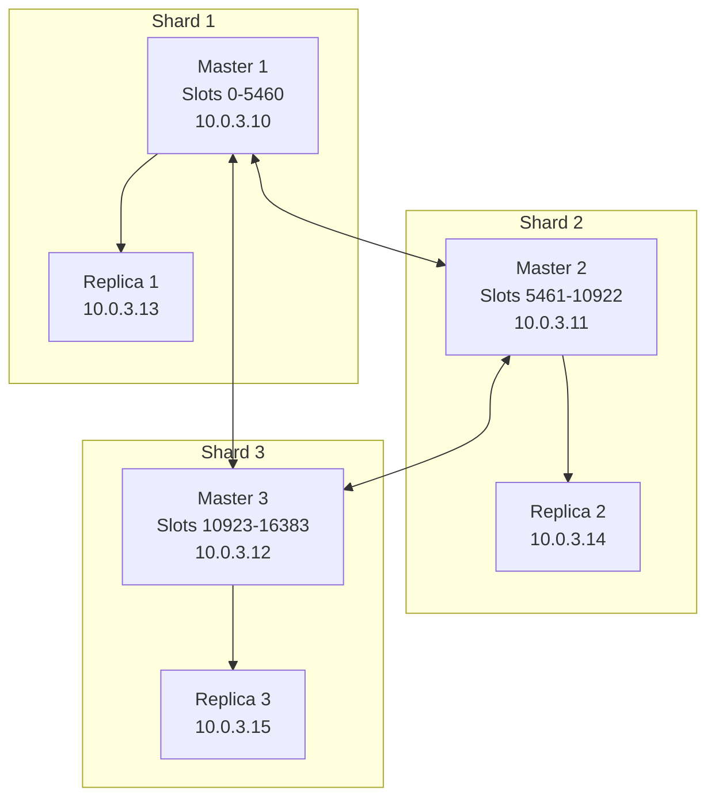

# How to Use Ansible to Set Up Redis Cluster

Author: [nawazdhandala](https://www.github.com/nawazdhandala)

Tags: Ansible, Redis, Clustering, Scalability

Description: Complete guide to deploying a Redis Cluster with automatic sharding using Ansible for scalable in-memory data storage.

---

Redis Cluster is the built-in way to horizontally scale Redis. Unlike Redis Sentinel, which provides high availability for a single dataset, Redis Cluster shards your data across multiple nodes. Each node handles a subset of the 16384 hash slots, and the cluster automatically distributes keys across them. Setting up a Redis Cluster by hand involves creating six or more Redis instances, then running `redis-cli --cluster create` with the right arguments. With Ansible, you can automate the entire thing.

This guide covers deploying a six-node Redis Cluster (three masters, three replicas) using Ansible.

## Cluster Architecture

A minimum Redis Cluster requires six nodes: three masters and three replicas. Each master gets a replica for failover.



## Inventory

```ini
# inventory/redis-cluster.ini
[redis_cluster_nodes]
redis-node-1 ansible_host=10.0.3.10 redis_cluster_port=6379
redis-node-2 ansible_host=10.0.3.11 redis_cluster_port=6379
redis-node-3 ansible_host=10.0.3.12 redis_cluster_port=6379
redis-node-4 ansible_host=10.0.3.13 redis_cluster_port=6379
redis-node-5 ansible_host=10.0.3.14 redis_cluster_port=6379
redis-node-6 ansible_host=10.0.3.15 redis_cluster_port=6379

[redis_cluster_nodes:vars]
ansible_user=ubuntu
redis_cluster_replicas=1
redis_cluster_bus_port=16379
```

## Step 1: Install Redis on All Cluster Nodes

```yaml
# playbooks/install-redis-cluster-nodes.yml
---
- name: Install Redis on all cluster nodes
  hosts: redis_cluster_nodes
  become: true

  tasks:
    - name: Install prerequisites
      ansible.builtin.apt:
        name:
          - lsb-release
          - curl
          - gpg
        state: present
        update_cache: true

    - name: Add Redis GPG key
      ansible.builtin.apt_key:
        url: https://packages.redis.io/gpg
        state: present

    - name: Add Redis APT repository
      ansible.builtin.apt_repository:
        repo: "deb https://packages.redis.io/deb {{ ansible_distribution_release }} main"
        state: present
        filename: redis

    - name: Install redis-server
      ansible.builtin.apt:
        name: redis-server
        state: present
        update_cache: true
```

## Step 2: Configure Each Node for Cluster Mode

Every node needs cluster mode enabled in its configuration. This is what makes it different from a standalone Redis instance.

```yaml
# playbooks/configure-cluster-nodes.yml
---
- name: Configure Redis nodes for cluster mode
  hosts: redis_cluster_nodes
  become: true
  vars_files:
    - ../vault/redis-secrets.yml

  tasks:
    - name: Create Redis data directory for cluster
      ansible.builtin.file:
        path: /var/lib/redis/cluster
        state: directory
        owner: redis
        group: redis
        mode: "0750"

    - name: Deploy cluster-enabled Redis configuration
      ansible.builtin.template:
        src: ../templates/redis-cluster.conf.j2
        dest: /etc/redis/redis.conf
        owner: redis
        group: redis
        mode: "0640"
      notify: Restart Redis for cluster

    - name: Apply system tuning for Redis
      ansible.posix.sysctl:
        name: "{{ item.key }}"
        value: "{{ item.value }}"
        state: present
        reload: true
      loop:
        - { key: "vm.overcommit_memory", value: "1" }
        - { key: "net.core.somaxconn", value: "65535" }

    - name: Ensure Redis is running
      ansible.builtin.systemd:
        name: redis-server
        state: started
        enabled: true

  handlers:
    - name: Restart Redis for cluster
      ansible.builtin.systemd:
        name: redis-server
        state: restarted
```

The cluster configuration template.

```jinja2
# templates/redis-cluster.conf.j2
# Redis Cluster Node - managed by Ansible
bind 0.0.0.0
port {{ redis_cluster_port }}
protected-mode no

# Cluster configuration
cluster-enabled yes
cluster-config-file /var/lib/redis/cluster/nodes.conf
cluster-node-timeout 5000
cluster-announce-ip {{ ansible_host }}
cluster-announce-port {{ redis_cluster_port }}
cluster-announce-bus-port {{ redis_cluster_bus_port }}

# Authentication
requirepass {{ redis_password }}
masterauth {{ redis_password }}

# Persistence
save 900 1
save 300 10
appendonly yes
appendfsync everysec
dir /var/lib/redis/cluster

# Memory
maxmemory {{ redis_cluster_maxmemory | default('2gb') }}
maxmemory-policy allkeys-lru

# Logging
loglevel notice
logfile /var/log/redis/redis-server.log

# Performance
tcp-backlog 511
tcp-keepalive 300
hz 10
dynamic-hz yes
```

## Step 3: Create the Cluster

After all nodes are running with cluster mode enabled, you need to tell them to form a cluster. The `redis-cli --cluster create` command handles slot assignment and replica mapping.

```yaml
# playbooks/create-cluster.yml
---
- name: Form the Redis Cluster
  hosts: redis_cluster_nodes[0]
  become: true
  vars_files:
    - ../vault/redis-secrets.yml

  tasks:
    - name: Build the list of cluster node addresses
      ansible.builtin.set_fact:
        cluster_nodes: >-
          
          {{ hostvars[host].ansible_host }}:{{ hostvars[host].redis_cluster_port }}
          

    - name: Create the Redis Cluster with automatic replica assignment
      ansible.builtin.command:
        cmd: >
          redis-cli -a {{ redis_password }}
          --cluster create {{ cluster_nodes | trim }}
          --cluster-replicas {{ redis_cluster_replicas }}
          --cluster-yes
      register: cluster_create
      changed_when: "'OK' in cluster_create.stdout"
      failed_when: cluster_create.rc != 0 and 'already' not in cluster_create.stderr
      no_log: true

    - name: Display cluster creation result
      ansible.builtin.debug:
        msg: "{{ cluster_create.stdout_lines | default(['Cluster already exists']) }}"
```

## Step 4: Verify the Cluster

After creation, verify that the cluster is healthy and all slots are assigned.

```yaml
# playbooks/verify-cluster.yml
---
- name: Verify Redis Cluster health
  hosts: redis_cluster_nodes[0]
  become: true
  vars_files:
    - ../vault/redis-secrets.yml

  tasks:
    - name: Check cluster info
      ansible.builtin.command:
        cmd: redis-cli -a {{ redis_password }} cluster info
      register: cluster_info
      changed_when: false
      no_log: true

    - name: Check cluster nodes
      ansible.builtin.command:
        cmd: redis-cli -a {{ redis_password }} cluster nodes
      register: cluster_nodes_info
      changed_when: false
      no_log: true

    - name: Verify all 16384 slots are covered
      ansible.builtin.command:
        cmd: redis-cli -a {{ redis_password }} --cluster check {{ ansible_host }}:{{ redis_cluster_port }}
      register: cluster_check
      changed_when: false
      no_log: true

    - name: Display cluster status
      ansible.builtin.debug:
        msg:
          - "Cluster info: {{ cluster_info.stdout_lines[:5] }}"
          - "Cluster check: {{ cluster_check.stdout_lines[-3:] }}"
```

## Adding Nodes to an Existing Cluster

As your data grows, you may need to add more shards. Here is how to add a new master and replica to an existing cluster.

```yaml
# playbooks/add-cluster-node.yml
---
- name: Add a new node to the Redis Cluster
  hosts: redis_cluster_nodes[0]
  become: true
  vars_files:
    - ../vault/redis-secrets.yml
  vars:
    new_node_ip: "10.0.3.16"
    new_node_port: 6379
    existing_node: "{{ ansible_host }}:{{ redis_cluster_port }}"

  tasks:
    - name: Add the new node as a master
      ansible.builtin.command:
        cmd: >
          redis-cli -a {{ redis_password }}
          --cluster add-node {{ new_node_ip }}:{{ new_node_port }}
          {{ existing_node }}
      changed_when: true
      no_log: true

    - name: Wait for the node to join the cluster
      ansible.builtin.pause:
        seconds: 10

    - name: Reshard slots to the new node
      ansible.builtin.command:
        cmd: >
          redis-cli -a {{ redis_password }}
          --cluster reshard {{ existing_node }}
          --cluster-from all
          --cluster-to {{ new_node_id }}
          --cluster-slots 4096
          --cluster-yes
      changed_when: true
      no_log: true
```

## Full Deployment Playbook

Tie all the steps together.

```yaml
# playbooks/deploy-redis-cluster.yml
---
- name: Step 1 - Install Redis
  import_playbook: install-redis-cluster-nodes.yml

- name: Step 2 - Configure for cluster mode
  import_playbook: configure-cluster-nodes.yml

- name: Step 3 - Create the cluster
  import_playbook: create-cluster.yml

- name: Step 4 - Verify cluster health
  import_playbook: verify-cluster.yml
```

Run the full deployment.

```bash
# Deploy the entire Redis Cluster in one command
ansible-playbook playbooks/deploy-redis-cluster.yml \
  -i inventory/redis-cluster.ini \
  --ask-vault-pass
```

## Cluster Maintenance Tasks

Here are some useful maintenance operations.

```yaml
# playbooks/cluster-maintenance.yml
---
- name: Redis Cluster maintenance tasks
  hosts: redis_cluster_nodes[0]
  become: true
  vars_files:
    - ../vault/redis-secrets.yml

  tasks:
    - name: Get cluster slot distribution
      ansible.builtin.command:
        cmd: redis-cli -a {{ redis_password }} --cluster info {{ ansible_host }}:{{ redis_cluster_port }}
      register: slot_info
      changed_when: false
      no_log: true

    - name: Fix any cluster inconsistencies
      ansible.builtin.command:
        cmd: redis-cli -a {{ redis_password }} --cluster fix {{ ansible_host }}:{{ redis_cluster_port }}
      register: cluster_fix
      changed_when: "'OK' in cluster_fix.stdout"
      no_log: true

    - name: Rebalance slots across all masters
      ansible.builtin.command:
        cmd: >
          redis-cli -a {{ redis_password }}
          --cluster rebalance {{ ansible_host }}:{{ redis_cluster_port }}
          --cluster-use-empty-masters
      changed_when: true
      no_log: true
```

## Things That Bite You in Production

1. **Keys that span multiple slots fail.** If your application uses multi-key operations, use hash tags (`{user}:profile`, `{user}:sessions`) to force related keys onto the same slot.

2. **The cluster bus port must be open.** Redis Cluster uses port 16379 (or port + 10000) for node-to-node communication. Forgetting to open this in your firewall means the cluster cannot form.

3. **Resharding is not instant.** Moving slots between nodes migrates keys one at a time. For large datasets, this takes a while and generates network traffic. Do it during low-traffic periods.

4. **Monitor slot coverage.** If a master goes down and its replica also fails, you lose the slots assigned to that shard. The whole cluster stops accepting writes unless you set `cluster-require-full-coverage no`.

5. **Client libraries matter.** Make sure your application's Redis client supports cluster mode. Not all clients do, and those that do not will only connect to a single node.

## Conclusion

Deploying Redis Cluster with Ansible transforms a complex manual process into a repeatable automation workflow. The playbooks here cover installation, cluster-mode configuration, cluster creation, verification, and ongoing maintenance. Keep your configuration in source control, test changes in staging first, and always verify slot coverage after any cluster topology change.
