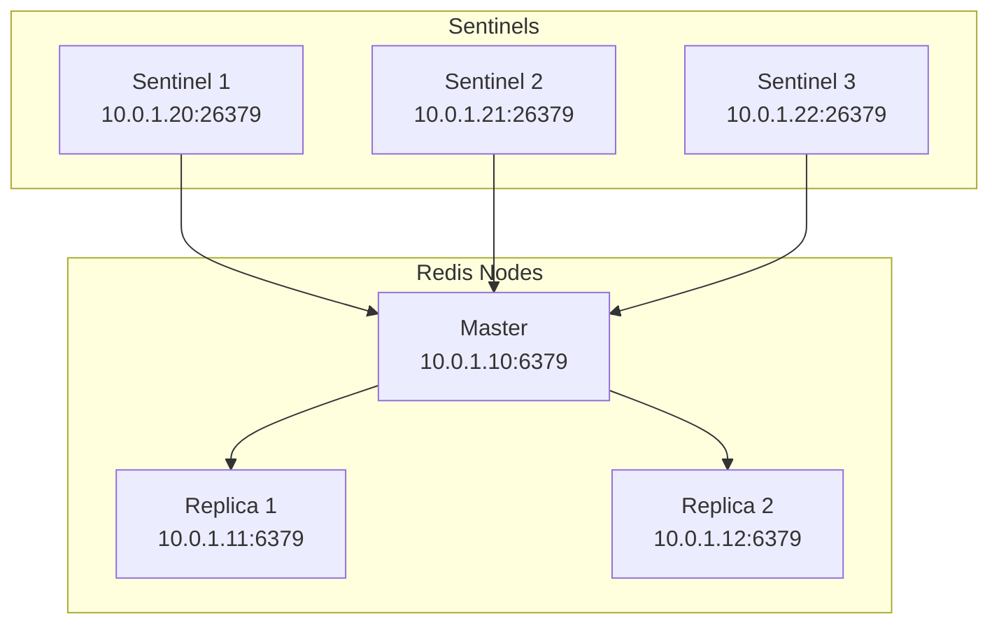

# How to Use Ansible to Set Up Redis Sentinel

Author: [nawazdhandala](https://www.github.com/nawazdhandala)

Tags: Ansible, Redis, High Availability, Sentinel

Description: Learn how to deploy and configure Redis Sentinel for automatic failover using Ansible playbooks with full examples.

---

Redis Sentinel provides high availability for Redis by monitoring your master and replica instances, automatically promoting a replica when the master fails. Setting it up manually is doable for a single cluster, but if you need to manage multiple environments or rebuild infrastructure quickly, you want this automated. Ansible makes it possible to spin up a full Sentinel-monitored Redis deployment in minutes.

This guide walks through deploying a complete Redis Sentinel setup: one master, two replicas, and three Sentinel processes.

## Architecture Overview

A minimal Sentinel deployment looks like this.



You need an odd number of Sentinel instances (at least three) so they can reach a quorum when deciding whether the master is down. Running Sentinel on the same hosts as your Redis nodes is fine for small deployments.

## Inventory

```ini
# inventory/redis-sentinel.ini
[redis_master]
redis-master ansible_host=10.0.1.10

[redis_replicas]
redis-replica-1 ansible_host=10.0.1.11
redis-replica-2 ansible_host=10.0.1.12

[redis_sentinels]
sentinel-1 ansible_host=10.0.1.20
sentinel-2 ansible_host=10.0.1.21
sentinel-3 ansible_host=10.0.1.22

[redis_all:children]
redis_master
redis_replicas
redis_sentinels

[redis_all:vars]
ansible_user=ubuntu
redis_master_ip=10.0.1.10
redis_master_port=6379
redis_sentinel_port=26379
redis_master_name=mymaster
redis_sentinel_quorum=2
redis_sentinel_down_after=5000
redis_sentinel_failover_timeout=60000
redis_sentinel_parallel_syncs=1
```

## Step 1: Install Redis on All Nodes

First, install Redis on every host in the deployment.

```yaml
# playbooks/install-redis-all.yml
---
- name: Install Redis on all nodes
  hosts: redis_all
  become: true

  tasks:
    - name: Install prerequisite packages
      ansible.builtin.apt:
        name:
          - lsb-release
          - curl
          - gpg
        state: present
        update_cache: true

    - name: Add Redis GPG key
      ansible.builtin.apt_key:
        url: https://packages.redis.io/gpg
        state: present

    - name: Add Redis repository
      ansible.builtin.apt_repository:
        repo: "deb https://packages.redis.io/deb {{ ansible_distribution_release }} main"
        state: present
        filename: redis

    - name: Install redis-server and redis-sentinel packages
      ansible.builtin.apt:
        name:
          - redis-server
          - redis-sentinel
        state: present
        update_cache: true
```

## Step 2: Configure the Master

The master needs a straightforward Redis configuration with a password and network binding.

```yaml
# playbooks/configure-master.yml
---
- name: Configure Redis master
  hosts: redis_master
  become: true
  vars_files:
    - ../vault/redis-secrets.yml

  tasks:
    - name: Deploy master redis.conf
      ansible.builtin.template:
        src: ../templates/redis-master.conf.j2
        dest: /etc/redis/redis.conf
        owner: redis
        group: redis
        mode: "0640"
      notify: Restart Redis master

    - name: Ensure Redis master is running
      ansible.builtin.systemd:
        name: redis-server
        state: started
        enabled: true

  handlers:
    - name: Restart Redis master
      ansible.builtin.systemd:
        name: redis-server
        state: restarted
```

The master configuration template.

```jinja2
# templates/redis-master.conf.j2
# Redis Master - managed by Ansible
bind 0.0.0.0
port {{ redis_master_port }}
protected-mode no

# Authentication
requirepass {{ redis_password }}
masterauth {{ redis_password }}

# Persistence
save 900 1
save 300 10
save 60 10000
appendonly yes
appendfsync everysec
dir /var/lib/redis

# Memory
maxmemory {{ redis_maxmemory | default('1gb') }}
maxmemory-policy allkeys-lru

# Logging
loglevel notice
logfile /var/log/redis/redis-server.log

# Performance
tcp-backlog 511
tcp-keepalive 300
```

## Step 3: Configure Replicas

Replicas need the `replicaof` directive pointing to the master.

```yaml
# playbooks/configure-replicas.yml
---
- name: Configure Redis replicas
  hosts: redis_replicas
  become: true
  vars_files:
    - ../vault/redis-secrets.yml

  tasks:
    - name: Deploy replica redis.conf
      ansible.builtin.template:
        src: ../templates/redis-replica.conf.j2
        dest: /etc/redis/redis.conf
        owner: redis
        group: redis
        mode: "0640"
      notify: Restart Redis replica

    - name: Ensure Redis replica is running
      ansible.builtin.systemd:
        name: redis-server
        state: started
        enabled: true

  handlers:
    - name: Restart Redis replica
      ansible.builtin.systemd:
        name: redis-server
        state: restarted
```

```jinja2
# templates/redis-replica.conf.j2
# Redis Replica - managed by Ansible
bind 0.0.0.0
port 6379
protected-mode no

# This node replicates from the master
replicaof {{ redis_master_ip }} {{ redis_master_port }}

# Authentication
requirepass {{ redis_password }}
masterauth {{ redis_password }}

# Replicas are read-only by default
replica-read-only yes

# Persistence
save 900 1
save 300 10
appendonly yes
appendfsync everysec
dir /var/lib/redis

# Memory
maxmemory {{ redis_maxmemory | default('1gb') }}
maxmemory-policy allkeys-lru

# Logging
loglevel notice
logfile /var/log/redis/redis-server.log
```

## Step 4: Configure Sentinel

This is the critical piece. Each Sentinel instance monitors the master and coordinates failover.

```yaml
# playbooks/configure-sentinels.yml
---
- name: Configure Redis Sentinel
  hosts: redis_sentinels
  become: true
  vars_files:
    - ../vault/redis-secrets.yml

  tasks:
    - name: Create Sentinel data directory
      ansible.builtin.file:
        path: /var/lib/redis-sentinel
        state: directory
        owner: redis
        group: redis
        mode: "0750"

    - name: Deploy Sentinel configuration
      ansible.builtin.template:
        src: ../templates/sentinel.conf.j2
        dest: /etc/redis/sentinel.conf
        owner: redis
        group: redis
        mode: "0640"
      notify: Restart Redis Sentinel

    - name: Ensure Sentinel is running
      ansible.builtin.systemd:
        name: redis-sentinel
        state: started
        enabled: true

  handlers:
    - name: Restart Redis Sentinel
      ansible.builtin.systemd:
        name: redis-sentinel
        state: restarted
```

The Sentinel configuration template.

```jinja2
# templates/sentinel.conf.j2
# Redis Sentinel - managed by Ansible
port {{ redis_sentinel_port }}
daemonize no
supervised systemd

dir /var/lib/redis-sentinel
logfile /var/log/redis/sentinel.log

# Monitor the master with a quorum of {{ redis_sentinel_quorum }}
sentinel monitor {{ redis_master_name }} {{ redis_master_ip }} {{ redis_master_port }} {{ redis_sentinel_quorum }}

# Authentication for the monitored master
sentinel auth-pass {{ redis_master_name }} {{ redis_password }}

# How long to wait before considering the master down (milliseconds)
sentinel down-after-milliseconds {{ redis_master_name }} {{ redis_sentinel_down_after }}

# Failover timeout (milliseconds)
sentinel failover-timeout {{ redis_master_name }} {{ redis_sentinel_failover_timeout }}

# How many replicas can sync from the new master simultaneously after failover
sentinel parallel-syncs {{ redis_master_name }} {{ redis_sentinel_parallel_syncs }}

# Deny scripts for security
sentinel deny-scripts-reconfig yes
```

## Step 5: Orchestrate the Full Deployment

Tie everything together with a master playbook that runs the steps in the correct order.

```yaml
# playbooks/deploy-sentinel-cluster.yml
---
- name: Step 1 - Install Redis on all nodes
  import_playbook: install-redis-all.yml

- name: Step 2 - Configure the master
  import_playbook: configure-master.yml

- name: Step 3 - Configure replicas
  import_playbook: configure-replicas.yml

- name: Step 4 - Configure Sentinels
  import_playbook: configure-sentinels.yml

- name: Step 5 - Verify the deployment
  import_playbook: verify-sentinel.yml
```

## Verification Playbook

Check that everything is working after deployment.

```yaml
# playbooks/verify-sentinel.yml
---
- name: Verify Redis Sentinel deployment
  hosts: redis_sentinels[0]
  become: true
  vars_files:
    - ../vault/redis-secrets.yml

  tasks:
    - name: Query Sentinel for the current master
      ansible.builtin.command:
        cmd: redis-cli -p {{ redis_sentinel_port }} SENTINEL get-master-addr-by-name {{ redis_master_name }}
      register: sentinel_master
      changed_when: false

    - name: Check how many replicas Sentinel sees
      ansible.builtin.command:
        cmd: redis-cli -p {{ redis_sentinel_port }} SENTINEL replicas {{ redis_master_name }}
      register: sentinel_replicas
      changed_when: false

    - name: Check how many Sentinels are known
      ansible.builtin.command:
        cmd: redis-cli -p {{ redis_sentinel_port }} SENTINEL sentinels {{ redis_master_name }}
      register: sentinel_peers
      changed_when: false

    - name: Display Sentinel status
      ansible.builtin.debug:
        msg:
          - "Current master: {{ sentinel_master.stdout_lines }}"
          - "Number of replica entries: {{ sentinel_replicas.stdout_lines | length }}"
```

## Testing Failover

You can trigger a manual failover to test that Sentinel works correctly.

```yaml
# playbooks/test-failover.yml
---
- name: Test Sentinel failover
  hosts: redis_sentinels[0]
  become: true

  tasks:
    - name: Trigger a manual failover
      ansible.builtin.command:
        cmd: redis-cli -p {{ redis_sentinel_port }} SENTINEL failover {{ redis_master_name }}
      changed_when: true

    - name: Wait for failover to complete
      ansible.builtin.pause:
        seconds: 15

    - name: Check who the new master is
      ansible.builtin.command:
        cmd: redis-cli -p {{ redis_sentinel_port }} SENTINEL get-master-addr-by-name {{ redis_master_name }}
      register: new_master
      changed_when: false

    - name: Display the new master
      ansible.builtin.debug:
        msg: "New master after failover: {{ new_master.stdout_lines }}"
```

## Production Considerations

1. **Run Sentinels on separate hosts.** If a Sentinel runs on the same host as the master and that host dies, you lose both the master and a Sentinel vote.

2. **Set `down-after-milliseconds` carefully.** Too low and you get false failovers during network blips. Too high and your downtime stretches. 5000ms is a good starting point.

3. **Use `parallel-syncs: 1`** so only one replica at a time syncs with the new master after failover. This keeps the rest available for reads during the transition.

4. **Make sure your application uses Sentinel-aware clients** that can discover the current master. Connecting directly to a fixed IP defeats the purpose.

5. **Monitor Sentinel itself.** Use tools like OneUptime to watch the Sentinel processes and get alerts when a failover happens.

## Conclusion

Redis Sentinel with Ansible gives you automated high availability that you can deploy and rebuild reliably. The playbooks in this guide cover the full lifecycle: installation, master/replica configuration, Sentinel setup, verification, and failover testing. Keep your configuration in version control, use Ansible Vault for passwords, and test failover regularly so you know it works when you actually need it.
