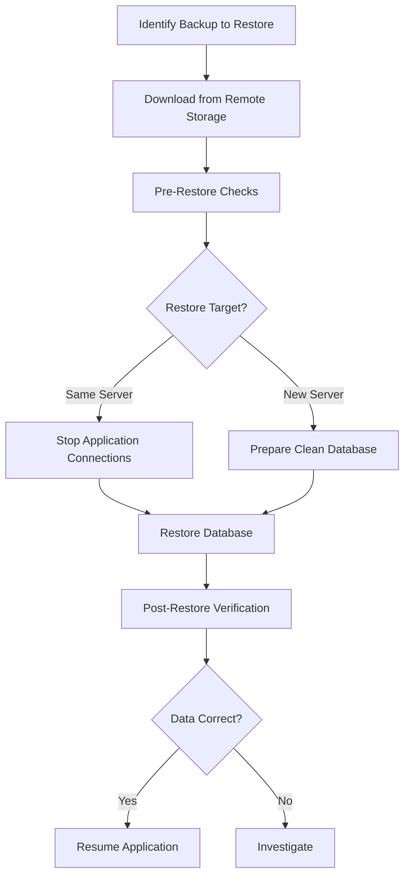

# How to Use Ansible to Restore Databases from Backup

Author: [nawazdhandala](https://www.github.com/nawazdhandala)

Tags: Ansible, Database Restore, Disaster Recovery, PostgreSQL, MySQL

Description: Automate database restoration from backups using Ansible playbooks with verification steps for PostgreSQL, MySQL, and MongoDB.

---

Taking backups is only half the battle. The other half is being able to restore them quickly and correctly when disaster strikes. A restore procedure that has never been tested is a liability. Ansible lets you build a tested, repeatable restore workflow that works under pressure, when you need it most.

This guide covers restoring databases from backup using Ansible for PostgreSQL, MySQL, and MongoDB, including pre-restore checks and post-restore verification.

## Restore Workflow



## Inventory

```ini
# inventory/restore.ini
[restore_targets]
db-restore ansible_host=10.0.9.50

[restore_targets:vars]
ansible_user=ubuntu
restore_dir=/var/backups/restore
```

## Downloading Backups from S3

First, pull the backup file from remote storage.

```yaml
# playbooks/download-backup.yml
---
- name: Download database backup from S3
  hosts: restore_targets
  become: true
  vars_files:
    - ../vault/db-secrets.yml
  vars:
    s3_bucket: mycompany-db-backups
    backup_date: "2026-02-20"
    backup_source_host: pg-primary
    db_name: myapp_production

  tasks:
    - name: Create restore directory
      ansible.builtin.file:
        path: "{{ restore_dir }}"
        state: directory
        mode: "0750"

    - name: List available backups for the specified date
      ansible.builtin.command:
        cmd: >
          aws s3 ls s3://{{ s3_bucket }}/{{ backup_source_host }}/{{ backup_date }}/
      environment:
        AWS_ACCESS_KEY_ID: "{{ vault_aws_access_key }}"
        AWS_SECRET_ACCESS_KEY: "{{ vault_aws_secret_key }}"
        AWS_DEFAULT_REGION: "{{ aws_region | default('us-east-1') }}"
      register: available_backups
      changed_when: false

    - name: Display available backups
      ansible.builtin.debug:
        msg: "{{ available_backups.stdout_lines }}"

    - name: Download the backup file
      ansible.builtin.command:
        cmd: >
          aws s3 cp
          s3://{{ s3_bucket }}/{{ backup_source_host }}/{{ backup_date }}/postgresql/{{ db_name }}_{{ backup_date }}_0300.dump
          {{ restore_dir }}/{{ db_name }}.dump
      environment:
        AWS_ACCESS_KEY_ID: "{{ vault_aws_access_key }}"
        AWS_SECRET_ACCESS_KEY: "{{ vault_aws_secret_key }}"
        AWS_DEFAULT_REGION: "{{ aws_region | default('us-east-1') }}"
      changed_when: true

    - name: Verify downloaded file integrity
      ansible.builtin.stat:
        path: "{{ restore_dir }}/{{ db_name }}.dump"
      register: backup_file

    - name: Fail if backup file is too small or missing
      ansible.builtin.fail:
        msg: "Backup file is missing or suspiciously small ({{ backup_file.stat.size | default(0) }} bytes)"
      when: not backup_file.stat.exists or backup_file.stat.size < 1024
```

## PostgreSQL Restore

```yaml
# playbooks/restore-postgresql.yml
---
- name: Restore PostgreSQL database from backup
  hosts: restore_targets
  become: true
  vars_files:
    - ../vault/db-secrets.yml
  vars:
    db_name: myapp_production
    db_user: myapp
    backup_file: "{{ restore_dir }}/{{ db_name }}.dump"

  tasks:
    - name: Check that the backup file exists
      ansible.builtin.stat:
        path: "{{ backup_file }}"
      register: backup_check

    - name: Fail if backup file does not exist
      ansible.builtin.fail:
        msg: "Backup file {{ backup_file }} not found"
      when: not backup_check.stat.exists

    - name: Terminate active connections to the target database
      community.postgresql.postgresql_query:
        db: postgres
        login_user: "{{ vault_pg_admin_user }}"
        login_password: "{{ vault_pg_admin_password }}"
        query: >
          SELECT pg_terminate_backend(pid)
          FROM pg_stat_activity
          WHERE datname = %s
          AND pid != pg_backend_pid()
        positional_args:
          - "{{ db_name }}"
      no_log: true

    - name: Drop the existing database
      community.postgresql.postgresql_db:
        name: "{{ db_name }}"
        login_user: "{{ vault_pg_admin_user }}"
        login_password: "{{ vault_pg_admin_password }}"
        state: absent
      no_log: true

    - name: Create a fresh empty database
      community.postgresql.postgresql_db:
        name: "{{ db_name }}"
        owner: "{{ db_user }}"
        login_user: "{{ vault_pg_admin_user }}"
        login_password: "{{ vault_pg_admin_password }}"
        state: present
      no_log: true

    - name: Restore the database using pg_restore
      ansible.builtin.command:
        cmd: >
          pg_restore
          --host=localhost
          --username={{ vault_pg_admin_user }}
          --dbname={{ db_name }}
          --jobs=4
          --no-owner
          --role={{ db_user }}
          --verbose
          {{ backup_file }}
      environment:
        PGPASSWORD: "{{ vault_pg_admin_password }}"
      register: restore_result
      changed_when: true
      no_log: true

    - name: Analyze restored database to update statistics
      ansible.builtin.command:
        cmd: >
          psql -h localhost -U {{ vault_pg_admin_user }}
          -d {{ db_name }}
          -c "ANALYZE VERBOSE"
      environment:
        PGPASSWORD: "{{ vault_pg_admin_password }}"
      changed_when: true
      no_log: true
```

## MySQL Restore

```yaml
# playbooks/restore-mysql.yml
---
- name: Restore MySQL database from backup
  hosts: restore_targets
  become: true
  vars_files:
    - ../vault/db-secrets.yml
  vars:
    db_name: myapp_production
    backup_file: "{{ restore_dir }}/{{ db_name }}.sql.gz"

  tasks:
    - name: Check that the backup file exists
      ansible.builtin.stat:
        path: "{{ backup_file }}"
      register: backup_check

    - name: Fail if backup file does not exist
      ansible.builtin.fail:
        msg: "Backup file {{ backup_file }} not found"
      when: not backup_check.stat.exists

    - name: Drop the existing database
      community.mysql.mysql_db:
        name: "{{ db_name }}"
        login_user: "{{ vault_mysql_admin_user }}"
        login_password: "{{ vault_mysql_admin_password }}"
        state: absent
      no_log: true

    - name: Create a fresh empty database
      community.mysql.mysql_db:
        name: "{{ db_name }}"
        login_user: "{{ vault_mysql_admin_user }}"
        login_password: "{{ vault_mysql_admin_password }}"
        encoding: utf8mb4
        collation: utf8mb4_unicode_ci
        state: present
      no_log: true

    - name: Restore the database from gzipped dump
      ansible.builtin.shell:
        cmd: >
          gunzip -c {{ backup_file }}
          | mysql
          --host=localhost
          --user={{ vault_mysql_admin_user }}
          --password={{ vault_mysql_admin_password }}
          {{ db_name }}
      changed_when: true
      no_log: true

    - name: Run OPTIMIZE TABLE on large tables
      community.mysql.mysql_query:
        login_user: "{{ vault_mysql_admin_user }}"
        login_password: "{{ vault_mysql_admin_password }}"
        login_db: "{{ db_name }}"
        query: >
          SELECT CONCAT('OPTIMIZE TABLE ', table_name, ';') as cmd
          FROM information_schema.tables
          WHERE table_schema = %s
          AND table_rows > 100000
        positional_args:
          - "{{ db_name }}"
      register: optimize_tables
      no_log: true
```

## MongoDB Restore

```yaml
# playbooks/restore-mongodb.yml
---
- name: Restore MongoDB database from backup
  hosts: restore_targets
  become: true
  vars_files:
    - ../vault/db-secrets.yml
  vars:
    backup_file: "{{ restore_dir }}/mongodb_full.tar.gz"

  tasks:
    - name: Check that the backup archive exists
      ansible.builtin.stat:
        path: "{{ backup_file }}"
      register: backup_check

    - name: Fail if backup archive does not exist
      ansible.builtin.fail:
        msg: "Backup archive {{ backup_file }} not found"
      when: not backup_check.stat.exists

    - name: Extract the backup archive
      ansible.builtin.unarchive:
        src: "{{ backup_file }}"
        dest: "{{ restore_dir }}"
        remote_src: true

    - name: Restore all databases using mongorestore
      ansible.builtin.command:
        cmd: >
          mongorestore
          --host=localhost
          --port=27017
          --username={{ vault_mongo_admin_user }}
          --password={{ vault_mongo_admin_password }}
          --authenticationDatabase=admin
          --gzip
          --drop
          {{ restore_dir }}/full_*
      changed_when: true
      no_log: true
```

## Post-Restore Verification

Always verify the restored data before resuming application traffic.

```yaml
# playbooks/verify-restore.yml
---
- name: Verify database restoration
  hosts: restore_targets
  become: true
  vars_files:
    - ../vault/db-secrets.yml
  vars:
    db_name: myapp_production
    expected_tables:
      - users
      - orders
      - products
      - user_preferences

  tasks:
    - name: Verify all expected tables exist
      community.postgresql.postgresql_query:
        db: "{{ db_name }}"
        login_user: "{{ vault_pg_admin_user }}"
        login_password: "{{ vault_pg_admin_password }}"
        query: >
          SELECT table_name
          FROM information_schema.tables
          WHERE table_schema = 'public'
      register: restored_tables
      no_log: true

    - name: Check that each expected table is present
      ansible.builtin.assert:
        that:
          - "item in (restored_tables.query_result | map(attribute='table_name') | list)"
        fail_msg: "Table {{ item }} is missing after restore"
        success_msg: "Table {{ item }} found"
      loop: "{{ expected_tables }}"

    - name: Count rows in critical tables
      community.postgresql.postgresql_query:
        db: "{{ db_name }}"
        login_user: "{{ vault_pg_admin_user }}"
        login_password: "{{ vault_pg_admin_password }}"
        query: >
          SELECT
            'users' as table_name, count(*) as row_count FROM users
          UNION ALL
          SELECT
            'orders', count(*) FROM orders
          UNION ALL
          SELECT
            'products', count(*) FROM products
      register: row_counts
      no_log: true

    - name: Display row counts
      ansible.builtin.debug:
        msg: "{{ item.table_name }}: {{ item.row_count }} rows"
      loop: "{{ row_counts.query_result }}"

    - name: Run a sample application query to verify data integrity
      community.postgresql.postgresql_query:
        db: "{{ db_name }}"
        login_user: "{{ vault_pg_admin_user }}"
        login_password: "{{ vault_pg_admin_password }}"
        query: >
          SELECT id, email, created_at
          FROM users
          ORDER BY created_at DESC
          LIMIT 5
      register: sample_data
      no_log: true

    - name: Display sample data
      ansible.builtin.debug:
        msg: "Latest users: {{ sample_data.query_result }}"
```

## Production Restore Checklist

1. **Notify the team.** Before starting a restore, make sure everyone knows. Applications connecting to the database will lose access during the process.

2. **Use `--jobs=4` with pg_restore.** Parallel restore dramatically speeds up restoration of large databases. Match the job count to available CPU cores.

3. **Run `ANALYZE` after restore.** PostgreSQL query planner depends on table statistics. After a restore, statistics are stale and queries may perform poorly until `ANALYZE` runs.

4. **Verify row counts against known good values.** If your backup had 1 million users and the restore shows 100, something went wrong.

5. **Test the restore procedure quarterly.** Spin up a test server, restore the latest backup, and verify it. Document the time it takes so you know your recovery time objective (RTO).

## Conclusion

Restoring databases with Ansible gives you a repeatable, tested recovery procedure. The playbooks in this guide cover downloading from remote storage, restoring PostgreSQL, MySQL, and MongoDB databases, and verifying data integrity. The best time to test your restore procedure is before you need it. Run these playbooks against a staging environment regularly so when disaster hits, you are ready.
