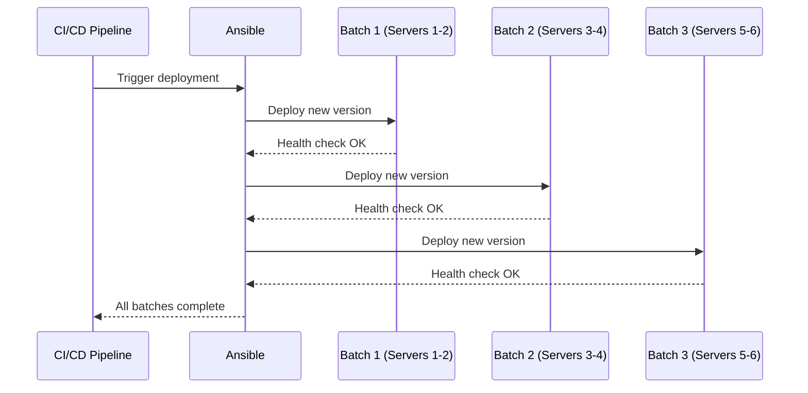

# How to Use Ansible for Rolling Deployments in CI/CD

Author: [nawazdhandala](https://www.github.com/nawazdhandala)

Tags: Ansible, Rolling Deployment, CI/CD, DevOps

Description: Implement rolling deployments with Ansible in your CI/CD pipeline to achieve zero-downtime releases across your server fleet.

---

Rolling deployments update servers in batches rather than all at once. This approach keeps your application available throughout the deployment because only a portion of your servers are offline or running the new version at any given time. Ansible has built-in support for this through the `serial` keyword, and integrating it into a CI/CD pipeline is surprisingly clean.

This post covers the full journey from writing a rolling deployment playbook to wiring it into GitHub Actions, GitLab CI, and Jenkins.

## How Rolling Deployments Work

Unlike a blue-green deployment where you maintain two complete environments, rolling deployments update your existing servers in waves. If you have 10 servers and set your batch size to 2, Ansible deploys to 2 servers, waits for health checks to pass, and then moves on to the next 2. At no point are all servers offline.



## The Rolling Deployment Playbook

Here is a complete playbook that performs a rolling deployment with health checks between batches.

```yaml
# playbooks/rolling-deploy.yml
# Deploy application in rolling batches with health verification
---
- name: Rolling deployment
  hosts: webservers
  serial: "{{ batch_size | default(2) }}"
  max_fail_percentage: 0
  become: true
  vars:
    app_version: "{{ deploy_version }}"
    app_dir: /opt/webapp
    service_name: webapp

  pre_tasks:
    - name: Deregister from load balancer
      uri:
        url: "http://{{ lb_host }}/api/deregister"
        method: POST
        body_format: json
        body:
          server: "{{ ansible_host }}"
          port: 8080
      delegate_to: localhost

    - name: Wait for connections to drain
      wait_for:
        timeout: 30

  tasks:
    - name: Stop the application service
      systemd:
        name: "{{ service_name }}"
        state: stopped

    - name: Deploy application artifact
      unarchive:
        src: "https://artifacts.myorg.com/webapp/{{ app_version }}/webapp.tar.gz"
        dest: "{{ app_dir }}"
        remote_src: true

    - name: Update version file
      copy:
        content: "{{ app_version }}"
        dest: "{{ app_dir }}/VERSION"

    - name: Run database migrations (only on first host in batch)
      command: "{{ app_dir }}/bin/migrate"
      run_once: true
      when: inventory_hostname == ansible_play_hosts[0]

    - name: Start the application service
      systemd:
        name: "{{ service_name }}"
        state: started

    - name: Verify application health
      uri:
        url: "http://{{ ansible_host }}:8080/health"
        status_code: 200
      register: health_check
      until: health_check.status == 200
      retries: 12
      delay: 5

  post_tasks:
    - name: Register with load balancer
      uri:
        url: "http://{{ lb_host }}/api/register"
        method: POST
        body_format: json
        body:
          server: "{{ ansible_host }}"
          port: 8080
      delegate_to: localhost

    - name: Verify server is receiving traffic
      uri:
        url: "http://{{ ansible_host }}:8080/ready"
        status_code: 200
      retries: 5
      delay: 2
```

The `max_fail_percentage: 0` setting is critical. It means that if any single server in a batch fails, the entire deployment stops. This prevents a bad release from spreading across your fleet.

## Percentage-Based Serial Execution

Instead of a fixed batch size, you can use percentages. This is useful when your fleet size changes frequently due to auto-scaling.

```yaml
# Deploy in percentage-based waves: 10%, then 30%, then the rest
---
- name: Rolling deployment with percentage waves
  hosts: webservers
  serial:
    - "10%"
    - "30%"
    - "100%"
  become: true
  tasks:
    - name: Deploy application
      include_role:
        name: deploy_app
      vars:
        version: "{{ deploy_version }}"
```

With this configuration, the first wave is 10% of your fleet. If that succeeds, 30% gets deployed next. Finally, the remaining servers are updated. This gives you a natural canary-like experience without needing separate inventory groups.

## GitHub Actions Integration

Here is how to wire the rolling deployment into GitHub Actions.

```yaml
# .github/workflows/rolling-deploy.yml
# Trigger rolling deployment on release tag
name: Rolling Deployment

on:
  push:
    tags:
      - 'v*'

jobs:
  deploy:
    runs-on: ubuntu-latest
    steps:
      - name: Checkout code
        uses: actions/checkout@v4

      - name: Install Ansible
        run: pip install ansible

      - name: Configure SSH key
        run: |
          mkdir -p ~/.ssh
          echo "${{ secrets.DEPLOY_SSH_KEY }}" > ~/.ssh/deploy_key
          chmod 600 ~/.ssh/deploy_key

      - name: Run rolling deployment
        env:
          ANSIBLE_HOST_KEY_CHECKING: "false"
        run: |
          ansible-playbook playbooks/rolling-deploy.yml \
            -i inventory/production.yml \
            -e "deploy_version=${{ github.ref_name }}" \
            -e "lb_host=10.0.0.5" \
            --private-key ~/.ssh/deploy_key
```

## GitLab CI Integration

For GitLab CI, the approach is similar but uses GitLab-specific syntax.

```yaml
# .gitlab-ci.yml
# Rolling deployment stage in GitLab CI pipeline
stages:
  - build
  - test
  - deploy

deploy_production:
  stage: deploy
  image: python:3.11-slim
  before_script:
    - pip install ansible
    - mkdir -p ~/.ssh
    - echo "$DEPLOY_SSH_KEY" > ~/.ssh/deploy_key
    - chmod 600 ~/.ssh/deploy_key
  script:
    - ansible-playbook playbooks/rolling-deploy.yml
        -i inventory/production.yml
        -e "deploy_version=${CI_COMMIT_TAG}"
        --private-key ~/.ssh/deploy_key
  only:
    - tags
  environment:
    name: production
```

## Jenkins Pipeline Integration

For Jenkins, you can use a Jenkinsfile with the Ansible plugin or call it directly.

```groovy
// Jenkinsfile
// Rolling deployment triggered by Jenkins pipeline
pipeline {
    agent any

    parameters {
        string(name: 'DEPLOY_VERSION', description: 'Version tag to deploy')
    }

    stages {
        stage('Deploy') {
            steps {
                withCredentials([sshUserPrivateKey(
                    credentialsId: 'deploy-key',
                    keyFileVariable: 'SSH_KEY'
                )]) {
                    sh """
                        ansible-playbook playbooks/rolling-deploy.yml \
                          -i inventory/production.yml \
                          -e "deploy_version=${params.DEPLOY_VERSION}" \
                          --private-key \$SSH_KEY
                    """
                }
            }
        }
    }

    post {
        failure {
            slackSend(
                channel: '#deployments',
                color: 'danger',
                message: "Rolling deployment of ${params.DEPLOY_VERSION} failed!"
            )
        }
    }
}
```

## Handling Rollback in Rolling Deployments

When a batch fails, you need to roll back the servers that already got the new version. Here is a rollback playbook.

```yaml
# playbooks/rollback.yml
# Roll back to a specific previous version
---
- name: Emergency rollback
  hosts: webservers
  serial: "50%"
  become: true
  vars:
    rollback_version: "{{ previous_version }}"

  tasks:
    - name: Check current version
      slurp:
        src: /opt/webapp/VERSION
      register: current_ver

    - name: Rollback if running new version
      block:
        - name: Deploy previous version
          unarchive:
            src: "https://artifacts.myorg.com/webapp/{{ rollback_version }}/webapp.tar.gz"
            dest: /opt/webapp
            remote_src: true

        - name: Restart service
          systemd:
            name: webapp
            state: restarted

        - name: Verify health
          uri:
            url: "http://{{ ansible_host }}:8080/health"
            status_code: 200
          retries: 10
          delay: 3
      when: (current_ver.content | b64decode | trim) != rollback_version
```

## Tuning Batch Size for Your Fleet

Choosing the right batch size depends on a few factors. If you have a small fleet (5-10 servers), batches of 1 work fine. For larger fleets (50+ servers), start with 10% as a canary wave and then increase to 25% or 50% for subsequent waves.

The `serial` keyword also accepts a list, so you can ramp up gradually:

```yaml
# Start slow and increase batch size as confidence grows
serial:
  - 1
  - 5
  - "25%"
  - "100%"
```

This deploys to 1 server first, then 5, then 25% of the remaining, then everything else. It is a good balance between safety and deployment speed.

## Conclusion

Rolling deployments with Ansible are a practical, battle-tested way to ship code without downtime. The `serial` keyword gives you fine-grained control over batch sizes, and the pre/post task hooks let you integrate with load balancers and monitoring systems. Combined with a CI/CD pipeline, you get a fully automated deployment process that minimizes risk. Start with small batches and strict health checks, and adjust the batch size as you gain confidence in your deployment process.
