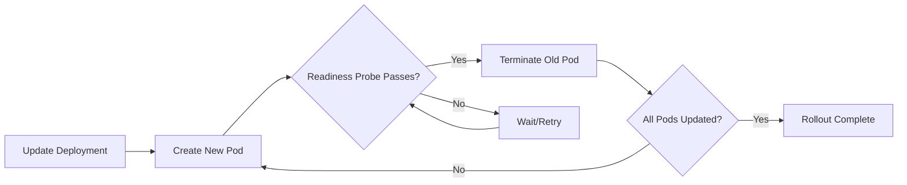

# How to Use Ansible to Perform Rolling Updates in Kubernetes

Author: [nawazdhandala](https://www.github.com/nawazdhandala)

Tags: Ansible, Kubernetes, Rolling Updates, Deployment, Zero Downtime

Description: Perform zero-downtime rolling updates in Kubernetes with Ansible, covering update strategies, canary deployments, rollback procedures, and health verification.

---

Rolling updates are the default deployment strategy in Kubernetes. Instead of taking down all pods at once and replacing them, Kubernetes gradually replaces old pods with new ones, maintaining availability throughout the process. When combined with Ansible, you get a controlled, scriptable update process with verification steps, rollback capability, and audit trails.

This guide covers performing rolling updates with Ansible, configuring update strategies, implementing canary patterns, handling rollbacks, and building end-to-end deployment pipelines with health gates.

## Prerequisites

- Ansible 2.12+ with `kubernetes.core` collection
- A Kubernetes cluster with an existing Deployment
- A valid kubeconfig

```bash
ansible-galaxy collection install kubernetes.core
pip install kubernetes
```

## How Rolling Updates Work

When you update a Deployment's pod template (for example, changing the container image), Kubernetes:

1. Creates new pods with the updated template
2. Waits for new pods to pass readiness probes
3. Terminates old pods
4. Repeats until all pods are updated

The `maxSurge` and `maxUnavailable` settings control the speed and safety of this process.



## Basic Rolling Update

The simplest rolling update: change the container image.

```yaml
# playbook: rolling-update.yml
# Performs a rolling update by changing the container image
---
- name: Perform Rolling Update
  hosts: localhost
  connection: local
  gather_facts: false

  vars:
    app_name: web-api
    namespace: production
    new_image: "registry.company.com/web-api:v2.6.0"

  tasks:
    - name: Get current deployment state
      kubernetes.core.k8s_info:
        kind: Deployment
        name: "{{ app_name }}"
        namespace: "{{ namespace }}"
      register: current_state

    - name: Show current image
      ansible.builtin.debug:
        msg: "Current image: {{ current_state.resources[0].spec.template.spec.containers[0].image }}"

    - name: Trigger rolling update with new image
      kubernetes.core.k8s:
        state: present
        definition:
          apiVersion: apps/v1
          kind: Deployment
          metadata:
            name: "{{ app_name }}"
            namespace: "{{ namespace }}"
          spec:
            template:
              metadata:
                labels:
                  app: "{{ app_name }}"
              spec:
                containers:
                  - name: "{{ app_name }}"
                    image: "{{ new_image }}"

    - name: Wait for rollout to complete
      kubernetes.core.k8s_info:
        kind: Deployment
        name: "{{ app_name }}"
        namespace: "{{ namespace }}"
      register: rollout_status
      until:
        - rollout_status.resources[0].status.updatedReplicas is defined
        - rollout_status.resources[0].status.updatedReplicas == rollout_status.resources[0].spec.replicas
        - rollout_status.resources[0].status.readyReplicas is defined
        - rollout_status.resources[0].status.readyReplicas == rollout_status.resources[0].spec.replicas
        - rollout_status.resources[0].status.unavailableReplicas is not defined
      retries: 60
      delay: 10

    - name: Confirm rollout success
      ansible.builtin.debug:
        msg: "Rolling update to {{ new_image }} completed. {{ rollout_status.resources[0].status.readyReplicas }} replicas ready."
```

## Configuring the Rolling Update Strategy

Control the pace of the rollout with `maxSurge` and `maxUnavailable`.

```yaml
# playbook: configure-rolling-strategy.yml
# Deploys with a specific rolling update strategy
---
- name: Deploy with configured rolling update strategy
  hosts: localhost
  connection: local
  gather_facts: false

  vars:
    app_name: web-api
    namespace: production
    new_image: "registry.company.com/web-api:v2.6.0"

  tasks:
    - name: Deploy with rolling update configuration
      kubernetes.core.k8s:
        state: present
        definition:
          apiVersion: apps/v1
          kind: Deployment
          metadata:
            name: "{{ app_name }}"
            namespace: "{{ namespace }}"
          spec:
            replicas: 10
            strategy:
              type: RollingUpdate
              rollingUpdate:
                # At most 3 extra pods during update
                maxSurge: 3
                # At most 1 pod unavailable during update
                maxUnavailable: 1
            selector:
              matchLabels:
                app: "{{ app_name }}"
            template:
              metadata:
                labels:
                  app: "{{ app_name }}"
              spec:
                containers:
                  - name: "{{ app_name }}"
                    image: "{{ new_image }}"
                    ports:
                      - containerPort: 8080
                    readinessProbe:
                      httpGet:
                        path: /health
                        port: 8080
                      initialDelaySeconds: 10
                      periodSeconds: 5
                    livenessProbe:
                      httpGet:
                        path: /health
                        port: 8080
                      initialDelaySeconds: 30
                      periodSeconds: 10
```

With `maxSurge: 3` and `maxUnavailable: 1`, Kubernetes can create up to 3 new pods beyond the desired count and allow at most 1 pod to be unavailable. For a 10-replica Deployment, you will always have at least 9 ready pods during the update.

You can also use percentages:

```yaml
            strategy:
              type: RollingUpdate
              rollingUpdate:
                maxSurge: 25%
                maxUnavailable: 25%
```

This scales with the replica count: for 10 replicas, 25% means 2-3 pods.

## Rolling Update with Readiness Gates

Proper readiness probes are critical for safe rolling updates. Without them, Kubernetes considers a pod ready as soon as the container starts, which might be before your application can handle traffic.

```yaml
# playbook: rolling-update-with-probes.yml
# Ensures health checks are properly configured before rolling update
---
- name: Rolling update with proper health checks
  hosts: localhost
  connection: local
  gather_facts: false

  vars:
    app_name: web-api
    namespace: production
    new_image: "registry.company.com/web-api:v2.6.0"

  tasks:
    - name: Deploy with comprehensive health checks
      kubernetes.core.k8s:
        state: present
        definition:
          apiVersion: apps/v1
          kind: Deployment
          metadata:
            name: "{{ app_name }}"
            namespace: "{{ namespace }}"
          spec:
            replicas: 5
            strategy:
              type: RollingUpdate
              rollingUpdate:
                maxSurge: 1
                maxUnavailable: 0
            # Minimum time a pod must be ready before considered available
            minReadySeconds: 30
            # How long to keep old ReplicaSets for rollback
            revisionHistoryLimit: 10
            selector:
              matchLabels:
                app: "{{ app_name }}"
            template:
              metadata:
                labels:
                  app: "{{ app_name }}"
              spec:
                terminationGracePeriodSeconds: 60
                containers:
                  - name: "{{ app_name }}"
                    image: "{{ new_image }}"
                    ports:
                      - containerPort: 8080
                    readinessProbe:
                      httpGet:
                        path: /ready
                        port: 8080
                      initialDelaySeconds: 15
                      periodSeconds: 5
                      failureThreshold: 3
                      successThreshold: 1
                    livenessProbe:
                      httpGet:
                        path: /alive
                        port: 8080
                      initialDelaySeconds: 30
                      periodSeconds: 10
                      failureThreshold: 5
                    startupProbe:
                      httpGet:
                        path: /alive
                        port: 8080
                      initialDelaySeconds: 10
                      periodSeconds: 5
                      failureThreshold: 30
```

Key settings for zero-downtime updates:

- `maxUnavailable: 0` ensures no pods are terminated before replacements are ready
- `minReadySeconds: 30` adds a 30-second buffer after readiness probe passes before considering the pod available
- `startupProbe` gives slow-starting applications time to initialize without triggering the liveness probe
- `terminationGracePeriodSeconds: 60` gives the old pod time to finish in-flight requests

## Canary Deployment Pattern

Deploy the new version to a subset of pods first, verify it works, then roll out to the rest.

```yaml
# playbook: canary-deployment.yml
# Deploys a canary version alongside the stable version
---
- name: Canary Deployment
  hosts: localhost
  connection: local
  gather_facts: false

  vars:
    app_name: web-api
    namespace: production
    stable_image: "registry.company.com/web-api:v2.5.0"
    canary_image: "registry.company.com/web-api:v2.6.0"

  tasks:
    - name: Create canary deployment (small replica count)
      kubernetes.core.k8s:
        state: present
        definition:
          apiVersion: apps/v1
          kind: Deployment
          metadata:
            name: "{{ app_name }}-canary"
            namespace: "{{ namespace }}"
            labels:
              app: "{{ app_name }}"
              track: canary
          spec:
            replicas: 1
            selector:
              matchLabels:
                app: "{{ app_name }}"
                track: canary
            template:
              metadata:
                labels:
                  app: "{{ app_name }}"
                  track: canary
              spec:
                containers:
                  - name: "{{ app_name }}"
                    image: "{{ canary_image }}"
                    ports:
                      - containerPort: 8080

    - name: Wait for canary pod to be ready
      kubernetes.core.k8s_info:
        kind: Deployment
        name: "{{ app_name }}-canary"
        namespace: "{{ namespace }}"
      register: canary_status
      until:
        - canary_status.resources[0].status.readyReplicas is defined
        - canary_status.resources[0].status.readyReplicas == 1
      retries: 30
      delay: 10

    - name: Pause for canary observation period
      ansible.builtin.pause:
        minutes: 5
        prompt: "Canary is running. Check metrics, then press Enter to promote or Ctrl+C to abort"

    - name: Promote canary to stable
      kubernetes.core.k8s:
        state: present
        definition:
          apiVersion: apps/v1
          kind: Deployment
          metadata:
            name: "{{ app_name }}"
            namespace: "{{ namespace }}"
          spec:
            template:
              spec:
                containers:
                  - name: "{{ app_name }}"
                    image: "{{ canary_image }}"

    - name: Wait for stable rollout to complete
      kubernetes.core.k8s_info:
        kind: Deployment
        name: "{{ app_name }}"
        namespace: "{{ namespace }}"
      register: stable_status
      until:
        - stable_status.resources[0].status.readyReplicas is defined
        - stable_status.resources[0].status.readyReplicas == stable_status.resources[0].spec.replicas
      retries: 60
      delay: 10

    - name: Remove canary deployment
      kubernetes.core.k8s:
        state: absent
        kind: Deployment
        name: "{{ app_name }}-canary"
        namespace: "{{ namespace }}"
        api_version: apps/v1
```

The canary gets traffic because the Service selector matches on `app: web-api` (which both the stable and canary deployments have). The canary handles roughly 1/(stable_replicas+1) of the traffic.

## Automated Rollback

If the new version is failing, roll back to the previous image.

```yaml
# playbook: rolling-update-with-rollback.yml
# Performs a rolling update with automatic rollback on failure
---
- name: Rolling update with rollback safety
  hosts: localhost
  connection: local
  gather_facts: false

  vars:
    app_name: web-api
    namespace: production
    new_image: "registry.company.com/web-api:v2.6.0"

  tasks:
    - name: Record current state for rollback
      kubernetes.core.k8s_info:
        kind: Deployment
        name: "{{ app_name }}"
        namespace: "{{ namespace }}"
      register: pre_update

    - name: Save previous image
      ansible.builtin.set_fact:
        previous_image: "{{ pre_update.resources[0].spec.template.spec.containers[0].image }}"
        previous_replicas: "{{ pre_update.resources[0].spec.replicas }}"

    - name: Perform rolling update
      kubernetes.core.k8s:
        state: present
        definition:
          apiVersion: apps/v1
          kind: Deployment
          metadata:
            name: "{{ app_name }}"
            namespace: "{{ namespace }}"
          spec:
            template:
              metadata:
                labels:
                  app: "{{ app_name }}"
              spec:
                containers:
                  - name: "{{ app_name }}"
                    image: "{{ new_image }}"

    - name: Wait for rollout
      kubernetes.core.k8s_info:
        kind: Deployment
        name: "{{ app_name }}"
        namespace: "{{ namespace }}"
      register: update_result
      until:
        - update_result.resources[0].status.updatedReplicas is defined
        - update_result.resources[0].status.updatedReplicas == update_result.resources[0].spec.replicas
        - update_result.resources[0].status.readyReplicas is defined
        - update_result.resources[0].status.readyReplicas == update_result.resources[0].spec.replicas
      retries: 30
      delay: 10
      ignore_errors: true

    - name: Check if rollout succeeded
      ansible.builtin.set_fact:
        rollout_succeeded: "{{ update_result is not failed }}"

    - name: Rollback on failure
      kubernetes.core.k8s:
        state: present
        definition:
          apiVersion: apps/v1
          kind: Deployment
          metadata:
            name: "{{ app_name }}"
            namespace: "{{ namespace }}"
          spec:
            template:
              metadata:
                labels:
                  app: "{{ app_name }}"
              spec:
                containers:
                  - name: "{{ app_name }}"
                    image: "{{ previous_image }}"
      when: not rollout_succeeded

    - name: Wait for rollback to complete
      kubernetes.core.k8s_info:
        kind: Deployment
        name: "{{ app_name }}"
        namespace: "{{ namespace }}"
      register: rollback_status
      until:
        - rollback_status.resources[0].status.readyReplicas is defined
        - rollback_status.resources[0].status.readyReplicas == rollback_status.resources[0].spec.replicas
      retries: 30
      delay: 10
      when: not rollout_succeeded

    - name: Report final status
      ansible.builtin.debug:
        msg: "{{ 'Rollout of ' + new_image + ' succeeded!' if rollout_succeeded else 'Rollout failed. Rolled back to ' + previous_image }}"
```

## Rolling Update Across Multiple Deployments

When your application consists of multiple microservices that need coordinated updates.

```yaml
# playbook: coordinated-update.yml
# Updates multiple services in order with verification between each
---
- name: Coordinated rolling update
  hosts: localhost
  connection: local
  gather_facts: false

  vars:
    namespace: production
    release_version: "v2.6.0"
    update_order:
      - name: database-migrator
        image: "registry.company.com/migrator:{{ release_version }}"
        wait_for_completion: true
        is_job: true
      - name: api-service
        image: "registry.company.com/api:{{ release_version }}"
        wait_for_completion: true
        is_job: false
      - name: web-frontend
        image: "registry.company.com/frontend:{{ release_version }}"
        wait_for_completion: true
        is_job: false

  tasks:
    - name: Update each service in order
      ansible.builtin.include_tasks: tasks/update-service.yml
      loop: "{{ update_order }}"
      loop_control:
        label: "{{ item.name }}"
```

With a task file:

```yaml
# tasks/update-service.yml
# Handles updating a single service and waiting for readiness
- name: "Update {{ item.name }}"
  kubernetes.core.k8s:
    state: present
    definition:
      apiVersion: apps/v1
      kind: Deployment
      metadata:
        name: "{{ item.name }}"
        namespace: "{{ namespace }}"
      spec:
        template:
          metadata:
            labels:
              app: "{{ item.name }}"
          spec:
            containers:
              - name: "{{ item.name }}"
                image: "{{ item.image }}"
  when: not (item.is_job | default(false))

- name: "Wait for {{ item.name }} to be ready"
  kubernetes.core.k8s_info:
    kind: Deployment
    name: "{{ item.name }}"
    namespace: "{{ namespace }}"
  register: svc_status
  until:
    - svc_status.resources[0].status.readyReplicas is defined
    - svc_status.resources[0].status.readyReplicas == svc_status.resources[0].spec.replicas
  retries: 30
  delay: 10
  when:
    - item.wait_for_completion | default(true)
    - not (item.is_job | default(false))
```

## Summary

Rolling updates are the backbone of zero-downtime deployments in Kubernetes. Ansible adds a layer of control and visibility that kubectl alone does not provide: pre-update state recording, automated rollback, cross-service coordination, and audit logging. The key ingredients are properly configured readiness probes (so Kubernetes knows when pods can handle traffic), the right maxSurge/maxUnavailable settings (to balance speed and safety), and post-update verification (to catch problems before they affect all pods). Build these patterns into your CI/CD pipeline, and your deployments will be reliable, observable, and recoverable.
