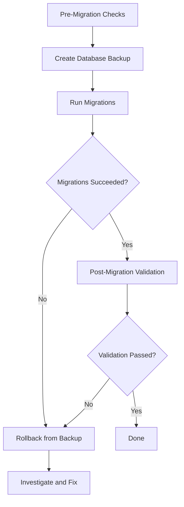

# How to Use Ansible to Run Database Migrations

Author: [nawazdhandala](https://www.github.com/nawazdhandala)

Tags: Ansible, Database Migrations, DevOps, Deployment

Description: Learn how to safely automate database schema migrations using Ansible playbooks with rollback support and pre-migration checks.

---

Database migrations are the riskiest part of any deployment. A bad migration can corrupt data, cause downtime, or leave your schema in a half-applied state. Running migrations by hand adds human error to an already risky process. Ansible lets you automate migrations with pre-checks, backups, and rollback procedures, turning a nerve-wracking manual step into a repeatable workflow.

This guide covers running database migrations with Ansible for PostgreSQL, MySQL, and applications using popular migration tools like Flyway, Alembic, and Django.

## The Migration Workflow

Every migration should follow this pattern.



## Inventory

```ini
# inventory/databases.ini
[database_servers]
db-primary ansible_host=10.0.9.10

[app_servers]
app-1 ansible_host=10.0.9.20

[database_servers:vars]
ansible_user=ubuntu
db_name=myapp_production
db_user=myapp
db_host=10.0.9.10
db_port=5432
```

## Pre-Migration Checks

Before running any migration, verify the database is healthy and accessible.

```yaml
# playbooks/pre-migration-checks.yml
---
- name: Run pre-migration checks
  hosts: database_servers
  become: true
  vars_files:
    - ../vault/db-secrets.yml

  tasks:
    - name: Check database connectivity
      community.postgresql.postgresql_ping:
        db: "{{ db_name }}"
        login_host: "{{ db_host }}"
        login_user: "{{ db_user }}"
        login_password: "{{ vault_db_password }}"
      register: db_ping

    - name: Fail if database is not reachable
      ansible.builtin.fail:
        msg: "Database is not reachable. Aborting migration."
      when: db_ping.failed | default(false)

    - name: Check for active connections
      community.postgresql.postgresql_query:
        db: "{{ db_name }}"
        login_host: "{{ db_host }}"
        login_user: "{{ db_user }}"
        login_password: "{{ vault_db_password }}"
        query: >
          SELECT count(*) as active_connections
          FROM pg_stat_activity
          WHERE datname = %s
          AND state = 'active'
          AND pid != pg_backend_pid()
        positional_args:
          - "{{ db_name }}"
      register: active_connections

    - name: Display active connections
      ansible.builtin.debug:
        msg: "Active connections: {{ active_connections.query_result[0].active_connections }}"

    - name: Check available disk space
      ansible.builtin.command:
        cmd: df -h /var/lib/postgresql
      register: disk_space
      changed_when: false

    - name: Display disk space
      ansible.builtin.debug:
        msg: "{{ disk_space.stdout_lines }}"

    - name: Check for any running migrations or locks
      community.postgresql.postgresql_query:
        db: "{{ db_name }}"
        login_host: "{{ db_host }}"
        login_user: "{{ db_user }}"
        login_password: "{{ vault_db_password }}"
        query: >
          SELECT count(*) as locks
          FROM pg_locks
          WHERE locktype = 'advisory'
      register: advisory_locks

    - name: Warn if advisory locks exist
      ansible.builtin.debug:
        msg: "WARNING: {{ advisory_locks.query_result[0].locks }} advisory locks found"
      when: advisory_locks.query_result[0].locks | int > 0
```

## Running Flyway Migrations

Flyway is a popular migration tool for Java and SQL-based migrations.

```yaml
# playbooks/run-flyway-migrations.yml
---
- name: Run Flyway database migrations
  hosts: app_servers
  become: true
  vars_files:
    - ../vault/db-secrets.yml
  vars:
    flyway_version: "10.6.0"
    flyway_url: "jdbc:postgresql://{{ db_host }}:{{ db_port }}/{{ db_name }}"
    migration_dir: /opt/myapp/db/migrations

  tasks:
    - name: Download Flyway CLI if not present
      ansible.builtin.get_url:
        url: "https://repo1.maven.org/maven2/org/flywaydb/flyway-commandline/{{ flyway_version }}/flyway-commandline-{{ flyway_version }}-linux-x64.tar.gz"
        dest: "/tmp/flyway-{{ flyway_version }}.tar.gz"
        mode: "0644"
      register: flyway_download

    - name: Extract Flyway
      ansible.builtin.unarchive:
        src: "/tmp/flyway-{{ flyway_version }}.tar.gz"
        dest: /opt
        remote_src: true
      when: flyway_download.changed

    - name: Check current migration status
      ansible.builtin.command:
        cmd: >
          /opt/flyway-{{ flyway_version }}/flyway
          -url={{ flyway_url }}
          -user={{ db_user }}
          -password={{ vault_db_password }}
          -locations=filesystem:{{ migration_dir }}
          info
      register: flyway_info
      changed_when: false
      no_log: true

    - name: Display pending migrations
      ansible.builtin.debug:
        msg: "{{ flyway_info.stdout_lines }}"

    - name: Run pending migrations
      ansible.builtin.command:
        cmd: >
          /opt/flyway-{{ flyway_version }}/flyway
          -url={{ flyway_url }}
          -user={{ db_user }}
          -password={{ vault_db_password }}
          -locations=filesystem:{{ migration_dir }}
          migrate
      register: flyway_migrate
      changed_when: "'Successfully applied' in flyway_migrate.stdout"
      no_log: true

    - name: Display migration result
      ansible.builtin.debug:
        msg: "{{ flyway_migrate.stdout_lines[-5:] }}"
```

## Running Django Migrations

For Django projects, use the `manage.py migrate` command.

```yaml
# playbooks/run-django-migrations.yml
---
- name: Run Django database migrations
  hosts: app_servers
  become: true
  become_user: "{{ app_user | default('www-data') }}"
  vars:
    app_dir: /opt/myapp
    venv_dir: /opt/myapp/venv

  tasks:
    - name: Check for pending migrations
      ansible.builtin.command:
        cmd: "{{ venv_dir }}/bin/python {{ app_dir }}/manage.py showmigrations --plan"
      register: pending_migrations
      changed_when: false
      environment:
        DJANGO_SETTINGS_MODULE: myapp.settings.production

    - name: Display pending migrations
      ansible.builtin.debug:
        msg: "{{ pending_migrations.stdout_lines }}"

    - name: Run Django migrations
      ansible.builtin.command:
        cmd: "{{ venv_dir }}/bin/python {{ app_dir }}/manage.py migrate --noinput"
      register: django_migrate
      changed_when: "'Applying' in django_migrate.stdout"
      environment:
        DJANGO_SETTINGS_MODULE: myapp.settings.production

    - name: Display migration output
      ansible.builtin.debug:
        msg: "{{ django_migrate.stdout_lines }}"
```

## Running Alembic Migrations (Python/SQLAlchemy)

```yaml
# playbooks/run-alembic-migrations.yml
---
- name: Run Alembic database migrations
  hosts: app_servers
  become: true
  become_user: "{{ app_user | default('www-data') }}"
  vars:
    app_dir: /opt/myapp
    venv_dir: /opt/myapp/venv

  tasks:
    - name: Check current Alembic revision
      ansible.builtin.command:
        cmd: "{{ venv_dir }}/bin/alembic current"
        chdir: "{{ app_dir }}"
      register: current_revision
      changed_when: false

    - name: Display current revision
      ansible.builtin.debug:
        msg: "Current: {{ current_revision.stdout }}"

    - name: Run Alembic upgrade to head
      ansible.builtin.command:
        cmd: "{{ venv_dir }}/bin/alembic upgrade head"
        chdir: "{{ app_dir }}"
      register: alembic_result
      changed_when: "'Running upgrade' in alembic_result.stderr"

    - name: Display migration result
      ansible.builtin.debug:
        msg: "{{ alembic_result.stderr_lines }}"
```

## Running Raw SQL Migrations

Sometimes you need to run raw SQL files without a migration framework.

```yaml
# playbooks/run-sql-migrations.yml
---
- name: Run raw SQL migration files
  hosts: database_servers
  become: true
  vars_files:
    - ../vault/db-secrets.yml
  vars:
    sql_migration_dir: /opt/migrations/sql
    migration_files:
      - "001_add_user_preferences_table.sql"
      - "002_add_index_on_email.sql"
      - "003_update_status_column.sql"

  tasks:
    - name: Copy migration files to the server
      ansible.builtin.copy:
        src: "../migrations/{{ item }}"
        dest: "{{ sql_migration_dir }}/{{ item }}"
        mode: "0644"
      loop: "{{ migration_files }}"

    - name: Execute each migration file in order
      community.postgresql.postgresql_query:
        db: "{{ db_name }}"
        login_host: "{{ db_host }}"
        login_user: "{{ db_user }}"
        login_password: "{{ vault_db_password }}"
        path_to_script: "{{ sql_migration_dir }}/{{ item }}"
      loop: "{{ migration_files }}"
      loop_control:
        label: "{{ item }}"
      register: migration_results
```

## Post-Migration Validation

After running migrations, verify the schema is correct.

```yaml
# playbooks/post-migration-validation.yml
---
- name: Validate database schema after migration
  hosts: database_servers
  become: true
  vars_files:
    - ../vault/db-secrets.yml

  tasks:
    - name: Check that expected tables exist
      community.postgresql.postgresql_query:
        db: "{{ db_name }}"
        login_host: "{{ db_host }}"
        login_user: "{{ db_user }}"
        login_password: "{{ vault_db_password }}"
        query: >
          SELECT table_name
          FROM information_schema.tables
          WHERE table_schema = 'public'
          ORDER BY table_name
      register: tables

    - name: Display all tables
      ansible.builtin.debug:
        msg: "{{ tables.query_result | map(attribute='table_name') | list }}"

    - name: Verify specific expected table exists
      ansible.builtin.assert:
        that:
          - "'user_preferences' in (tables.query_result | map(attribute='table_name') | list)"
        fail_msg: "Expected table 'user_preferences' not found after migration"
        success_msg: "Table 'user_preferences' exists"

    - name: Run a sample query to verify data integrity
      community.postgresql.postgresql_query:
        db: "{{ db_name }}"
        login_host: "{{ db_host }}"
        login_user: "{{ db_user }}"
        login_password: "{{ vault_db_password }}"
        query: "SELECT count(*) as row_count FROM users"
      register: user_count

    - name: Display user count
      ansible.builtin.debug:
        msg: "Users table has {{ user_count.query_result[0].row_count }} rows"
```

## Full Migration Playbook

Tie everything together in the correct order.

```yaml
# playbooks/full-migration.yml
---
- name: Step 1 - Pre-migration checks
  import_playbook: pre-migration-checks.yml

- name: Step 2 - Create backup
  import_playbook: backup-database.yml

- name: Step 3 - Run migrations
  import_playbook: run-flyway-migrations.yml

- name: Step 4 - Validate schema
  import_playbook: post-migration-validation.yml
```

## Production Tips

1. **Always backup before migrating.** This is non-negotiable. A broken migration with no backup turns a bad day into a catastrophe.

2. **Run migrations from a single host.** Never run the same migration from multiple hosts simultaneously. Use `hosts: app_servers[0]` to target just one.

3. **Test migrations against a copy of production data.** Schema changes that work on an empty database might lock or time out on a table with millions of rows.

4. **Use advisory locks.** If your migration tool does not use them already, wrap your migration in a PostgreSQL advisory lock to prevent concurrent runs.

5. **Keep migrations small and reversible.** Each migration should do one thing. If something goes wrong, you know exactly which change caused it.

## Conclusion

Running database migrations with Ansible transforms a manual, high-stress process into an automated workflow with built-in safety checks. The playbooks here cover pre-migration validation, multiple migration tools, post-migration verification, and the full orchestration. Whether you use Flyway, Django, Alembic, or raw SQL, the pattern is the same: check, backup, migrate, validate.
