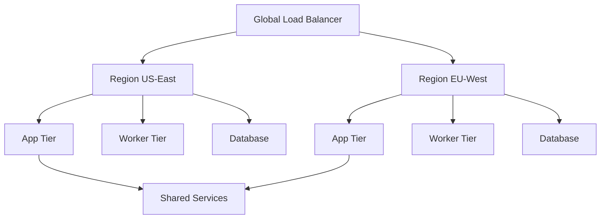

# How to Use Ansible for SaaS Platform Management

Author: [nawazdhandala](https://www.github.com/nawazdhandala)

Tags: Ansible, SaaS, Platform Management, DevOps

Description: Manage SaaS platform infrastructure with Ansible covering multi-region deployment, tenant management, billing integration, and platform scaling.

---

Running a SaaS platform involves managing shared infrastructure, tenant provisioning, feature gating, billing integration, and multi-region deployments. Ansible provides the automation layer that ties these concerns together into a manageable system.

This post walks through using Ansible to manage the infrastructure side of a SaaS platform.

## SaaS Platform Components

A typical SaaS platform has several infrastructure layers:



## Platform Configuration

Define the platform in a central configuration:

```yaml
# platform/config.yml
# SaaS platform global configuration
---
platform_name: myplatform
platform_domain: myplatform.com

regions:
  - name: us-east-1
    primary: true
    domain: us.myplatform.com
  - name: eu-west-1
    primary: false
    domain: eu.myplatform.com

tiers:
  free:
    max_users: 5
    api_rate_limit: 100
    storage_gb: 1
    support: community
  pro:
    max_users: 50
    api_rate_limit: 5000
    storage_gb: 50
    support: email
  enterprise:
    max_users: unlimited
    api_rate_limit: 50000
    storage_gb: 500
    support: dedicated

shared_services:
  - name: email
    provider: ses
  - name: cdn
    provider: cloudfront
  - name: search
    provider: elasticsearch
  - name: cache
    provider: elasticache
```

## Multi-Region Deployment

Deploy the platform across regions:

```yaml
# playbooks/deploy-platform.yml
# Deploy SaaS platform to all regions
---
- name: Deploy platform to each region
  hosts: "{{ region }}_app_servers"
  become: true
  serial: "25%"
  vars_files:
    - ../platform/config.yml

  pre_tasks:
    - name: Drain from regional load balancer
      ansible.builtin.uri:
        url: "http://{{ regional_lb_api }}/backends/{{ inventory_hostname }}/drain"
        method: POST
      delegate_to: localhost

  roles:
    - common
    - platform_app
    - platform_worker

  post_tasks:
    - name: Health check
      ansible.builtin.uri:
        url: "http://localhost:{{ app_port }}/platform/health"
        status_code: 200
      retries: 30
      delay: 5
      register: health
      until: health.status == 200

    - name: Re-enable in load balancer
      ansible.builtin.uri:
        url: "http://{{ regional_lb_api }}/backends/{{ inventory_hostname }}/enable"
        method: POST
      delegate_to: localhost
```

## Tenant Tier Management

Automate tier changes when customers upgrade or downgrade:

```yaml
# playbooks/change-tenant-tier.yml
# Change a tenant tier (upgrade or downgrade)
---
- name: Update tenant tier
  hosts: localhost
  connection: local
  vars:
    tenant_id: "{{ target_tenant }}"
    new_tier: "{{ target_tier }}"
  vars_files:
    - ../platform/config.yml

  tasks:
    - name: Load tenant configuration
      ansible.builtin.include_vars:
        file: "../tenants/{{ tenant_id }}.yml"
        name: tenant

    - name: Get new tier limits
      ansible.builtin.set_fact:
        tier_config: "{{ tiers[new_tier] }}"

    - name: Update database resource limits
      community.postgresql.postgresql_query:
        db: "{{ tenant.database.name }}"
        login_host: "{{ db_host }}"
        login_user: "{{ db_admin_user }}"
        login_password: "{{ db_admin_password }}"
        query: |
          UPDATE tenant_settings SET value = '{{ item.value }}' WHERE key = '{{ item.key }}';
        named_args: {}
      loop:
        - { key: 'tier', value: '{{ new_tier }}' }
        - { key: 'max_users', value: '{{ tier_config.max_users }}' }
        - { key: 'api_rate_limit', value: '{{ tier_config.api_rate_limit }}' }
        - { key: 'storage_limit_gb', value: '{{ tier_config.storage_gb }}' }

    - name: Update tenant config file
      ansible.builtin.lineinfile:
        path: "../tenants/{{ tenant_id }}.yml"
        regexp: "^tenant_tier:"
        line: "tenant_tier: {{ new_tier }}"
      delegate_to: localhost

    - name: Apply new rate limits on app servers
      ansible.builtin.include_tasks: tasks/apply-tenant-rate-limits.yml
      vars:
        rate_limit: "{{ tier_config.api_rate_limit }}"
```

## Platform Monitoring Setup

```yaml
# roles/platform_monitoring/tasks/main.yml
# Deploy platform-wide monitoring
---
- name: Deploy platform health check endpoints
  ansible.builtin.template:
    src: platform-health.yml.j2
    dest: /opt/monitoring/platform-health.yml
    mode: '0644'

- name: Configure per-tenant metrics collection
  ansible.builtin.template:
    src: tenant-metrics.yml.j2
    dest: /opt/monitoring/prometheus/tenant-metrics.yml
    mode: '0644'
  notify: reload prometheus

- name: Deploy platform dashboard
  ansible.builtin.uri:
    url: "http://{{ grafana_host }}:3000/api/dashboards/db"
    method: POST
    headers:
      Authorization: "Bearer {{ grafana_api_key }}"
    body_format: json
    body:
      dashboard: "{{ lookup('template', 'platform-dashboard.json.j2') }}"
      overwrite: true
  delegate_to: localhost
  run_once: true
```

## Platform Scaling

Scale platform components based on demand:

```yaml
# playbooks/scale-platform.yml
# Scale platform tier based on current load
---
- name: Check current load and scale
  hosts: localhost
  connection: local

  tasks:
    - name: Get current request rate
      ansible.builtin.uri:
        url: "http://{{ prometheus_host }}:9090/api/v1/query"
        method: POST
        body_format: form-urlencoded
        body:
          query: "sum(rate(http_requests_total[5m]))"
      register: current_load

    - name: Calculate required instances
      ansible.builtin.set_fact:
        required_instances: "{{ ((current_load.json.data.result[0].value[1] | float / requests_per_instance) | round(0, 'ceil')) | int }}"

    - name: Scale app servers if needed
      amazon.aws.ec2_asg:
        name: "{{ platform_name }}-app-asg"
        desired_capacity: "{{ [required_instances | int, min_instances | int] | max }}"
        min_size: "{{ min_instances }}"
        max_size: "{{ max_instances }}"
      when: required_instances | int != current_instance_count | int
```

## Key Takeaways

SaaS platform management with Ansible covers the full lifecycle from multi-region deployment to tenant management to scaling. Define your platform configuration centrally, use the same deployment playbooks across regions, and automate tenant operations like onboarding and tier changes. Build monitoring that gives you visibility into both platform health and per-tenant metrics. Use auto-scaling playbooks to handle load spikes. The goal is that platform operations are automated, auditable, and repeatable across all regions.

## Common Use Cases

Here are several practical scenarios where this module proves essential in real-world playbooks.

### Infrastructure Provisioning Workflow

```yaml
# Complete workflow incorporating this module
- name: Infrastructure provisioning
  hosts: all
  become: true
  gather_facts: true
  tasks:
    - name: Gather system information
      ansible.builtin.setup:
        gather_subset:
          - hardware
          - network

    - name: Display system summary
      ansible.builtin.debug:
        msg: >-
          Host {{ inventory_hostname }} has
          {{ ansible_memtotal_mb }}MB RAM,
          {{ ansible_processor_vcpus }} vCPUs,
          running {{ ansible_distribution }} {{ ansible_distribution_version }}

    - name: Install required packages
      ansible.builtin.package:
        name:
          - curl
          - wget
          - git
          - vim
          - htop
          - jq
        state: present

    - name: Configure system timezone
      ansible.builtin.timezone:
        name: "{{ system_timezone | default('UTC') }}"

    - name: Configure hostname
      ansible.builtin.hostname:
        name: "{{ inventory_hostname }}"

    - name: Update /etc/hosts
      ansible.builtin.lineinfile:
        path: /etc/hosts
        regexp: '^127\.0\.1\.1'
        line: "127.0.1.1 {{ inventory_hostname }}"

    - name: Configure SSH hardening
      ansible.builtin.lineinfile:
        path: /etc/ssh/sshd_config
        regexp: "{{ item.regexp }}"
        line: "{{ item.line }}"
      loop:
        - { regexp: '^PermitRootLogin', line: 'PermitRootLogin no' }
        - { regexp: '^PasswordAuthentication', line: 'PasswordAuthentication no' }
      notify: restart sshd

    - name: Configure firewall rules
      community.general.ufw:
        rule: allow
        port: "{{ item }}"
        proto: tcp
      loop:
        - "22"
        - "80"
        - "443"

    - name: Enable firewall
      community.general.ufw:
        state: enabled
        policy: deny

  handlers:
    - name: restart sshd
      ansible.builtin.service:
        name: sshd
        state: restarted
```

### Integration with Monitoring

```yaml
# Using gathered facts to configure monitoring thresholds
- name: Configure monitoring based on system specs
  hosts: all
  become: true
  tasks:
    - name: Set monitoring thresholds based on hardware
      ansible.builtin.template:
        src: monitoring_config.yml.j2
        dest: /etc/monitoring/config.yml
      vars:
        memory_warning_threshold: "{{ (ansible_memtotal_mb * 0.8) | int }}"
        memory_critical_threshold: "{{ (ansible_memtotal_mb * 0.95) | int }}"
        cpu_warning_threshold: 80
        cpu_critical_threshold: 95

    - name: Register host with monitoring system
      ansible.builtin.uri:
        url: "https://monitoring.example.com/api/hosts"
        method: POST
        body_format: json
        body:
          hostname: "{{ inventory_hostname }}"
          ip_address: "{{ ansible_default_ipv4.address }}"
          os: "{{ ansible_distribution }}"
          memory_mb: "{{ ansible_memtotal_mb }}"
          cpus: "{{ ansible_processor_vcpus }}"
        headers:
          Authorization: "Bearer {{ monitoring_api_token }}"
        status_code: [200, 201, 409]
```

### Error Handling Patterns

```yaml
# Robust error handling with this module
- name: Robust task execution
  hosts: all
  tasks:
    - name: Attempt primary operation
      ansible.builtin.command: /opt/app/primary-task.sh
      register: primary_result
      failed_when: false

    - name: Handle primary failure with fallback
      ansible.builtin.command: /opt/app/fallback-task.sh
      when: primary_result.rc != 0
      register: fallback_result

    - name: Report final status
      ansible.builtin.debug:
        msg: >-
          Task completed via {{ 'primary' if primary_result.rc == 0 else 'fallback' }} path.
          Return code: {{ primary_result.rc if primary_result.rc == 0 else fallback_result.rc }}

    - name: Fail if both paths failed
      ansible.builtin.fail:
        msg: "Both primary and fallback operations failed"
      when:
        - primary_result.rc != 0
        - fallback_result is defined
        - fallback_result.rc != 0
```

### Scheduling and Automation

```yaml
# Set up scheduled compliance scans using cron
- name: Configure automated scans
  hosts: all
  become: true
  tasks:
    - name: Create scan script
      ansible.builtin.copy:
        dest: /opt/scripts/compliance_scan.sh
        mode: '0755'
        content: |
          #!/bin/bash
          cd /opt/ansible
          ansible-playbook playbooks/validate.yml -i inventory/ > /var/log/compliance_scan.log 2>&1
          EXIT_CODE=$?
          if [ $EXIT_CODE -ne 0 ]; then
            curl -X POST https://hooks.example.com/alert \
              -H "Content-Type: application/json" \
              -d "{\"text\":\"Compliance scan failed on $(hostname)\"}"
          fi
          exit $EXIT_CODE

    - name: Schedule weekly compliance scan
      ansible.builtin.cron:
        name: "Weekly compliance scan"
        minute: "0"
        hour: "3"
        weekday: "1"
        job: "/opt/scripts/compliance_scan.sh"
        user: ansible
```

