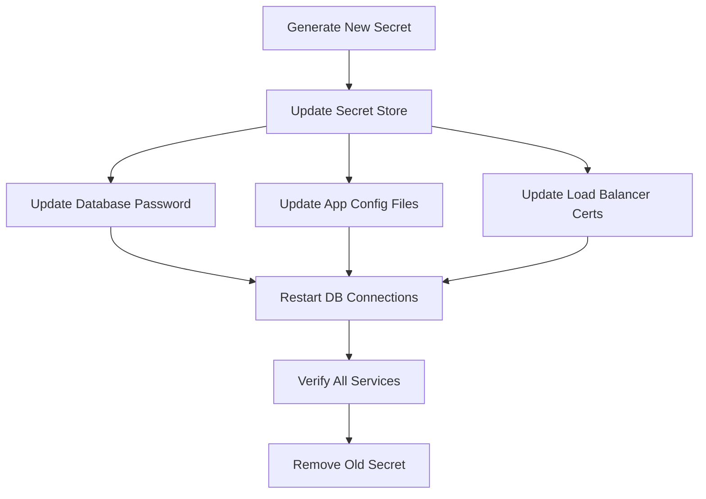

# How to Use Ansible for Secrets Rotation Automation

Author: [nawazdhandala](https://www.github.com/nawazdhandala)

Tags: Ansible, Secrets Management, Security, Automation

Description: Automate the rotation of passwords, API keys, certificates, and other secrets across your infrastructure using Ansible playbooks with zero downtime.

---

Rotating secrets regularly is a security best practice, but doing it manually across dozens of services and servers is painful and error-prone. Miss one configuration file and your application breaks. Ansible can automate the entire rotation process, from generating new credentials to updating every service that uses them, with zero downtime.

This guide walks through automating secrets rotation for database passwords, API keys, TLS certificates, and SSH keys.

## The Rotation Challenge

Secret rotation involves updating the credential in multiple places simultaneously:



The tricky part is ordering. If you update the application config before the database accepts the new password, your app goes down.

## Database Password Rotation

Here is a playbook that rotates a PostgreSQL password without downtime:

```yaml
# playbooks/rotate-db-password.yml
# Rotate database password with zero downtime
---
- name: Generate new database password
  hosts: localhost
  connection: local
  tasks:
    - name: Generate secure password
      ansible.builtin.set_fact:
        new_db_password: "{{ lookup('password', '/dev/null length=32 chars=ascii_letters,digits') }}"

    - name: Store new password in vault
      ansible.builtin.command:
        cmd: >
          vault kv put secret/database/{{ db_name }}
          password={{ new_db_password }}
          previous_password={{ current_db_password }}
          rotated_at={{ ansible_date_time.iso8601 }}
      environment:
        VAULT_ADDR: "{{ vault_addr }}"
        VAULT_TOKEN: "{{ vault_token }}"

- name: Update database password
  hosts: db_primary
  become: true
  tasks:
    - name: Change PostgreSQL user password
      community.postgresql.postgresql_user:
        name: "{{ db_user }}"
        password: "{{ new_db_password }}"
        login_host: localhost
        login_user: postgres
      no_log: true

    - name: Verify new password works
      community.postgresql.postgresql_ping:
        db: "{{ db_name }}"
        login_host: localhost
        login_user: "{{ db_user }}"
        login_password: "{{ new_db_password }}"

- name: Update application configuration
  hosts: app_servers
  become: true
  serial: "25%"
  tasks:
    - name: Update database password in config
      ansible.builtin.lineinfile:
        path: "{{ app_config_dir }}/database.yml"
        regexp: 'password:'
        line: "  password: {{ new_db_password }}"
        mode: '0640'
      no_log: true
      notify: restart application

    - name: Flush handlers to restart immediately
      ansible.builtin.meta: flush_handlers

    - name: Wait for application health check
      ansible.builtin.uri:
        url: "http://localhost:{{ app_port }}/health"
        status_code: 200
      retries: 20
      delay: 3
      register: health
      until: health.status == 200

- name: Verify rotation success
  hosts: app_servers
  tasks:
    - name: Verify database connectivity
      ansible.builtin.uri:
        url: "http://localhost:{{ app_port }}/health/database"
        status_code: 200
      register: db_health

    - name: Report rotation status
      ansible.builtin.debug:
        msg: "Database password rotated successfully on {{ inventory_hostname }}"
```

## API Key Rotation

For services that use API keys, rotation often means supporting both old and new keys during the transition:

```yaml
# playbooks/rotate-api-keys.yml
# Rotate API keys with dual-key transition period
---
- name: Rotate API keys for external services
  hosts: app_servers
  become: true
  serial: 1

  tasks:
    - name: Generate new API key
      ansible.builtin.uri:
        url: "https://api.{{ service_name }}.com/v1/api-keys"
        method: POST
        headers:
          Authorization: "Bearer {{ admin_token }}"
        body_format: json
        body:
          name: "production-{{ ansible_date_time.epoch }}"
          permissions: "{{ api_key_permissions }}"
        status_code: 201
      register: new_key
      delegate_to: localhost
      run_once: true
      no_log: true

    - name: Update API key in application config
      ansible.builtin.template:
        src: api_keys.yml.j2
        dest: "{{ app_config_dir }}/api_keys.yml"
        owner: "{{ app_user }}"
        mode: '0640'
      vars:
        api_key: "{{ new_key.json.key }}"
      no_log: true
      notify: restart application

    - name: Flush handlers
      ansible.builtin.meta: flush_handlers

    - name: Verify service connectivity
      ansible.builtin.uri:
        url: "http://localhost:{{ app_port }}/health/external-services"
        status_code: 200
      retries: 10
      delay: 5
      register: svc_health
      until: svc_health.status == 200

    - name: Revoke old API key after all servers updated
      ansible.builtin.uri:
        url: "https://api.{{ service_name }}.com/v1/api-keys/{{ old_api_key_id }}"
        method: DELETE
        headers:
          Authorization: "Bearer {{ admin_token }}"
        status_code: [200, 204]
      delegate_to: localhost
      run_once: true
      when: inventory_hostname == ansible_play_hosts_all[-1]
```

## TLS Certificate Rotation

Automating certificate renewal and deployment:

```yaml
# playbooks/rotate-tls-certificates.yml
# Rotate TLS certificates across web servers
---
- name: Generate new TLS certificates
  hosts: localhost
  connection: local
  tasks:
    - name: Generate certificate from CA
      ansible.builtin.command:
        cmd: >
          certbot certonly
          --dns-route53
          --non-interactive
          --agree-tos
          -d {{ domain_name }}
          -d "*.{{ domain_name }}"
          --cert-name {{ domain_name }}
      register: certbot_result

    - name: Read new certificate
      ansible.builtin.slurp:
        src: "/etc/letsencrypt/live/{{ domain_name }}/fullchain.pem"
      register: new_cert

    - name: Read new private key
      ansible.builtin.slurp:
        src: "/etc/letsencrypt/live/{{ domain_name }}/privkey.pem"
      register: new_key
      no_log: true

- name: Deploy certificates to web servers
  hosts: webservers
  become: true
  serial: 1

  tasks:
    - name: Deregister from load balancer
      ansible.builtin.uri:
        url: "http://{{ lb_api }}/backends/{{ inventory_hostname }}/disable"
        method: POST
      delegate_to: localhost

    - name: Deploy new certificate
      ansible.builtin.copy:
        content: "{{ new_cert.content | b64decode }}"
        dest: "/etc/ssl/certs/{{ domain_name }}.pem"
        owner: root
        mode: '0644'

    - name: Deploy new private key
      ansible.builtin.copy:
        content: "{{ new_key.content | b64decode }}"
        dest: "/etc/ssl/private/{{ domain_name }}.key"
        owner: root
        mode: '0600'
      no_log: true

    - name: Verify certificate validity
      ansible.builtin.command:
        cmd: openssl x509 -in /etc/ssl/certs/{{ domain_name }}.pem -noout -dates
      register: cert_dates
      changed_when: false

    - name: Reload Nginx to use new certificate
      ansible.builtin.service:
        name: nginx
        state: reloaded

    - name: Verify HTTPS works
      ansible.builtin.uri:
        url: "https://{{ inventory_hostname }}/health"
        validate_certs: true
        status_code: 200
      retries: 5
      delay: 2

    - name: Re-register with load balancer
      ansible.builtin.uri:
        url: "http://{{ lb_api }}/backends/{{ inventory_hostname }}/enable"
        method: POST
      delegate_to: localhost
```

## SSH Key Rotation

```yaml
# playbooks/rotate-ssh-keys.yml
# Rotate SSH keys for service accounts
---
- name: Generate new SSH key pair
  hosts: localhost
  connection: local
  tasks:
    - name: Generate new SSH key
      community.crypto.openssh_keypair:
        path: "/tmp/new_deploy_key"
        type: ed25519
        comment: "deploy@{{ ansible_date_time.date }}"
      register: new_ssh_key

- name: Deploy new SSH key to all servers
  hosts: all
  become: true

  tasks:
    - name: Add new public key to authorized_keys
      ansible.posix.authorized_key:
        user: "{{ deploy_user }}"
        key: "{{ lookup('file', '/tmp/new_deploy_key.pub') }}"
        state: present

- name: Verify new key works on all servers
  hosts: all
  vars:
    ansible_ssh_private_key_file: /tmp/new_deploy_key

  tasks:
    - name: Test SSH connection with new key
      ansible.builtin.ping:

- name: Remove old SSH key
  hosts: all
  become: true
  tasks:
    - name: Remove previous key from authorized_keys
      ansible.posix.authorized_key:
        user: "{{ deploy_user }}"
        key: "{{ old_ssh_public_key }}"
        state: absent

- name: Store new key in vault
  hosts: localhost
  connection: local
  tasks:
    - name: Store private key in vault
      ansible.builtin.command:
        cmd: >
          vault kv put secret/ssh/deploy
          private_key=@/tmp/new_deploy_key
          public_key=@/tmp/new_deploy_key.pub
      no_log: true

    - name: Clean up temporary key files
      ansible.builtin.file:
        path: "{{ item }}"
        state: absent
      loop:
        - /tmp/new_deploy_key
        - /tmp/new_deploy_key.pub
```

## Scheduled Rotation with Cron

Set up automatic rotation on a schedule:

```yaml
# roles/secrets_rotation_scheduler/tasks/main.yml
# Schedule automatic secrets rotation
---
- name: Deploy rotation playbooks
  ansible.builtin.copy:
    src: "playbooks/{{ item }}"
    dest: "/opt/ansible/playbooks/{{ item }}"
    mode: '0644'
  loop:
    - rotate-db-password.yml
    - rotate-api-keys.yml
    - rotate-tls-certificates.yml

- name: Schedule database password rotation (every 90 days)
  ansible.builtin.cron:
    name: "Rotate database passwords"
    day: "1"
    month: "*/3"
    hour: "2"
    minute: "0"
    job: >
      /usr/local/bin/ansible-playbook
      /opt/ansible/playbooks/rotate-db-password.yml
      -e @/opt/ansible/vault-pass
      >> /var/log/secrets-rotation.log 2>&1
    user: ansible

- name: Schedule certificate renewal (monthly check)
  ansible.builtin.cron:
    name: "Rotate TLS certificates"
    day: "15"
    hour: "3"
    minute: "0"
    job: >
      /usr/local/bin/ansible-playbook
      /opt/ansible/playbooks/rotate-tls-certificates.yml
      >> /var/log/secrets-rotation.log 2>&1
    user: ansible
```

## Key Takeaways

Automated secrets rotation requires careful ordering to avoid downtime. Always update the service that validates the credential first (like the database), then update the clients. Use rolling updates with `serial` to avoid taking all servers offline at once. Verify connectivity after each step. Store both old and new credentials during the transition. And schedule rotation so it happens regularly without human intervention. The initial effort to build these playbooks pays off every time a rotation happens smoothly at 2 AM without anyone getting paged.
