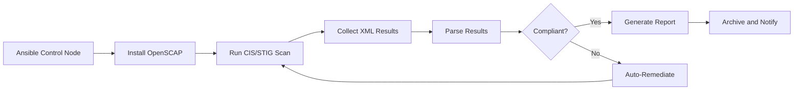

# How to Use Ansible to Run Security Compliance Scans

Author: [nawazdhandala](https://www.github.com/nawazdhandala)

Tags: Ansible, Security, Compliance, DevOps, Automation

Description: Learn how to automate security compliance scanning across your infrastructure using Ansible playbooks and roles for CIS, STIG, and PCI-DSS benchmarks.

---

Running security compliance scans manually across dozens or hundreds of servers is a painful, error-prone process. I have spent weekends doing exactly that before discovering how Ansible can automate the entire workflow. In this post, I will walk through building Ansible playbooks that run compliance scans, collect results, and even remediate findings automatically.

## Why Automate Compliance Scanning

Most organizations need to comply with standards like CIS Benchmarks, DISA STIGs, or PCI-DSS. The traditional approach involves logging into each server, running scanning tools, exporting results, and compiling a report. With Ansible, you can scan your entire fleet in minutes and get a consolidated view of compliance posture.

## Setting Up OpenSCAP with Ansible

OpenSCAP is one of the most popular open-source compliance scanning tools. Let us start by installing it across our infrastructure.

This playbook installs OpenSCAP and the security guide content on target hosts:

```yaml
# install-openscap.yml - Installs OpenSCAP scanner and SCAP content
---
- name: Install OpenSCAP on all servers
  hosts: all
  become: true
  tasks:
    - name: Install OpenSCAP packages on RHEL/CentOS
      ansible.builtin.yum:
        name:
          - openscap-scanner
          - scap-security-guide
        state: present
      when: ansible_os_family == "RedHat"

    - name: Install OpenSCAP packages on Debian/Ubuntu
      ansible.builtin.apt:
        name:
          - libopenscap8
          - ssg-debian
          - ssg-debderived
        state: present
        update_cache: true
      when: ansible_os_family == "Debian"

    - name: Create results directory for scan output
      ansible.builtin.file:
        path: /var/log/compliance-scans
        state: directory
        mode: '0750'
        owner: root
        group: root
```

## Running CIS Benchmark Scans

The CIS (Center for Internet Security) benchmarks are widely adopted. Here is a playbook that runs a CIS scan and collects the results.

This playbook executes the CIS benchmark scan and generates both XML and HTML reports:

```yaml
# run-cis-scan.yml - Execute CIS benchmark compliance scan
---
- name: Run CIS Compliance Scan
  hosts: all
  become: true
  vars:
    scan_date: "{{ ansible_date_time.date }}"
    results_dir: /var/log/compliance-scans
    # Adjust the profile based on your OS
    scap_profile: xccdf_org.ssgproject.content_profile_cis
    scap_content: /usr/share/xml/scap/ssg/content/ssg-rhel8-ds.xml

  tasks:
    - name: Run OpenSCAP evaluation against CIS profile
      ansible.builtin.command:
        cmd: >
          oscap xccdf eval
          --profile {{ scap_profile }}
          --results {{ results_dir }}/{{ inventory_hostname }}-{{ scan_date }}.xml
          --report {{ results_dir }}/{{ inventory_hostname }}-{{ scan_date }}.html
          {{ scap_content }}
      register: scan_result
      # OpenSCAP returns non-zero when findings exist, so we allow failures
      failed_when: scan_result.rc > 2

    - name: Fetch the HTML report back to control node
      ansible.builtin.fetch:
        src: "{{ results_dir }}/{{ inventory_hostname }}-{{ scan_date }}.html"
        dest: "./compliance-reports/{{ inventory_hostname }}-{{ scan_date }}.html"
        flat: true

    - name: Fetch the XML results back for further processing
      ansible.builtin.fetch:
        src: "{{ results_dir }}/{{ inventory_hostname }}-{{ scan_date }}.xml"
        dest: "./compliance-reports/{{ inventory_hostname }}-{{ scan_date }}.xml"
        flat: true
```

## Parsing and Reporting Scan Results

Getting scan results is only half the battle. You need to parse them and generate actionable reports.

This playbook parses the XML output and creates a summary of pass/fail results:

```yaml
# parse-results.yml - Parse compliance scan results into a summary
---
- name: Parse Compliance Scan Results
  hosts: localhost
  gather_facts: false
  vars:
    reports_dir: "./compliance-reports"

  tasks:
    - name: Find all XML result files
      ansible.builtin.find:
        paths: "{{ reports_dir }}"
        patterns: "*.xml"
      register: result_files

    - name: Parse each result file for pass/fail counts
      ansible.builtin.shell: |
        # Count pass, fail, and other results from XCCDF output
        PASS=$(grep -c 'result="pass"' "{{ item.path }}" || echo 0)
        FAIL=$(grep -c 'result="fail"' "{{ item.path }}" || echo 0)
        NOTAPPLICABLE=$(grep -c 'result="notapplicable"' "{{ item.path }}" || echo 0)
        echo "{{ item.path | basename }}: PASS=$PASS FAIL=$FAIL N/A=$NOTAPPLICABLE"
      loop: "{{ result_files.files }}"
      register: parsed_results
      changed_when: false

    - name: Display compliance summary
      ansible.builtin.debug:
        msg: "{{ item.stdout }}"
      loop: "{{ parsed_results.results }}"
      loop_control:
        label: "{{ item.item.path | basename }}"
```

## Automated Remediation

Once you know what is failing, you can build remediation playbooks. OpenSCAP can actually generate Ansible remediation content directly.

This task generates an Ansible playbook from your scan findings that will fix non-compliant items:

```yaml
# generate-remediation.yml - Auto-generate remediation playbook from scan results
---
- name: Generate Remediation Playbook
  hosts: all
  become: true
  vars:
    scap_profile: xccdf_org.ssgproject.content_profile_cis
    scap_content: /usr/share/xml/scap/ssg/content/ssg-rhel8-ds.xml

  tasks:
    - name: Generate Ansible remediation content from SCAP profile
      ansible.builtin.command:
        cmd: >
          oscap xccdf generate fix
          --fix-type ansible
          --profile {{ scap_profile }}
          --output /tmp/remediation-playbook.yml
          {{ scap_content }}
      register: gen_result
      failed_when: gen_result.rc != 0

    - name: Fetch generated remediation playbook
      ansible.builtin.fetch:
        src: /tmp/remediation-playbook.yml
        dest: "./remediation/{{ inventory_hostname }}-remediation.yml"
        flat: true
```

## Building a Custom Compliance Role

For recurring scans, wrapping everything in a role makes sense. Here is the role structure.

The directory layout for a reusable compliance scanning role:

```
roles/compliance_scan/
  tasks/
    main.yml
    install.yml
    scan.yml
    report.yml
  defaults/
    main.yml
  templates/
    compliance-report.j2
```

The defaults file defines configurable scan parameters:

```yaml
# roles/compliance_scan/defaults/main.yml
---
compliance_scan_profile: xccdf_org.ssgproject.content_profile_cis
compliance_scan_content_rhel8: /usr/share/xml/scap/ssg/content/ssg-rhel8-ds.xml
compliance_scan_content_rhel9: /usr/share/xml/scap/ssg/content/ssg-rhel9-ds.xml
compliance_scan_results_dir: /var/log/compliance-scans
compliance_scan_remediate: false
compliance_scan_notify_email: "security@example.com"
```

The main task file chains the sub-tasks together:

```yaml
# roles/compliance_scan/tasks/main.yml
---
- name: Include installation tasks
  ansible.builtin.include_tasks: install.yml

- name: Include scanning tasks
  ansible.builtin.include_tasks: scan.yml

- name: Include reporting tasks
  ansible.builtin.include_tasks: report.yml
```

## Scheduling Regular Scans with Ansible

You can set up a cron job through Ansible to run scans on a schedule.

This task creates a weekly cron job that triggers the compliance scan playbook:

```yaml
# schedule-scan.yml - Set up recurring compliance scans
---
- name: Schedule Weekly Compliance Scans
  hosts: all
  become: true
  tasks:
    - name: Create compliance scan script
      ansible.builtin.copy:
        dest: /usr/local/bin/run-compliance-scan.sh
        mode: '0750'
        content: |
          #!/bin/bash
          # Weekly compliance scan - runs CIS benchmark
          SCAN_DATE=$(date +%Y-%m-%d)
          RESULTS_DIR=/var/log/compliance-scans
          oscap xccdf eval \
            --profile xccdf_org.ssgproject.content_profile_cis \
            --results ${RESULTS_DIR}/scan-${SCAN_DATE}.xml \
            --report ${RESULTS_DIR}/scan-${SCAN_DATE}.html \
            /usr/share/xml/scap/ssg/content/ssg-rhel8-ds.xml
          # Exit 0 even if findings exist (exit code 2)
          exit 0

    - name: Set up weekly cron job for compliance scanning
      ansible.builtin.cron:
        name: "Weekly CIS compliance scan"
        weekday: "0"
        hour: "2"
        minute: "0"
        job: "/usr/local/bin/run-compliance-scan.sh"
        user: root
```

## Scanning Workflow Overview

Here is how the full compliance scanning pipeline fits together:



## Tips from Production

After running compliance scans in production for a couple of years, here are some things I have learned:

1. **Baseline first**: Run scans once to establish a baseline before turning on remediation. You do not want to break a production system by auto-fixing 200 findings at once.

2. **Tag your exceptions**: Some findings will be intentional deviations. Use a YAML file to track accepted risks and filter them from reports.

3. **Scan in stages**: Do not scan all 500 servers at once. Use Ansible's `serial` keyword to scan in batches of 20 or 50.

4. **Version your SCAP content**: The security guides get updated. Pin a version so your results are consistent across scan cycles.

5. **Integrate with CI/CD**: Run compliance scans as part of your golden image build pipeline. Catch issues before they hit production.

Automating compliance scanning with Ansible saves enormous amounts of time and gives you a repeatable, auditable process. Start with a small group of servers, validate the results match what you would get manually, and then scale out to your full fleet.
