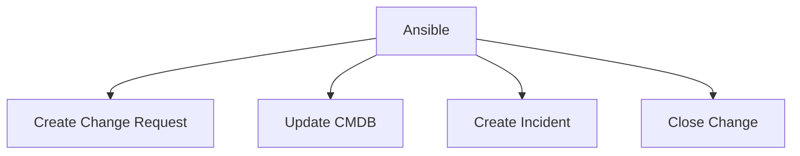

# How to Use Ansible with ServiceNow for ITSM

Author: [nawazdhandala](https://www.github.com/nawazdhandala)

Tags: Ansible, ServiceNow, ITSM, Change Management

Description: Integrate Ansible with ServiceNow for automated change request creation, approval workflows, and CMDB updates.

---

ServiceNow is the enterprise standard for IT Service Management. Ansible has a certified ServiceNow collection that lets you automate change requests, update the CMDB, and manage incidents programmatically.

## Integration Points



## Installing the ServiceNow Collection

```bash
ansible-galaxy collection install servicenow.itsm
```

## Creating Change Requests

```yaml
# tasks/snow-change-request.yml
---
- name: Create change request
  servicenow.itsm.change_request:
    instance:
      host: "{{ snow_instance }}"
      username: "{{ snow_username }}"
      password: "{{ snow_password }}"
    state: new
    type: normal
    short_description: "Deploy {{ app_name }} {{ app_version }}"
    description: |
      Automated change request for application deployment.
      Application: {{ app_name }}
      Version: {{ app_version }}
      Environment: {{ environment_name }}
    assignment_group: "{{ snow_assignment_group }}"
    category: Software
    priority: moderate
  register: change_request

- name: Wait for approval
  servicenow.itsm.change_request_info:
    instance:
      host: "{{ snow_instance }}"
      username: "{{ snow_username }}"
      password: "{{ snow_password }}"
    sys_id: "{{ change_request.record.sys_id }}"
  register: cr_status
  retries: 60
  delay: 60
  until: cr_status.records[0].state == 'implement'
  when: require_approval | default(true)
```

## Updating CMDB

```yaml
# tasks/snow-cmdb.yml
---
- name: Update CMDB configuration item
  servicenow.itsm.configuration_item:
    instance:
      host: "{{ snow_instance }}"
      username: "{{ snow_username }}"
      password: "{{ snow_password }}"
    name: "{{ inventory_hostname }}"
    sys_class_name: cmdb_ci_server
    other:
      ip_address: "{{ ansible_default_ipv4.address }}"
      os: "{{ ansible_distribution }} {{ ansible_distribution_version }}"
      os_version: "{{ ansible_distribution_version }}"
      ram: "{{ ansible_memtotal_mb }}"
      cpu_count: "{{ ansible_processor_vcpus }}"
```

## Closing Change Requests

```yaml
# tasks/snow-close-change.yml
---
- name: Close change request
  servicenow.itsm.change_request:
    instance:
      host: "{{ snow_instance }}"
      username: "{{ snow_username }}"
      password: "{{ snow_password }}"
    sys_id: "{{ change_request.record.sys_id }}"
    state: closed
    close_code: successful
    close_notes: "Deployment completed successfully. All health checks passed."
```

## Key Takeaways

ServiceNow integration with Ansible automates the ITSM workflow. Create change requests before deployments, wait for approvals, execute the change, update the CMDB, and close the change request. The servicenow.itsm collection handles all the API interactions. This is essential for enterprises with formal change management processes.

## Common Use Cases

Here are several practical scenarios where this module proves essential in real-world playbooks.

### Infrastructure Provisioning Workflow

```yaml
# Complete workflow incorporating this module
- name: Infrastructure provisioning
  hosts: all
  become: true
  gather_facts: true
  tasks:
    - name: Gather system information
      ansible.builtin.setup:
        gather_subset:
          - hardware
          - network

    - name: Display system summary
      ansible.builtin.debug:
        msg: >-
          Host {{ inventory_hostname }} has
          {{ ansible_memtotal_mb }}MB RAM,
          {{ ansible_processor_vcpus }} vCPUs,
          running {{ ansible_distribution }} {{ ansible_distribution_version }}

    - name: Install required packages
      ansible.builtin.package:
        name:
          - curl
          - wget
          - git
          - vim
          - htop
          - jq
        state: present

    - name: Configure system timezone
      ansible.builtin.timezone:
        name: "{{ system_timezone | default('UTC') }}"

    - name: Configure hostname
      ansible.builtin.hostname:
        name: "{{ inventory_hostname }}"

    - name: Update /etc/hosts
      ansible.builtin.lineinfile:
        path: /etc/hosts
        regexp: '^127\.0\.1\.1'
        line: "127.0.1.1 {{ inventory_hostname }}"

    - name: Configure SSH hardening
      ansible.builtin.lineinfile:
        path: /etc/ssh/sshd_config
        regexp: "{{ item.regexp }}"
        line: "{{ item.line }}"
      loop:
        - { regexp: '^PermitRootLogin', line: 'PermitRootLogin no' }
        - { regexp: '^PasswordAuthentication', line: 'PasswordAuthentication no' }
      notify: restart sshd

    - name: Configure firewall rules
      community.general.ufw:
        rule: allow
        port: "{{ item }}"
        proto: tcp
      loop:
        - "22"
        - "80"
        - "443"

    - name: Enable firewall
      community.general.ufw:
        state: enabled
        policy: deny

  handlers:
    - name: restart sshd
      ansible.builtin.service:
        name: sshd
        state: restarted
```

### Integration with Monitoring

```yaml
# Using gathered facts to configure monitoring thresholds
- name: Configure monitoring based on system specs
  hosts: all
  become: true
  tasks:
    - name: Set monitoring thresholds based on hardware
      ansible.builtin.template:
        src: monitoring_config.yml.j2
        dest: /etc/monitoring/config.yml
      vars:
        memory_warning_threshold: "{{ (ansible_memtotal_mb * 0.8) | int }}"
        memory_critical_threshold: "{{ (ansible_memtotal_mb * 0.95) | int }}"
        cpu_warning_threshold: 80
        cpu_critical_threshold: 95

    - name: Register host with monitoring system
      ansible.builtin.uri:
        url: "https://monitoring.example.com/api/hosts"
        method: POST
        body_format: json
        body:
          hostname: "{{ inventory_hostname }}"
          ip_address: "{{ ansible_default_ipv4.address }}"
          os: "{{ ansible_distribution }}"
          memory_mb: "{{ ansible_memtotal_mb }}"
          cpus: "{{ ansible_processor_vcpus }}"
        headers:
          Authorization: "Bearer {{ monitoring_api_token }}"
        status_code: [200, 201, 409]
```

### Error Handling Patterns

```yaml
# Robust error handling with this module
- name: Robust task execution
  hosts: all
  tasks:
    - name: Attempt primary operation
      ansible.builtin.command: /opt/app/primary-task.sh
      register: primary_result
      failed_when: false

    - name: Handle primary failure with fallback
      ansible.builtin.command: /opt/app/fallback-task.sh
      when: primary_result.rc != 0
      register: fallback_result

    - name: Report final status
      ansible.builtin.debug:
        msg: >-
          Task completed via {{ 'primary' if primary_result.rc == 0 else 'fallback' }} path.
          Return code: {{ primary_result.rc if primary_result.rc == 0 else fallback_result.rc }}

    - name: Fail if both paths failed
      ansible.builtin.fail:
        msg: "Both primary and fallback operations failed"
      when:
        - primary_result.rc != 0
        - fallback_result is defined
        - fallback_result.rc != 0
```

### Scheduling and Automation

```yaml
# Set up scheduled compliance scans using cron
- name: Configure automated scans
  hosts: all
  become: true
  tasks:
    - name: Create scan script
      ansible.builtin.copy:
        dest: /opt/scripts/compliance_scan.sh
        mode: '0755'
        content: |
          #!/bin/bash
          cd /opt/ansible
          ansible-playbook playbooks/validate.yml -i inventory/ > /var/log/compliance_scan.log 2>&1
          EXIT_CODE=$?
          if [ $EXIT_CODE -ne 0 ]; then
            curl -X POST https://hooks.example.com/alert \
              -H "Content-Type: application/json" \
              -d "{\"text\":\"Compliance scan failed on $(hostname)\"}"
          fi
          exit $EXIT_CODE

    - name: Schedule weekly compliance scan
      ansible.builtin.cron:
        name: "Weekly compliance scan"
        minute: "0"
        hour: "3"
        weekday: "1"
        job: "/opt/scripts/compliance_scan.sh"
        user: ansible
```

