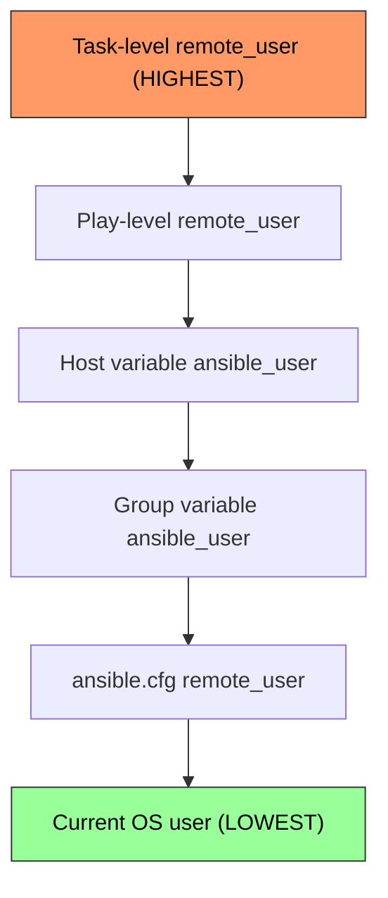

# How to Set the Remote User in Ansible Playbooks

Author: [nawazdhandala](https://www.github.com/nawazdhandala)

Tags: Ansible, SSH, Remote User, Authentication

Description: Learn how to configure the remote user for Ansible playbook execution at the global, play, task, and host levels for flexible authentication.

---

Ansible connects to remote hosts via SSH, and it needs to know which user account to authenticate as. The remote user setting controls this. You can set it globally in the Ansible configuration, per play, per task, or even per host. Understanding the different levels and their precedence is key to managing environments where different hosts require different login accounts.

## Default Behavior

By default, Ansible uses the username of the user running the playbook on the control node. If you are logged in as `deploy` on your laptop and run `ansible-playbook`, Ansible will try to SSH as `deploy` to all remote hosts.

```bash
# If you are logged in as 'deploy', this connects as 'deploy'
ansible-playbook -i inventory.ini site.yml
```

## Setting Remote User in ansible.cfg

For a project-wide default, set the remote user in your Ansible configuration file.

```ini
# ansible.cfg - sets the default SSH user for all connections
[defaults]
remote_user = ansible_svc
```

Now every playbook you run from this project directory will connect as `ansible_svc` unless overridden elsewhere.

## Setting Remote User at the Play Level

Use the `remote_user` directive at the play level to control which user connects for all tasks in that play.

```yaml
# play-level-user.yml - connects as different users per play
---
- name: Configure web servers
  hosts: webservers
  remote_user: deploy
  become: yes

  tasks:
    - name: Install nginx
      apt:
        name: nginx
        state: present

    - name: Start nginx
      service:
        name: nginx
        state: started

- name: Configure network devices
  hosts: switches
  remote_user: netadmin
  gather_facts: no
  connection: network_cli

  tasks:
    - name: Show running config
      ios_command:
        commands: show running-config
```

The first play connects as `deploy` to the web servers. The second play connects as `netadmin` to the network switches.

## Setting Remote User at the Task Level

For even more granularity, set the remote user on individual tasks.

```yaml
# task-level-user.yml - different users for different tasks
---
- name: Application deployment
  hosts: appservers
  remote_user: deploy

  tasks:
    - name: Check application logs (as deploy user)
      command: tail -20 /var/log/myapp/app.log
      register: app_logs

    - name: Restart system service (as root via become)
      service:
        name: myapp
        state: restarted
      become: yes

    - name: Run database backup (as postgres user)
      command: pg_dump myapp > /var/backups/myapp.sql
      remote_user: postgres
      delegate_to: "{{ groups['dbservers'][0] }}"
```

## Setting Remote User in Inventory

You can specify different users per host or per group in your inventory file.

```ini
# inventory.ini - per-host and per-group user configuration
[webservers]
web01 ansible_host=192.168.1.10 ansible_user=deploy
web02 ansible_host=192.168.1.11 ansible_user=deploy
web03 ansible_host=192.168.1.12 ansible_user=ubuntu

[dbservers]
db01 ansible_host=192.168.1.20 ansible_user=postgres

[switches]
sw01 ansible_host=10.0.0.1 ansible_user=admin

[webservers:vars]
ansible_user=deploy

[dbservers:vars]
ansible_user=dbadmin
```

Note the difference: in the inventory, the variable is called `ansible_user` (not `remote_user`). In the playbook, it is `remote_user`.

## YAML Inventory Format

The same configuration in YAML format.

```yaml
# inventory.yml - per-host user in YAML format
---
all:
  children:
    webservers:
      vars:
        ansible_user: deploy
      hosts:
        web01:
          ansible_host: 192.168.1.10
        web02:
          ansible_host: 192.168.1.11
        web03:
          ansible_host: 192.168.1.12
          ansible_user: ubuntu  # overrides group-level setting
    dbservers:
      vars:
        ansible_user: dbadmin
      hosts:
        db01:
          ansible_host: 192.168.1.20
```

## Precedence Order

When the remote user is set in multiple places, Ansible follows a specific precedence order.



The task-level setting wins over everything else. If nothing is set at any level, Ansible falls back to the OS username of the person running the playbook.

## Command Line Override

You can override the remote user for a single run using the `-u` flag.

```bash
# Override remote user from the command line
ansible-playbook -i inventory.ini site.yml -u root

# Same thing, long form
ansible-playbook -i inventory.ini site.yml --user root
```

The command-line flag overrides all other settings except task-level `remote_user`.

## Remote User vs Become User

It is important to understand the distinction between the remote user (who you SSH as) and the become user (who you escalate to).

```yaml
# user-vs-become.yml - shows the difference clearly
---
- name: User escalation example
  hosts: webservers
  remote_user: deploy     # SSH connects as 'deploy'
  become: yes             # Then escalate privileges
  become_user: root       # Become the 'root' user (default)

  tasks:
    # This task runs as root (because become: yes at play level)
    - name: Install package as root
      apt:
        name: nginx
        state: present

    # This task runs as www-data
    - name: Create web content as www-data
      copy:
        content: "Hello World"
        dest: /var/www/html/index.html
      become_user: www-data

    # This task runs as deploy (no become)
    - name: Check user home directory
      command: whoami
      become: no
      register: whoami_result

    - name: Show who we are
      debug:
        msg: "{{ whoami_result.stdout }}"
      become: no
```

The SSH connection is established as `deploy`. Then `become: yes` uses sudo (or another method) to switch to `root` for running commands. Individual tasks can override this to become a different user or disable privilege escalation entirely.

## Multi-Environment Configuration

In real-world setups, different environments often use different SSH accounts.

```yaml
# group_vars/production.yml
---
ansible_user: prod_deploy
ansible_become: yes
ansible_become_method: sudo

# group_vars/staging.yml
---
ansible_user: staging_deploy
ansible_become: yes
ansible_become_method: sudo

# group_vars/development.yml
---
ansible_user: vagrant
ansible_become: yes
ansible_become_method: sudo
ansible_become_pass: vagrant
```

```yaml
# playbook.yml - works across all environments
---
- name: Deploy application
  hosts: appservers
  # remote_user comes from group_vars based on environment

  tasks:
    - name: Deploy code
      synchronize:
        src: /opt/releases/current/
        dest: /var/www/myapp/

    - name: Restart service
      service:
        name: myapp
        state: restarted
      become: yes
```

The playbook does not need to know which user to connect as. The group vars handle it based on which inventory you use.

```bash
# Deploy to staging
ansible-playbook -i staging/inventory.ini playbook.yml

# Deploy to production (uses different user automatically)
ansible-playbook -i production/inventory.ini playbook.yml
```

## Troubleshooting Common Issues

**"Permission denied" errors**: The remote user does not have SSH access. Verify the SSH key is in the user's `~/.ssh/authorized_keys` on the remote host.

**"sudo: a password is required"**: The remote user needs a password for sudo. Either configure passwordless sudo for the user, or use `--ask-become-pass` when running the playbook.

**"Host key verification failed"**: First-time connection to a host. Either accept the host key manually or set `host_key_checking = False` in ansible.cfg (not recommended for production).

```bash
# Run with become password prompt
ansible-playbook -i inventory.ini site.yml --ask-become-pass

# Run with SSH password prompt (when key-based auth is not set up)
ansible-playbook -i inventory.ini site.yml --ask-pass
```

Setting the remote user correctly is fundamental to Ansible working at all. Get it right at the inventory and configuration level, and your playbooks stay clean and portable across environments.
