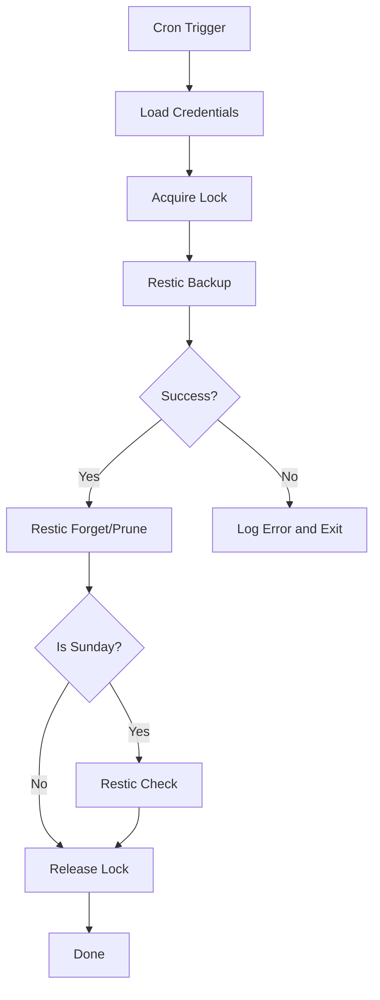

# How to Use Ansible to Set Up Automated Backups with Restic

Author: [nawazdhandala](https://www.github.com/nawazdhandala)

Tags: Ansible, Restic, Backup, Cloud Storage

Description: Automate Restic backup deployments across your servers with Ansible for encrypted, deduplicated backups to local and cloud storage.

---

Restic is a fast, secure, and efficient backup program that supports multiple storage backends including local disks, SFTP, AWS S3, Google Cloud Storage, Azure Blob Storage, and many others. What makes Restic stand out is its simplicity. Unlike some backup tools that require complex configuration files, Restic operations are driven by straightforward command-line arguments. This makes it particularly well-suited for automation with Ansible.

In this guide, I will show you how to deploy Restic across your servers, configure it for both local and cloud storage, and set up automated backup schedules with proper monitoring.

## Installing Restic

Restic is distributed as a single binary, which makes installation clean and simple:

```yaml
# install-restic.yml - Install Restic backup on all servers
---
- name: Install Restic
  hosts: backup_clients
  become: true

  vars:
    restic_version: "0.16.4"

  tasks:
    # Try system package manager first
    - name: Install Restic from package manager (RedHat)
      ansible.builtin.yum:
        name: restic
        state: present
      when: ansible_os_family == "RedHat"
      register: pkg_install
      failed_when: false

    - name: Install Restic from package manager (Debian)
      ansible.builtin.apt:
        name: restic
        state: present
        update_cache: true
      when: ansible_os_family == "Debian"
      register: pkg_install_deb
      failed_when: false

    # Fall back to binary download if package is unavailable or too old
    - name: Download Restic binary
      ansible.builtin.get_url:
        url: "https://github.com/restic/restic/releases/download/v{{ restic_version }}/restic_{{ restic_version }}_linux_{{ 'amd64' if ansible_architecture == 'x86_64' else 'arm64' }}.bz2"
        dest: "/tmp/restic.bz2"
        mode: '0644'
      when: pkg_install is failed or pkg_install_deb is failed

    - name: Extract Restic binary
      ansible.builtin.shell:
        cmd: "bunzip2 -f /tmp/restic.bz2 && mv /tmp/restic /usr/local/bin/restic && chmod 755 /usr/local/bin/restic"
      when: pkg_install is failed or pkg_install_deb is failed

    # Verify installation
    - name: Verify Restic installation
      ansible.builtin.command:
        cmd: restic version
      register: restic_ver
      changed_when: false

    - name: Display Restic version
      ansible.builtin.debug:
        msg: "{{ restic_ver.stdout }}"
```

## Initializing Repositories

Restic needs a repository to store backups. Here is how to set up repositories for different backends:

```yaml
# init-restic-repos.yml - Initialize Restic repositories
---
- name: Initialize Restic repositories
  hosts: backup_clients
  become: true

  vars:
    restic_password: "{{ vault_restic_password }}"
    # Choose one of these backend configurations
    restic_repo_local: /backup/restic
    restic_repo_s3: "s3:s3.amazonaws.com/my-backup-bucket/{{ inventory_hostname }}"
    restic_repo_sftp: "sftp:backup@10.0.1.50:/backup/{{ inventory_hostname }}"

    # AWS credentials for S3 backend
    aws_access_key: "{{ vault_aws_access_key }}"
    aws_secret_key: "{{ vault_aws_secret_key }}"

  environment:
    RESTIC_PASSWORD: "{{ restic_password }}"
    AWS_ACCESS_KEY_ID: "{{ aws_access_key | default('') }}"
    AWS_SECRET_ACCESS_KEY: "{{ aws_secret_key | default('') }}"

  tasks:
    # Create local repository directory
    - name: Create local backup directory
      ansible.builtin.file:
        path: "{{ restic_repo_local }}"
        state: directory
        owner: root
        group: root
        mode: '0700'

    # Initialize local repository
    - name: Check if local repo is initialized
      ansible.builtin.command:
        cmd: "restic -r {{ restic_repo_local }} cat config"
      register: local_check
      changed_when: false
      failed_when: false

    - name: Initialize local Restic repository
      ansible.builtin.command:
        cmd: "restic init -r {{ restic_repo_local }}"
      when: local_check.rc != 0

    # Initialize S3 repository
    - name: Check if S3 repo is initialized
      ansible.builtin.command:
        cmd: "restic -r {{ restic_repo_s3 }} cat config"
      register: s3_check
      changed_when: false
      failed_when: false
      when: aws_access_key is defined and aws_access_key != ""

    - name: Initialize S3 Restic repository
      ansible.builtin.command:
        cmd: "restic init -r {{ restic_repo_s3 }}"
      when:
        - aws_access_key is defined and aws_access_key != ""
        - s3_check.rc != 0
```

## Deploying the Backup Script

A well-structured backup script handles the full lifecycle: backup, prune, and check.

```yaml
# deploy-restic-backup.yml - Deploy Restic backup automation
---
- name: Deploy Restic backup script
  hosts: backup_clients
  become: true

  vars:
    restic_repo: /backup/restic
    restic_password: "{{ vault_restic_password }}"
    restic_backup_paths:
      - /etc
      - /home
      - /var/www
      - /opt
      - /srv
    restic_exclude_patterns:
      - "*.tmp"
      - "*.cache"
      - "*/.cache/*"
      - "*/node_modules/*"
      - "*/vendor/*"
      - "/var/log/journal/*"
      - "/tmp/*"
    restic_keep_hourly: 24
    restic_keep_daily: 7
    restic_keep_weekly: 4
    restic_keep_monthly: 12
    restic_keep_yearly: 3

  tasks:
    # Deploy environment file with credentials
    - name: Deploy Restic environment file
      ansible.builtin.copy:
        dest: /etc/restic-env
        owner: root
        group: root
        mode: '0400'
        content: |
          export RESTIC_REPOSITORY="{{ restic_repo }}"
          export RESTIC_PASSWORD="{{ restic_password }}"

    # Deploy exclude file
    - name: Deploy Restic exclude file
      ansible.builtin.copy:
        dest: /etc/restic-excludes.txt
        owner: root
        group: root
        mode: '0644'
        content: |
          
          {{ pattern }}
          

    # Deploy the backup script
    - name: Deploy Restic backup script
      ansible.builtin.copy:
        dest: /usr/local/bin/restic-backup.sh
        owner: root
        group: root
        mode: '0700'
        content: |
          #!/bin/bash
          # Restic backup script - Managed by Ansible
          set -euo pipefail

          # Load credentials
          source /etc/restic-env

          LOG="/var/log/restic-backup.log"
          LOCK="/var/run/restic-backup.lock"

          log() {
              echo "$(date '+%Y-%m-%d %H:%M:%S') [$1] $2" | tee -a "$LOG"
          }

          # Lock handling
          if [ -f "$LOCK" ]; then
              pid=$(cat "$LOCK")
              if kill -0 "$pid" 2>/dev/null; then
                  log "ERROR" "Backup already running (PID $pid)"
                  exit 1
              fi
              log "WARN" "Removing stale lock file"
              rm -f "$LOCK"
          fi
          echo $$ > "$LOCK"
          trap "rm -f $LOCK" EXIT

          # Run the backup
          log "INFO" "Starting backup"
          restic backup \
              --verbose \
              --exclude-file=/etc/restic-excludes.txt \
              --exclude-caches \
              --tag "automated" \
              --tag "{{ inventory_hostname }}" \
              
              {{ path }} \
              
              2>&1 | tee -a "$LOG"

          BACKUP_RC=${PIPESTATUS[0]}
          if [ $BACKUP_RC -ne 0 ]; then
              log "ERROR" "Backup failed with exit code $BACKUP_RC"
              exit $BACKUP_RC
          fi
          log "INFO" "Backup completed successfully"

          # Prune old snapshots
          log "INFO" "Pruning old snapshots"
          restic forget \
              --verbose \
              --prune \
              --keep-hourly {{ restic_keep_hourly }} \
              --keep-daily {{ restic_keep_daily }} \
              --keep-weekly {{ restic_keep_weekly }} \
              --keep-monthly {{ restic_keep_monthly }} \
              --keep-yearly {{ restic_keep_yearly }} \
              2>&1 | tee -a "$LOG"

          log "INFO" "Prune completed"

          # Periodic integrity check (run on Sundays only)
          if [ "$(date +%u)" -eq 7 ]; then
              log "INFO" "Running weekly integrity check"
              restic check 2>&1 | tee -a "$LOG"
              log "INFO" "Integrity check completed"
          fi

    # Set up cron schedule
    - name: Schedule Restic backup
      ansible.builtin.cron:
        name: "Restic backup"
        minute: "30"
        hour: "*/4"
        job: "/usr/local/bin/restic-backup.sh >> /var/log/restic-cron.log 2>&1"
        user: root

    # Configure log rotation
    - name: Configure Restic log rotation
      ansible.builtin.copy:
        dest: /etc/logrotate.d/restic
        mode: '0644'
        content: |
          /var/log/restic-backup.log /var/log/restic-cron.log {
              weekly
              rotate 8
              compress
              delaycompress
              missingok
              notifempty
          }
```

## Backup Flow



## Configuring S3 Backend for Cloud Backups

Cloud storage gives you off-site backup protection. Here is the S3-specific setup:

```yaml
# restic-s3-setup.yml - Configure Restic with S3 backend
---
- name: Configure Restic S3 backups
  hosts: backup_clients
  become: true

  vars:
    restic_s3_bucket: "company-backups"
    restic_s3_path: "servers/{{ inventory_hostname }}"
    restic_password: "{{ vault_restic_password }}"
    aws_access_key: "{{ vault_aws_access_key }}"
    aws_secret_key: "{{ vault_aws_secret_key }}"
    aws_region: "us-east-1"

  tasks:
    # Deploy S3 environment file
    - name: Deploy S3 Restic environment
      ansible.builtin.copy:
        dest: /etc/restic-s3-env
        owner: root
        group: root
        mode: '0400'
        content: |
          export RESTIC_REPOSITORY="s3:s3.{{ aws_region }}.amazonaws.com/{{ restic_s3_bucket }}/{{ restic_s3_path }}"
          export RESTIC_PASSWORD="{{ restic_password }}"
          export AWS_ACCESS_KEY_ID="{{ aws_access_key }}"
          export AWS_SECRET_ACCESS_KEY="{{ aws_secret_key }}"
          export AWS_DEFAULT_REGION="{{ aws_region }}"

    # Deploy S3 backup script with bandwidth limiting
    - name: Deploy S3 backup script
      ansible.builtin.copy:
        dest: /usr/local/bin/restic-s3-backup.sh
        owner: root
        group: root
        mode: '0700'
        content: |
          #!/bin/bash
          # Restic S3 backup - Managed by Ansible
          set -euo pipefail
          source /etc/restic-s3-env

          LOG="/var/log/restic-s3-backup.log"

          log() {
              echo "$(date '+%Y-%m-%d %H:%M:%S') $1" >> "$LOG"
          }

          log "Starting S3 backup"

          # Limit upload bandwidth to avoid saturating the connection
          restic backup \
              --verbose \
              --limit-upload 50000 \
              --exclude-file=/etc/restic-excludes.txt \
              --exclude-caches \
              --tag "s3-backup" \
              /etc /home /var/www /opt \
              2>> "$LOG"

          log "S3 backup complete, pruning..."

          restic forget \
              --prune \
              --keep-daily 30 \
              --keep-weekly 12 \
              --keep-monthly 24 \
              2>> "$LOG"

          log "S3 prune complete"

    # Schedule S3 backup (once daily, offset from local backup)
    - name: Schedule S3 backup
      ansible.builtin.cron:
        name: "Restic S3 backup"
        minute: "0"
        hour: "3"
        job: "/usr/local/bin/restic-s3-backup.sh >> /var/log/restic-s3-cron.log 2>&1"
        user: root
```

## Monitoring and Alerting

```yaml
# monitor-restic.yml - Monitor Restic backup health
---
- name: Monitor Restic backup health
  hosts: backup_clients
  become: true

  vars:
    restic_repo: /backup/restic
    restic_password: "{{ vault_restic_password }}"
    max_age_hours: 8

  environment:
    RESTIC_REPOSITORY: "{{ restic_repo }}"
    RESTIC_PASSWORD: "{{ restic_password }}"

  tasks:
    # List recent snapshots
    - name: Get recent snapshots
      ansible.builtin.command:
        cmd: restic snapshots --last --json
      register: snapshots_raw
      changed_when: false

    - name: Parse snapshot info
      ansible.builtin.set_fact:
        latest_snapshot: "{{ snapshots_raw.stdout | from_json | first }}"
      when: snapshots_raw.stdout != "[]"

    - name: Display latest snapshot
      ansible.builtin.debug:
        msg:
          - "Host: {{ inventory_hostname }}"
          - "Latest snapshot: {{ latest_snapshot.short_id | default('NONE') }}"
          - "Time: {{ latest_snapshot.time | default('NO BACKUPS') }}"
          - "Paths: {{ latest_snapshot.paths | default([]) }}"
      when: latest_snapshot is defined

    # Check repository statistics
    - name: Get repository stats
      ansible.builtin.command:
        cmd: restic stats --json
      register: stats_raw
      changed_when: false

    - name: Parse and display stats
      ansible.builtin.debug:
        msg: "Repository size: {{ ((stats_raw.stdout | from_json).total_size / 1073741824) | round(2) }} GB"

    # Alert if no recent backups
    - name: Alert on missing backups
      ansible.builtin.debug:
        msg: "ALERT: No backups found for {{ inventory_hostname }}!"
      when: snapshots_raw.stdout == "[]"
```

## Tips for Production Use

Real-world experience with Restic:

1. Use the `--limit-upload` flag when backing up to cloud storage. Without it, Restic will try to upload as fast as possible, which can saturate your internet connection and impact other services.

2. Keep your repository password somewhere safe outside of your servers. If all your servers burn down and you lose the password, your encrypted backups are useless. Store it in a password manager and ideally also in a physical safe.

3. Test restores regularly. I run monthly restore tests by pulling a random snapshot to a test server and verifying the data. A backup you have never tested is a backup you cannot trust.

4. Use tags on your snapshots. They make it easy to filter and manage backups from different sources or scheduled at different times.

5. The `restic mount` command lets you browse snapshots as a FUSE filesystem. This is incredibly useful for restoring individual files without extracting an entire snapshot.

6. For large fleets, stagger your backup times. If 100 servers all start backing up to the same S3 bucket at midnight, you will hit API rate limits. Spread them across the available hours.

Restic is the backup tool I recommend most often for Linux servers. Combined with Ansible for deployment and scheduling, it provides encrypted, deduplicated, cloud-capable backups with minimal operational overhead.
