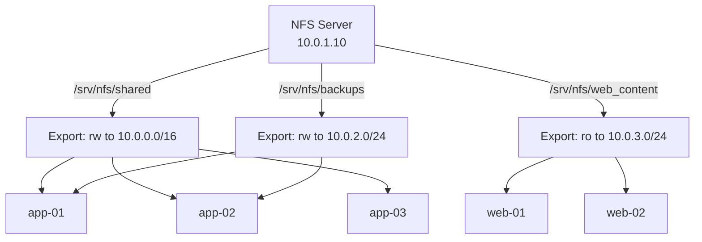

# How to Use Ansible to Set Up NFS Server

Author: [nawazdhandala](https://www.github.com/nawazdhandala)

Tags: Ansible, NFS, Linux, File Sharing

Description: Set up and configure an NFS server and clients across your infrastructure using Ansible for reliable network file sharing.

---

NFS (Network File System) has been around since the 1980s and it is still one of the most common ways to share files between Linux servers. It is simple, well-understood, and works for a surprising number of use cases. The problem is that setting up NFS on one server is easy, but making sure it is configured identically across 20 servers, with the right exports, permissions, and security settings, is where things get tedious.

Ansible turns NFS setup into a repeatable process. This guide covers everything from installing the NFS server packages to configuring exports, mounting on clients, and setting up proper security.

## Inventory Setup

A typical NFS setup has one or more servers exporting directories and many clients mounting them.

```ini
# inventory/nfs
[nfs_servers]
nfs-server-01 ansible_host=10.0.1.10

[nfs_clients]
app-01 ansible_host=10.0.2.10
app-02 ansible_host=10.0.2.11
app-03 ansible_host=10.0.2.12
web-01 ansible_host=10.0.3.10
web-02 ansible_host=10.0.3.11

[nfs_clients:vars]
nfs_server_ip=10.0.1.10
```

## Installing and Configuring the NFS Server

Let us start with the server side. The playbook installs the packages, configures exports, and opens the firewall.

```yaml
# setup-nfs-server.yml - Install and configure NFS server
---
- name: Set up NFS server
  hosts: nfs_servers
  become: true

  vars:
    nfs_exports:
      - path: /srv/nfs/shared
        clients: "10.0.0.0/16"
        options: "rw,sync,no_subtree_check,no_root_squash"
      - path: /srv/nfs/web_content
        clients: "10.0.3.0/24"
        options: "ro,sync,no_subtree_check,root_squash"
      - path: /srv/nfs/backups
        clients: "10.0.2.0/24"
        options: "rw,sync,no_subtree_check,root_squash,no_all_squash"

  tasks:
    # Install NFS server packages
    - name: Install NFS server (RedHat)
      ansible.builtin.yum:
        name:
          - nfs-utils
          - rpcbind
        state: present
      when: ansible_os_family == "RedHat"

    - name: Install NFS server (Debian)
      ansible.builtin.apt:
        name:
          - nfs-kernel-server
          - nfs-common
          - rpcbind
        state: present
        update_cache: true
      when: ansible_os_family == "Debian"

    # Create export directories
    - name: Create NFS export directories
      ansible.builtin.file:
        path: "{{ item.path }}"
        state: directory
        owner: nobody
        group: "{{ 'nogroup' if ansible_os_family == 'Debian' else 'nobody' }}"
        mode: '0755'
      loop: "{{ nfs_exports }}"

    # Configure /etc/exports file
    - name: Configure NFS exports
      ansible.builtin.template:
        src: exports.j2
        dest: /etc/exports
        owner: root
        group: root
        mode: '0644'
        backup: true
      notify: reload nfs exports

    # Enable and start required services
    - name: Enable rpcbind
      ansible.builtin.systemd:
        name: rpcbind
        state: started
        enabled: true

    - name: Enable NFS server
      ansible.builtin.systemd:
        name: nfs-server
        state: started
        enabled: true

    # Configure firewall for NFS
    - name: Open NFS firewall ports
      ansible.posix.firewalld:
        service: "{{ item }}"
        permanent: true
        state: enabled
        immediate: true
      loop:
        - nfs
        - rpc-bind
        - mountd
      when: ansible_os_family == "RedHat"
      failed_when: false

  handlers:
    - name: reload nfs exports
      ansible.builtin.command:
        cmd: exportfs -ra
```

The exports template:

```jinja2
# /etc/exports - Managed by Ansible
# Do not edit manually, changes will be overwritten

{{ export.path }}    {{ export.clients }}({{ export.options }})

```

## Configuring NFS Clients

The client side involves installing packages, creating mount points, and adding entries to fstab:

```yaml
# setup-nfs-clients.yml - Configure NFS mounts on client servers
---
- name: Set up NFS clients
  hosts: nfs_clients
  become: true

  vars:
    nfs_mounts:
      - src: "{{ nfs_server_ip }}:/srv/nfs/shared"
        path: /mnt/nfs/shared
        opts: "rw,hard,intr,timeo=600,retrans=2,_netdev"
      - src: "{{ nfs_server_ip }}:/srv/nfs/web_content"
        path: /mnt/nfs/web_content
        opts: "ro,hard,intr,timeo=600,retrans=2,_netdev"

  tasks:
    # Install NFS client packages
    - name: Install NFS client (RedHat)
      ansible.builtin.yum:
        name: nfs-utils
        state: present
      when: ansible_os_family == "RedHat"

    - name: Install NFS client (Debian)
      ansible.builtin.apt:
        name: nfs-common
        state: present
        update_cache: true
      when: ansible_os_family == "Debian"

    # Create mount point directories
    - name: Create NFS mount points
      ansible.builtin.file:
        path: "{{ item.path }}"
        state: directory
        mode: '0755'
      loop: "{{ nfs_mounts }}"

    # Mount NFS shares and add to fstab
    - name: Mount NFS shares
      ansible.posix.mount:
        path: "{{ item.path }}"
        src: "{{ item.src }}"
        fstype: nfs
        opts: "{{ item.opts }}"
        state: mounted
      loop: "{{ nfs_mounts }}"

    # Verify the mounts are working
    - name: Verify NFS mounts are accessible
      ansible.builtin.stat:
        path: "{{ item.path }}"
      loop: "{{ nfs_mounts }}"
      register: mount_check

    - name: Report mount status
      ansible.builtin.debug:
        msg: "Mount {{ item.item.path }} exists: {{ item.stat.exists }}, is_dir: {{ item.stat.isdir | default(false) }}"
      loop: "{{ mount_check.results }}"
      loop_control:
        label: "{{ item.item.path }}"
```

## NFS Architecture Overview



## Configuring NFSv4 with Kerberos Security

For production environments where security matters, NFSv4 with Kerberos authentication is the way to go:

```yaml
# nfs-kerberos.yml - Configure NFSv4 with Kerberos security
---
- name: Configure NFS with Kerberos
  hosts: nfs_servers
  become: true

  vars:
    nfs_domain: example.com
    kerberos_keytab: /etc/krb5.keytab

  tasks:
    # Configure the NFS domain for idmapping
    - name: Set NFS domain in idmapd.conf
      ansible.builtin.lineinfile:
        path: /etc/idmapd.conf
        regexp: '^#?\s*Domain\s*='
        line: "Domain = {{ nfs_domain }}"
        backup: true
      notify: restart nfs-idmapd

    # Enable NFSv4 and disable older versions
    - name: Configure NFS server for v4 only
      ansible.builtin.copy:
        dest: /etc/nfs.conf.d/nfsv4.conf
        mode: '0644'
        content: |
          [nfsd]
          vers2=n
          vers3=n
          vers4=y
          vers4.1=y
          vers4.2=y
      notify: restart nfs-server

    # Configure secure exports with Kerberos
    - name: Configure Kerberos-secured exports
      ansible.builtin.lineinfile:
        path: /etc/exports
        line: "/srv/nfs/secure    *.{{ nfs_domain }}(rw,sync,sec=krb5p,no_subtree_check)"
        create: true
        mode: '0644'
      notify: reload nfs exports

    # Enable gssproxy for Kerberos support
    - name: Enable gssproxy
      ansible.builtin.systemd:
        name: gssproxy
        state: started
        enabled: true

  handlers:
    - name: restart nfs-idmapd
      ansible.builtin.systemd:
        name: nfs-idmapd
        state: restarted

    - name: restart nfs-server
      ansible.builtin.systemd:
        name: nfs-server
        state: restarted

    - name: reload nfs exports
      ansible.builtin.command:
        cmd: exportfs -ra
```

## Monitoring NFS Health

Keeping tabs on NFS performance and connectivity is important for production systems:

```yaml
# monitor-nfs.yml - Check NFS server health and client connectivity
---
- name: Monitor NFS health
  hosts: nfs_servers
  become: true

  tasks:
    # Show current NFS exports
    - name: Show active exports
      ansible.builtin.command:
        cmd: exportfs -v
      register: active_exports
      changed_when: false

    - name: Display active exports
      ansible.builtin.debug:
        var: active_exports.stdout_lines

    # Check connected NFS clients
    - name: Show connected NFS clients
      ansible.builtin.command:
        cmd: ss -tn state established '( sport = :2049 )'
      register: nfs_clients
      changed_when: false

    - name: Display connected clients
      ansible.builtin.debug:
        var: nfs_clients.stdout_lines

    # Check NFS server statistics
    - name: Get NFS server stats
      ansible.builtin.command:
        cmd: nfsstat -s
      register: nfs_stats
      changed_when: false

    - name: Display NFS stats
      ansible.builtin.debug:
        var: nfs_stats.stdout_lines

- name: Check NFS mounts on clients
  hosts: nfs_clients
  become: true

  tasks:
    # Verify all NFS mounts are active
    - name: Check NFS mount status
      ansible.builtin.shell:
        cmd: mount -t nfs,nfs4 | awk '{print $1, $3, $5, $6}'
      register: client_mounts
      changed_when: false

    - name: Display client mounts
      ansible.builtin.debug:
        msg: "{{ inventory_hostname }}: {{ client_mounts.stdout_lines }}"

    # Test read access on each mount
    - name: Test NFS mount accessibility
      ansible.builtin.command:
        cmd: "ls {{ item }}"
      loop:
        - /mnt/nfs/shared
        - /mnt/nfs/web_content
      register: access_test
      changed_when: false
      failed_when: false

    - name: Report access status
      ansible.builtin.debug:
        msg: "{{ item.item }}: {{ 'OK' if item.rc == 0 else 'FAILED' }}"
      loop: "{{ access_test.results }}"
      loop_control:
        label: "{{ item.item }}"
```

## Handling NFS Mount Timeouts

One of the most common NFS problems is stale mounts when the server goes down. Here is a playbook that detects and handles them:

```yaml
# fix-stale-mounts.yml - Detect and fix stale NFS mounts
---
- name: Fix stale NFS mounts
  hosts: nfs_clients
  become: true

  tasks:
    # Try to stat each NFS mount with a timeout
    - name: Check for stale NFS mounts
      ansible.builtin.command:
        cmd: "timeout 5 stat {{ item }}"
      loop:
        - /mnt/nfs/shared
        - /mnt/nfs/web_content
      register: stale_check
      changed_when: false
      failed_when: false

    # Force unmount any stale mounts
    - name: Force unmount stale mounts
      ansible.builtin.command:
        cmd: "umount -f -l {{ item.item }}"
      loop: "{{ stale_check.results }}"
      when: item.rc != 0
      loop_control:
        label: "{{ item.item }}"

    # Remount after fixing stale mounts
    - name: Remount all NFS from fstab
      ansible.builtin.command:
        cmd: mount -a -t nfs,nfs4
      when: stale_check.results | selectattr('rc', 'ne', 0) | list | length > 0
      changed_when: true
```

## Production Tips

These are the lessons I have picked up from running NFS in various environments:

1. Always use `hard` mount option in production. The `soft` option can cause silent data corruption because the client will return errors to applications instead of waiting for the server to come back.

2. The `_netdev` mount option is essential. Without it, the system will try to mount NFS shares before the network is up during boot, causing boot delays or failures.

3. Use `no_subtree_check` on exports. The subtree check is a security feature that verifies the file being accessed is in the exported directory tree, but it causes reliability problems and performance overhead that is almost never worth it.

4. Be careful with `no_root_squash`. It allows the root user on client machines to act as root on the NFS server, which is a security risk. Only use it when you specifically need root-level access from clients.

5. Monitor NFS latency, not just availability. A slow NFS server will make every application that depends on it slow, and it often shows up as mysterious performance issues that are hard to trace.

NFS may be old technology, but when managed with Ansible, it remains one of the most practical solutions for sharing files across a Linux infrastructure.
