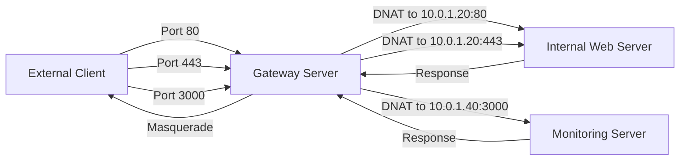

# How to Use Ansible to Set Up Port Forwarding

Author: [nawazdhandala](https://www.github.com/nawazdhandala)

Tags: Ansible, Port Forwarding, Networking, Linux, NAT

Description: Learn how to configure port forwarding on Linux servers using Ansible with iptables, firewalld, and sysctl for IP forwarding.

---

Port forwarding is a fundamental networking technique that redirects traffic arriving on one port to a different port or a different machine entirely. It is essential for running services behind NAT gateways, load balancers, or jump hosts. Ansible makes it straightforward to configure port forwarding rules consistently across your infrastructure, whether you use iptables, firewalld, or nftables as your backend.

## Prerequisites

- Ansible 2.9+ on your control node
- Linux target hosts with root or sudo access
- Basic understanding of NAT and IP forwarding concepts
- Either iptables or firewalld installed on target hosts

## Enabling IP Forwarding

Before any port forwarding will work, the Linux kernel needs to have IP forwarding enabled. By default, Linux does not forward packets between interfaces. Here is how to enable it persistently:

```yaml
# enable_ip_forwarding.yml - Enable kernel IP forwarding
---
- name: Enable IP forwarding
  hosts: gateway_servers
  become: true
  tasks:
    - name: Enable IPv4 forwarding
      ansible.posix.sysctl:
        name: net.ipv4.ip_forward
        value: '1'
        sysctl_set: true
        state: present
        reload: true

    - name: Enable IPv6 forwarding if needed
      ansible.posix.sysctl:
        name: net.ipv6.conf.all.forwarding
        value: '1'
        sysctl_set: true
        state: present
        reload: true

    - name: Verify forwarding is enabled
      ansible.builtin.command: sysctl net.ipv4.ip_forward
      register: forward_check
      changed_when: false

    - name: Show forwarding status
      ansible.builtin.debug:
        var: forward_check.stdout
```

## Port Forwarding with iptables

The most common approach uses iptables DNAT (Destination NAT) rules in the nat table. Here is a complete example that forwards external traffic to internal servers:

```yaml
# iptables_port_forward.yml - Set up port forwarding with iptables
---
- name: Configure port forwarding with iptables
  hosts: gateway_servers
  become: true
  vars:
    external_interface: eth0
    internal_web_server: 10.0.1.20
    internal_db_server: 10.0.1.30
    internal_app_server: 10.0.1.40
  tasks:
    - name: Enable IP forwarding
      ansible.posix.sysctl:
        name: net.ipv4.ip_forward
        value: '1'
        sysctl_set: true
        state: present
        reload: true

    - name: Forward port 80 to internal web server
      ansible.builtin.iptables:
        table: nat
        chain: PREROUTING
        in_interface: "{{ external_interface }}"
        protocol: tcp
        destination_port: '80'
        jump: DNAT
        to_destination: "{{ internal_web_server }}:80"
        comment: "Forward HTTP to web server"

    - name: Forward port 443 to internal web server
      ansible.builtin.iptables:
        table: nat
        chain: PREROUTING
        in_interface: "{{ external_interface }}"
        protocol: tcp
        destination_port: '443'
        jump: DNAT
        to_destination: "{{ internal_web_server }}:443"
        comment: "Forward HTTPS to web server"

    - name: Forward port 5432 to database server (from specific source)
      ansible.builtin.iptables:
        table: nat
        chain: PREROUTING
        in_interface: "{{ external_interface }}"
        protocol: tcp
        source: 203.0.113.0/24
        destination_port: '5432'
        jump: DNAT
        to_destination: "{{ internal_db_server }}:5432"
        comment: "Forward PostgreSQL from trusted network"

    - name: Masquerade forwarded traffic
      ansible.builtin.iptables:
        table: nat
        chain: POSTROUTING
        out_interface: eth1
        jump: MASQUERADE
        comment: "Masquerade forwarded traffic"

    - name: Allow forwarded traffic in FORWARD chain
      ansible.builtin.iptables:
        chain: FORWARD
        in_interface: "{{ external_interface }}"
        out_interface: eth1
        ctstate:
          - NEW
          - ESTABLISHED
          - RELATED
        jump: ACCEPT
        comment: "Allow forwarded traffic"

    - name: Allow return traffic
      ansible.builtin.iptables:
        chain: FORWARD
        in_interface: eth1
        out_interface: "{{ external_interface }}"
        ctstate:
          - ESTABLISHED
          - RELATED
        jump: ACCEPT
        comment: "Allow return traffic"
```

## Port Remapping

Sometimes you want to redirect traffic from one port to a different port number. For example, forwarding external port 8080 to internal port 80:

```yaml
# port_remap.yml - Forward one port to a different port number
---
- name: Configure port remapping
  hosts: gateway_servers
  become: true
  tasks:
    - name: Forward external port 8080 to internal port 80
      ansible.builtin.iptables:
        table: nat
        chain: PREROUTING
        protocol: tcp
        destination_port: '8080'
        jump: DNAT
        to_destination: 10.0.1.20:80
        comment: "Remap 8080 to 80 on web server"

    - name: Forward external port 2222 to internal SSH
      ansible.builtin.iptables:
        table: nat
        chain: PREROUTING
        protocol: tcp
        destination_port: '2222'
        jump: DNAT
        to_destination: 10.0.1.50:22
        comment: "Remap 2222 to SSH on internal host"

    - name: Local port redirect (same host, 8080 to 80)
      ansible.builtin.iptables:
        table: nat
        chain: PREROUTING
        protocol: tcp
        destination_port: '8080'
        jump: REDIRECT
        to_ports: '80'
        comment: "Local redirect 8080 to 80"
```

## Port Forwarding with firewalld

If your systems use firewalld, port forwarding is managed through the zone configuration:

```yaml
# firewalld_port_forward.yml - Port forwarding using firewalld
---
- name: Configure port forwarding with firewalld
  hosts: gateway_servers
  become: true
  tasks:
    - name: Enable masquerading in public zone
      ansible.posix.firewalld:
        zone: public
        masquerade: true
        permanent: true
        immediate: true
        state: enabled

    - name: Forward port 80 to internal web server
      ansible.posix.firewalld:
        rich_rule: 'rule family="ipv4" forward-port port="80" protocol="tcp" to-port="80" to-addr="10.0.1.20"'
        zone: public
        permanent: true
        immediate: true
        state: enabled

    - name: Forward port 443 to internal web server
      ansible.posix.firewalld:
        rich_rule: 'rule family="ipv4" forward-port port="443" protocol="tcp" to-port="443" to-addr="10.0.1.20"'
        zone: public
        permanent: true
        immediate: true
        state: enabled

    - name: Forward port 8080 to internal port 80
      ansible.posix.firewalld:
        rich_rule: 'rule family="ipv4" forward-port port="8080" protocol="tcp" to-port="80" to-addr="10.0.1.20"'
        zone: public
        permanent: true
        immediate: true
        state: enabled
```

## Variable-Driven Port Forwarding

For environments with many forwarding rules, using variables keeps things clean and maintainable:

```yaml
# variable_port_forward.yml - Data-driven port forwarding configuration
---
- name: Configure port forwarding from variables
  hosts: gateway_servers
  become: true
  vars:
    port_forwards:
      - src_port: 80
        dest_ip: 10.0.1.20
        dest_port: 80
        proto: tcp
        comment: "HTTP to web server"
      - src_port: 443
        dest_ip: 10.0.1.20
        dest_port: 443
        proto: tcp
        comment: "HTTPS to web server"
      - src_port: 3000
        dest_ip: 10.0.1.40
        dest_port: 3000
        proto: tcp
        comment: "Grafana to monitoring server"
      - src_port: 9090
        dest_ip: 10.0.1.40
        dest_port: 9090
        proto: tcp
        comment: "Prometheus to monitoring server"
  tasks:
    - name: Enable IP forwarding
      ansible.posix.sysctl:
        name: net.ipv4.ip_forward
        value: '1'
        sysctl_set: true
        state: present
        reload: true

    - name: Create DNAT rules for each port forward
      ansible.builtin.iptables:
        table: nat
        chain: PREROUTING
        protocol: "{{ item.proto }}"
        destination_port: "{{ item.src_port }}"
        jump: DNAT
        to_destination: "{{ item.dest_ip }}:{{ item.dest_port }}"
        comment: "{{ item.comment }}"
      loop: "{{ port_forwards }}"

    - name: Allow forwarded connections
      ansible.builtin.iptables:
        chain: FORWARD
        protocol: "{{ item.proto }}"
        destination: "{{ item.dest_ip }}"
        destination_port: "{{ item.dest_port }}"
        ctstate:
          - NEW
        jump: ACCEPT
        comment: "Allow forward {{ item.comment }}"
      loop: "{{ port_forwards }}"

    - name: Enable masquerading
      ansible.builtin.iptables:
        table: nat
        chain: POSTROUTING
        jump: MASQUERADE
        comment: "Masquerade all forwarded traffic"
```

## Persisting iptables Port Forwarding Rules

Since iptables rules are not persistent by default, you need to save them:

```yaml
# persist_rules.yml - Save port forwarding rules for persistence
---
- name: Persist iptables rules
  hosts: gateway_servers
  become: true
  tasks:
    - name: Install iptables-persistent
      ansible.builtin.apt:
        name: iptables-persistent
        state: present
      when: ansible_os_family == "Debian"

    - name: Save current rules
      ansible.builtin.command: netfilter-persistent save
      changed_when: true
      when: ansible_os_family == "Debian"

    - name: Install iptables-services on RHEL
      ansible.builtin.yum:
        name: iptables-services
        state: present
      when: ansible_os_family == "RedHat"

    - name: Save rules on RHEL
      ansible.builtin.command: service iptables save
      changed_when: true
      when: ansible_os_family == "RedHat"
```

## Traffic Flow



## Troubleshooting Port Forwarding

When port forwarding is not working, there are several things to check. Use this verification playbook:

```yaml
# verify_forward.yml - Diagnose port forwarding issues
---
- name: Verify port forwarding setup
  hosts: gateway_servers
  become: true
  tasks:
    - name: Check IP forwarding is enabled
      ansible.builtin.command: sysctl net.ipv4.ip_forward
      register: fwd_status
      changed_when: false

    - name: Show forwarding status
      ansible.builtin.debug:
        var: fwd_status.stdout

    - name: Show NAT table rules
      ansible.builtin.command: iptables -t nat -L -n -v
      register: nat_rules
      changed_when: false

    - name: Show NAT rules
      ansible.builtin.debug:
        var: nat_rules.stdout_lines

    - name: Show FORWARD chain rules
      ansible.builtin.command: iptables -L FORWARD -n -v
      register: forward_rules
      changed_when: false

    - name: Show FORWARD rules
      ansible.builtin.debug:
        var: forward_rules.stdout_lines
```

The most common issues are: IP forwarding not enabled (check sysctl), missing FORWARD chain rules (DNAT alone is not enough if your default FORWARD policy is DROP), and missing masquerade rules (the return packets need to be rewritten too). Ansible makes it easy to codify the complete setup and avoid missing any of these pieces.
