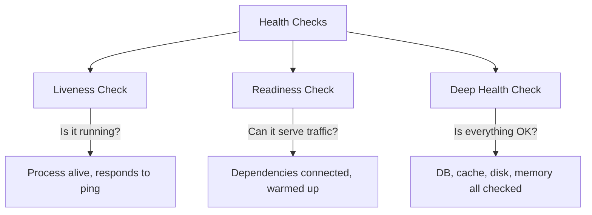

# How to Use Ansible to Set Up Application Health Checks

Author: [nawazdhandala](https://www.github.com/nawazdhandala)

Tags: Ansible, Health Checks, Monitoring, DevOps, Reliability

Description: Implement application health checks with Ansible including HTTP probes, service verification, dependency checks, and automated recovery.

---

Health checks are the foundation of reliable application operations. They tell you whether your application is running, whether it can reach its dependencies, and whether it is ready to serve traffic. Without health checks, you are flying blind. Load balancers need health checks to route traffic away from unhealthy instances. Orchestrators use them to decide when to restart containers. Monitoring systems rely on them for alerting.

This guide covers setting up comprehensive health checks with Ansible, from simple HTTP probes to deep dependency verification.

## Types of Health Checks

There are three main types of health checks:



- **Liveness**: Is the process alive? Returns 200 if the application responds at all.
- **Readiness**: Can it serve traffic? Returns 200 only when all dependencies are available.
- **Deep/Startup**: Full dependency check including database connectivity, cache availability, disk space, and memory.

## Project Structure

```
health-checks/
  inventory/
    hosts.yml
  group_vars/
    all.yml
  roles/
    health_checks/
      tasks/
        main.yml
        deploy_endpoint.yml
        monitoring.yml
      templates/
        health-check-script.sh.j2
        health-check-cron.j2
        nginx-health.conf.j2
      handlers/
        main.yml
  playbook.yml
```

## Variables

```yaml
# group_vars/all.yml
app_name: myapp
app_port: 8000
app_health_path: /health
app_readiness_path: /ready
health_check_interval: 30  # seconds
health_check_timeout: 10   # seconds
health_check_retries: 3

# Dependency endpoints to verify
app_dependencies:
  - name: database
    type: tcp
    host: db.internal
    port: 5432
  - name: redis
    type: tcp
    host: redis.internal
    port: 6379
  - name: api-service
    type: http
    url: http://api.internal:8080/health

# Alert configuration
alert_webhook: "https://hooks.slack.com/services/YOUR/WEBHOOK"
alert_email: ops@example.com
```

## Deployment-Time Health Checks

The most important use of health checks in Ansible is verifying that a deployment succeeded before moving to the next server.

```yaml
# roles/health_checks/tasks/main.yml
---
- name: Wait for application port to be available
  wait_for:
    port: "{{ app_port }}"
    host: 127.0.0.1
    delay: 5
    timeout: 60
    state: started

- name: Check application liveness endpoint
  uri:
    url: "http://127.0.0.1:{{ app_port }}{{ app_health_path }}"
    method: GET
    status_code: 200
    timeout: "{{ health_check_timeout }}"
  register: health_result
  retries: "{{ health_check_retries }}"
  delay: 5
  until: health_result.status == 200

- name: Check application readiness endpoint
  uri:
    url: "http://127.0.0.1:{{ app_port }}{{ app_readiness_path }}"
    method: GET
    status_code: 200
    timeout: "{{ health_check_timeout }}"
    return_content: yes
  register: readiness_result
  retries: "{{ health_check_retries }}"
  delay: 10
  until: readiness_result.status == 200

- name: Display health check results
  debug:
    msg: |
      Health: {{ health_result.status }}
      Readiness: {{ readiness_result.status }}
      Response: {{ readiness_result.content | default('N/A') }}

- name: Verify all dependencies are reachable
  include_tasks: check_dependency.yml
  loop: "{{ app_dependencies }}"
  loop_control:
    loop_var: dep

- name: Deploy health check monitoring script
  template:
    src: health-check-script.sh.j2
    dest: /opt/scripts/health-check-{{ app_name }}.sh
    owner: root
    group: root
    mode: '0755'

- name: Schedule periodic health checks via cron
  cron:
    name: "Health check for {{ app_name }}"
    minute: "*/{{ (health_check_interval / 60) | int | default(1) }}"
    job: "/opt/scripts/health-check-{{ app_name }}.sh >> /var/log/{{ app_name }}/health-check.log 2>&1"
    user: root
```

## Dependency Check Tasks

```yaml
# roles/health_checks/tasks/check_dependency.yml
---
- name: "Check TCP dependency: {{ dep.name }}"
  wait_for:
    host: "{{ dep.host }}"
    port: "{{ dep.port }}"
    timeout: "{{ health_check_timeout }}"
    state: started
  when: dep.type == "tcp"
  register: tcp_check
  ignore_errors: yes

- name: "Check HTTP dependency: {{ dep.name }}"
  uri:
    url: "{{ dep.url }}"
    method: GET
    status_code: 200
    timeout: "{{ health_check_timeout }}"
  when: dep.type == "http"
  register: http_check
  ignore_errors: yes

- name: "Report dependency status: {{ dep.name }}"
  debug:
    msg: "Dependency {{ dep.name }}: {{ 'OK' if (tcp_check is not failed and http_check is not failed) else 'FAILED' }}"
```

## Health Check Monitoring Script

This script runs on a schedule and alerts if the application becomes unhealthy.

```bash
#!/bin/bash
# roles/health_checks/templates/health-check-script.sh.j2
# Health check script for {{ app_name }} - managed by Ansible

APP_NAME="{{ app_name }}"
HEALTH_URL="http://127.0.0.1:{{ app_port }}{{ app_health_path }}"
READY_URL="http://127.0.0.1:{{ app_port }}{{ app_readiness_path }}"
TIMEOUT={{ health_check_timeout }}
MAX_RETRIES={{ health_check_retries }}
LOG_FILE="/var/log/{{ app_name }}/health-check.log"
ALERT_FILE="/tmp/${APP_NAME}_health_alert_sent"

log() {
    echo "$(date '+%Y-%m-%d %H:%M:%S') - $1"
}

check_health() {
    local url=$1
    local name=$2
    local retries=0

    while [ $retries -lt $MAX_RETRIES ]; do
        response=$(curl -s -o /dev/null -w "%{http_code}" --max-time $TIMEOUT "$url")
        if [ "$response" = "200" ]; then
            return 0
        fi
        retries=$((retries + 1))
        sleep 2
    done
    return 1
}

send_alert() {
    local message=$1

    curl -s -X POST "{{ alert_webhook }}" \
        -H "Content-Type: application/json" \
        -d "{\"text\": \"$message\"}" > /dev/null 2>&1

    log "ALERT: $message"
}

# Run liveness check
if check_health "$HEALTH_URL" "liveness"; then
    log "Liveness check: PASSED"

    # Remove alert flag if it exists (app recovered)
    if [ -f "$ALERT_FILE" ]; then
        rm -f "$ALERT_FILE"
        send_alert "RECOVERED: ${APP_NAME} is healthy again on $(hostname)"
    fi
else
    log "Liveness check: FAILED"

    # Only send alert once per failure
    if [ ! -f "$ALERT_FILE" ]; then
        touch "$ALERT_FILE"
        send_alert "ALERT: ${APP_NAME} liveness check failed on $(hostname)"

        # Attempt automatic restart
        log "Attempting automatic restart of ${APP_NAME}"
        systemctl restart "${APP_NAME}"
        sleep 10

        # Check again after restart
        if check_health "$HEALTH_URL" "post-restart"; then
            log "Auto-restart successful"
            send_alert "AUTO-RECOVERED: ${APP_NAME} restarted successfully on $(hostname)"
            rm -f "$ALERT_FILE"
        else
            log "Auto-restart did not fix the issue"
            send_alert "CRITICAL: ${APP_NAME} auto-restart failed on $(hostname). Manual intervention required."
        fi
    fi
fi

# Run dependency checks


if nc -z -w $TIMEOUT {{ dep.host }} {{ dep.port }} 2>/dev/null; then
    log "Dependency {{ dep.name }}: OK"
else
    log "Dependency {{ dep.name }}: UNREACHABLE"
    send_alert "WARNING: Dependency {{ dep.name }} ({{ dep.host }}:{{ dep.port }}) is unreachable from $(hostname)"
fi

dep_response=$(curl -s -o /dev/null -w "%{http_code}" --max-time $TIMEOUT "{{ dep.url }}")
if [ "$dep_response" = "200" ]; then
    log "Dependency {{ dep.name }}: OK"
else
    log "Dependency {{ dep.name }}: HTTP $dep_response"
    send_alert "WARNING: Dependency {{ dep.name }} returned HTTP $dep_response from $(hostname)"
fi


```

## Nginx Health Check Endpoint

If your application does not have a built-in health endpoint, you can add one at the Nginx level:

```nginx
# roles/health_checks/templates/nginx-health.conf.j2
# Simple health check endpoint at the Nginx level
location /nginx-health {
    access_log off;
    return 200 '{"status": "ok", "server": "$hostname", "timestamp": "$time_iso8601"}';
    add_header Content-Type application/json;
}

# Proxy to application health endpoint
location {{ app_health_path }} {
    proxy_pass http://127.0.0.1:{{ app_port }}{{ app_health_path }};
    proxy_set_header Host $host;
    access_log off;
}
```

## Using Health Checks in Serial Deployment

Health checks are critical during rolling deployments:

```yaml
# deploy.yml - Deploy with health check gates
---
- name: Deploy Application with Health Check Gates
  hosts: app_servers
  become: yes
  serial: 1
  max_fail_percentage: 0

  tasks:
    - name: Pull latest application code
      git:
        repo: "{{ app_repo }}"
        dest: "{{ app_dir }}"
        version: "{{ app_branch }}"
      notify: restart application

    - meta: flush_handlers

    - name: Wait for application to start
      wait_for:
        port: "{{ app_port }}"
        delay: 5
        timeout: 60

    - name: Verify health check passes
      uri:
        url: "http://127.0.0.1:{{ app_port }}{{ app_health_path }}"
        status_code: 200
      retries: 5
      delay: 10
      register: post_deploy_health

    - name: Fail the deployment if health check does not pass
      fail:
        msg: "Health check failed after deployment. Investigate before continuing."
      when: post_deploy_health.status != 200
```

## Running the Playbook

```bash
# Set up health checks
ansible-playbook -i inventory/hosts.yml playbook.yml

# Run health checks manually on all servers
ansible all -i inventory/hosts.yml -m shell -a "/opt/scripts/health-check-myapp.sh"
```

## Wrapping Up

Health checks are not just a nice-to-have; they are essential for reliable operations. This Ansible playbook sets up multi-level health checking: deployment-time verification to catch failures early, dependency checks to identify infrastructure issues, and ongoing monitoring scripts with automated alerting and recovery. The key is to use health checks as gates during rolling deployments so that a failed deployment on one server does not cascade to the rest of your fleet.
