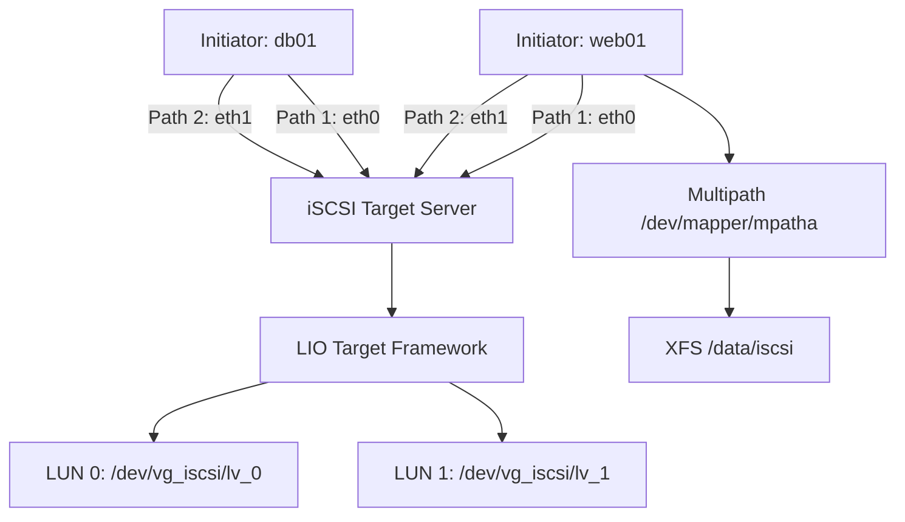

# How to Use Ansible to Set Up iSCSI Storage

Author: [nawazdhandala](https://www.github.com/nawazdhandala)

Tags: Ansible, iSCSI, Storage, Linux, SAN

Description: Automate iSCSI target and initiator configuration on Linux using Ansible for block-level network storage with proper multipath and authentication setup.

---

iSCSI (Internet Small Computer Systems Interface) lets you access block storage over a regular TCP/IP network. It is essentially a SAN (Storage Area Network) protocol that works over Ethernet instead of requiring dedicated Fibre Channel infrastructure. This makes it accessible to organizations that cannot justify the cost of dedicated storage networking. Ansible automates both sides of the iSCSI equation: the target (server that provides storage) and the initiator (client that consumes it).

## iSCSI Terminology

Before jumping into playbooks, here are the key terms:

- **Target**: The server that exports block devices over the network
- **Initiator**: The client that connects to targets and uses the block devices
- **IQN**: iSCSI Qualified Name, a unique identifier for each target and initiator
- **LUN**: Logical Unit Number, identifies a specific block device on a target
- **Portal**: IP address and port where the target listens (default: port 3260)
- **CHAP**: Challenge-Handshake Authentication Protocol, authenticates connections

## Setting Up an iSCSI Target Server

Let us start with the target server that will export block storage.

This playbook installs and configures an iSCSI target with LIO (Linux-IO):

```yaml
# configure-iscsi-target.yml - Set up iSCSI target server
---
- name: Configure iSCSI Target Server
  hosts: storage_servers
  become: true
  vars:
    iscsi_target_iqn: "iqn.2024-01.com.example:storage.target1"
    iscsi_portal_ip: "{{ ansible_default_ipv4.address }}"
    iscsi_portal_port: 3260
    iscsi_luns:
      - name: lun0
        device: /dev/vg_iscsi/lv_iscsi_0
        size: 100G
      - name: lun1
        device: /dev/vg_iscsi/lv_iscsi_1
        size: 50G
    iscsi_allowed_initiators:
      - iqn: "iqn.2024-01.com.example:client.web01"
        chap_user: "web01_user"
        chap_password: "{{ vault_chap_web01 }}"
      - iqn: "iqn.2024-01.com.example:client.db01"
        chap_user: "db01_user"
        chap_password: "{{ vault_chap_db01 }}"

  tasks:
    - name: Install targetcli for LIO management
      ansible.builtin.apt:
        name:
          - targetcli-fb
          - python3-rtslib-fb
        state: present
        update_cache: true
      when: ansible_os_family == "Debian"

    - name: Install targetcli on RHEL
      ansible.builtin.yum:
        name:
          - targetcli
        state: present
      when: ansible_os_family == "RedHat"

    - name: Enable and start target service
      ansible.builtin.systemd:
        name: rtslib-fb-targetctl
        enabled: true
        state: started
      failed_when: false

    - name: Create LVM volumes for iSCSI LUNs
      community.general.lvol:
        vg: vg_iscsi
        lv: "{{ item.name }}"
        size: "{{ item.size }}"
      loop: "{{ iscsi_luns }}"
      loop_control:
        label: "{{ item.name }}"

    - name: Configure iSCSI target using targetcli
      ansible.builtin.shell: |
        # Create backstores for each LUN
        
        targetcli /backstores/block create name={{ lun.name }} dev={{ lun.device }} 2>/dev/null || true
        

        # Create the iSCSI target
        targetcli /iscsi create {{ iscsi_target_iqn }} 2>/dev/null || true

        # Create portal
        targetcli /iscsi/{{ iscsi_target_iqn }}/tpg1/portals create {{ iscsi_portal_ip }} {{ iscsi_portal_port }} 2>/dev/null || true

        # Add LUNs to the target
        
        targetcli /iscsi/{{ iscsi_target_iqn }}/tpg1/luns create /backstores/block/{{ lun.name }} 2>/dev/null || true
        

        # Configure ACLs for each allowed initiator
        
        targetcli /iscsi/{{ iscsi_target_iqn }}/tpg1/acls create {{ initiator.iqn }} 2>/dev/null || true
        

        # Enable CHAP authentication
        targetcli /iscsi/{{ iscsi_target_iqn }}/tpg1 set attribute authentication=1

        # Save configuration
        targetcli saveconfig
      register: targetcli_result
      changed_when: true

    - name: Configure CHAP credentials for each initiator
      ansible.builtin.shell: |
        targetcli /iscsi/{{ iscsi_target_iqn }}/tpg1/acls/{{ item.iqn }} set auth userid={{ item.chap_user }} password={{ item.chap_password }}
        targetcli saveconfig
      loop: "{{ iscsi_allowed_initiators }}"
      loop_control:
        label: "{{ item.iqn }}"
      no_log: true
      changed_when: true

    - name: Open iSCSI port in firewall
      ansible.posix.firewalld:
        port: "{{ iscsi_portal_port }}/tcp"
        permanent: true
        state: enabled
        immediate: true
      failed_when: false
```

## Configuring iSCSI Initiators

Now let us set up the client side to connect to the iSCSI target.

This playbook configures iSCSI initiator clients:

```yaml
# configure-iscsi-initiator.yml - Set up iSCSI client
---
- name: Configure iSCSI Initiator
  hosts: iscsi_clients
  become: true
  vars:
    iscsi_initiator_iqn: "iqn.2024-01.com.example:client.{{ inventory_hostname_short }}"
    iscsi_target_portal: "10.0.0.50:3260"
    iscsi_target_iqn: "iqn.2024-01.com.example:storage.target1"
    iscsi_chap_user: "{{ vault_iscsi_chap_user }}"
    iscsi_chap_password: "{{ vault_iscsi_chap_password }}"

  tasks:
    - name: Install iSCSI initiator packages
      ansible.builtin.apt:
        name:
          - open-iscsi
          - multipath-tools
        state: present
        update_cache: true
      when: ansible_os_family == "Debian"

    - name: Install iSCSI initiator on RHEL
      ansible.builtin.yum:
        name:
          - iscsi-initiator-utils
          - device-mapper-multipath
        state: present
      when: ansible_os_family == "RedHat"

    - name: Set the initiator IQN
      ansible.builtin.copy:
        dest: /etc/iscsi/initiatorname.iscsi
        content: "InitiatorName={{ iscsi_initiator_iqn }}\n"
        mode: '0600'
      notify: Restart iscsid

    - name: Configure iSCSI initiator settings
      ansible.builtin.copy:
        dest: /etc/iscsi/iscsid.conf
        mode: '0600'
        backup: true
        content: |
          # iSCSI initiator configuration - managed by Ansible
          node.startup = automatic
          node.session.timeo.replacement_timeout = 120
          node.conn[0].timeo.login_timeout = 15
          node.conn[0].timeo.logout_timeout = 15
          node.conn[0].timeo.noop_out_interval = 5
          node.conn[0].timeo.noop_out_timeout = 5

          # CHAP authentication
          node.session.auth.authmethod = CHAP
          node.session.auth.username = {{ iscsi_chap_user }}
          node.session.auth.password = {{ iscsi_chap_password }}

          # Performance settings
          node.session.cmds_max = 128
          node.session.queue_depth = 32

          # Error recovery
          node.session.iscsi.FastAbort = Yes
          node.session.err_timeo.abort_timeout = 15
      notify: Restart iscsid

    - name: Enable and start iSCSI services
      ansible.builtin.systemd:
        name: "{{ item }}"
        enabled: true
        state: started
      loop:
        - iscsid
        - open-iscsi

    - name: Discover iSCSI targets
      community.general.open_iscsi:
        portal: "{{ iscsi_target_portal }}"
        discover: true
      register: discovered_targets

    - name: Display discovered targets
      ansible.builtin.debug:
        msg: "Discovered targets: {{ discovered_targets }}"

    - name: Log into iSCSI target
      community.general.open_iscsi:
        target: "{{ iscsi_target_iqn }}"
        portal: "{{ iscsi_target_portal }}"
        login: true
        auto_node_startup: true
      register: login_result

  handlers:
    - name: Restart iscsid
      ansible.builtin.systemd:
        name: iscsid
        state: restarted
```

## Configuring Multipath for iSCSI

For production iSCSI setups, multipath gives you redundancy and load balancing across multiple network paths.

This playbook configures multipath for iSCSI devices:

```yaml
# configure-iscsi-multipath.yml - Set up multipath for iSCSI
---
- name: Configure iSCSI Multipath
  hosts: iscsi_clients
  become: true
  tasks:
    - name: Install multipath tools
      ansible.builtin.package:
        name: multipath-tools
        state: present

    - name: Deploy multipath configuration
      ansible.builtin.copy:
        dest: /etc/multipath.conf
        mode: '0644'
        content: |
          # Multipath configuration for iSCSI - managed by Ansible
          defaults {
              polling_interval      10
              path_selector         "round-robin 0"
              path_grouping_policy  failover
              uid_attribute         ID_SERIAL
              rr_min_io             100
              failback              immediate
              no_path_retry         queue
              user_friendly_names   yes
          }

          blacklist {
              # Do not manage local disks
              devnode "^sd[a-b]$"
              devnode "^(ram|raw|loop|fd|md|dm-|sr|scd|st)[0-9]*"
              devnode "^hd[a-z]"
              devnode "^vd[a-z]"
          }

          devices {
              device {
                  vendor                "LIO-ORG"
                  product               "*"
                  path_grouping_policy  failover
                  path_selector         "round-robin 0"
                  path_checker          tur
                  hardware_handler      "1 alua"
                  failback              immediate
                  rr_weight             uniform
                  no_path_retry         queue
              }
          }
      notify: Restart multipathd

    - name: Enable and start multipath
      ansible.builtin.systemd:
        name: multipathd
        enabled: true
        state: started

    - name: Verify multipath devices
      ansible.builtin.command: multipath -ll
      register: multipath_status
      changed_when: false

    - name: Display multipath topology
      ansible.builtin.debug:
        msg: "{{ multipath_status.stdout_lines }}"

  handlers:
    - name: Restart multipathd
      ansible.builtin.systemd:
        name: multipathd
        state: restarted
```

## Creating Filesystem on iSCSI LUNs

After mounting the iSCSI LUN, you need to partition and format it.

This playbook creates a filesystem on an iSCSI-attached device:

```yaml
# setup-iscsi-filesystem.yml - Format and mount iSCSI LUNs
---
- name: Set Up Filesystem on iSCSI LUNs
  hosts: iscsi_clients
  become: true
  vars:
    iscsi_volumes:
      - device: /dev/mapper/mpatha
        fstype: xfs
        mount: /data/iscsi
        opts: defaults,noatime,_netdev

  tasks:
    - name: Wait for iSCSI devices to appear
      ansible.builtin.wait_for:
        path: "{{ item.device }}"
        timeout: 30
      loop: "{{ iscsi_volumes }}"
      loop_control:
        label: "{{ item.device }}"

    - name: Create filesystem on iSCSI LUN
      community.general.filesystem:
        fstype: "{{ item.fstype }}"
        dev: "{{ item.device }}"
      loop: "{{ iscsi_volumes }}"
      loop_control:
        label: "{{ item.device }}"

    - name: Create mount points
      ansible.builtin.file:
        path: "{{ item.mount }}"
        state: directory
        mode: '0755'
      loop: "{{ iscsi_volumes }}"
      loop_control:
        label: "{{ item.mount }}"

    - name: Mount iSCSI volumes
      ansible.posix.mount:
        path: "{{ item.mount }}"
        src: "{{ item.device }}"
        fstype: "{{ item.fstype }}"
        opts: "{{ item.opts }}"
        state: mounted
      loop: "{{ iscsi_volumes }}"
      loop_control:
        label: "{{ item.mount }}"
```

## iSCSI Architecture



## iSCSI Health Monitoring

This playbook checks the health of iSCSI connections:

```yaml
# check-iscsi-health.yml - Monitor iSCSI status
---
- name: Check iSCSI Health
  hosts: iscsi_clients
  become: true
  tasks:
    - name: Check iSCSI session status
      ansible.builtin.command: iscsiadm -m session
      register: iscsi_sessions
      changed_when: false
      failed_when: false

    - name: Display active sessions
      ansible.builtin.debug:
        msg: "{{ iscsi_sessions.stdout_lines }}"

    - name: Check multipath status
      ansible.builtin.command: multipath -ll
      register: mp_status
      changed_when: false

    - name: Alert on degraded paths
      ansible.builtin.shell: |
        multipath -ll | grep -c "failed\|faulty" || echo "0"
      register: failed_paths
      changed_when: false

    - name: Report path failures
      ansible.builtin.debug:
        msg: "WARNING: {{ failed_paths.stdout }} failed paths on {{ inventory_hostname }}"
      when: failed_paths.stdout | int > 0
```

## Important Considerations

**Network reliability**: iSCSI depends on your network. A flaky switch or a congested network link means storage problems. For production, use dedicated VLANs or even dedicated NICs for iSCSI traffic.

**Jumbo frames**: Enable jumbo frames (MTU 9000) on all network interfaces used for iSCSI traffic. This reduces CPU overhead and improves throughput significantly.

**CHAP authentication**: Always enable CHAP. Without it, any machine on the network can connect to your iSCSI targets and access the data.

**Boot order**: iSCSI devices are not available until the network is up and the iSCSI session is established. Use `_netdev` in your fstab entries to ensure proper boot ordering.

iSCSI with Ansible gives you enterprise-grade block storage over commodity Ethernet. The key is getting the initiator configuration, multipath, and authentication right. These playbooks handle all of that, giving you a repeatable deployment for every iSCSI client in your environment.
