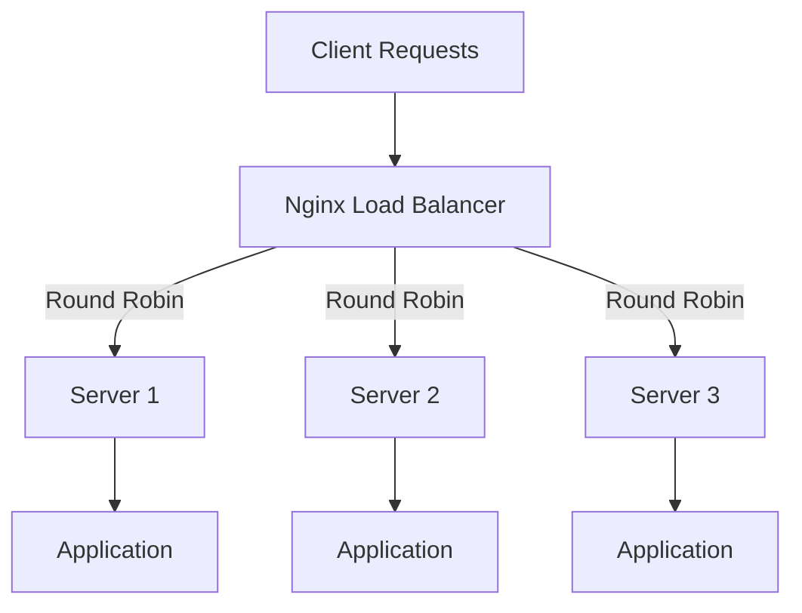

# How to Use Ansible to Set Up Load Balancing with Nginx

Author: [nawazdhandala](https://www.github.com/nawazdhandala)

Tags: Ansible, Nginx, Load Balancing, High Availability, DevOps

Description: Configure Nginx load balancing with Ansible including round-robin, least connections, IP hash, health checks, and sticky sessions.

---

When your application gets more traffic than a single server can handle, you need load balancing. Nginx is an excellent load balancer that distributes incoming requests across multiple backend servers. It supports several balancing algorithms, health checks, connection draining, and session persistence. Setting up load balancing with Ansible means you can add or remove backend servers by simply updating your inventory and rerunning the playbook.

This guide covers configuring Nginx as a load balancer with Ansible, including different balancing strategies, health checks, and SSL termination.

## Load Balancing Concepts

Before diving into the Ansible configuration, here is a quick overview of the balancing methods Nginx supports:



- **Round Robin** (default): Requests are distributed evenly across servers
- **Least Connections**: Sends requests to the server with the fewest active connections
- **IP Hash**: Routes requests from the same client IP to the same backend server
- **Weighted**: Servers with higher weights get more requests

## Project Structure

```
nginx-lb/
  inventory/
    production.yml
  group_vars/
    all.yml
  roles/
    nginx_lb/
      tasks/
        main.yml
      templates/
        load-balancer.conf.j2
        nginx.conf.j2
      handlers/
        main.yml
  playbook.yml
```

## Inventory

Define your load balancer and backend servers separately.

```yaml
# inventory/production.yml
all:
  children:
    load_balancers:
      hosts:
        lb1:
          ansible_host: 10.0.0.5
        lb2:
          ansible_host: 10.0.0.6
    backend_servers:
      hosts:
        app1:
          ansible_host: 10.0.1.10
          weight: 3
        app2:
          ansible_host: 10.0.1.11
          weight: 3
        app3:
          ansible_host: 10.0.1.12
          weight: 2
  vars:
    ansible_user: deploy
```

## Variables

```yaml
# group_vars/all.yml
lb_name: myapp
server_name: www.example.com
backend_port: 8080
lb_method: least_conn  # round_robin, least_conn, ip_hash
enable_ssl: false
health_check_path: /health
health_check_interval: 10
max_fails: 3
fail_timeout: 30
keepalive_connections: 32
```

## Role Tasks

```yaml
# roles/nginx_lb/tasks/main.yml
---
- name: Install Nginx
  apt:
    name: nginx
    state: present
    update_cache: yes

- name: Deploy custom Nginx main configuration
  template:
    src: nginx.conf.j2
    dest: /etc/nginx/nginx.conf
    mode: '0644'
  notify: reload nginx

- name: Deploy load balancer configuration
  template:
    src: load-balancer.conf.j2
    dest: /etc/nginx/sites-available/{{ lb_name }}-lb
    mode: '0644'
  notify: reload nginx

- name: Enable load balancer site
  file:
    src: /etc/nginx/sites-available/{{ lb_name }}-lb
    dest: /etc/nginx/sites-enabled/{{ lb_name }}-lb
    state: link
  notify: reload nginx

- name: Remove default Nginx site
  file:
    path: /etc/nginx/sites-enabled/default
    state: absent
  notify: reload nginx

- name: Test Nginx configuration
  command: nginx -t
  changed_when: false

- name: Ensure Nginx is running
  systemd:
    name: nginx
    enabled: yes
    state: started
```

## Nginx Main Configuration

Tune the main Nginx config for load balancing workloads.

```nginx
# roles/nginx_lb/templates/nginx.conf.j2
user www-data;
worker_processes auto;
pid /run/nginx.pid;
include /etc/nginx/modules-enabled/*.conf;

events {
    worker_connections 4096;
    multi_accept on;
    use epoll;
}

http {
    # Basic settings
    sendfile on;
    tcp_nopush on;
    tcp_nodelay on;
    keepalive_timeout 65;
    types_hash_max_size 2048;
    server_tokens off;

    include /etc/nginx/mime.types;
    default_type application/octet-stream;

    # Logging
    log_format lb_format '$remote_addr - $remote_user [$time_local] '
                         '"$request" $status $body_bytes_sent '
                         '"$http_referer" "$http_user_agent" '
                         'upstream=$upstream_addr '
                         'response_time=$upstream_response_time';

    access_log /var/log/nginx/access.log lb_format;
    error_log /var/log/nginx/error.log;

    # Gzip compression
    gzip on;
    gzip_vary on;
    gzip_proxied any;
    gzip_comp_level 6;
    gzip_types text/plain text/css application/json application/javascript text/xml;

    include /etc/nginx/conf.d/*.conf;
    include /etc/nginx/sites-enabled/*;
}
```

## Load Balancer Configuration

This is the core load balancing configuration.

```nginx
# roles/nginx_lb/templates/load-balancer.conf.j2
# Define the upstream backend pool
upstream {{ lb_name }}_backends {

    # Use least connections algorithm
    least_conn;

    # Use IP hash for session persistence
    ip_hash;

    # Note: round_robin is the default, no directive needed


    # Backend server: {{ host }}
    server {{ hostvars[host].ansible_host }}:{{ backend_port }} weight={{ hostvars[host].weight | default(1) }} max_fails={{ max_fails }} fail_timeout={{ fail_timeout }}s;


    # Keep connections alive to backend servers
    keepalive {{ keepalive_connections }};
}

server {
    listen 80;
    server_name {{ server_name }};

    # Custom log format that includes which backend handled the request
    access_log /var/log/nginx/{{ lb_name }}-lb.access.log lb_format;
    error_log /var/log/nginx/{{ lb_name }}-lb.error.log;

    # Proxy all requests to the backend pool
    location / {
        proxy_pass http://{{ lb_name }}_backends;
        proxy_http_version 1.1;
        proxy_set_header Connection "";
        proxy_set_header Host $host;
        proxy_set_header X-Real-IP $remote_addr;
        proxy_set_header X-Forwarded-For $proxy_add_x_forwarded_for;
        proxy_set_header X-Forwarded-Proto $scheme;

        # Timeouts
        proxy_connect_timeout 10s;
        proxy_read_timeout 60s;
        proxy_send_timeout 60s;

        # Retry on connection failures
        proxy_next_upstream error timeout http_502 http_503 http_504;
        proxy_next_upstream_tries 3;
    }

    # Load balancer health check endpoint
    location /lb-health {
        access_log off;
        return 200 "Load balancer is healthy\n";
        add_header Content-Type text/plain;
    }

    # Status page for monitoring (restrict access)
    location /nginx-status {
        stub_status on;
        allow 10.0.0.0/8;
        allow 127.0.0.1;
        deny all;
    }
}
```

## Handlers

```yaml
# roles/nginx_lb/handlers/main.yml
---
- name: reload nginx
  systemd:
    name: nginx
    state: reloaded

- name: restart nginx
  systemd:
    name: nginx
    state: restarted
```

## Main Playbook

```yaml
# playbook.yml
---
- name: Configure Nginx Load Balancer
  hosts: load_balancers
  become: yes
  roles:
    - nginx_lb
```

## Active Health Checks

Nginx open source uses passive health checks (marking servers down after failures). For active health checks, add a verification task in your playbook:

```yaml
# Verify all backends are reachable from the load balancer
- name: Check backend health endpoints
  uri:
    url: "http://{{ hostvars[item].ansible_host }}:{{ backend_port }}{{ health_check_path }}"
    status_code: 200
    timeout: 5
  loop: "{{ groups['backend_servers'] }}"
  register: health_results
  ignore_errors: yes

- name: Report unhealthy backends
  debug:
    msg: "WARNING: {{ item.item }} is not responding to health checks"
  loop: "{{ health_results.results }}"
  when: item.failed
```

## Dynamically Adding and Removing Servers

One of the biggest advantages of Ansible is how easy it is to scale. To add a new backend server:

1. Add it to your inventory file
2. Rerun the playbook

```yaml
# inventory/production.yml - Just add a new entry
backend_servers:
  hosts:
    app4:
      ansible_host: 10.0.1.13
      weight: 3
```

```bash
# Rerun to update the load balancer config
ansible-playbook -i inventory/production.yml playbook.yml
```

## Connection Draining

When removing a server for maintenance, set its weight to 0 first to stop new connections while existing ones complete:

```yaml
# Temporarily drain connections from a server
- name: Set server weight to zero for draining
  template:
    src: load-balancer.conf.j2
    dest: /etc/nginx/sites-available/{{ lb_name }}-lb
  vars:
    drain_server: app3
  notify: reload nginx
```

## Running the Playbook

```bash
# Set up load balancing
ansible-playbook -i inventory/production.yml playbook.yml

# Change the balancing method
ansible-playbook -i inventory/production.yml playbook.yml -e "lb_method=ip_hash"
```

## Monitoring Load Distribution

Check how traffic is distributed across your backends:

```bash
# View which backends are handling requests
tail -f /var/log/nginx/myapp-lb.access.log | awk '{print $NF}'
```

## Wrapping Up

Nginx load balancing with Ansible gives you a flexible, easy-to-manage traffic distribution layer. The inventory-driven approach means adding or removing backend servers is a matter of editing a YAML file and running the playbook. Whether you need round-robin for simplicity, least connections for uneven workloads, or IP hash for session persistence, the configuration is straightforward. Combined with Nginx's built-in failure detection and retry logic, you get a reliable load balancing setup with minimal complexity.
