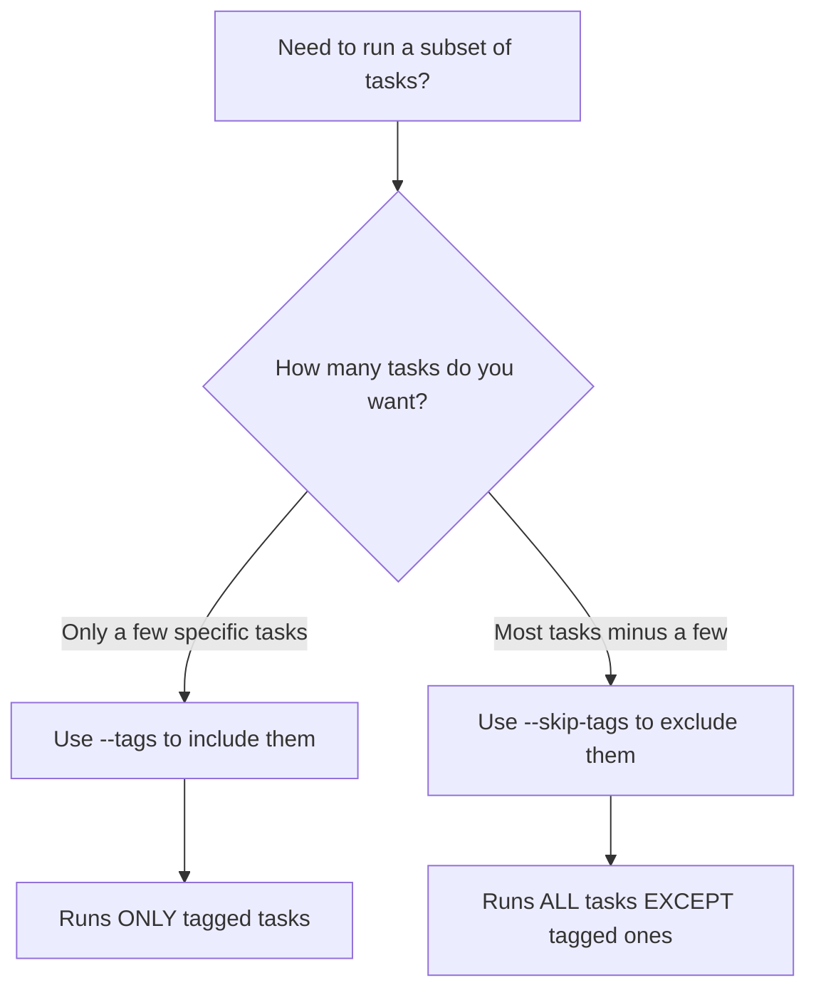

# How to Skip Tags When Running Ansible Playbooks

Author: [nawazdhandala](https://www.github.com/nawazdhandala)

Tags: Ansible, Tags, Playbook, Task Management

Description: Learn how to use Ansible skip-tags to exclude specific tasks from playbook runs, with practical examples for selective execution.

---

Ansible tags let you label tasks so you can run specific subsets of a playbook. But what about the opposite? Sometimes you want to run everything except certain tasks. That is where `--skip-tags` comes in. It is the inverse of `--tags` and is incredibly useful when you want to run a full playbook while skipping expensive, slow, or disruptive tasks.

## How Tags Work (Quick Recap)

Before diving into skipping, let us set up a tagged playbook to work with.

```yaml
# full-setup.yml - a fully tagged playbook for server configuration
---
- name: Full server setup
  hosts: webservers
  become: yes

  tasks:
    - name: Update package cache
      apt:
        update_cache: yes
        cache_valid_time: 3600
      tags:
        - packages
        - update

    - name: Install base packages
      apt:
        name:
          - vim
          - htop
          - curl
          - wget
        state: present
      tags:
        - packages

    - name: Install nginx
      apt:
        name: nginx
        state: present
      tags:
        - packages
        - nginx

    - name: Deploy nginx configuration
      template:
        src: templates/nginx.conf.j2
        dest: /etc/nginx/nginx.conf
      notify: Restart nginx
      tags:
        - nginx
        - config

    - name: Deploy SSL certificates
      copy:
        src: "files/ssl/{{ inventory_hostname }}/"
        dest: /etc/ssl/private/
        mode: '0600'
      tags:
        - ssl
        - security

    - name: Configure firewall rules
      ufw:
        rule: allow
        port: "{{ item }}"
        proto: tcp
      loop:
        - "22"
        - "80"
        - "443"
      tags:
        - firewall
        - security

    - name: Run database migrations
      command: /opt/myapp/migrate.sh
      tags:
        - database
        - migrations

  handlers:
    - name: Restart nginx
      service:
        name: nginx
        state: restarted
```

## Using --skip-tags

The `--skip-tags` flag tells Ansible to run everything except the tagged tasks you specify.

```bash
# Run everything except database migrations
ansible-playbook -i inventory.ini full-setup.yml --skip-tags database
```

This runs all tasks in the playbook but skips the "Run database migrations" task because it has the `database` tag.

## Skipping Multiple Tags

You can skip multiple tags by separating them with commas.

```bash
# Skip both database migrations and SSL certificate deployment
ansible-playbook -i inventory.ini full-setup.yml --skip-tags "database,ssl"
```

Or use multiple `--skip-tags` flags.

```bash
# Same result, different syntax
ansible-playbook -i inventory.ini full-setup.yml --skip-tags database --skip-tags ssl
```

## Skip-Tags vs Tags: When to Use Which

The decision between `--tags` and `--skip-tags` depends on what you want to accomplish.



Use `--tags` when you want to run a small, specific subset. Use `--skip-tags` when you want to run the full playbook but exclude a few things.

## Practical Scenarios

### Skipping Slow Tasks During Development

When developing and testing a playbook, you might want to skip time-consuming tasks that are not relevant to what you are testing.

```bash
# Skip package installation and SSL setup during development
ansible-playbook -i dev-inventory.ini full-setup.yml --skip-tags "packages,ssl"
```

### Skipping Destructive Tasks in Maintenance Windows

During a maintenance window, you might want to apply configuration changes but skip tasks that would cause service interruption.

```yaml
# maintenance.yml - tagged for selective execution
---
- name: Maintenance tasks
  hosts: all
  become: yes

  tasks:
    - name: Update configuration files
      template:
        src: "templates/{{ item.src }}"
        dest: "{{ item.dest }}"
      loop:
        - { src: app.conf.j2, dest: /etc/myapp/app.conf }
        - { src: logging.conf.j2, dest: /etc/myapp/logging.conf }
      tags:
        - config

    - name: Restart application service
      service:
        name: myapp
        state: restarted
      tags:
        - restart
        - disruptive

    - name: Run health check
      uri:
        url: "http://{{ inventory_hostname }}:8080/health"
        return_content: yes
      register: health
      tags:
        - healthcheck

    - name: Clear application cache
      command: /opt/myapp/clear-cache.sh
      tags:
        - cache
        - disruptive
```

```bash
# Apply config changes without restarting services or clearing cache
ansible-playbook -i production.ini maintenance.yml --skip-tags disruptive
```

### Separating Infrastructure and Application Concerns

Tag your playbook to separate infrastructure setup from application deployment, then skip accordingly.

```bash
# Run only infrastructure tasks (skip app-specific stuff)
ansible-playbook -i inventory.ini site.yml --skip-tags "application,deploy"

# Run only application tasks (skip infrastructure changes)
ansible-playbook -i inventory.ini site.yml --skip-tags "infrastructure,security"
```

## How Skip-Tags Interacts with Tag Inheritance

Tags propagate from plays to blocks to tasks. Understanding this inheritance is important when using skip-tags.

```yaml
# inheritance-example.yml - shows how tags inherit
---
- name: Setup with tag inheritance
  hosts: webservers
  become: yes
  tags:
    - websetup

  tasks:
    - name: Install nginx
      apt:
        name: nginx
        state: present
      tags:
        - packages

    - name: Configure nginx
      template:
        src: templates/nginx.conf.j2
        dest: /etc/nginx/nginx.conf
      tags:
        - config
```

In this example, both tasks inherit the `websetup` tag from the play level. The first task effectively has tags `[websetup, packages]` and the second has `[websetup, config]`.

```bash
# This skips BOTH tasks because both inherit the 'websetup' tag
ansible-playbook -i inventory.ini inheritance-example.yml --skip-tags websetup

# This skips only the package installation
ansible-playbook -i inventory.ini inheritance-example.yml --skip-tags packages
```

## Combining --tags and --skip-tags

You can use both flags together. Ansible first selects tasks matching `--tags`, then removes tasks matching `--skip-tags`.

```bash
# Run all security tasks except firewall changes
ansible-playbook -i inventory.ini full-setup.yml --tags security --skip-tags firewall
```

This runs the "Deploy SSL certificates" task (tagged `security` and `ssl`) but skips "Configure firewall rules" (tagged `security` and `firewall`).

## Verifying What Gets Skipped

Before running with skip-tags, verify which tasks would execute using `--list-tasks`.

```bash
# List tasks that would run after skipping database and ssl tags
ansible-playbook -i inventory.ini full-setup.yml --skip-tags "database,ssl" --list-tasks
```

Output:

```
playbook: full-setup.yml

  play #1 (webservers): Full server setup    TAGS: []
    tasks:
      Update package cache      TAGS: [packages, update]
      Install base packages     TAGS: [packages]
      Install nginx             TAGS: [nginx, packages]
      Deploy nginx config       TAGS: [config, nginx]
      Configure firewall rules  TAGS: [firewall, security]
```

Notice that "Deploy SSL certificates" and "Run database migrations" are absent from the list.

## Tagging Strategy for Effective Skipping

Design your tagging strategy with skip-tags in mind. Use consistent categories that make exclusion intuitive.

```yaml
# Good tagging categories for skip-tags usage
# Functional: packages, config, deploy, migrate, test
# Risk level: safe, disruptive, destructive
# Component: nginx, database, redis, application
# Phase: setup, configure, validate, cleanup

- name: Example of multi-dimensional tagging
  apt:
    name: nginx
    state: present
  tags:
    - packages      # functional category
    - safe          # risk level
    - nginx         # component
    - setup         # phase
```

With this kind of tagging, you can skip by any dimension:

```bash
# Skip all disruptive tasks
ansible-playbook site.yml --skip-tags disruptive

# Skip all database-related tasks
ansible-playbook site.yml --skip-tags database

# Skip cleanup phase
ansible-playbook site.yml --skip-tags cleanup
```

A well-thought-out tagging strategy makes skip-tags a powerful tool for controlling playbook execution in different contexts, whether you are running in development, staging, or production environments.
