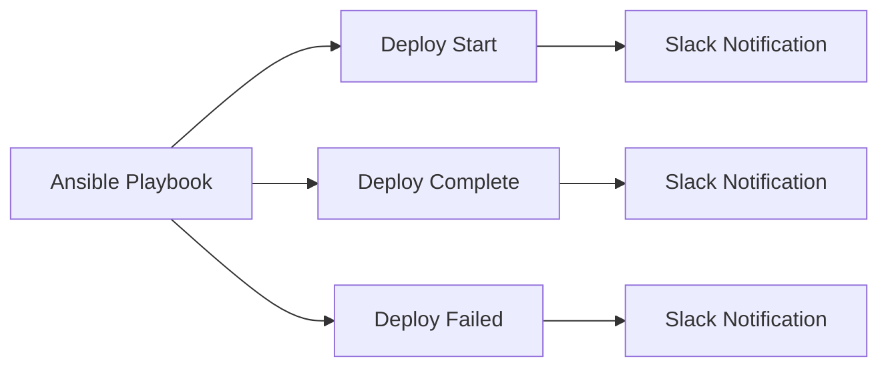

# How to Use Ansible with Slack for Notifications

Author: [nawazdhandala](https://www.github.com/nawazdhandala)

Tags: Ansible, Slack, Notifications, DevOps

Description: Send deployment notifications, alerts, and status updates to Slack channels from Ansible playbooks using webhooks and the Slack module.

---

Keeping your team informed about infrastructure changes is critical. Ansible can send messages to Slack channels at key points during playbook execution, providing real-time visibility into deployments, configuration changes, and automated operations.

## Slack Integration



## Using the Slack Module

```yaml
# tasks/slack-notify.yml
---
- name: Send deployment notification to Slack
  community.general.slack:
    token: "{{ slack_webhook_token }}"
    channel: "#deployments"
    username: "Ansible Deploy Bot"
    msg: |
      *Deployment Update*
      App: {{ app_name }}
      Version: {{ app_version }}
      Environment: {{ environment_name }}
      Status: {{ deploy_status }}
      Server: {{ inventory_hostname }}
    color: "{{ 'good' if deploy_status == 'success' else 'danger' }}"
  delegate_to: localhost
```

## Using Webhooks

```yaml
# tasks/slack-webhook.yml
---
- name: Send rich Slack notification via webhook
  ansible.builtin.uri:
    url: "{{ slack_webhook_url }}"
    method: POST
    body_format: json
    body:
      channel: "#deployments"
      username: "Ansible"
      attachments:
        - color: "{{ '#36a64f' if success else '#ff0000' }}"
          title: "{{ app_name }} Deployment"
          fields:
            - title: Version
              value: "{{ app_version }}"
              short: true
            - title: Environment
              value: "{{ environment_name }}"
              short: true
            - title: Status
              value: "{{ 'Success' if success else 'Failed' }}"
              short: true
            - title: Duration
              value: "{{ deploy_duration }}s"
              short: true
```

## Callback Plugin for Auto-Notifications

```ini
# ansible.cfg
[defaults]
callback_whitelist = community.general.slack
```

```yaml
# Configure Slack callback
# group_vars/all/slack.yml
slack_webhook_url: https://hooks.slack.com/services/XXX/YYY/ZZZ
slack_channel: "#ansible-runs"
```

## Deployment Playbook with Notifications

```yaml
# playbooks/deploy-with-slack.yml
---
- name: Deploy with Slack notifications
  hosts: app_servers
  become: true

  pre_tasks:
    - name: Notify deployment start
      community.general.slack:
        token: "{{ slack_token }}"
        channel: "#deployments"
        msg: "Starting deployment of {{ app_name }} {{ app_version }} to {{ environment_name }}"
      delegate_to: localhost
      run_once: true

  tasks:
    - name: Deploy application
      block:
        - name: Run deployment
          ansible.builtin.include_role:
            name: app_deploy

        - name: Notify success
          community.general.slack:
            token: "{{ slack_token }}"
            channel: "#deployments"
            msg: "{{ app_name }} {{ app_version }} deployed successfully to {{ inventory_hostname }}"
            color: good
          delegate_to: localhost

      rescue:
        - name: Notify failure
          community.general.slack:
            token: "{{ slack_token }}"
            channel: "#deployments"
            msg: "FAILED: {{ app_name }} deployment to {{ inventory_hostname }}: {{ ansible_failed_result.msg | default('unknown error') }}"
            color: danger
          delegate_to: localhost
```

## Key Takeaways

Slack notifications from Ansible keep your team informed about infrastructure changes in real time. Use the community.general.slack module for simple messages and webhooks for rich formatting. Send notifications at deployment start, on each server completion, and on failures. Use block/rescue to ensure failure notifications are always sent even when tasks fail.

## Common Use Cases

Here are several practical scenarios where this module proves essential in real-world playbooks.

### Infrastructure Provisioning Workflow

```yaml
# Complete workflow incorporating this module
- name: Infrastructure provisioning
  hosts: all
  become: true
  gather_facts: true
  tasks:
    - name: Gather system information
      ansible.builtin.setup:
        gather_subset:
          - hardware
          - network

    - name: Display system summary
      ansible.builtin.debug:
        msg: >-
          Host {{ inventory_hostname }} has
          {{ ansible_memtotal_mb }}MB RAM,
          {{ ansible_processor_vcpus }} vCPUs,
          running {{ ansible_distribution }} {{ ansible_distribution_version }}

    - name: Install required packages
      ansible.builtin.package:
        name:
          - curl
          - wget
          - git
          - vim
          - htop
          - jq
        state: present

    - name: Configure system timezone
      ansible.builtin.timezone:
        name: "{{ system_timezone | default('UTC') }}"

    - name: Configure hostname
      ansible.builtin.hostname:
        name: "{{ inventory_hostname }}"

    - name: Update /etc/hosts
      ansible.builtin.lineinfile:
        path: /etc/hosts
        regexp: '^127\.0\.1\.1'
        line: "127.0.1.1 {{ inventory_hostname }}"

    - name: Configure SSH hardening
      ansible.builtin.lineinfile:
        path: /etc/ssh/sshd_config
        regexp: "{{ item.regexp }}"
        line: "{{ item.line }}"
      loop:
        - { regexp: '^PermitRootLogin', line: 'PermitRootLogin no' }
        - { regexp: '^PasswordAuthentication', line: 'PasswordAuthentication no' }
      notify: restart sshd

    - name: Configure firewall rules
      community.general.ufw:
        rule: allow
        port: "{{ item }}"
        proto: tcp
      loop:
        - "22"
        - "80"
        - "443"

    - name: Enable firewall
      community.general.ufw:
        state: enabled
        policy: deny

  handlers:
    - name: restart sshd
      ansible.builtin.service:
        name: sshd
        state: restarted
```

### Integration with Monitoring

```yaml
# Using gathered facts to configure monitoring thresholds
- name: Configure monitoring based on system specs
  hosts: all
  become: true
  tasks:
    - name: Set monitoring thresholds based on hardware
      ansible.builtin.template:
        src: monitoring_config.yml.j2
        dest: /etc/monitoring/config.yml
      vars:
        memory_warning_threshold: "{{ (ansible_memtotal_mb * 0.8) | int }}"
        memory_critical_threshold: "{{ (ansible_memtotal_mb * 0.95) | int }}"
        cpu_warning_threshold: 80
        cpu_critical_threshold: 95

    - name: Register host with monitoring system
      ansible.builtin.uri:
        url: "https://monitoring.example.com/api/hosts"
        method: POST
        body_format: json
        body:
          hostname: "{{ inventory_hostname }}"
          ip_address: "{{ ansible_default_ipv4.address }}"
          os: "{{ ansible_distribution }}"
          memory_mb: "{{ ansible_memtotal_mb }}"
          cpus: "{{ ansible_processor_vcpus }}"
        headers:
          Authorization: "Bearer {{ monitoring_api_token }}"
        status_code: [200, 201, 409]
```

### Error Handling Patterns

```yaml
# Robust error handling with this module
- name: Robust task execution
  hosts: all
  tasks:
    - name: Attempt primary operation
      ansible.builtin.command: /opt/app/primary-task.sh
      register: primary_result
      failed_when: false

    - name: Handle primary failure with fallback
      ansible.builtin.command: /opt/app/fallback-task.sh
      when: primary_result.rc != 0
      register: fallback_result

    - name: Report final status
      ansible.builtin.debug:
        msg: >-
          Task completed via {{ 'primary' if primary_result.rc == 0 else 'fallback' }} path.
          Return code: {{ primary_result.rc if primary_result.rc == 0 else fallback_result.rc }}

    - name: Fail if both paths failed
      ansible.builtin.fail:
        msg: "Both primary and fallback operations failed"
      when:
        - primary_result.rc != 0
        - fallback_result is defined
        - fallback_result.rc != 0
```

### Scheduling and Automation

```yaml
# Set up scheduled compliance scans using cron
- name: Configure automated scans
  hosts: all
  become: true
  tasks:
    - name: Create scan script
      ansible.builtin.copy:
        dest: /opt/scripts/compliance_scan.sh
        mode: '0755'
        content: |
          #!/bin/bash
          cd /opt/ansible
          ansible-playbook playbooks/validate.yml -i inventory/ > /var/log/compliance_scan.log 2>&1
          EXIT_CODE=$?
          if [ $EXIT_CODE -ne 0 ]; then
            curl -X POST https://hooks.example.com/alert \
              -H "Content-Type: application/json" \
              -d "{\"text\":\"Compliance scan failed on $(hostname)\"}"
          fi
          exit $EXIT_CODE

    - name: Schedule weekly compliance scan
      ansible.builtin.cron:
        name: "Weekly compliance scan"
        minute: "0"
        hour: "3"
        weekday: "1"
        job: "/opt/scripts/compliance_scan.sh"
        user: ansible
```

