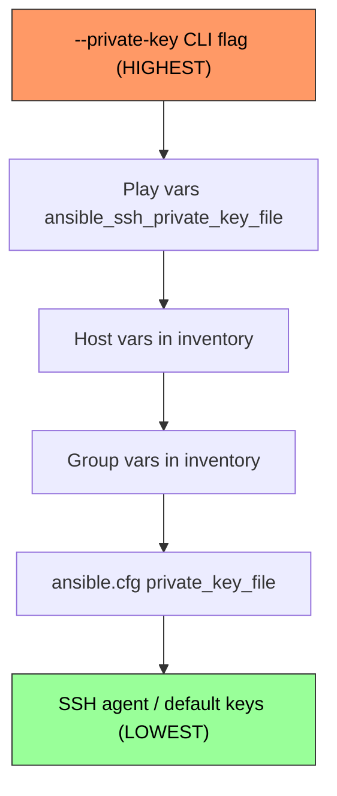

# How to Specify SSH Private Key in an Ansible Playbook

Author: [nawazdhandala](https://www.github.com/nawazdhandala)

Tags: Ansible, SSH, Private Key, Authentication, Security

Description: Learn how to configure SSH private key authentication in Ansible at the command line, inventory, playbook, and configuration levels.

---

Ansible relies on SSH for connecting to remote hosts, and SSH key-based authentication is the standard approach. By default, Ansible uses whatever keys your SSH agent provides or the default keys in `~/.ssh/`. But in many environments, you need to specify a particular private key. Maybe you have different keys for different environments, or a shared service account key stored in a specific location. This guide covers every way to configure the SSH private key in Ansible.

## Command Line: --private-key

The quickest way to specify a key for a single run is the `--private-key` flag (or `--key-file`).

```bash
# Specify the SSH private key on the command line
ansible-playbook -i inventory.ini site.yml --private-key ~/.ssh/deploy_key

# Alternative syntax
ansible-playbook -i inventory.ini site.yml --key-file /path/to/mykey.pem
```

This overrides all other key settings for this particular invocation.

## In ansible.cfg

For a project-wide default, set the private key in your Ansible configuration file.

```ini
# ansible.cfg - sets the default SSH private key for all connections
[defaults]
private_key_file = ~/.ssh/ansible_deploy_key

# You can also use an absolute path
# private_key_file = /opt/ansible/keys/deploy_key
```

This applies to every playbook run from the directory containing this `ansible.cfg`, unless overridden at a more specific level.

## In the Inventory File

When different hosts or groups need different keys, configure the key in the inventory.

```ini
# inventory.ini - per-host and per-group SSH key configuration
[webservers]
web01 ansible_host=192.168.1.10 ansible_ssh_private_key_file=~/.ssh/web_deploy_key
web02 ansible_host=192.168.1.11 ansible_ssh_private_key_file=~/.ssh/web_deploy_key
web03 ansible_host=192.168.1.12

[dbservers]
db01 ansible_host=192.168.1.20 ansible_ssh_private_key_file=~/.ssh/db_admin_key

[aws_instances]
app01 ansible_host=ec2-54-123-45-67.compute-1.amazonaws.com

[webservers:vars]
ansible_ssh_private_key_file=~/.ssh/web_deploy_key

[aws_instances:vars]
ansible_ssh_private_key_file=~/.ssh/aws-keypair.pem
ansible_user=ec2-user
```

In YAML inventory format:

```yaml
# inventory.yml - SSH keys in YAML inventory
---
all:
  children:
    webservers:
      vars:
        ansible_ssh_private_key_file: ~/.ssh/web_deploy_key
      hosts:
        web01:
          ansible_host: 192.168.1.10
        web02:
          ansible_host: 192.168.1.11
    aws_instances:
      vars:
        ansible_ssh_private_key_file: ~/.ssh/aws-keypair.pem
        ansible_user: ec2-user
      hosts:
        app01:
          ansible_host: ec2-54-123-45-67.compute-1.amazonaws.com
```

## In Group Variables

For cleaner organization, put the key configuration in group_vars files.

```yaml
# group_vars/aws_instances.yml - SSH config for AWS hosts
---
ansible_ssh_private_key_file: ~/.ssh/aws-keypair.pem
ansible_user: ec2-user
ansible_ssh_common_args: "-o StrictHostKeyChecking=no"
```

```yaml
# group_vars/on_prem.yml - SSH config for on-premises hosts
---
ansible_ssh_private_key_file: ~/.ssh/datacenter_key
ansible_user: deploy
```

## In the Playbook

You can set the SSH key at the play level using `vars`.

```yaml
# playbook-level-key.yml - specifies SSH key in the playbook
---
- name: Configure AWS instances
  hosts: aws_instances
  vars:
    ansible_ssh_private_key_file: "~/.ssh/aws-keypair.pem"

  tasks:
    - name: Check connectivity
      ping:

    - name: Install packages
      yum:
        name:
          - httpd
          - git
        state: present
      become: yes
```

## Precedence of Key Configuration

When the SSH key is specified in multiple places, Ansible follows this precedence order.



## Managing Multiple Keys for Multiple Environments

In real-world infrastructure, you often have different keys for different environments or cloud providers.

```
~/.ssh/
  production_key          # Production servers
  staging_key             # Staging servers
  aws-us-east-1.pem      # AWS US East
  aws-eu-west-1.pem      # AWS EU West
  gcp-project-key         # GCP instances
  on-prem-datacenter      # On-premises data center
```

Structure your inventory to map each group to its key.

```yaml
# environments/production/group_vars/all.yml
---
ansible_ssh_private_key_file: ~/.ssh/production_key

# environments/staging/group_vars/all.yml
---
ansible_ssh_private_key_file: ~/.ssh/staging_key

# environments/aws-us-east/group_vars/all.yml
---
ansible_ssh_private_key_file: ~/.ssh/aws-us-east-1.pem
```

```bash
# Deploy to production (uses production key)
ansible-playbook -i environments/production/inventory.ini deploy.yml

# Deploy to staging (uses staging key)
ansible-playbook -i environments/staging/inventory.ini deploy.yml
```

## Using SSH Agent Instead

If you prefer using the SSH agent, add your keys there and Ansible will use them automatically.

```bash
# Start the SSH agent if not already running
eval $(ssh-agent -s)

# Add your keys
ssh-add ~/.ssh/production_key
ssh-add ~/.ssh/aws-keypair.pem

# Now Ansible will try all loaded keys
ansible-playbook -i inventory.ini site.yml
```

The SSH agent approach is convenient for interactive use but less suitable for automated pipelines where you want explicit key selection.

## Setting Correct File Permissions

SSH is strict about private key file permissions. If your key file has incorrect permissions, SSH will refuse to use it.

```bash
# Set the correct permissions for a private key
chmod 600 ~/.ssh/deploy_key

# For .pem files from cloud providers
chmod 400 ~/.ssh/aws-keypair.pem
```

If permissions are wrong, you will see an error like:

```
@@@@@@@@@@@@@@@@@@@@@@@@@@@@@@@@@@@@@@@@@@@@@@@@@@@@@@@@@@@
@         WARNING: UNPROTECTED PRIVATE KEY FILE!          @
@@@@@@@@@@@@@@@@@@@@@@@@@@@@@@@@@@@@@@@@@@@@@@@@@@@@@@@@@@@
Permissions 0644 for '/home/deploy/.ssh/aws-keypair.pem' are too open.
```

## Using Vault-Encrypted Keys

For maximum security, you can store SSH private keys encrypted with Ansible Vault.

```bash
# Encrypt the SSH key with Ansible Vault
ansible-vault encrypt ~/.ssh/deploy_key --output files/deploy_key.vault
```

Then decrypt it at runtime in your playbook.

```yaml
# vault-key.yml - uses a vault-encrypted SSH key
---
- name: Deploy using vault-encrypted key
  hosts: localhost
  gather_facts: no

  tasks:
    - name: Decrypt SSH key to temporary file
      copy:
        src: files/deploy_key.vault
        dest: /tmp/deploy_key
        mode: '0600'

- name: Configure remote servers
  hosts: webservers
  vars:
    ansible_ssh_private_key_file: /tmp/deploy_key

  tasks:
    - name: Deploy application
      synchronize:
        src: /opt/releases/current/
        dest: /var/www/myapp/

- name: Clean up temporary key
  hosts: localhost
  gather_facts: no

  tasks:
    - name: Remove temporary key file
      file:
        path: /tmp/deploy_key
        state: absent
```

## Additional SSH Options

You can pass extra SSH options alongside the key configuration.

```yaml
# group_vars/all.yml - comprehensive SSH configuration
---
ansible_ssh_private_key_file: ~/.ssh/deploy_key
ansible_ssh_common_args: >-
  -o StrictHostKeyChecking=accept-new
  -o UserKnownHostsFile=/dev/null
  -o ServerAliveInterval=30
  -o ServerAliveCountMax=3
  -o ConnectTimeout=10
```

Or configure SSH multiplexing for faster connections.

```ini
# ansible.cfg - SSH connection optimization
[ssh_connection]
ssh_args = -C -o ControlMaster=auto -o ControlPersist=60s
pipelining = True
```

## Troubleshooting Key Issues

When SSH key authentication fails, run Ansible with verbose mode to see the connection details.

```bash
# Debug SSH connection issues
ansible-playbook -i inventory.ini site.yml -vvvv
```

Look for lines like:

```
<192.168.1.10> SSH: EXEC ssh -C -o ControlMaster=auto -o ControlPersist=60s
  -i /home/deploy/.ssh/web_deploy_key
  -o KbdInteractiveAuthentication=no
  -o PreferredAuthentications=publickey
  192.168.1.10 ...
```

This tells you exactly which key Ansible is using and what SSH options it is passing. Verify that the key file exists, has correct permissions, and that the corresponding public key is in the remote user's `~/.ssh/authorized_keys`.

Properly configuring SSH keys is one of the first things you do when setting up Ansible for a new environment. Get it right in your inventory or group vars, and your playbooks will work seamlessly across all your hosts without needing to specify keys repeatedly.
