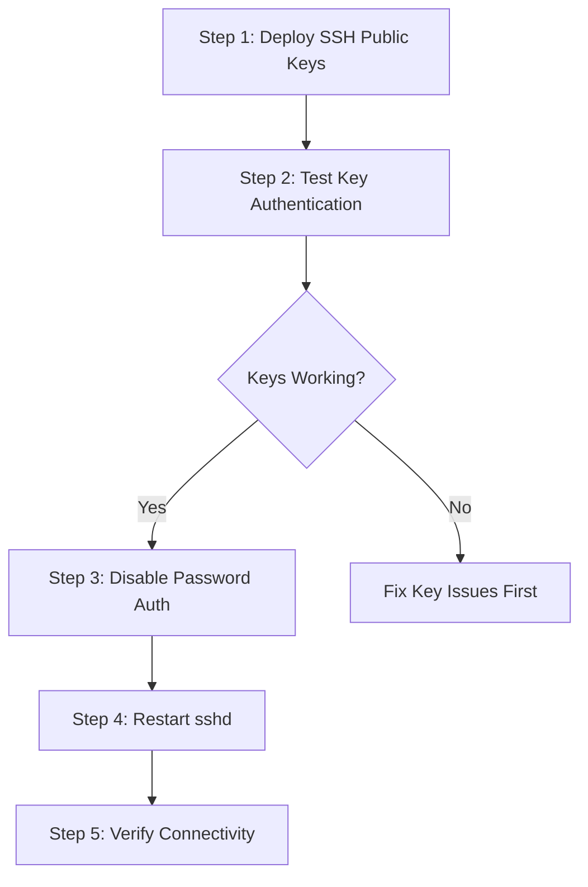

# How to Use Ansible to Configure SSH Key-Only Authentication

Author: [nawazdhandala](https://www.github.com/nawazdhandala)

Tags: Ansible, SSH, Security, Authentication, Linux

Description: Automate SSH key-only authentication setup across your servers using Ansible to eliminate password-based SSH access securely.

---

Password-based SSH authentication is one of the most common attack vectors for Linux servers. Brute force bots hit SSH ports constantly, and even strong passwords can be compromised through phishing or credential stuffing. Switching to SSH key-only authentication eliminates this entire class of attacks. The challenge is deploying this change across many servers without locking yourself out.

Ansible is the perfect tool for this job because it lets you deploy SSH keys, configure sshd, and test connectivity in a controlled sequence. In this guide, I will walk through the full process: distributing SSH public keys, hardening the sshd configuration, disabling password authentication, and verifying that key-based access works before cutting over.

## The Rollout Strategy

The order of operations matters here. If you disable password authentication before deploying keys, you will lock yourself out. Here is the safe sequence.



## Variables

```yaml
# group_vars/all.yml
# SSH users and their public keys
ssh_users:
  - username: deploy
    state: present
    groups: ["sudo", "sshusers"]
    shell: /bin/bash
    ssh_keys:
      - "ssh-ed25519 AAAAC3NzaC1lZDI1NTE5AAAAI... deploy@workstation"
      - "ssh-ed25519 AAAAC3NzaC1lZDI1NTE5AAAAI... deploy@laptop"

  - username: admin
    state: present
    groups: ["sudo", "sshusers"]
    shell: /bin/bash
    ssh_keys:
      - "ssh-ed25519 AAAAC3NzaC1lZDI1NTE5AAAAI... admin@workstation"

  - username: ci-runner
    state: present
    groups: ["sshusers"]
    shell: /bin/bash
    ssh_keys:
      - "ssh-ed25519 AAAAC3NzaC1lZDI1NTE5AAAAI... ci@jenkins"

# SSH hardening settings
ssh_port: 22
ssh_permit_root_login: "no"
ssh_password_authentication: "no"
ssh_challenge_response_authentication: "no"
ssh_pubkey_authentication: "yes"
ssh_max_auth_tries: 3
ssh_client_alive_interval: 300
ssh_client_alive_count_max: 2
ssh_allow_groups: "sshusers"
ssh_x11_forwarding: "no"
ssh_use_pam: "yes"
ssh_allow_agent_forwarding: "no"
ssh_allow_tcp_forwarding: "no"

# Safety settings
ssh_test_before_disable_password: true
```

## SSH Key Deployment Role

```yaml
# roles/ssh-keys/tasks/main.yml
---
- name: Ensure sshusers group exists
  ansible.builtin.group:
    name: sshusers
    state: present

- name: Create SSH users
  ansible.builtin.user:
    name: "{{ item.username }}"
    state: "{{ item.state }}"
    groups: "{{ item.groups }}"
    shell: "{{ item.shell | default('/bin/bash') }}"
    create_home: yes
    append: yes
  loop: "{{ ssh_users }}"
  when: item.state == 'present'

- name: Create .ssh directory for each user
  ansible.builtin.file:
    path: "/home/{{ item.username }}/.ssh"
    state: directory
    owner: "{{ item.username }}"
    group: "{{ item.username }}"
    mode: '0700'
  loop: "{{ ssh_users }}"
  when: item.state == 'present'

- name: Deploy authorized_keys for each user
  ansible.builtin.template:
    src: authorized_keys.j2
    dest: "/home/{{ item.username }}/.ssh/authorized_keys"
    owner: "{{ item.username }}"
    group: "{{ item.username }}"
    mode: '0600'
  loop: "{{ ssh_users }}"
  when: item.state == 'present'

- name: Remove users marked for removal
  ansible.builtin.user:
    name: "{{ item.username }}"
    state: absent
    remove: yes
  loop: "{{ ssh_users }}"
  when: item.state == 'absent'
```

The authorized_keys template supports multiple keys per user.

```jinja2
# roles/ssh-keys/templates/authorized_keys.j2
# Managed by Ansible - manual changes will be overwritten

{{ key }}

```

## SSH Hardening Role

This role configures sshd to enforce key-only authentication and applies security best practices.

```yaml
# roles/ssh-hardening/tasks/main.yml
---
# Phase 1: Deploy the new sshd configuration
- name: Backup existing sshd_config
  ansible.builtin.copy:
    src: /etc/ssh/sshd_config
    dest: /etc/ssh/sshd_config.backup
    remote_src: yes
    mode: '0600'

- name: Deploy hardened sshd configuration
  ansible.builtin.template:
    src: sshd_config.j2
    dest: /etc/ssh/sshd_config
    owner: root
    group: root
    mode: '0600'
    validate: '/usr/sbin/sshd -t -f %s'
  notify: Restart sshd

# Phase 2: Test key authentication before fully applying
- name: Test SSH key authentication
  ansible.builtin.command:
    cmd: "ssh -o PasswordAuthentication=no -o BatchMode=yes -o ConnectTimeout=5 -p {{ ssh_port }} {{ ansible_user }}@localhost echo 'key_auth_works'"
  register: key_test
  changed_when: false
  ignore_errors: yes
  when: ssh_test_before_disable_password | bool

- name: Verify key authentication works
  ansible.builtin.assert:
    that:
      - key_test.rc == 0
    fail_msg: >
      SSH key authentication test failed. Password authentication will NOT be disabled
      to prevent lockout. Fix the SSH key configuration and run again.
    success_msg: "SSH key authentication verified successfully."
  when: ssh_test_before_disable_password | bool

# Phase 3: Set correct permissions on SSH directories
- name: Set secure permissions on /etc/ssh
  ansible.builtin.file:
    path: /etc/ssh
    owner: root
    group: root
    mode: '0755'

- name: Set permissions on SSH host private keys
  ansible.builtin.file:
    path: "{{ item }}"
    owner: root
    group: root
    mode: '0600'
  loop:
    - /etc/ssh/ssh_host_rsa_key
    - /etc/ssh/ssh_host_ecdsa_key
    - /etc/ssh/ssh_host_ed25519_key
  ignore_errors: yes

- name: Set permissions on SSH host public keys
  ansible.builtin.file:
    path: "{{ item }}"
    owner: root
    group: root
    mode: '0644'
  loop:
    - /etc/ssh/ssh_host_rsa_key.pub
    - /etc/ssh/ssh_host_ecdsa_key.pub
    - /etc/ssh/ssh_host_ed25519_key.pub
  ignore_errors: yes
```

## Hardened sshd Configuration

```jinja2
# roles/ssh-hardening/templates/sshd_config.j2
# SSH Server Configuration - Managed by Ansible
# Based on CIS Benchmark recommendations

# Basic settings
Port {{ ssh_port }}
Protocol 2
AddressFamily inet

# Host keys
HostKey /etc/ssh/ssh_host_ed25519_key
HostKey /etc/ssh/ssh_host_rsa_key
HostKey /etc/ssh/ssh_host_ecdsa_key

# Authentication
PubkeyAuthentication {{ ssh_pubkey_authentication }}
PasswordAuthentication {{ ssh_password_authentication }}
ChallengeResponseAuthentication {{ ssh_challenge_response_authentication }}
PermitRootLogin {{ ssh_permit_root_login }}
PermitEmptyPasswords no
MaxAuthTries {{ ssh_max_auth_tries }}
MaxSessions 10
AuthenticationMethods publickey

# Key exchange and ciphers (strong algorithms only)
KexAlgorithms curve25519-sha256,curve25519-sha256@libssh.org,diffie-hellman-group16-sha512,diffie-hellman-group18-sha512
Ciphers chacha20-poly1305@openssh.com,aes256-gcm@openssh.com,aes128-gcm@openssh.com,aes256-ctr,aes192-ctr,aes128-ctr
MACs hmac-sha2-512-etm@openssh.com,hmac-sha2-256-etm@openssh.com,hmac-sha2-512,hmac-sha2-256

# Access control

AllowGroups {{ ssh_allow_groups }}


# Session settings
ClientAliveInterval {{ ssh_client_alive_interval }}
ClientAliveCountMax {{ ssh_client_alive_count_max }}
LoginGraceTime 60

# Forwarding
X11Forwarding {{ ssh_x11_forwarding }}
AllowAgentForwarding {{ ssh_allow_agent_forwarding }}
AllowTcpForwarding {{ ssh_allow_tcp_forwarding }}

# Logging
SyslogFacility AUTH
LogLevel VERBOSE

# PAM
UsePAM {{ ssh_use_pam }}

# Misc
PrintMotd no
PrintLastLog yes
TCPKeepAlive yes
Compression no
UseDNS no

# SFTP
Subsystem sftp /usr/lib/openssh/sftp-server

# Banner
Banner /etc/ssh/banner
```

## Login Banner

```yaml
# roles/ssh-hardening/tasks/banner.yml
---
- name: Deploy SSH login banner
  ansible.builtin.copy:
    dest: /etc/ssh/banner
    content: |
      ************************************************************
      * WARNING: Unauthorized access to this system is prohibited *
      * All connections are logged and monitored                  *
      * Disconnect IMMEDIATELY if you are not authorized          *
      ************************************************************
    owner: root
    group: root
    mode: '0644'
```

## Handlers

```yaml
# roles/ssh-hardening/handlers/main.yml
---
- name: Restart sshd
  ansible.builtin.service:
    name: sshd
    state: restarted
```

## Main Playbook

```yaml
# site.yml
---
- name: Deploy SSH keys
  hosts: all
  become: yes
  roles:
    - ssh-keys

- name: Harden SSH configuration
  hosts: all
  become: yes
  roles:
    - ssh-hardening

- name: Verify SSH connectivity after hardening
  hosts: all
  gather_facts: no
  tasks:
    - name: Verify SSH is accepting connections
      ansible.builtin.wait_for:
        port: "{{ ssh_port }}"
        host: "{{ ansible_host }}"
        timeout: 10
      delegate_to: localhost
```

## Phased Rollout Approach

For large environments, roll out in phases to minimize risk.

```yaml
# phase1-deploy-keys.yml - Run this first
---
- name: "Phase 1: Deploy SSH keys (password auth still enabled)"
  hosts: all
  become: yes
  roles:
    - ssh-keys
  vars:
    ssh_password_authentication: "yes"

# phase2-disable-passwords.yml - Run after verifying keys work
---
- name: "Phase 2: Disable password authentication"
  hosts: all
  become: yes
  serial: 5  # Process 5 hosts at a time
  roles:
    - ssh-hardening
  vars:
    ssh_password_authentication: "no"
    ssh_test_before_disable_password: true
```

## Running the Playbook

```bash
# Phase 1: Deploy keys first (safe, no lockout risk)
ansible-playbook -i inventory/hosts.ini phase1-deploy-keys.yml

# Test key access manually
ssh -o PasswordAuthentication=no user@server echo "works"

# Phase 2: Disable password auth (after verifying keys work)
ansible-playbook -i inventory/hosts.ini phase2-disable-passwords.yml

# Or do everything at once (with safety test built in)
ansible-playbook -i inventory/hosts.ini site.yml
```

## Emergency Recovery

If something goes wrong, here is how to recover.

```yaml
# emergency-restore.yml
---
- name: Emergency restore password authentication
  hosts: all
  become: yes
  tasks:
    - name: Re-enable password authentication
      ansible.builtin.lineinfile:
        path: /etc/ssh/sshd_config
        regexp: '^PasswordAuthentication'
        line: 'PasswordAuthentication yes'

    - name: Restart sshd
      ansible.builtin.service:
        name: sshd
        state: restarted
```

## Wrapping Up

Switching to SSH key-only authentication is one of the highest-impact security improvements you can make. The Ansible approach ensures you do not lock yourself out by testing key access before disabling passwords. The phased rollout with serial processing gives you a safety net for large fleets. Once deployed, you eliminate brute force attacks entirely, simplify auditing (you know exactly which keys have access), and can easily revoke access by removing a key from the variables file and running the playbook.
