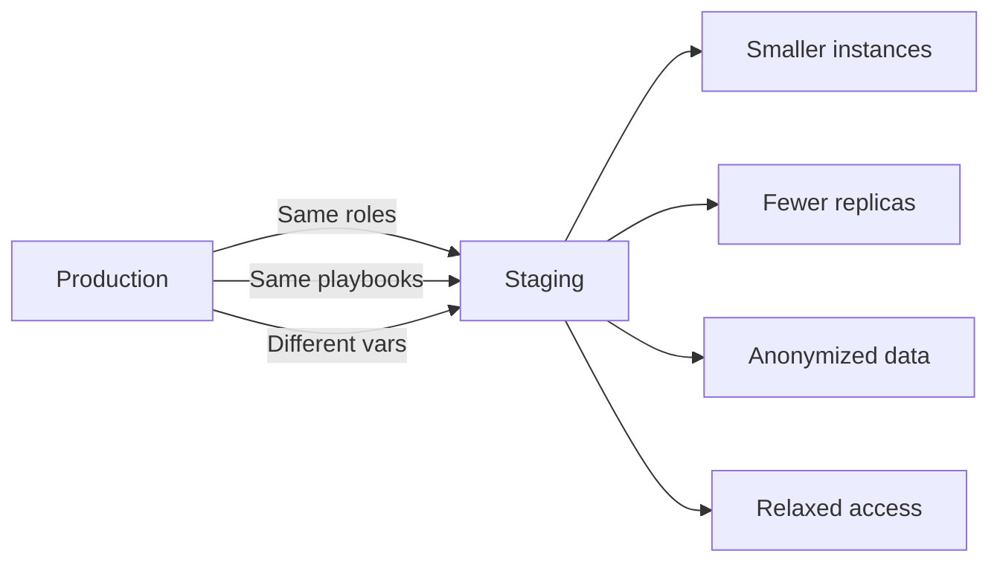

# How to Use Ansible for Staging Environment Management

Author: [nawazdhandala](https://www.github.com/nawazdhandala)

Tags: Ansible, Staging, Environment Management, DevOps

Description: Manage staging environments with Ansible to maintain production parity, automate refreshes, and provide reliable pre-production testing grounds.

---

A staging environment should be a faithful replica of production. When it drifts from production configuration, bugs slip through staging and show up in production. Ansible helps you keep staging in sync with production by using the same playbooks and roles with environment-specific variables.

This post covers managing staging environments effectively with Ansible.

## Staging Environment Principles

Your staging environment should match production in every way except scale and data sensitivity:



## Environment Variable Structure

Use the same roles for both environments with different variable files:

```yaml
# inventories/staging/group_vars/all.yml
# Staging environment configuration
---
environment_name: staging
domain: staging.example.com

# Smaller instances than production
web_instance_type: t3.small
app_instance_type: t3.medium
db_instance_type: r6g.large

# Fewer replicas
web_server_count: 1
app_server_count: 1

# Same software versions as production
app_version: "{{ lookup('file', '../production/current_version.txt') }}"
nginx_version: "1.24"
postgresql_version: "15"

# Staging-specific settings
ssl_certificate: staging-wildcard
monitoring_retention: 7d
backup_retention: 3d
log_level: debug

# Cost optimization
auto_shutdown_enabled: true
auto_shutdown_time: "20:00"
auto_startup_time: "08:00"
```

## Staging Provisioning Playbook

```yaml
# playbooks/provision-staging.yml
# Provision and configure the staging environment
---
- name: Provision staging infrastructure
  hosts: localhost
  connection: local
  vars_files:
    - ../inventories/staging/group_vars/all.yml

  tasks:
    - name: Create staging VPC
      ansible.builtin.include_role:
        name: provision_network
      vars:
        vpc_name: staging-vpc
        vpc_cidr: 10.20.0.0/16

    - name: Launch staging instances
      ansible.builtin.include_role:
        name: provision_compute

- name: Configure all staging hosts
  hosts: staging
  become: true
  roles:
    - common
    - security_baseline
    - monitoring_agent

- name: Configure staging web servers
  hosts: staging_webservers
  become: true
  roles:
    - nginx
    - ssl_certs
    - app_deploy

- name: Configure staging database
  hosts: staging_databases
  become: true
  roles:
    - postgresql
    - backup_agent
```

## Data Refresh from Production

Staging needs realistic data, but it must be anonymized:

```yaml
# playbooks/refresh-staging-data.yml
# Refresh staging database with anonymized production data
---
- name: Refresh staging data from production
  hosts: staging_databases[0]
  become: true
  become_user: postgres
  vars:
    staging_db: "{{ db_name }}"
    prod_backup_bucket: s3://backups-prod/postgres

  tasks:
    - name: Download latest production backup
      amazon.aws.s3_object:
        bucket: backups-prod
        object: "postgres/latest.sql.gz"
        dest: /tmp/prod_backup.sql.gz
        mode: get
      become: false

    - name: Drop and recreate staging database
      community.postgresql.postgresql_db:
        name: "{{ staging_db }}"
        state: absent

    - name: Create fresh staging database
      community.postgresql.postgresql_db:
        name: "{{ staging_db }}"
        state: present

    - name: Restore production data
      ansible.builtin.shell: |
        gunzip -c /tmp/prod_backup.sql.gz | psql {{ staging_db }}
      changed_when: true

    - name: Anonymize user data
      community.postgresql.postgresql_query:
        db: "{{ staging_db }}"
        query: |
          UPDATE users SET
            email = 'user_' || id || '@staging.example.com',
            password_hash = '$2b$12$staging_hash_placeholder',
            first_name = 'Staging',
            last_name = 'User_' || id,
            phone = '+1555000' || lpad(id::text, 4, '0');

    - name: Anonymize payment data
      community.postgresql.postgresql_query:
        db: "{{ staging_db }}"
        query: |
          UPDATE payment_methods SET
            card_number = '4111111111111111',
            card_holder_name = 'STAGING USER',
            billing_address = '123 Test Street';

    - name: Reset admin passwords to staging defaults
      community.postgresql.postgresql_query:
        db: "{{ staging_db }}"
        query: |
          UPDATE users SET password_hash = '{{ staging_admin_password_hash }}'
          WHERE role = 'admin';

    - name: Clean up backup file
      ansible.builtin.file:
        path: /tmp/prod_backup.sql.gz
        state: absent

    - name: Run post-refresh migrations
      ansible.builtin.command:
        cmd: "{{ app_dir }}/current/bin/migrate"
      become_user: "{{ app_user }}"
      changed_when: true
```

## Cost Optimization with Auto-Shutdown

Staging does not need to run 24/7:

```yaml
# roles/staging_scheduler/tasks/main.yml
# Auto-shutdown staging during off-hours
---
- name: Create shutdown script
  ansible.builtin.copy:
    content: |
      #!/bin/bash
      # Gracefully stop all application services before shutdown
      systemctl stop {{ app_name }}
      systemctl stop nginx
      # Signal to monitoring that this is planned
      curl -s -X POST "{{ monitoring_api }}/api/v1/silence" \
        -d '{"matchers":[{"name":"env","value":"staging"}],"duration":"12h"}'
    dest: /usr/local/bin/staging-shutdown.sh
    mode: '0755'

- name: Schedule nightly shutdown
  ansible.builtin.cron:
    name: "Staging auto-shutdown"
    hour: "{{ auto_shutdown_time.split(':')[0] }}"
    minute: "{{ auto_shutdown_time.split(':')[1] }}"
    job: "/usr/local/bin/staging-shutdown.sh && sudo shutdown -h now"
    user: root
  when: auto_shutdown_enabled | default(false)
```

```yaml
# playbooks/staging-startup.yml
# Morning startup for staging environment
---
- name: Start staging instances
  hosts: localhost
  connection: local
  tasks:
    - name: Start all staging EC2 instances
      amazon.aws.ec2_instance:
        state: started
        filters:
          "tag:Environment": staging
        wait: true
      register: started_instances

    - name: Wait for SSH availability
      ansible.builtin.wait_for:
        host: "{{ item.public_ip_address }}"
        port: 22
        timeout: 300
      loop: "{{ started_instances.instances }}"

- name: Verify staging services
  hosts: staging
  become: true
  tasks:
    - name: Ensure all services are running
      ansible.builtin.service:
        name: "{{ item }}"
        state: started
      loop:
        - "{{ app_name }}"
        - nginx
        - postgresql

    - name: Verify health endpoints
      ansible.builtin.uri:
        url: "http://localhost:{{ app_port }}/health"
        status_code: 200
      retries: 15
      delay: 10
```

## Staging Sync Playbook

Keep staging configuration in sync with production changes:

```yaml
# playbooks/sync-staging.yml
# Sync staging configuration with production
---
- name: Sync staging with production config
  hosts: staging
  become: true

  tasks:
    - name: Apply same roles as production
      ansible.builtin.include_role:
        name: "{{ item }}"
      loop:
        - common
        - security_baseline
        - monitoring_agent
        - "{{ 'nginx' if 'webservers' in group_names else '' }}"
        - "{{ 'app_deploy' if 'appservers' in group_names else '' }}"
      when: item != ''

    - name: Deploy same application version as production
      ansible.builtin.include_role:
        name: app_deploy
      vars:
        app_version: "{{ production_current_version }}"
      when: "'appservers' in group_names"
```

## Access Management for Staging

Staging needs broader access than production but still with controls:

```yaml
# roles/staging_access/tasks/main.yml
# Configure broader access for staging environment
---
- name: Add developer SSH keys
  ansible.posix.authorized_key:
    user: "{{ deploy_user }}"
    key: "{{ item }}"
    state: present
  loop: "{{ developer_ssh_keys }}"

- name: Configure staging-specific firewall rules
  ansible.builtin.iptables:
    chain: INPUT
    protocol: tcp
    destination_port: "{{ item }}"
    source: "{{ office_cidr }}"
    jump: ACCEPT
  loop:
    - 8080  # App debug port
    - 5432  # Direct DB access
    - 6379  # Direct Redis access
```

## Key Takeaways

Staging environment management with Ansible means using the same roles and playbooks as production with different variables for scale and cost. Automate data refreshes with anonymization so staging always has realistic data. Use auto-shutdown during off-hours to control costs. Keep a sync playbook that you run after every production change to prevent drift. Give developers broader access to staging for debugging, but still track everything through Ansible so you know exactly what the environment looks like at any time.
