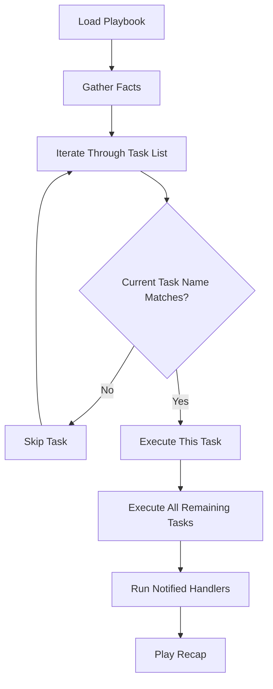

# How to Start Ansible Playbook at a Specific Task

Author: [nawazdhandala](https://www.github.com/nawazdhandala)

Tags: Ansible, Playbook, Debugging, Task Execution

Description: Learn how to use the start-at-task option to resume Ansible playbook execution from a specific task, saving time during debugging and reruns.

---

You are running a long playbook with 30 tasks. It fails on task 22. After fixing the issue, you do not want to sit through tasks 1 through 21 again. The `--start-at-task` flag lets you jump directly to a specific task in the playbook, skipping everything before it.

## Basic Usage

The `--start-at-task` flag takes the name of the task where you want execution to begin.

```bash
# Start execution at the task named "Deploy application files"
ansible-playbook -i inventory.ini deploy.yml --start-at-task "Deploy application files"
```

Ansible will skip all tasks before "Deploy application files" and start executing from that point forward.

## A Practical Example

Consider this deployment playbook.

```yaml
# deploy.yml - multi-step deployment process
---
- name: Deploy web application
  hosts: webservers
  become: yes

  tasks:
    - name: Update package cache
      apt:
        update_cache: yes
        cache_valid_time: 3600

    - name: Install dependencies
      apt:
        name:
          - nginx
          - python3
          - python3-pip
        state: present

    - name: Create application directory
      file:
        path: /var/www/myapp
        state: directory
        owner: www-data
        group: www-data
        mode: '0755'

    - name: Deploy application files
      synchronize:
        src: /opt/releases/v2.4.1/
        dest: /var/www/myapp/

    - name: Install Python requirements
      pip:
        requirements: /var/www/myapp/requirements.txt
        virtualenv: /var/www/myapp/venv

    - name: Deploy nginx configuration
      template:
        src: templates/nginx-app.conf.j2
        dest: /etc/nginx/sites-available/myapp.conf
      notify: Reload nginx

    - name: Run database migrations
      command: /var/www/myapp/venv/bin/python manage.py migrate
      args:
        chdir: /var/www/myapp

    - name: Collect static files
      command: /var/www/myapp/venv/bin/python manage.py collectstatic --noinput
      args:
        chdir: /var/www/myapp

    - name: Restart application service
      service:
        name: myapp
        state: restarted

  handlers:
    - name: Reload nginx
      service:
        name: nginx
        state: reloaded
```

If "Install Python requirements" fails because of a missing system library, you fix the issue on the server and then rerun from that task.

```bash
# Skip the first 4 tasks and start at the pip install step
ansible-playbook -i inventory.ini deploy.yml --start-at-task "Install Python requirements"
```

## Important: Facts Gathering Still Happens

Even when you use `--start-at-task`, Ansible still runs the "Gathering Facts" task. This is necessary because many tasks depend on facts like `ansible_os_family`, `ansible_hostname`, or `ansible_default_ipv4`. Without facts, those tasks would fail.

```bash
# Even with start-at-task, you will see fact gathering in the output
ansible-playbook -i inventory.ini deploy.yml --start-at-task "Deploy nginx configuration"
```

Output:

```
PLAY [Deploy web application] *************************************************

TASK [Gathering Facts] ********************************************************
ok: [web01]

TASK [Deploy nginx configuration] *********************************************
changed: [web01]

TASK [Run database migrations] ************************************************
changed: [web01]
...
```

If you also want to skip fact gathering (maybe to save time and your tasks do not need facts), you would need to set `gather_facts: false` in the playbook itself.

## Execution Flow with --start-at-task

Here is how Ansible processes a playbook when `--start-at-task` is used.



## Matching Task Names

The task name match is exact. You need to provide the full task name as it appears in the playbook.

```bash
# This works (exact match)
ansible-playbook deploy.yml --start-at-task "Deploy application files"

# This does NOT work (partial match)
ansible-playbook deploy.yml --start-at-task "Deploy"

# This does NOT work (case mismatch)
ansible-playbook deploy.yml --start-at-task "deploy application files"
```

If you are not sure of the exact task name, list all tasks first.

```bash
# List all task names in the playbook
ansible-playbook -i inventory.ini deploy.yml --list-tasks
```

Output:

```
playbook: deploy.yml

  play #1 (webservers): Deploy web application    TAGS: []
    tasks:
      Update package cache                    TAGS: []
      Install dependencies                    TAGS: []
      Create application directory            TAGS: []
      Deploy application files                TAGS: []
      Install Python requirements             TAGS: []
      Deploy nginx configuration              TAGS: []
      Run database migrations                 TAGS: []
      Collect static files                    TAGS: []
      Restart application service             TAGS: []
```

Copy the exact task name from this output to use with `--start-at-task`.

## Combining with Other Flags

You can combine `--start-at-task` with other flags for more control.

```bash
# Start at a task, limit to one host, with verbose output
ansible-playbook -i inventory.ini deploy.yml \
  --start-at-task "Run database migrations" \
  --limit web01 \
  -vv

# Start at a task in check mode to preview remaining changes
ansible-playbook -i inventory.ini deploy.yml \
  --start-at-task "Deploy nginx configuration" \
  --check --diff
```

## Multiple Plays and --start-at-task

When your playbook has multiple plays, `--start-at-task` searches across all plays. If the task name appears in the second play, tasks in the first play are skipped entirely.

```yaml
# multi-play.yml - two plays in one file
---
- name: Configure database servers
  hosts: dbservers
  become: yes

  tasks:
    - name: Install PostgreSQL
      apt:
        name: postgresql
        state: present

    - name: Configure PostgreSQL
      template:
        src: templates/postgresql.conf.j2
        dest: /etc/postgresql/14/main/postgresql.conf

- name: Configure web servers
  hosts: webservers
  become: yes

  tasks:
    - name: Install nginx
      apt:
        name: nginx
        state: present

    - name: Deploy web application
      synchronize:
        src: /opt/releases/current/
        dest: /var/www/app/
```

```bash
# This skips the entire first play and starts at "Install nginx"
ansible-playbook -i inventory.ini multi-play.yml --start-at-task "Install nginx"
```

## Caveats to Watch Out For

**Dependencies between tasks**: If task 5 depends on output from task 3 (via `register`), starting at task 5 means the registered variable will not exist. This will cause an undefined variable error.

```yaml
# This will break if you start at the second task
- name: Get current version
  command: cat /opt/myapp/VERSION
  register: current_version

- name: Deploy if version differs
  synchronize:
    src: /opt/releases/new/
    dest: /var/www/myapp/
  when: current_version.stdout != target_version
```

**Missing directory or file creation**: If earlier tasks create directories or files that later tasks need, skipping those setup tasks will cause failures.

**Handler notifications**: If a skipped task would have notified a handler, that handler will not run. Make sure skipping tasks does not leave your system in an inconsistent state.

## Alternative: Using --step for Interactive Control

If you want more granular control, the `--step` flag (covered in another post) lets you choose yes/no/continue for each task. But for simply resuming after a failure, `--start-at-task` is faster and more convenient.

The `--start-at-task` flag is a simple time-saver that becomes essential when you are iterating on long playbooks. Just remember to be aware of task dependencies, and always verify the exact task name before using it.
