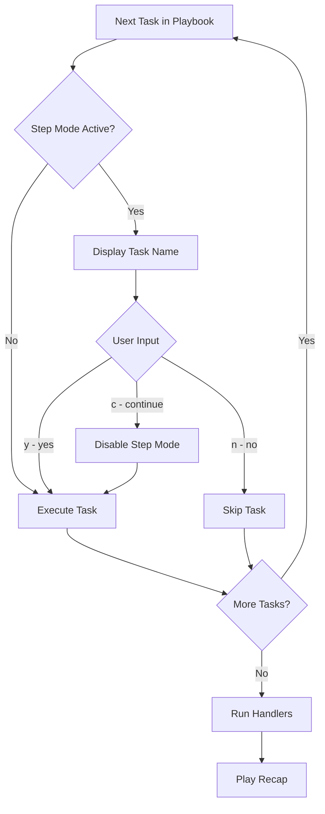

# How to Step Through Ansible Playbook Tasks One by One

Author: [nawazdhandala](https://www.github.com/nawazdhandala)

Tags: Ansible, Playbook, Debugging, Step Mode

Description: Learn how to use Ansible step mode to interactively control task execution, stepping through each task with manual confirmation.

---

When you are troubleshooting a playbook or running it against production for the first time, you might want manual control over each task. Instead of letting the entire playbook run unattended, Ansible's `--step` flag pauses before every task and asks you to confirm, skip, or continue. It is like having a breakpoint on every line of your automation.

## Enabling Step Mode

Add the `--step` flag to your `ansible-playbook` command.

```bash
# Run the playbook in step mode
ansible-playbook -i inventory.ini site.yml --step
```

Ansible will stop before each task and present you with three options.

```
TASK [Update package cache] ****************************************************
Perform task: TASK: Update package cache (N)o/(y)es/(c)ontinue:
```

The three choices are:

- **y (yes)**: Execute this task, then pause again before the next one
- **n (no)**: Skip this task, then pause again before the next one
- **c (continue)**: Execute this task and all remaining tasks without pausing

## Walkthrough Example

Let us work with a playbook that sets up a monitoring agent.

```yaml
# monitoring-setup.yml - installs and configures a monitoring agent
---
- name: Set up monitoring agent
  hosts: all
  become: yes

  tasks:
    - name: Add monitoring repository GPG key
      apt_key:
        url: https://packages.monitoring.example.com/gpg.key
        state: present

    - name: Add monitoring apt repository
      apt_repository:
        repo: "deb https://packages.monitoring.example.com/apt stable main"
        state: present

    - name: Install monitoring agent
      apt:
        name: monitoring-agent
        state: present
        update_cache: yes

    - name: Deploy agent configuration
      template:
        src: templates/monitoring-agent.conf.j2
        dest: /etc/monitoring-agent/agent.conf
        owner: root
        group: monitoring
        mode: '0640'
      notify: Restart monitoring agent

    - name: Start and enable monitoring agent
      service:
        name: monitoring-agent
        state: started
        enabled: yes

    - name: Verify agent is reporting
      uri:
        url: "http://localhost:9100/metrics"
        return_content: yes
      register: metrics_check
      retries: 3
      delay: 5

    - name: Show agent status
      debug:
        msg: "Agent on {{ inventory_hostname }} is reporting {{ metrics_check.content | regex_search('agent_uptime_seconds [0-9.]+') }}"

  handlers:
    - name: Restart monitoring agent
      service:
        name: monitoring-agent
        state: restarted
```

Running this with `--step`:

```bash
ansible-playbook -i inventory.ini monitoring-setup.yml --step
```

The session looks like this:

```
PLAY [Set up monitoring agent] ************************************************

TASK [Gathering Facts] ********************************************************
Perform task: TASK: Gathering Facts (N)o/(y)es/(c)ontinue: y

ok: [web01]

TASK [Add monitoring repository GPG key] **************************************
Perform task: TASK: Add monitoring repository GPG key (N)o/(y)es/(c)ontinue: y

changed: [web01]

TASK [Add monitoring apt repository] ******************************************
Perform task: TASK: Add monitoring apt repository (N)o/(y)es/(c)ontinue: y

changed: [web01]

TASK [Install monitoring agent] ***********************************************
Perform task: TASK: Install monitoring agent (N)o/(y)es/(c)ontinue: y

changed: [web01]

TASK [Deploy agent configuration] *********************************************
Perform task: TASK: Deploy agent configuration (N)o/(y)es/(c)ontinue: y

changed: [web01]

TASK [Start and enable monitoring agent] **************************************
Perform task: TASK: Start and enable monitoring agent (N)o/(y)es/(c)ontinue: c

ok: [web01]

TASK [Verify agent is reporting] **********************************************
ok: [web01]

TASK [Show agent status] ******************************************************
ok: [web01] => {
    "msg": "Agent on web01 is reporting agent_uptime_seconds 12.4"
}
```

Notice that after typing `c` at the "Start and enable monitoring agent" task, the remaining tasks ran without further prompts.

## Step Mode Decision Flow

Here is how step mode processes each task.



## Practical Use Cases

### First-Time Production Run

When running a new playbook against production for the first time, step mode gives you a safety net.

```bash
# Step through carefully on the first production run
ansible-playbook -i production.ini new-deployment.yml --step --diff
```

You can review each task, check the diff output (if using `--diff`), and decide whether to proceed. If something looks wrong, press `n` to skip it and investigate.

### Debugging Complex Playbooks

When a playbook has many tasks and you want to isolate which one is causing issues, step mode lets you observe the system state between tasks.

```bash
# Step through and check the server state between tasks
ansible-playbook -i inventory.ini complex-setup.yml --step -v
```

Between each prompt, you can SSH into the target host in another terminal to verify the state before proceeding.

### Training and Demonstrations

Step mode is excellent for training sessions where you want to explain what each task does before executing it.

```bash
# Use in training to discuss each task before running it
ansible-playbook -i lab-inventory.ini demo-playbook.yml --step
```

## Combining Step Mode with Other Flags

Step mode works well alongside other flags.

```bash
# Step through with verbose output to see what each task does
ansible-playbook -i inventory.ini site.yml --step -v

# Step through with check mode for a completely safe walkthrough
ansible-playbook -i inventory.ini site.yml --step --check

# Step through starting at a specific task
ansible-playbook -i inventory.ini site.yml --step --start-at-task "Deploy config"

# Step through on a single host
ansible-playbook -i inventory.ini site.yml --step --limit web01
```

The `--step --check` combination is particularly useful. You get interactive control and nothing actually changes on the remote hosts.

## Limitations of Step Mode

**Not suitable for automation**: Step mode is interactive by nature. You cannot use it in CI/CD pipelines, cron jobs, or any unattended context. It requires a human at the keyboard.

**Single-host focus**: When running against multiple hosts, the step prompt applies to each task across all hosts. You cannot selectively step on one host and auto-run on another.

**No backward stepping**: Unlike a debugger, you cannot go back to a previous task. If you skip a task with `n`, the only way to run it is to restart the playbook (possibly with `--start-at-task`).

**Handler complications**: If you skip a task that would have notified a handler, the handler will not run. This can leave services in a state where they need a restart that never happens.

## The Ansible Debugger (An Alternative)

For more advanced interactive debugging, Ansible has a built-in debugger that activates when a task fails.

```yaml
# debugger-example.yml - enables the debugger on failure
---
- name: Deploy with debugger
  hosts: webservers
  become: yes
  debugger: on_failed

  tasks:
    - name: Template that might fail
      template:
        src: templates/app.conf.j2
        dest: /etc/myapp/app.conf
```

When a task fails, the debugger drops you into an interactive session where you can inspect variables, change task arguments, and retry.

```
TASK [Template that might fail] ***********************************************
fatal: [web01]: FAILED! => {"msg": "AnsibleUndefinedVariable: 'app_port' is undefined"}
[web01] TASK: Template that might fail (debug)> p task_vars['app_port']
***KeyError: 'app_port'
[web01] TASK: Template that might fail (debug)> task_vars['app_port'] = 8080
[web01] TASK: Template that might fail (debug)> redo
changed: [web01]
```

The debugger is more powerful than step mode for fixing issues on the fly, but step mode is better for preventive control where you want to review each task before it runs.

## When to Use Step Mode vs Other Approaches

| Situation | Best Approach |
|-----------|--------------|
| First run against production | `--step` |
| Task failed, need to inspect variables | debugger |
| Want to skip a few known-slow tasks | `--skip-tags` |
| Resuming after a failure | `--start-at-task` |
| Training or demonstration | `--step` |
| CI/CD pipeline | None of these (fully automated) |

Step mode is a simple but effective tool for situations where you want a human in the loop. It adds confidence when running playbooks in sensitive environments and makes learning Ansible more interactive. Keep it in your toolbox for those times when you need to proceed with caution.
