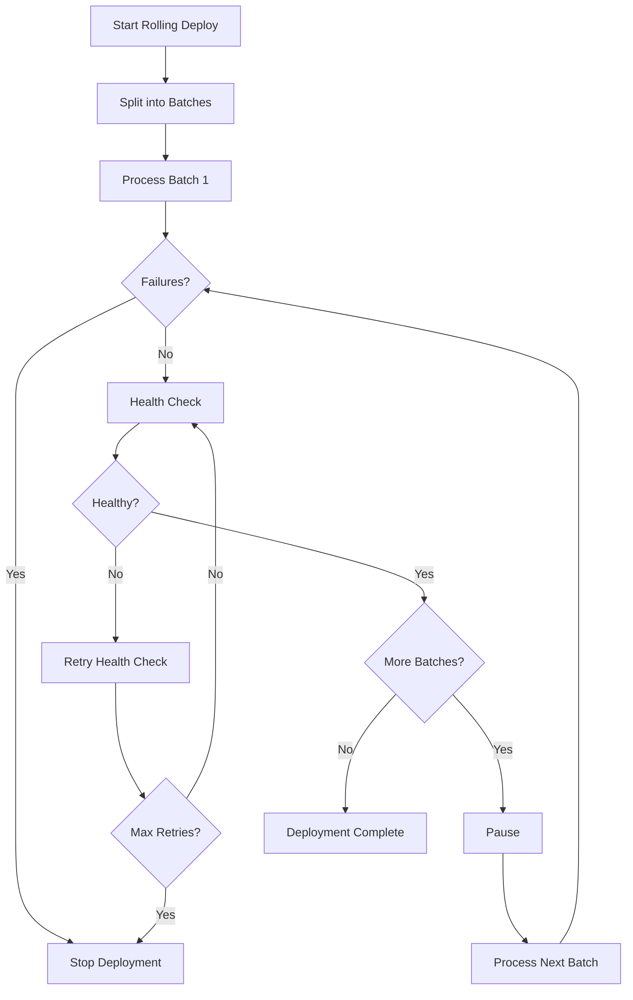

# How to Create a Strategy Plugin for Custom Execution Patterns

Author: [nawazdhandala](https://www.github.com/nawazdhandala)

Tags: Ansible, Plugins, Strategy, Execution, Deployment

Description: Build custom Ansible strategy plugins to implement advanced execution patterns like rolling deploys, blue-green switching, and weighted batches.

---

Strategy plugins control the order and grouping of task execution across hosts. The built-in `linear` strategy runs each task on all hosts before moving to the next task. The `free` strategy lets each host run through all tasks independently. When you need something more sophisticated, like rolling deployments with health gate checks, weighted batch processing, or priority-based execution, you write a custom strategy.

This guide builds two practical strategies: a rolling deploy with health checks and a priority-based execution strategy.

## Rolling Deploy with Health Gates

This strategy processes hosts in configurable batch sizes and runs a health check between batches. If the health check fails, it stops the deployment.

Create `strategy_plugins/rolling_health.py`:

```python
# rolling_health.py - Rolling deployment with health gate checks
from __future__ import absolute_import, division, print_function
__metaclass__ = type

DOCUMENTATION = """
    name: rolling_health
    short_description: Rolling deployment with health gate checks
    description:
        - Processes hosts in batches with configurable health checks between batches.
        - Stops deployment if health checks fail after any batch.
    options:
      batch_size:
        description: Number of hosts per batch.
        type: int
        default: 5
        env:
          - name: ANSIBLE_ROLLING_BATCH_SIZE
        ini:
          - key: batch_size
            section: rolling_health
      health_check_url:
        description: URL to check between batches (expects HTTP 200).
        type: str
        default: ''
        env:
          - name: ANSIBLE_HEALTH_CHECK_URL
        ini:
          - key: health_check_url
            section: rolling_health
      health_check_retries:
        description: Number of health check retries.
        type: int
        default: 3
        env:
          - name: ANSIBLE_HEALTH_CHECK_RETRIES
        ini:
          - key: health_check_retries
            section: rolling_health
      health_check_delay:
        description: Seconds between health check retries.
        type: int
        default: 10
        env:
          - name: ANSIBLE_HEALTH_CHECK_DELAY
        ini:
          - key: health_check_delay
            section: rolling_health
      pause_between_batches:
        description: Seconds to pause between batches.
        type: int
        default: 0
        env:
          - name: ANSIBLE_ROLLING_PAUSE
        ini:
          - key: pause_between_batches
            section: rolling_health
"""

import time
from ansible.plugins.strategy.linear import StrategyModule as LinearStrategy
from ansible.utils.display import Display
from ansible.errors import AnsibleError

display = Display()


class StrategyModule(LinearStrategy):
    """Rolling deployment strategy with health gates."""

    def run(self, iterator, play_context):
        batch_size = self.get_option('batch_size')
        health_url = self.get_option('health_check_url')
        retries = self.get_option('health_check_retries')
        delay = self.get_option('health_check_delay')
        pause = self.get_option('pause_between_batches')

        all_hosts = self._inventory.get_hosts(
            iterator._play.hosts, order=iterator._play.order
        )

        if len(all_hosts) <= batch_size:
            display.display(
                "ROLLING: All %d hosts fit in one batch, running normally"
                % len(all_hosts)
            )
            return super(StrategyModule, self).run(iterator, play_context)

        # Split hosts into batches
        batches = []
        for i in range(0, len(all_hosts), batch_size):
            batches.append(all_hosts[i:i + batch_size])

        display.display(
            "ROLLING: %d hosts in %d batches of %d"
            % (len(all_hosts), len(batches), batch_size),
            color='cyan'
        )

        total_result = 0

        for batch_num, batch in enumerate(batches, 1):
            batch_names = [h.name for h in batch]
            display.display(
                "ROLLING: Batch %d/%d: %s"
                % (batch_num, len(batches), ', '.join(batch_names)),
                color='yellow'
            )

            # Mark hosts not in this batch as unreachable temporarily
            other_hosts = [h for h in all_hosts if h not in batch]
            for host in other_hosts:
                self._tqm._unreachable_hosts[host.name] = True

            # Run the batch
            result = super(StrategyModule, self).run(iterator, play_context)

            # Restore hosts
            for host in other_hosts:
                if host.name in self._tqm._unreachable_hosts:
                    del self._tqm._unreachable_hosts[host.name]

            # Check for failures in this batch
            if self._tqm._stats.failures:
                failed_hosts = [
                    h for h in batch_names
                    if self._tqm._stats.summarize(h).get('failures', 0) > 0
                ]
                if failed_hosts:
                    display.error(
                        "ROLLING: Batch %d had failures on: %s. Stopping."
                        % (batch_num, ', '.join(failed_hosts))
                    )
                    return result

            # Run health check if configured
            if health_url and batch_num < len(batches):
                if not self._run_health_check(health_url, retries, delay):
                    display.error(
                        "ROLLING: Health check failed after batch %d. Stopping deployment."
                        % batch_num
                    )
                    return 1

                display.display(
                    "ROLLING: Health check passed after batch %d" % batch_num,
                    color='green'
                )

            # Pause between batches
            if pause > 0 and batch_num < len(batches):
                display.display(
                    "ROLLING: Pausing %d seconds" % pause, color='cyan'
                )
                time.sleep(pause)

            total_result = max(total_result, result)

        display.display(
            "ROLLING: All %d batches complete" % len(batches),
            color='green'
        )
        return total_result

    def _run_health_check(self, url, retries, delay):
        """Run an HTTP health check with retries."""
        from ansible.module_utils.urls import open_url

        for attempt in range(1, retries + 1):
            try:
                display.vv(
                    "ROLLING: Health check attempt %d/%d: %s"
                    % (attempt, retries, url)
                )
                response = open_url(url, timeout=10, method='GET')
                status = response.getcode()
                if status == 200:
                    return True
                display.warning(
                    "ROLLING: Health check returned status %d" % status
                )
            except Exception as e:
                display.warning(
                    "ROLLING: Health check failed: %s" % str(e)
                )

            if attempt < retries:
                display.vv("ROLLING: Waiting %d seconds before retry" % delay)
                time.sleep(delay)

        return False
```

## Priority-Based Strategy

This strategy lets you assign priorities to hosts and processes higher-priority hosts first.

Create `strategy_plugins/priority.py`:

```python
# priority.py - Execute tasks on hosts based on priority ordering
from __future__ import absolute_import, division, print_function
__metaclass__ = type

DOCUMENTATION = """
    name: priority
    short_description: Priority-based execution strategy
    description:
        - Processes hosts in order of their assigned priority.
        - Higher priority hosts are processed first.
        - Set priority via the ansible_priority host variable.
    options:
      priority_var:
        description: Variable name that holds the host priority (higher = first).
        type: str
        default: ansible_priority
        env:
          - name: ANSIBLE_PRIORITY_VAR
        ini:
          - key: priority_var
            section: priority_strategy
      group_by_priority:
        description: If true, all hosts of same priority run together before next group.
        type: bool
        default: true
        env:
          - name: ANSIBLE_PRIORITY_GROUP
"""

from ansible.plugins.strategy.linear import StrategyModule as LinearStrategy
from ansible.utils.display import Display

display = Display()


class StrategyModule(LinearStrategy):
    """Execute hosts based on priority variable."""

    def run(self, iterator, play_context):
        priority_var = self.get_option('priority_var')
        group_by_priority = self.get_option('group_by_priority')

        all_hosts = self._inventory.get_hosts(
            iterator._play.hosts, order=iterator._play.order
        )

        # Sort hosts by priority (highest first)
        def get_priority(host):
            priority = self._inventory.get_host(host.name).get_vars().get(
                priority_var, 0
            )
            try:
                return int(priority)
            except (ValueError, TypeError):
                return 0

        sorted_hosts = sorted(all_hosts, key=get_priority, reverse=True)

        # Log the execution order
        for host in sorted_hosts:
            p = get_priority(host)
            display.vv("PRIORITY: %s (priority=%d)" % (host.name, p))

        if not group_by_priority:
            # Just reorder and run linearly
            display.display(
                "PRIORITY: Running hosts in priority order",
                color='cyan'
            )
            return super(StrategyModule, self).run(iterator, play_context)

        # Group by priority and run each group separately
        priority_groups = {}
        for host in sorted_hosts:
            p = get_priority(host)
            if p not in priority_groups:
                priority_groups[p] = []
            priority_groups[p].append(host)

        total_result = 0
        for priority in sorted(priority_groups.keys(), reverse=True):
            group = priority_groups[priority]
            group_names = [h.name for h in group]

            display.display(
                "PRIORITY: Processing priority %d: %s"
                % (priority, ', '.join(group_names)),
                color='yellow'
            )

            # Run only this priority group
            other_hosts = [h for h in all_hosts if h not in group]
            for host in other_hosts:
                self._tqm._unreachable_hosts[host.name] = True

            result = super(StrategyModule, self).run(iterator, play_context)

            for host in other_hosts:
                if host.name in self._tqm._unreachable_hosts:
                    del self._tqm._unreachable_hosts[host.name]

            total_result = max(total_result, result)

        return total_result
```

## Using These Strategies

### Rolling Health Deploy

```yaml
---
# rolling_deploy.yml
- name: Deploy with rolling health checks
  hosts: web_servers
  strategy: rolling_health
  become: true

  tasks:
    - name: Pull latest code
      ansible.builtin.git:
        repo: https://github.com/myorg/webapp.git
        dest: /opt/webapp
        version: "{{ deploy_version }}"

    - name: Restart service
      ansible.builtin.systemd:
        name: webapp
        state: restarted

    - name: Wait for service to start
      ansible.builtin.wait_for:
        port: 8080
        delay: 5
        timeout: 30
```

Configure the strategy:

```ini
# ansible.cfg
[rolling_health]
batch_size = 3
health_check_url = https://lb.myorg.com/health
health_check_retries = 5
health_check_delay = 10
pause_between_batches = 30
```

### Priority-Based Execution

```yaml
# inventory/hosts.yml
all:
  children:
    web_servers:
      hosts:
        web-canary:
          ansible_priority: 100
        web-primary-01:
          ansible_priority: 50
        web-primary-02:
          ansible_priority: 50
        web-secondary-01:
          ansible_priority: 10
```

```yaml
---
# priority_deploy.yml
- name: Deploy with priority ordering
  hosts: web_servers
  strategy: priority

  tasks:
    - name: Deploy application
      ansible.builtin.copy:
        src: app.tar.gz
        dest: /opt/app/
```

## Execution Flow



## Summary

Custom strategy plugins give you precise control over how Ansible processes hosts. The rolling health strategy adds safety to deployments by checking service health between batches. The priority strategy ensures critical hosts get updated first. Both patterns extend the linear strategy, reusing its task execution and result handling while adding custom orchestration logic on top. The key technique is temporarily manipulating `_tqm._unreachable_hosts` to control which hosts get processed in each phase.
