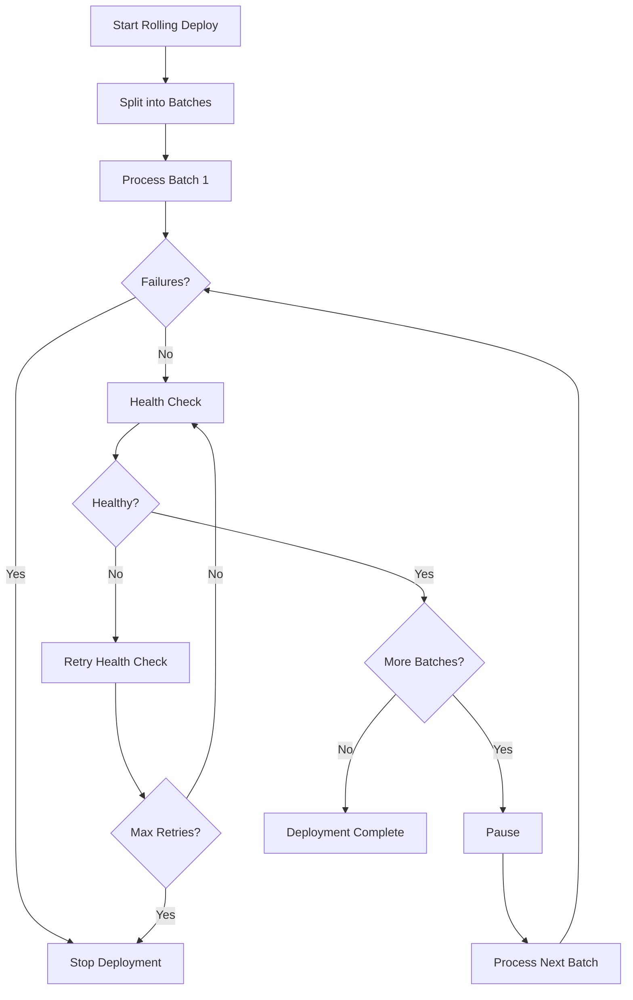

# How to Create a Strategy Plugin for Custom Execution Patterns

Author: [nawazdhandala](https://www.github.com/nawazdhandala)

Tags: Ansible, Plugin, Strategy, Execution, Deployment

Description: Build custom Ansible strategy plugins to implement advanced execution patterns like rolling deploys, blue-green switching, and weighted batches.

---

Strategy plugins control the flow of task execution across hosts. The built-in `linear` strategy runs each task on all hosts before moving to the next task. The `free` strategy lets each host run through all tasks independently. When you need something more sophisticated, like rolling deployments with health gate checks or priority-based execution, you write a custom strategy.

This guide builds two practical strategies: a rolling deploy with health checks and a priority-based execution strategy.

## Rolling Deploy with Health Gates

This strategy uses Ansible's `serial` play keyword for batch sizing and runs a health check after each batch. If the health check fails, it stops the deployment.

Create `strategy_plugins/rolling_health.py`:

```python
# rolling_health.py - Rolling deployment with health gate checks

from __future__ import absolute_import, division, print_function
__metaclass__ = type

DOCUMENTATION = """
    name: rolling_health
    short_description: Rolling deployment with health gate checks
    description:
        - Runs configurable health checks after Ansible serial batches.
        - Stops deployment if health checks fail after any batch.
    options:
      health_check_url:
        description: URL to check after each serial batch (expects HTTP 200).
        type: str
        default: ''
        env:
          - name: ANSIBLE_HEALTH_CHECK_URL
        ini:
          - key: health_check_url
            section: rolling_health
      health_check_retries:
        description: Number of health check retries.
        type: int
        default: 3
        env:
          - name: ANSIBLE_HEALTH_CHECK_RETRIES
        ini:
          - key: health_check_retries
            section: rolling_health
      health_check_delay:
        description: Seconds between health check retries.
        type: int
        default: 10
        env:
          - name: ANSIBLE_HEALTH_CHECK_DELAY
        ini:
          - key: health_check_delay
            section: rolling_health
      pause_between_batches:
        description: Seconds to pause after each batch.
        type: int
        default: 0
        env:
          - name: ANSIBLE_ROLLING_PAUSE
        ini:
          - key: pause_between_batches
            section: rolling_health
"""

import time
from ansible.plugins.strategy.linear import StrategyModule as LinearStrategy
from ansible.utils.display import Display

display = Display()


class StrategyModule(LinearStrategy):
    """Rolling deployment strategy with health gates."""

    def run(self, iterator, play_context):
        health_url = self.get_option('health_check_url')
        retries = self.get_option('health_check_retries')
        delay = self.get_option('health_check_delay')
        pause = self.get_option('pause_between_batches')

        hosts = self._inventory.get_hosts(
            iterator._play.hosts, order=iterator._play.order
        )
        display.display(
            "ROLLING: Running batch with %d host(s)" % len(hosts),
            color='cyan'
        )

        result = super(StrategyModule, self).run(iterator, play_context)
        if result != self._tqm.RUN_OK:
            return result

        if health_url:
            if not self._run_health_check(health_url, retries, delay):
                display.error(
                    "ROLLING: Health check failed after batch. Stopping deployment."
                )
                return self._tqm.RUN_FAILED_HOSTS

            display.display(
                "ROLLING: Health check passed after batch",
                color='green'
            )

        if pause > 0:
            display.display("ROLLING: Pausing %d seconds" % pause, color='cyan')
            time.sleep(pause)

        return result

    def _run_health_check(self, url, retries, delay):
        """Run an HTTP health check with retries."""
        from ansible.module_utils.urls import open_url

        for attempt in range(1, retries + 1):
            try:
                display.vv(
                    "ROLLING: Health check attempt %d/%d: %s"
                    % (attempt, retries, url)
                )
                response = open_url(url, timeout=10, method='GET')
                status = response.getcode()
                if status == 200:
                    return True
                display.warning(
                    "ROLLING: Health check returned status %d" % status
                )
            except Exception as e:
                display.warning(
                    "ROLLING: Health check failed: %s" % str(e)
                )

            if attempt < retries:
                display.vv("ROLLING: Waiting %d seconds before retry" % delay)
                time.sleep(delay)

        return False
```

## Priority-Based Strategy

This strategy lets you assign priorities to hosts and schedules higher-priority hosts first.

Create `strategy_plugins/priority.py`:

```python
# priority.py - Execute tasks on hosts based on priority ordering
from __future__ import absolute_import, division, print_function
__metaclass__ = type

DOCUMENTATION = """
    name: priority
    short_description: Priority-based execution strategy
    description:
        - Schedules hosts in order of their assigned priority.
        - Higher priority hosts are scheduled first.
        - Set priority via the ansible_priority host variable.
    options:
      priority_var:
        description: Variable name that holds the host priority (higher = first).
        type: str
        default: ansible_priority
        env:
          - name: ANSIBLE_PRIORITY_VAR
        ini:
          - key: priority_var
            section: priority_strategy
"""

from ansible.plugins.strategy.linear import StrategyModule as LinearStrategy
from ansible.utils.display import Display

display = Display()


class StrategyModule(LinearStrategy):
    """Execute hosts based on priority variable."""

    def _get_priority(self, host):
        priority_var = self.get_option('priority_var')
        priority = self._inventory.get_host(host.name).get_vars().get(
            priority_var, 0
        )
        try:
            return int(priority)
        except (ValueError, TypeError):
            return 0

    def _set_hosts_cache(self, play, refresh=True):
        super(StrategyModule, self)._set_hosts_cache(play, refresh=refresh)
        hosts = [
            self._inventory.get_host(host_name)
            for host_name in self._hosts_cache
        ]
        sorted_hosts = sorted(hosts, key=self._get_priority, reverse=True)
        self._hosts_cache = [host.name for host in sorted_hosts]

    def run(self, iterator, play_context):
        self._set_hosts_cache(iterator._play)

        # Log the execution order
        for host_name in self._hosts_cache:
            host = self._inventory.get_host(host_name)
            p = self._get_priority(host)
            display.vv("PRIORITY: %s (priority=%d)" % (host_name, p))

        display.display(
            "PRIORITY: Running hosts in priority order",
            color='cyan'
        )
        return super(StrategyModule, self).run(iterator, play_context)
```

## Using These Strategies

### Rolling Health Deploy

```yaml
---
# rolling_deploy.yml
- name: Deploy with rolling health checks
  hosts: web_servers
  strategy: rolling_health
  serial: 3
  become: true

  tasks:
    - name: Pull latest code
      ansible.builtin.git:
        repo: https://github.com/myorg/webapp.git
        dest: /opt/webapp
        version: "{{ deploy_version }}"

    - name: Restart service
      ansible.builtin.systemd:
        name: webapp
        state: restarted

    - name: Wait for service to start
      ansible.builtin.wait_for:
        port: 8080
        delay: 5
        timeout: 30
```

Configure the strategy:

```ini
# ansible.cfg
[rolling_health]
health_check_url = https://lb.myorg.com/health
health_check_retries = 5
health_check_delay = 10
pause_between_batches = 30
```

### Priority-Based Execution

```yaml
# inventory/hosts.yml
all:
  children:
    web_servers:
      hosts:
        web-canary:
          ansible_priority: 100
        web-primary-01:
          ansible_priority: 50
        web-primary-02:
          ansible_priority: 50
        web-secondary-01:
          ansible_priority: 10
```

```yaml
---
# priority_deploy.yml
- name: Deploy with priority ordering
  hosts: web_servers
  strategy: priority

  tasks:
    - name: Deploy application
      ansible.builtin.copy:
        src: app.tar.gz
        dest: /opt/app/
```

## Execution Flow


```mermaid
flowchart TD
    A[Start Rolling Deploy] --> B[Split into Batches]
    B --> C[Process Batch 1]
    C --> D{Failures?}
    D -->|Yes| E[Stop Deployment]
    D -->|No| F[Health Check]
    F --> G{Healthy?}
    G -->|No| H[Retry Health Check]
    H --> I{Max Retries?}
    I -->|Yes| E
    I -->|No| F
    G -->|Yes| J{More Batches?}
    J -->|Yes| K[Pause]
    K --> L[Process Next Batch]
    L --> D
    J -->|No| M[Deployment Complete]
```

## Summary

Custom strategy plugins give you precise control over how Ansible processes hosts. The rolling health strategy adds safety to deployments by checking service health after each serial batch. The priority strategy ensures critical hosts get scheduled first. Both patterns extend the linear strategy, reusing its task execution and result handling while adding custom orchestration logic on top. The key technique is overriding strategy behavior while leaving rolling deployment batch sizing to Ansible's `serial` keyword.
