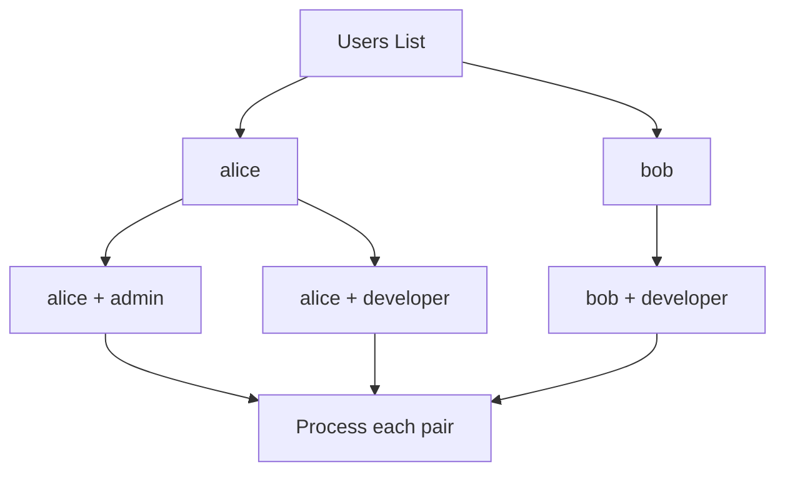

# How to Use the Ansible subelements Lookup Plugin

Author: [nawazdhandala](https://www.github.com/nawazdhandala)

Tags: Ansible, Lookup Plugins, Loops, Nested Data

Description: Learn how to use the Ansible subelements lookup plugin to iterate over nested lists within complex data structures in your playbooks.

---

When your data has a nested structure, like users with multiple SSH keys or servers with multiple network interfaces, you need a way to iterate over the inner list while keeping a reference to the outer item. The `subelements` lookup plugin does exactly this. It takes a list of dictionaries and a key pointing to a nested list, then produces a flat iteration where each item is a pair: the parent dictionary and one element from the nested list.

## What the subelements Lookup Does

Given a list of items where each item contains a sub-list, `subelements` produces a cross-product between each item and its sub-list. For example, if you have 3 users and each user has 2 SSH keys, `subelements` produces 6 iterations, each giving you the user and one of their keys.

## Basic Usage

The classic use case is managing users and their SSH keys.

This playbook creates users and deploys their SSH keys:

```yaml
# playbook.yml - Create users with multiple SSH keys
---
- name: Manage user accounts and SSH keys
  hosts: all
  vars:
    users:
      - name: alice
        groups: [sudo, developers]
        ssh_keys:
          - "ssh-rsa AAAAB3Nza...alice@laptop"
          - "ssh-rsa AAAAB3Nza...alice@desktop"
      - name: bob
        groups: [developers]
        ssh_keys:
          - "ssh-rsa AAAAB3Nza...bob@laptop"
      - name: charlie
        groups: [operators]
        ssh_keys:
          - "ssh-rsa AAAAB3Nza...charlie@laptop"
          - "ssh-rsa AAAAB3Nza...charlie@phone"
          - "ssh-rsa AAAAB3Nza...charlie@tablet"
  tasks:
    - name: Create user accounts
      ansible.builtin.user:
        name: "{{ item.name }}"
        groups: "{{ item.groups }}"
        state: present
      loop: "{{ users }}"

    - name: Deploy SSH keys for each user
      ansible.posix.authorized_key:
        user: "{{ item.0.name }}"
        key: "{{ item.1 }}"
        state: present
      loop: "{{ lookup('subelements', users, 'ssh_keys') }}"
```

In the subelements loop:
- `item.0` is the parent dictionary (the user)
- `item.1` is the current element from the nested list (the SSH key)

## How the Iteration Works

Let me illustrate the iteration with a concrete example.

Given this data:

```yaml
users:
  - name: alice
    roles: [admin, developer]
  - name: bob
    roles: [developer]
```

The `subelements` lookup over `users` and `roles` produces these iterations:

```
Iteration 1: item.0 = {name: alice, roles: [admin, developer]}, item.1 = admin
Iteration 2: item.0 = {name: alice, roles: [admin, developer]}, item.1 = developer
Iteration 3: item.0 = {name: bob, roles: [developer]},          item.1 = developer
```

Here is a flow diagram showing how it works:



## Practical Example: Database User Grants

Managing database users with multiple privilege grants is a perfect fit for subelements.

```yaml
# playbook.yml - Manage MySQL users and their database grants
---
- name: Configure database access
  hosts: dbservers
  vars:
    db_users:
      - username: app_read
        password: "{{ vault_app_read_pass }}"
        grants:
          - database: production
            privileges: SELECT
          - database: analytics
            privileges: SELECT
      - username: app_write
        password: "{{ vault_app_write_pass }}"
        grants:
          - database: production
            privileges: "SELECT,INSERT,UPDATE,DELETE"
      - username: app_admin
        password: "{{ vault_app_admin_pass }}"
        grants:
          - database: production
            privileges: ALL
          - database: staging
            privileges: ALL
          - database: analytics
            privileges: ALL
  tasks:
    - name: Create database users
      community.mysql.mysql_user:
        name: "{{ item.username }}"
        password: "{{ item.password }}"
        state: present
      loop: "{{ db_users }}"
      no_log: true

    - name: Grant database privileges
      community.mysql.mysql_user:
        name: "{{ item.0.username }}"
        priv: "{{ item.1.database }}.*:{{ item.1.privileges }}"
        append_privs: true
        state: present
      loop: "{{ lookup('subelements', db_users, 'grants') }}"
```

## Managing Virtual Hosts

Another practical example is deploying multiple virtual hosts where each host has multiple server aliases.

```yaml
# playbook.yml - Deploy Nginx virtual hosts with aliases
---
- name: Configure Nginx virtual hosts
  hosts: webservers
  vars:
    virtual_hosts:
      - domain: example.com
        document_root: /var/www/example
        aliases:
          - www.example.com
          - shop.example.com
      - domain: blog.example.com
        document_root: /var/www/blog
        aliases:
          - news.example.com
  tasks:
    - name: Create document root directories
      ansible.builtin.file:
        path: "{{ item.document_root }}"
        state: directory
        mode: '0755'
      loop: "{{ virtual_hosts }}"

    - name: Deploy virtual host configurations
      ansible.builtin.template:
        src: vhost.conf.j2
        dest: "/etc/nginx/sites-available/{{ item.domain }}.conf"
        mode: '0644'
      loop: "{{ virtual_hosts }}"
      notify: reload nginx

    - name: Create SSL certificates for all domains and aliases
      ansible.builtin.command:
        cmd: "certbot certonly --nginx -d {{ item.1 }} --non-interactive --agree-tos -m admin@{{ item.0.domain }}"
        creates: "/etc/letsencrypt/live/{{ item.1 }}/fullchain.pem"
      loop: "{{ lookup('subelements', virtual_hosts, 'aliases') }}"
```

## Handling Missing Subelements

Sometimes a subelement list might not exist on every item. Use the `skip_missing` flag to handle this.

```yaml
# playbook.yml - Handle optional subelements
---
- name: Process items with optional nested lists
  hosts: localhost
  vars:
    servers:
      - name: web01
        tags:
          - frontend
          - production
      - name: db01
        # No tags defined for this server
      - name: api01
        tags:
          - backend
          - production
  tasks:
    - name: Process server tags (skip servers without tags)
      ansible.builtin.debug:
        msg: "Server {{ item.0.name }} has tag: {{ item.1 }}"
      loop: "{{ lookup('subelements', servers, 'tags', {'skip_missing': True}) }}"
```

Without `skip_missing: True`, the lookup would fail on `db01` because it has no `tags` key. With the flag set, `db01` is simply skipped.

## Cron Jobs Per Application

Managing cron jobs for multiple applications, where each application has different scheduled tasks:

```yaml
# playbook.yml - Deploy cron jobs for multiple applications
---
- name: Configure application cron jobs
  hosts: appservers
  vars:
    applications:
      - name: data-processor
        user: dataproc
        cron_jobs:
          - name: hourly cleanup
            minute: "0"
            hour: "*"
            job: "/opt/data-processor/bin/cleanup.sh"
          - name: daily report
            minute: "30"
            hour: "6"
            job: "/opt/data-processor/bin/report.sh"
      - name: api-server
        user: apiuser
        cron_jobs:
          - name: health check
            minute: "*/5"
            hour: "*"
            job: "/opt/api-server/bin/healthcheck.sh"
          - name: cache warmup
            minute: "0"
            hour: "*/4"
            job: "/opt/api-server/bin/warmup.sh"
          - name: log rotation
            minute: "0"
            hour: "0"
            job: "/opt/api-server/bin/rotate-logs.sh"
  tasks:
    - name: Create cron jobs for all applications
      ansible.builtin.cron:
        name: "{{ item.0.name }} - {{ item.1.name }}"
        user: "{{ item.0.user }}"
        minute: "{{ item.1.minute }}"
        hour: "{{ item.1.hour }}"
        job: "{{ item.1.job }}"
      loop: "{{ lookup('subelements', applications, 'cron_jobs') }}"
```

## Firewall Rules Per Zone

Network security configurations often follow a hierarchical structure.

```yaml
# playbook.yml - Configure firewall rules per zone
---
- name: Configure firewalld zones and rules
  hosts: all
  vars:
    firewall_zones:
      - zone: public
        rules:
          - service: http
          - service: https
          - port: "8080/tcp"
      - zone: internal
        rules:
          - service: ssh
          - service: ntp
          - port: "9090/tcp"
          - port: "5432/tcp"
      - zone: dmz
        rules:
          - service: http
          - service: https
  tasks:
    - name: Configure firewall rules for each zone
      ansible.posix.firewalld:
        zone: "{{ item.0.zone }}"
        service: "{{ item.1.service | default(omit) }}"
        port: "{{ item.1.port | default(omit) }}"
        permanent: true
        state: enabled
      loop: "{{ lookup('subelements', firewall_zones, 'rules') }}"
      notify: reload firewalld
```

## subelements vs Nested Loops

You might wonder how `subelements` compares to using `loop` with `product` or nested iteration. Here is the comparison:

```yaml
# playbook.yml - subelements vs alternatives
---
- name: Compare iteration approaches
  hosts: localhost
  vars:
    data:
      - name: group_a
        members: [alice, bob]
      - name: group_b
        members: [charlie]
  tasks:
    # Using subelements (recommended for this pattern)
    - name: With subelements
      ansible.builtin.debug:
        msg: "{{ item.0.name }}: {{ item.1 }}"
      loop: "{{ lookup('subelements', data, 'members') }}"

    # Using loop with a Jinja2 expression (more verbose)
    - name: With nested Jinja2 loop in template
      ansible.builtin.debug:
        msg: "{{ item.0.name }}: {{ item.1 }}"
      loop: "{{ data | subelements('members') }}"
```

Both work, but the filter form `data | subelements('members')` is often more readable. Use whichever feels more natural in your context.

## Tips and Gotchas

1. **Access pattern**: Always remember that `item.0` is the parent and `item.1` is the subelement. This is easy to mix up.

2. **skip_missing**: Use it when the subelement key might not exist on every item. The syntax is `lookup('subelements', list, 'key', {'skip_missing': True})`.

3. **Performance**: Each combination produces a separate task iteration. If you have 100 users with 5 keys each, that is 500 iterations. For very large datasets, consider batching or using a different approach.

4. **Nested subelements**: The plugin works one level deep. If you need to iterate over nested subelements (lists within lists within lists), you will need to flatten the data first or use multiple tasks.

5. **Task naming**: Include both the parent and child info in your task name for clearer output: `"Deploy {{ item.1 }} for {{ item.0.name }}"`.

The `subelements` lookup plugin is essential for managing one-to-many relationships in Ansible. Whenever your data model has parent items with child lists, this plugin gives you a clean way to iterate over the full cross-product.
