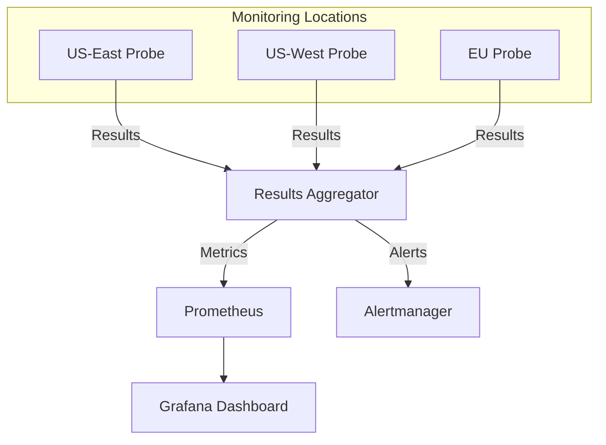

# How to Use Ansible to Set Up Synthetic Monitoring

Author: [nawazdhandala](https://www.github.com/nawazdhandala)

Tags: Ansible, Synthetic Monitoring, Testing, DevOps, Observability

Description: Deploy synthetic monitoring checks that simulate real user interactions using Ansible with Playwright, cURL-based probes, and multi-step API tests.

---

Synthetic monitoring goes beyond simple uptime checks. Instead of just asking "is this endpoint returning 200?", synthetic monitors simulate actual user journeys: logging in, navigating pages, submitting forms, completing checkout flows. If something breaks in your user experience, synthetic monitoring catches it before your users complain.

Setting up synthetic monitoring infrastructure manually is painful because you need monitoring agents in multiple locations, test scripts that stay in sync, and a way to report results. Ansible handles all of this by deploying the monitoring agents, distributing test scripts, and configuring the results pipeline. In this post, we will build a complete synthetic monitoring system using Ansible.

## Architecture



## Project Structure

```bash
synthetic-monitoring/
  inventory/
    hosts.ini
  group_vars/
    all.yml
  roles/
    synthetic-agent/
      tasks/main.yml
      templates/
      files/
        checks/
  files/
    checks/
      api-health.sh
      login-flow.sh
      checkout-flow.js
  site.yml
```

## Inventory

Deploy monitoring agents in multiple geographic locations for realistic results.

```ini
# inventory/hosts.ini
[synthetic_agents]
probe-us-east ansible_host=10.1.1.10 probe_location=us-east
probe-us-west ansible_host=10.2.1.10 probe_location=us-west
probe-eu     ansible_host=10.3.1.10 probe_location=eu-west

[results_aggregator]
monitor-01 ansible_host=10.0.1.10
```

## Variables

```yaml
# group_vars/all.yml
synthetic_check_dir: /opt/synthetic-checks
synthetic_results_dir: /var/lib/synthetic-results
synthetic_log_dir: /var/log/synthetic-monitoring

# Pushgateway for Prometheus metrics
pushgateway_url: "http://10.0.1.10:9091"

# Check definitions
synthetic_checks:
  - name: api_health
    type: curl
    schedule: "*/2 * * * *"  # Every 2 minutes
    timeout: 30
    script: api-health.sh
    targets:
      - url: "https://api.example.com/health"
        expected_status: 200
        expected_body: "ok"

  - name: login_flow
    type: curl
    schedule: "*/5 * * * *"  # Every 5 minutes
    timeout: 60
    script: login-flow.sh

  - name: homepage_load
    type: playwright
    schedule: "*/10 * * * *"  # Every 10 minutes
    timeout: 120
    script: homepage-load.js

  - name: checkout_flow
    type: playwright
    schedule: "*/15 * * * *"
    timeout: 180
    script: checkout-flow.js

# Alert thresholds
synthetic_failure_threshold: 2  # Alert after 2 consecutive failures
synthetic_latency_threshold_ms: 5000
```

## Synthetic Agent Role

```yaml
# roles/synthetic-agent/tasks/main.yml
---
- name: Create synthetic monitoring user
  ansible.builtin.user:
    name: synthetic
    system: yes
    shell: /bin/bash
    create_home: yes

- name: Install required packages
  ansible.builtin.apt:
    name:
      - curl
      - jq
      - bc
      - chromium-browser
      - nodejs
      - npm
    state: present
    update_cache: yes

- name: Install Playwright globally
  ansible.builtin.npm:
    name: playwright
    global: yes
  environment:
    PLAYWRIGHT_BROWSERS_PATH: /opt/playwright-browsers

- name: Install Playwright browsers
  ansible.builtin.command:
    cmd: npx playwright install chromium
  environment:
    PLAYWRIGHT_BROWSERS_PATH: /opt/playwright-browsers
  args:
    creates: /opt/playwright-browsers

- name: Create required directories
  ansible.builtin.file:
    path: "{{ item }}"
    state: directory
    owner: synthetic
    group: synthetic
    mode: '0755'
  loop:
    - "{{ synthetic_check_dir }}"
    - "{{ synthetic_results_dir }}"
    - "{{ synthetic_log_dir }}"

- name: Deploy check scripts
  ansible.builtin.template:
    src: "checks/{{ item.script }}.j2"
    dest: "{{ synthetic_check_dir }}/{{ item.script }}"
    owner: synthetic
    group: synthetic
    mode: '0755'
  loop: "{{ synthetic_checks }}"

- name: Deploy the check runner wrapper
  ansible.builtin.template:
    src: run-check.sh.j2
    dest: "{{ synthetic_check_dir }}/run-check.sh"
    owner: synthetic
    group: synthetic
    mode: '0755'

- name: Deploy metrics pusher script
  ansible.builtin.template:
    src: push-metrics.sh.j2
    dest: "{{ synthetic_check_dir }}/push-metrics.sh"
    owner: synthetic
    group: synthetic
    mode: '0755'

- name: Set up cron jobs for each check
  ansible.builtin.cron:
    name: "synthetic_{{ item.name }}"
    minute: "{{ item.schedule.split()[0] }}"
    hour: "{{ item.schedule.split()[1] }}"
    day: "{{ item.schedule.split()[2] }}"
    month: "{{ item.schedule.split()[3] }}"
    weekday: "{{ item.schedule.split()[4] }}"
    job: "{{ synthetic_check_dir }}/run-check.sh {{ item.name }} {{ item.script }} {{ item.timeout }} >> {{ synthetic_log_dir }}/{{ item.name }}.log 2>&1"
    user: synthetic
  loop: "{{ synthetic_checks }}"
```

## Check Runner Wrapper

This script runs each check, measures timing, and pushes results to Prometheus.

```jinja2
# roles/synthetic-agent/templates/run-check.sh.j2
#!/bin/bash
# Synthetic check runner - Managed by Ansible
# Usage: run-check.sh <check_name> <script> <timeout>

CHECK_NAME="$1"
SCRIPT="$2"
TIMEOUT="${3:-30}"
LOCATION="{{ probe_location | default('unknown') }}"
CHECK_DIR="{{ synthetic_check_dir }}"
RESULTS_DIR="{{ synthetic_results_dir }}"

# Record start time
START_TIME=$(date +%s%N)

# Run the check script with timeout
timeout "${TIMEOUT}" "${CHECK_DIR}/${SCRIPT}"
EXIT_CODE=$?

# Calculate duration in milliseconds
END_TIME=$(date +%s%N)
DURATION_MS=$(( (END_TIME - START_TIME) / 1000000 ))

# Determine status
if [ $EXIT_CODE -eq 0 ]; then
    STATUS="success"
    SUCCESS=1
elif [ $EXIT_CODE -eq 124 ]; then
    STATUS="timeout"
    SUCCESS=0
else
    STATUS="failure"
    SUCCESS=0
fi

# Log the result
echo "$(date -Iseconds) check=${CHECK_NAME} location=${LOCATION} status=${STATUS} duration_ms=${DURATION_MS} exit_code=${EXIT_CODE}"

# Save result to file for the metrics pusher
cat > "${RESULTS_DIR}/${CHECK_NAME}.json" <<EOF
{
  "check": "${CHECK_NAME}",
  "location": "${LOCATION}",
  "status": "${STATUS}",
  "success": ${SUCCESS},
  "duration_ms": ${DURATION_MS},
  "exit_code": ${EXIT_CODE},
  "timestamp": "$(date -Iseconds)"
}
EOF

# Push metrics to Prometheus Pushgateway
"${CHECK_DIR}/push-metrics.sh" "${CHECK_NAME}" "${SUCCESS}" "${DURATION_MS}" "${LOCATION}"
```

## Metrics Pusher

```jinja2
# roles/synthetic-agent/templates/push-metrics.sh.j2
#!/bin/bash
# Push synthetic check results to Prometheus Pushgateway
# Managed by Ansible

CHECK_NAME="$1"
SUCCESS="$2"
DURATION_MS="$3"
LOCATION="$4"
PUSHGATEWAY="{{ pushgateway_url }}"

# Push metrics in Prometheus exposition format
cat <<METRICS | curl -s --data-binary @- "${PUSHGATEWAY}/metrics/job/synthetic/check/${CHECK_NAME}/location/${LOCATION}"
# HELP synthetic_check_success Whether the synthetic check passed (1) or failed (0)
# TYPE synthetic_check_success gauge
synthetic_check_success{check="${CHECK_NAME}",location="${LOCATION}"} ${SUCCESS}
# HELP synthetic_check_duration_ms Duration of the synthetic check in milliseconds
# TYPE synthetic_check_duration_ms gauge
synthetic_check_duration_ms{check="${CHECK_NAME}",location="${LOCATION}"} ${DURATION_MS}
# HELP synthetic_check_timestamp_seconds Unix timestamp of when the check ran
# TYPE synthetic_check_timestamp_seconds gauge
synthetic_check_timestamp_seconds{check="${CHECK_NAME}",location="${LOCATION}"} $(date +%s)
METRICS
```

## API Health Check Script

A cURL-based check that verifies an API endpoint returns the expected response.

```jinja2
# roles/synthetic-agent/templates/checks/api-health.sh.j2
#!/bin/bash
# API health check - Managed by Ansible
# Tests that the API health endpoint returns 200 with expected body

ERRORS=0


# Check {{ target.url }}
RESPONSE=$(curl -s -o /tmp/api_health_body -w "%{http_code}|%{time_total}" \
  --max-time 10 \
  "{{ target.url }}")

HTTP_CODE=$(echo "$RESPONSE" | cut -d'|' -f1)
RESPONSE_TIME=$(echo "$RESPONSE" | cut -d'|' -f2)

if [ "$HTTP_CODE" != "{{ target.expected_status }}" ]; then
  echo "FAIL: {{ target.url }} returned $HTTP_CODE (expected {{ target.expected_status }})"
  ERRORS=$((ERRORS + 1))
fi


if ! grep -q "{{ target.expected_body }}" /tmp/api_health_body; then
  echo "FAIL: {{ target.url }} body missing expected content '{{ target.expected_body }}'"
  ERRORS=$((ERRORS + 1))
fi


echo "CHECK: {{ target.url }} status=$HTTP_CODE time=${RESPONSE_TIME}s"


exit $ERRORS
```

## Login Flow Check Script

A multi-step check that simulates a user login.

```jinja2
# roles/synthetic-agent/templates/checks/login-flow.sh.j2
#!/bin/bash
# Login flow synthetic check - Managed by Ansible
# Simulates a user logging in: GET login page, POST credentials, verify redirect

COOKIE_JAR=$(mktemp)
BASE_URL="https://app.example.com"

# Step 1: Load the login page
echo "Step 1: Loading login page..."
LOGIN_PAGE=$(curl -s -o /dev/null -w "%{http_code}" \
  --cookie-jar "$COOKIE_JAR" \
  --max-time 10 \
  "${BASE_URL}/login")

if [ "$LOGIN_PAGE" != "200" ]; then
  echo "FAIL: Login page returned $LOGIN_PAGE"
  rm -f "$COOKIE_JAR"
  exit 1
fi

# Step 2: Submit login credentials
echo "Step 2: Submitting login..."
LOGIN_RESULT=$(curl -s -o /dev/null -w "%{http_code}|%{redirect_url}" \
  --cookie "$COOKIE_JAR" \
  --cookie-jar "$COOKIE_JAR" \
  --max-time 10 \
  -X POST \
  -d "username=synthetic-monitor@example.com&password={{ vault_synthetic_password | default('test') }}" \
  "${BASE_URL}/login")

HTTP_CODE=$(echo "$LOGIN_RESULT" | cut -d'|' -f1)

if [ "$HTTP_CODE" != "302" ] && [ "$HTTP_CODE" != "200" ]; then
  echo "FAIL: Login POST returned $HTTP_CODE (expected 302 or 200)"
  rm -f "$COOKIE_JAR"
  exit 1
fi

# Step 3: Verify dashboard access
echo "Step 3: Verifying dashboard access..."
DASHBOARD=$(curl -s -o /tmp/dashboard_body -w "%{http_code}" \
  --cookie "$COOKIE_JAR" \
  --max-time 10 \
  "${BASE_URL}/dashboard")

if [ "$DASHBOARD" != "200" ]; then
  echo "FAIL: Dashboard returned $DASHBOARD after login"
  rm -f "$COOKIE_JAR"
  exit 1
fi

echo "SUCCESS: Login flow completed successfully"
rm -f "$COOKIE_JAR"
exit 0
```

## Playwright Browser Check

For full browser-based synthetic checks, use Playwright.

```jinja2
# roles/synthetic-agent/templates/checks/homepage-load.js.j2
// Homepage load synthetic check - Managed by Ansible
const { chromium } = require('playwright');

(async () => {
  const browser = await chromium.launch({
    headless: true,
    args: ['--no-sandbox', '--disable-setuid-sandbox']
  });

  try {
    const page = await browser.newPage();

    // Navigate to homepage and wait for full load
    const response = await page.goto('https://www.example.com', {
      waitUntil: 'networkidle',
      timeout: 30000
    });

    // Verify HTTP status
    if (response.status() !== 200) {
      console.error(`FAIL: Homepage returned status ${response.status()}`);
      process.exit(1);
    }

    // Verify key elements are present
    const title = await page.title();
    if (!title.includes('Example')) {
      console.error(`FAIL: Unexpected page title: ${title}`);
      process.exit(1);
    }

    // Check that the main navigation loaded
    const navVisible = await page.isVisible('nav.main-nav');
    if (!navVisible) {
      console.error('FAIL: Main navigation not visible');
      process.exit(1);
    }

    // Measure Core Web Vitals
    const metrics = await page.evaluate(() => {
      return JSON.stringify(performance.getEntriesByType('navigation')[0]);
    });
    const nav = JSON.parse(metrics);
    console.log(`Load time: ${nav.loadEventEnd - nav.startTime}ms`);
    console.log(`DOM Interactive: ${nav.domInteractive - nav.startTime}ms`);

    console.log('SUCCESS: Homepage loaded correctly');
    process.exit(0);

  } catch (error) {
    console.error(`FAIL: ${error.message}`);
    process.exit(1);
  } finally {
    await browser.close();
  }
})();
```

## Alert Rules for Synthetic Checks

```yaml
# roles/prometheus/templates/synthetic-alerts.yml.j2
groups:
  - name: synthetic_monitoring
    rules:
      - alert: SyntheticCheckFailing
        expr: synthetic_check_success == 0
        for: 5m
        labels:
          severity: critical
        annotations:
          summary: "Synthetic check {{ '{{ $labels.check }}' }} failing from {{ '{{ $labels.location }}' }}"

      - alert: SyntheticCheckSlow
        expr: synthetic_check_duration_ms > {{ synthetic_latency_threshold_ms }}
        for: 10m
        labels:
          severity: warning
        annotations:
          summary: "Synthetic check {{ '{{ $labels.check }}' }} is slow ({{ '{{ $value }}' }}ms)"
```

## Running the Playbook

```bash
# Deploy synthetic monitoring agents
ansible-playbook -i inventory/hosts.ini site.yml

# Deploy only check scripts (when adding new checks)
ansible-playbook -i inventory/hosts.ini site.yml --tags checks

# Test a specific check manually on a probe
ansible -i inventory/hosts.ini probe-us-east -m command -a "/opt/synthetic-checks/run-check.sh api_health api-health.sh 30" --become-user synthetic
```

## Wrapping Up

Synthetic monitoring gives you confidence that your application works from the user's perspective. With Ansible managing the deployment, you can spin up monitoring probes in new locations, add new check scripts, and keep everything consistent across all probe nodes. The combination of simple cURL-based checks for API endpoints and Playwright for browser-based flows covers most monitoring needs. The Prometheus integration means your synthetic check results sit alongside your other infrastructure metrics, making it easy to correlate user experience issues with backend problems.
