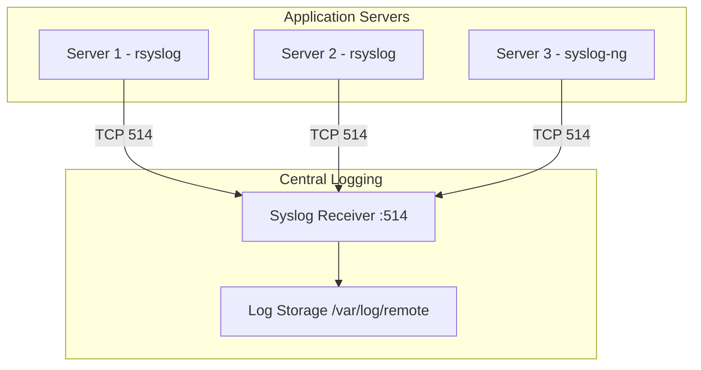

# How to Use Ansible to Configure Syslog Forwarding

Author: [nawazdhandala](https://www.github.com/nawazdhandala)

Tags: Ansible, Syslog, Logging, Linux, DevOps

Description: Automate syslog forwarding configuration across your Linux fleet using Ansible playbooks with rsyslog and syslog-ng examples.

---

Syslog forwarding is the backbone of centralized logging on Linux systems. Every Linux distribution ships with some variant of syslog, and getting all your servers to forward their logs to a central location is one of the first things you should automate. Doing it manually across dozens or hundreds of servers is error-prone and time-consuming. Ansible makes this a solved problem.

In this guide, I will cover how to configure syslog forwarding using both rsyslog (the default on most modern distros) and syslog-ng (common in enterprise environments). You will have playbooks that work across mixed fleets with minimal modification.

## Why Syslog Forwarding Matters

When an incident happens at 3 AM, you do not want to SSH into each server to read logs. With syslog forwarding, every log message lands in one place. This also helps with compliance requirements like PCI DSS and HIPAA, which mandate centralized log retention. And if a server dies, you still have its logs because they were forwarded before the failure.

## Architecture



## Project Layout

```bash
# Standard Ansible project structure
syslog-forwarding/
  inventory/
    hosts.ini
  group_vars/
    all.yml
  roles/
    rsyslog-client/
      tasks/main.yml
      templates/forwarding.conf.j2
      handlers/main.yml
    rsyslog-server/
      tasks/main.yml
      templates/server.conf.j2
      handlers/main.yml
    syslog-ng-client/
      tasks/main.yml
      templates/forwarding.conf.j2
      handlers/main.yml
  site.yml
```

## Inventory

Separate your servers into clients (log producers) and the central receiver.

```ini
# inventory/hosts.ini
[syslog_clients]
web-01 ansible_host=10.0.1.10
web-02 ansible_host=10.0.1.11
db-01 ansible_host=10.0.1.20

[syslog_clients:vars]
syslog_daemon=rsyslog

[syslog_ng_clients]
legacy-01 ansible_host=10.0.1.30

[syslog_ng_clients:vars]
syslog_daemon=syslog-ng

[syslog_server]
log-central ansible_host=10.0.2.10
```

## Shared Variables

```yaml
# group_vars/all.yml
syslog_server_ip: 10.0.2.10
syslog_server_port: 514
syslog_protocol: tcp
syslog_tls_enabled: false
syslog_facility_filter: "*.*"
syslog_queue_size: 10000
syslog_disk_queue_max: "1g"
```

## rsyslog Client Role

This role configures rsyslog to forward all messages to the central server.

```yaml
# roles/rsyslog-client/tasks/main.yml
---
- name: Install rsyslog
  ansible.builtin.package:
    name: rsyslog
    state: present

- name: Deploy forwarding configuration
  ansible.builtin.template:
    src: forwarding.conf.j2
    dest: /etc/rsyslog.d/50-forwarding.conf
    owner: root
    group: root
    mode: '0644'
    validate: 'rsyslogd -N1 -f %s'
  notify: Restart rsyslog

- name: Remove any conflicting default forwarding rules
  ansible.builtin.lineinfile:
    path: /etc/rsyslog.conf
    regexp: '^\*\.\*\s+@@?'
    state: absent
  notify: Restart rsyslog

- name: Ensure rsyslog is running
  ansible.builtin.service:
    name: rsyslog
    state: started
    enabled: yes
```

The forwarding template supports both TCP and UDP and includes disk-assisted queuing so logs are not lost during network outages.

```jinja2
# roles/rsyslog-client/templates/forwarding.conf.j2
# Syslog forwarding - Managed by Ansible
# Target: {{ syslog_server_ip }}:{{ syslog_server_port }}


# TLS configuration
$DefaultNetstreamDriverCAFile /etc/rsyslog.d/ca.pem
$DefaultNetstreamDriver gtls
$ActionSendStreamDriverMode 1
$ActionSendStreamDriverAuthMode anon


# Disk-assisted queue for reliability during outages
$ActionQueueType LinkedList
$ActionQueueFileName syslog_fwd
$ActionResumeRetryCount -1
$ActionQueueSaveOnShutdown on
$ActionQueueMaxDiskSpace {{ syslog_disk_queue_max }}
$ActionQueueSize {{ syslog_queue_size }}

# Forward all facility.severity combinations

{{ syslog_facility_filter }} @@{{ syslog_server_ip }}:{{ syslog_server_port }}

{{ syslog_facility_filter }} @{{ syslog_server_ip }}:{{ syslog_server_port }}

```

The handler for rsyslog restart.

```yaml
# roles/rsyslog-client/handlers/main.yml
---
- name: Restart rsyslog
  ansible.builtin.service:
    name: rsyslog
    state: restarted
```

## rsyslog Server Role

The receiving end needs to listen for incoming syslog connections and store them organized by hostname.

```yaml
# roles/rsyslog-server/tasks/main.yml
---
- name: Install rsyslog
  ansible.builtin.package:
    name: rsyslog
    state: present

- name: Create remote log directory
  ansible.builtin.file:
    path: /var/log/remote
    state: directory
    owner: syslog
    group: adm
    mode: '0755'

- name: Deploy server configuration
  ansible.builtin.template:
    src: server.conf.j2
    dest: /etc/rsyslog.d/40-server.conf
    owner: root
    group: root
    mode: '0644'
  notify: Restart rsyslog server

- name: Open firewall port for syslog
  ansible.builtin.iptables:
    chain: INPUT
    protocol: tcp
    destination_port: "{{ syslog_server_port }}"
    jump: ACCEPT
    state: present

- name: Ensure rsyslog is running
  ansible.builtin.service:
    name: rsyslog
    state: started
    enabled: yes
```

The server template configures listening and log organization.

```jinja2
# roles/rsyslog-server/templates/server.conf.j2
# Syslog server configuration - Managed by Ansible

# Load TCP input module
module(load="imtcp")
input(type="imtcp" port="{{ syslog_server_port }}")


# Load UDP input module
module(load="imudp")
input(type="imudp" port="{{ syslog_server_port }}")


# Store remote logs organized by hostname and program
$template RemoteLogs,"/var/log/remote/%HOSTNAME%/%PROGRAMNAME%.log"

# Apply template to all incoming remote logs
if $fromhost-ip != '127.0.0.1' then {
    *.* ?RemoteLogs
    & stop
}
```

## syslog-ng Client Role

For servers running syslog-ng instead of rsyslog, a separate role handles the different configuration syntax.

```yaml
# roles/syslog-ng-client/tasks/main.yml
---
- name: Install syslog-ng
  ansible.builtin.package:
    name: syslog-ng
    state: present

- name: Deploy syslog-ng forwarding configuration
  ansible.builtin.template:
    src: forwarding.conf.j2
    dest: /etc/syslog-ng/conf.d/forwarding.conf
    owner: root
    group: root
    mode: '0644'
  notify: Restart syslog-ng

- name: Ensure syslog-ng is running
  ansible.builtin.service:
    name: syslog-ng
    state: started
    enabled: yes
```

The syslog-ng template uses its own configuration language.

```jinja2
# roles/syslog-ng-client/templates/forwarding.conf.j2
# syslog-ng forwarding - Managed by Ansible

destination d_central {

    tcp("{{ syslog_server_ip }}" port({{ syslog_server_port }})
        disk-buffer(
            mem-buf-size(10M)
            disk-buf-size(2G)
            reliable(yes)
            dir("/var/spool/syslog-ng")
        )
    );

    udp("{{ syslog_server_ip }}" port({{ syslog_server_port }}));

};

log {
    source(s_src);
    destination(d_central);
};
```

```yaml
# roles/syslog-ng-client/handlers/main.yml
---
- name: Restart syslog-ng
  ansible.builtin.service:
    name: syslog-ng
    state: restarted
```

## Main Playbook

```yaml
# site.yml
---
- name: Configure rsyslog forwarding on clients
  hosts: syslog_clients
  become: yes
  roles:
    - rsyslog-client

- name: Configure syslog-ng forwarding on legacy clients
  hosts: syslog_ng_clients
  become: yes
  roles:
    - syslog-ng-client

- name: Set up the central syslog server
  hosts: syslog_server
  become: yes
  roles:
    - rsyslog-server
```

## Log Rotation on the Server

Do not forget to set up log rotation for the remote logs, otherwise the disk will fill up.

```yaml
# Add this task to roles/rsyslog-server/tasks/main.yml
- name: Configure log rotation for remote logs
  ansible.builtin.copy:
    dest: /etc/logrotate.d/remote-syslog
    content: |
      /var/log/remote/*/*.log {
          daily
          rotate {{ log_retention_days | default(30) }}
          compress
          delaycompress
          missingok
          notifempty
          create 0640 syslog adm
          sharedscripts
          postrotate
              /usr/lib/rsyslog/rsyslog-rotate
          endscript
      }
    owner: root
    group: root
    mode: '0644'
```

## Testing the Setup

Run this verification playbook after deployment to confirm everything works.

```yaml
# verify.yml
---
- name: Test syslog forwarding
  hosts: syslog_clients[0]
  become: yes
  tasks:
    - name: Send a test message
      ansible.builtin.command:
        cmd: logger -t ansible-verify "Syslog forwarding test {{ ansible_date_time.iso8601 }}"

- name: Verify on server
  hosts: syslog_server
  become: yes
  tasks:
    - name: Wait a moment for log delivery
      ansible.builtin.pause:
        seconds: 5

    - name: Check for test message in remote logs
      ansible.builtin.shell:
        cmd: "grep 'ansible-verify' /var/log/remote/*/syslog 2>/dev/null || grep 'ansible-verify' /var/log/remote/*/logger.log 2>/dev/null"
      register: verify_result

    - name: Show result
      ansible.builtin.debug:
        msg: "{{ verify_result.stdout_lines }}"
```

## Running the Playbook

```bash
# Deploy syslog forwarding across all servers
ansible-playbook -i inventory/hosts.ini site.yml

# Verify it is working
ansible-playbook -i inventory/hosts.ini verify.yml

# Run only against the clients if the server is already configured
ansible-playbook -i inventory/hosts.ini site.yml --limit syslog_clients
```

## Troubleshooting Tips

If logs are not arriving at the server, check these common issues:

1. Firewall rules blocking port 514 on the server
2. SELinux preventing rsyslog from writing to non-standard directories
3. The rsyslog service failed to restart due to a syntax error
4. DNS resolution failures if using hostnames instead of IPs

You can check rsyslog internals with this debug playbook.

```yaml
# debug-rsyslog.yml
---
- name: Debug rsyslog on a target host
  hosts: "{{ target_host }}"
  become: yes
  tasks:
    - name: Check rsyslog status
      ansible.builtin.command:
        cmd: systemctl status rsyslog
      register: status

    - name: Check rsyslog configuration validity
      ansible.builtin.command:
        cmd: rsyslogd -N1
      register: config_check

    - name: Show listening ports
      ansible.builtin.command:
        cmd: ss -tlnp | grep rsyslog
      register: ports

    - name: Display results
      ansible.builtin.debug:
        msg:
          - "Status: {{ status.stdout_lines[-3:] }}"
          - "Config: {{ config_check.stdout_lines }}"
          - "Ports: {{ ports.stdout_lines }}"
```

## Wrapping Up

Automating syslog forwarding with Ansible gives you a consistent, auditable logging infrastructure. Whether your fleet uses rsyslog or syslog-ng, Ansible handles the differences through separate roles while keeping the overall workflow identical. The disk-assisted queuing configuration ensures you do not lose logs during network hiccups, and the log rotation setup keeps your central server from running out of disk space. From here, you can layer on TLS encryption, structured logging, or shipping to external platforms like Elasticsearch or Splunk.
