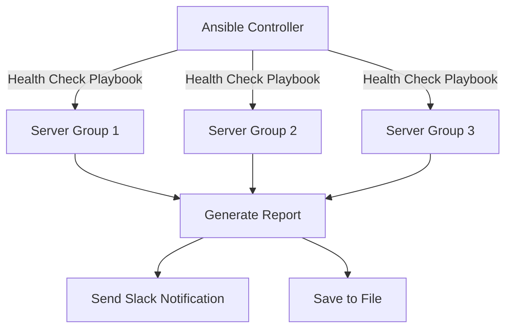

# How to Use Ansible to Configure System Health Checks

Author: [nawazdhandala](https://www.github.com/nawazdhandala)

Tags: Ansible, Health Checks, Monitoring, Linux, DevOps

Description: Build automated system health check playbooks with Ansible to monitor CPU, memory, disk, services, and network connectivity.

---

System health checks are something every operations team does, but they often happen manually or through ad-hoc scripts that nobody maintains. Ansible provides a structured way to run health checks across your entire fleet, report on the results, and even take corrective action automatically. Unlike monitoring agents that run continuously, Ansible health checks give you on-demand or scheduled snapshots of your infrastructure state.

This guide covers building comprehensive health check playbooks that inspect CPU, memory, disk usage, service status, network connectivity, and application endpoints. You will also learn how to generate reports and trigger alerts based on the results.

## What We Are Building



The Ansible controller runs health checks against all server groups, collects results, generates a summary report, and sends notifications if issues are found.

## Project Structure

```bash
health-checks/
  inventory/
    hosts.ini
  group_vars/
    all.yml
  roles/
    health-check/
      tasks/
        main.yml
        cpu.yml
        memory.yml
        disk.yml
        services.yml
        network.yml
        ports.yml
      defaults/main.yml
  health-check.yml
  report.yml
```

## Variables

Define thresholds that trigger warnings and critical alerts.

```yaml
# group_vars/all.yml
# CPU thresholds (percentage)
health_cpu_warning: 80
health_cpu_critical: 95

# Memory thresholds (percentage)
health_memory_warning: 80
health_memory_critical: 95

# Disk thresholds (percentage used)
health_disk_warning: 80
health_disk_critical: 90

# Load average threshold (multiplier of CPU count)
health_load_warning: 1.5
health_load_critical: 3.0

# Required services that must be running
health_required_services:
  - sshd
  - rsyslog
  - cron

# Network endpoints to check from each host
health_network_checks:
  - host: 8.8.8.8
    port: 53
    name: "DNS (Google)"
  - host: 10.0.0.1
    port: 443
    name: "Internal Gateway"

# Ports that should be listening on each host
health_required_ports: []

# Slack notification webhook
health_slack_webhook: "{{ vault_slack_webhook | default('') }}"
health_slack_channel: "#infra-health"

# Report output directory
health_report_dir: /tmp/health-reports
```

## CPU Health Check

```yaml
# roles/health-check/tasks/cpu.yml
---
- name: Get CPU core count
  ansible.builtin.command:
    cmd: nproc
  register: cpu_cores
  changed_when: false

- name: Get current CPU usage
  ansible.builtin.shell:
    cmd: "top -bn1 | grep 'Cpu(s)' | awk '{print $2}'"
  register: cpu_usage_raw
  changed_when: false

- name: Get load average
  ansible.builtin.command:
    cmd: "awk '{print $1}' /proc/loadavg"
  register: load_avg
  changed_when: false

- name: Set CPU facts
  ansible.builtin.set_fact:
    cpu_usage: "{{ cpu_usage_raw.stdout | float }}"
    cpu_count: "{{ cpu_cores.stdout | int }}"
    load_average: "{{ load_avg.stdout | float }}"

- name: Evaluate CPU status
  ansible.builtin.set_fact:
    cpu_status: >-
      CRITICAL
      WARNING
      OK

- name: Evaluate load average status
  ansible.builtin.set_fact:
    load_status: >-
      CRITICAL
      WARNING
      OK

- name: Record CPU health result
  ansible.builtin.set_fact:
    health_results: "{{ health_results | default([]) + [{'check': 'CPU Usage', 'value': cpu_usage ~ '%', 'status': cpu_status | trim}, {'check': 'Load Average', 'value': load_average ~ ' (' ~ cpu_count ~ ' cores)', 'status': load_status | trim}] }}"
```

## Memory Health Check

```yaml
# roles/health-check/tasks/memory.yml
---
- name: Gather memory facts
  ansible.builtin.setup:
    filter: ansible_memory_mb

- name: Calculate memory usage percentage
  ansible.builtin.set_fact:
    memory_total: "{{ ansible_memory_mb.real.total }}"
    memory_used: "{{ ansible_memory_mb.real.total - ansible_memory_mb.real.free - (ansible_memory_mb.nocache.free - ansible_memory_mb.real.free) | abs }}"
    memory_pct: "{{ ((ansible_memory_mb.real.used / ansible_memory_mb.real.total) * 100) | round(1) }}"

- name: Get swap usage
  ansible.builtin.shell:
    cmd: "free -m | awk '/Swap/ {if($2>0) printf \"%.1f\", $3/$2*100; else print \"0\"}'"
  register: swap_usage_raw
  changed_when: false

- name: Evaluate memory status
  ansible.builtin.set_fact:
    memory_status: >-
      CRITICAL
      WARNING
      OK

- name: Record memory health result
  ansible.builtin.set_fact:
    health_results: "{{ health_results | default([]) + [{'check': 'Memory Usage', 'value': memory_pct ~ '% (' ~ memory_used ~ '/' ~ memory_total ~ ' MB)', 'status': memory_status | trim}, {'check': 'Swap Usage', 'value': swap_usage_raw.stdout ~ '%', 'status': 'OK'}] }}"
```

## Disk Health Check

```yaml
# roles/health-check/tasks/disk.yml
---
- name: Get disk usage for all mounted filesystems
  ansible.builtin.shell:
    cmd: "df -h --output=target,pcent,size,avail -x tmpfs -x devtmpfs | tail -n +2"
  register: disk_usage
  changed_when: false

- name: Parse and evaluate disk usage
  ansible.builtin.set_fact:
    disk_results: []

- name: Check each filesystem
  ansible.builtin.set_fact:
    disk_results: >-
      {{ disk_results + [{
        'check': 'Disk ' ~ item.split()[0],
        'value': item.split()[1] ~ ' used (' ~ item.split()[3] ~ ' free of ' ~ item.split()[2] ~ ')',
        'status': 'CRITICAL' if (item.split()[1] | replace('%','') | int) > health_disk_critical
                  else ('WARNING' if (item.split()[1] | replace('%','') | int) > health_disk_warning
                  else 'OK')
      }] }}
  loop: "{{ disk_usage.stdout_lines }}"
  when: item | trim | length > 0

- name: Append disk results to health results
  ansible.builtin.set_fact:
    health_results: "{{ health_results | default([]) + disk_results }}"
```

## Service Health Check

```yaml
# roles/health-check/tasks/services.yml
---
- name: Check required services
  ansible.builtin.systemd:
    name: "{{ item }}"
  register: service_states
  loop: "{{ health_required_services }}"
  ignore_errors: yes

- name: Record service health results
  ansible.builtin.set_fact:
    health_results: "{{ health_results | default([]) + [{
      'check': 'Service ' ~ item.item,
      'value': item.status.ActiveState | default('unknown'),
      'status': 'OK' if item.status.ActiveState | default('') == 'active' else 'CRITICAL'
    }] }}"
  loop: "{{ service_states.results }}"
```

## Network Connectivity Check

```yaml
# roles/health-check/tasks/network.yml
---
- name: Check network connectivity to required endpoints
  ansible.builtin.wait_for:
    host: "{{ item.host }}"
    port: "{{ item.port }}"
    timeout: 5
    state: started
  register: network_checks
  loop: "{{ health_network_checks }}"
  ignore_errors: yes

- name: Record network health results
  ansible.builtin.set_fact:
    health_results: "{{ health_results | default([]) + [{
      'check': 'Network ' ~ item.item.name,
      'value': item.item.host ~ ':' ~ item.item.port,
      'status': 'OK' if not item.failed else 'CRITICAL'
    }] }}"
  loop: "{{ network_checks.results }}"
```

## Main Health Check Task

```yaml
# roles/health-check/tasks/main.yml
---
- name: Initialize health results
  ansible.builtin.set_fact:
    health_results: []

- name: Run CPU checks
  ansible.builtin.include_tasks: cpu.yml

- name: Run memory checks
  ansible.builtin.include_tasks: memory.yml

- name: Run disk checks
  ansible.builtin.include_tasks: disk.yml

- name: Run service checks
  ansible.builtin.include_tasks: services.yml

- name: Run network checks
  ansible.builtin.include_tasks: network.yml

- name: Display health results
  ansible.builtin.debug:
    msg: |
      === Health Report for {{ inventory_hostname }} ===
      
      [{{ result.status }}] {{ result.check }}: {{ result.value }}
      

- name: Set overall host health status
  ansible.builtin.set_fact:
    host_health_status: >-
      CRITICAL
      WARNING
      OK
```

## Main Playbook

```yaml
# health-check.yml
---
- name: Run system health checks
  hosts: all
  become: yes
  gather_facts: yes
  roles:
    - health-check

- name: Generate health report
  hosts: localhost
  gather_facts: no
  tasks:
    - name: Create report directory
      ansible.builtin.file:
        path: "{{ health_report_dir }}"
        state: directory
        mode: '0755'

    - name: Generate health report file
      ansible.builtin.template:
        src: health-report.j2
        dest: "{{ health_report_dir }}/health-report-{{ ansible_date_time.date }}.txt"
      vars:
        all_results: "{{ hostvars }}"

    - name: Send Slack notification if issues found
      ansible.builtin.uri:
        url: "{{ health_slack_webhook }}"
        method: POST
        body_format: json
        body:
          channel: "{{ health_slack_channel }}"
          text: >-
            Infrastructure Health Check Summary:
            
            {{ host }}: {{ hostvars[host].host_health_status | default('UNKNOWN') | trim }}
            
      when: health_slack_webhook | length > 0
```

## Running Health Checks

```bash
# Run health checks across all servers
ansible-playbook -i inventory/hosts.ini health-check.yml

# Check only specific server group
ansible-playbook -i inventory/hosts.ini health-check.yml --limit webservers

# Run as a cron job every hour
# Add to crontab:
# 0 * * * * ansible-playbook -i /path/to/inventory/hosts.ini /path/to/health-check.yml
```

## Wrapping Up

These health check playbooks give you a structured, repeatable way to validate the state of your infrastructure. The modular task structure means you can easily add new checks (like NTP sync status, kernel version verification, or certificate expiry) without touching the existing ones. Running this as a scheduled job through cron gives you regular health snapshots, and the Slack integration ensures you hear about problems quickly. For teams that already use Ansible for configuration management, this is a natural extension that keeps everything in one toolchain.
