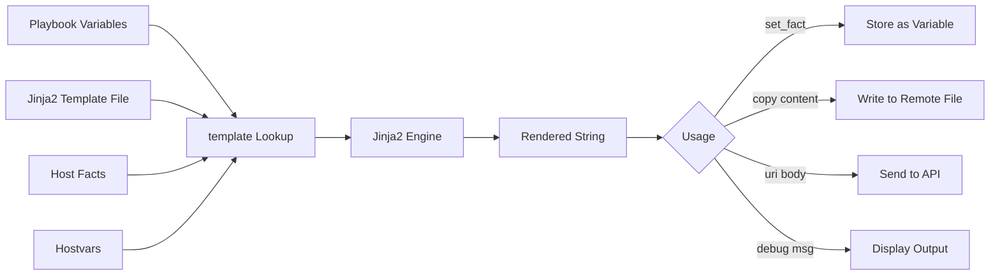

# How to Use the Ansible template Lookup Plugin

Author: [nawazdhandala](https://www.github.com/nawazdhandala)

Tags: Ansible, Lookup Plugins, Templates, Jinja2, Configuration

Description: Learn how to use the Ansible template lookup plugin to render Jinja2 templates inline and use the result as a string in playbooks.

---

The `template` lookup plugin renders a Jinja2 template file on the Ansible control node and returns the rendered content as a string. This is different from the `template` module, which renders a template and writes it to a file on the remote host. The template lookup gives you the rendered content as a variable, which you can then use in other tasks, pass to APIs, or embed within larger configurations.

## How the template Lookup Works

The template lookup takes a path to a Jinja2 template file, renders it using the current Ansible variable context (all vars, facts, and hostvars are available), and returns the result as a string. The rendering happens on the control node, not on the remote host.

Basic syntax:

```yaml
"{{ lookup('template', 'templates/mytemplate.j2') }}"
```

## Basic Usage

Here is a simple example that renders a template and uses the result:

```yaml
# basic_template_lookup.yml - Render template inline
---
- name: Use template lookup
  hosts: all
  gather_facts: true
  vars:
    app_name: myapp
    app_port: 8080
  tasks:
    - name: Render config template and show result
      ansible.builtin.debug:
        msg: "{{ lookup('template', 'templates/app.conf.j2') }}"

    - name: Store rendered template in a variable
      ansible.builtin.set_fact:
        rendered_config: "{{ lookup('template', 'templates/app.conf.j2') }}"

    - name: Use the rendered content
      ansible.builtin.debug:
        msg: "Config length: {{ rendered_config | length }} characters"
```

With this template file:

```jinja2
# templates/app.conf.j2 - Application configuration
# Generated for {{ inventory_hostname }}
app_name = {{ app_name }}
app_port = {{ app_port }}
hostname = {{ ansible_hostname }}
os = {{ ansible_distribution }} {{ ansible_distribution_version }}
```

## Comparing template Lookup vs template Module

The key difference is in what happens with the rendered content:

```yaml
# comparison.yml - template lookup vs template module
---
- name: Compare template lookup and module
  hosts: all
  become: true
  vars:
    app_name: myapp
  tasks:
    # Template MODULE - renders and writes to remote file
    - name: Template module writes file to remote host
      ansible.builtin.template:
        src: templates/app.conf.j2
        dest: /etc/myapp/app.conf
        mode: '0644'

    # Template LOOKUP - renders and returns string
    - name: Template lookup returns string content
      ansible.builtin.set_fact:
        config_string: "{{ lookup('template', 'templates/app.conf.j2') }}"

    # Then you can do anything with that string
    - name: Use rendered string in copy module
      ansible.builtin.copy:
        content: "{{ config_string }}"
        dest: /etc/myapp/app.conf
        mode: '0644'
```

## Rendering Config for API Calls

One of the most useful patterns is rendering a template and sending it to an API:

```yaml
# api_config.yml - Render template and send to API
---
- name: Deploy configuration via API
  hosts: localhost
  connection: local
  vars:
    service_name: web-frontend
    replicas: 3
    memory_limit: 512
  tasks:
    - name: Render Kubernetes deployment manifest
      ansible.builtin.set_fact:
        k8s_manifest: "{{ lookup('template', 'templates/deployment.yml.j2') | from_yaml }}"

    - name: Apply Kubernetes manifest
      kubernetes.core.k8s:
        state: present
        definition: "{{ k8s_manifest }}"
```

```jinja2
# templates/deployment.yml.j2 - Kubernetes deployment template
apiVersion: apps/v1
kind: Deployment
metadata:
  name: {{ service_name }}
  labels:
    app: {{ service_name }}
spec:
  replicas: {{ replicas }}
  selector:
    matchLabels:
      app: {{ service_name }}
  template:
    metadata:
      labels:
        app: {{ service_name }}
    spec:
      containers:
        - name: {{ service_name }}
          image: registry.example.com/{{ service_name }}:latest
          resources:
            limits:
              memory: {{ memory_limit }}Mi
          ports:
            - containerPort: 8080
```

## Rendering Multiple Templates

Process multiple templates and combine them:

```yaml
# multi_template.yml - Render and combine multiple templates
---
- name: Render multiple configuration sections
  hosts: all
  become: true
  vars:
    nginx_workers: 4
    upstream_servers:
      - 10.0.1.10:8080
      - 10.0.1.11:8080
    ssl_enabled: true
  tasks:
    - name: Render each config section
      ansible.builtin.set_fact:
        nginx_main: "{{ lookup('template', 'templates/nginx/main.conf.j2') }}"
        nginx_upstream: "{{ lookup('template', 'templates/nginx/upstream.conf.j2') }}"
        nginx_server: "{{ lookup('template', 'templates/nginx/server.conf.j2') }}"

    - name: Combine into final config
      ansible.builtin.copy:
        content: |
          {{ nginx_main }}

          {{ nginx_upstream }}

          {{ nginx_server }}
        dest: /etc/nginx/nginx.conf
        mode: '0644'
      notify: Reload Nginx

  handlers:
    - name: Reload Nginx
      ansible.builtin.service:
        name: nginx
        state: reloaded
```

## Using Variables in Template Path

You can dynamically select templates based on variables:

```yaml
# dynamic_template.yml - Select template dynamically
---
- name: Dynamic template selection
  hosts: all
  become: true
  vars:
    app_type: nodejs
  tasks:
    - name: Render environment-specific config
      ansible.builtin.set_fact:
        app_config: "{{ lookup('template', 'templates/' + app_type + '/config.j2') }}"

    - name: Render OS-specific config
      ansible.builtin.set_fact:
        os_config: "{{ lookup('template', 'templates/' + ansible_os_family | lower + '/system.conf.j2') }}"

    - name: Deploy both configs
      ansible.builtin.copy:
        content: "{{ item.content }}"
        dest: "{{ item.dest }}"
        mode: '0644'
      loop:
        - { content: "{{ app_config }}", dest: /etc/myapp/config.yml }
        - { content: "{{ os_config }}", dest: /etc/myapp/system.conf }
```

## Template Lookup with Hostvars

The template lookup has access to all hostvars, which lets you render templates with data from other hosts:

```yaml
# hostvars_template.yml - Use hostvars in template lookup
---
- name: Generate configs using hostvars
  hosts: load_balancers
  become: true
  tasks:
    - name: Render HAProxy config with all webserver IPs
      ansible.builtin.set_fact:
        haproxy_config: "{{ lookup('template', 'templates/haproxy.cfg.j2') }}"

    - name: Deploy HAProxy configuration
      ansible.builtin.copy:
        content: "{{ haproxy_config }}"
        dest: /etc/haproxy/haproxy.cfg
        mode: '0644'
```

```jinja2
# templates/haproxy.cfg.j2 - HAProxy config using hostvars
backend webservers
    balance roundrobin

    server {{ host }} {{ hostvars[host]['ansible_host'] }}:8080 check

```

## Generating Email or Notification Content

The template lookup is useful for generating notification messages:

```yaml
# notification.yml - Generate notification content from template
---
- name: Deploy and notify
  hosts: webservers
  become: true
  vars:
    app_version: "2.5.0"
    deploy_env: production
    changes:
      - "Fixed authentication bug"
      - "Added caching layer"
      - "Updated dependencies"
  tasks:
    - name: Deploy application
      ansible.builtin.debug:
        msg: "Deploying {{ app_version }}..."

    - name: Generate Slack notification
      ansible.builtin.set_fact:
        slack_message: "{{ lookup('template', 'templates/slack-deploy.j2') }}"

    - name: Send Slack notification
      ansible.builtin.uri:
        url: "{{ lookup('env', 'SLACK_WEBHOOK_URL') }}"
        method: POST
        body_format: json
        body:
          text: "{{ slack_message }}"
      when: lookup('env', 'SLACK_WEBHOOK_URL') | length > 0
      delegate_to: localhost
```

```jinja2
# templates/slack-deploy.j2 - Slack deployment notification
Deployment Complete
Environment: {{ deploy_env }}
Version: {{ app_version }}
Hosts: {{ ansible_play_hosts | join(', ') }}
Changes:

- {{ change }}

Time: {{ ansible_date_time.iso8601 }}
```

## Rendering Templates with Custom Variables

Pass extra variables to the template at render time:

```yaml
# custom_vars.yml - Template lookup with variable overrides
---
- name: Render templates with custom variables
  hosts: all
  tasks:
    - name: Render for each service
      ansible.builtin.debug:
        msg: "{{ lookup('template', 'templates/service.conf.j2', template_vars=dict(service_name=item.name, service_port=item.port)) }}"
      loop:
        - { name: web, port: 80 }
        - { name: api, port: 3000 }
        - { name: worker, port: 8080 }
```

## Inline Template Rendering

For simple templates, you can use the template lookup with inline content rather than a file:

```yaml
# inline_template.yml - Render inline Jinja2 string
---
- name: Inline template rendering
  hosts: all
  vars:
    servers:
      - { name: web1, ip: 10.0.1.10 }
      - { name: web2, ip: 10.0.1.11 }
      - { name: web3, ip: 10.0.1.12 }
  tasks:
    - name: Render hosts entries from inline template
      ansible.builtin.set_fact:
        hosts_entries: |
          
          {{ server.ip }}  {{ server.name }}.internal {{ server.name }}
          

    - name: Add entries to /etc/hosts
      ansible.builtin.blockinfile:
        path: /etc/hosts
        block: "{{ hosts_entries }}"
        marker: "# {mark} ANSIBLE MANAGED INTERNAL HOSTS"
```

## Template Lookup Flow



## Key Differences from the template Module

The template lookup returns a string. The template module writes a file. Use the lookup when you need the rendered content as data, for example when sending it to an API, combining it with other content, or storing it in a variable for conditional logic. Use the module when you simply need to write a rendered file to a remote host.

Both the lookup and the module have access to the same variable context, and both support the full Jinja2 feature set including filters, tests, macros, and includes. The template lookup is a tool you will reach for when you need more flexibility than "render this template and save it as a file."
