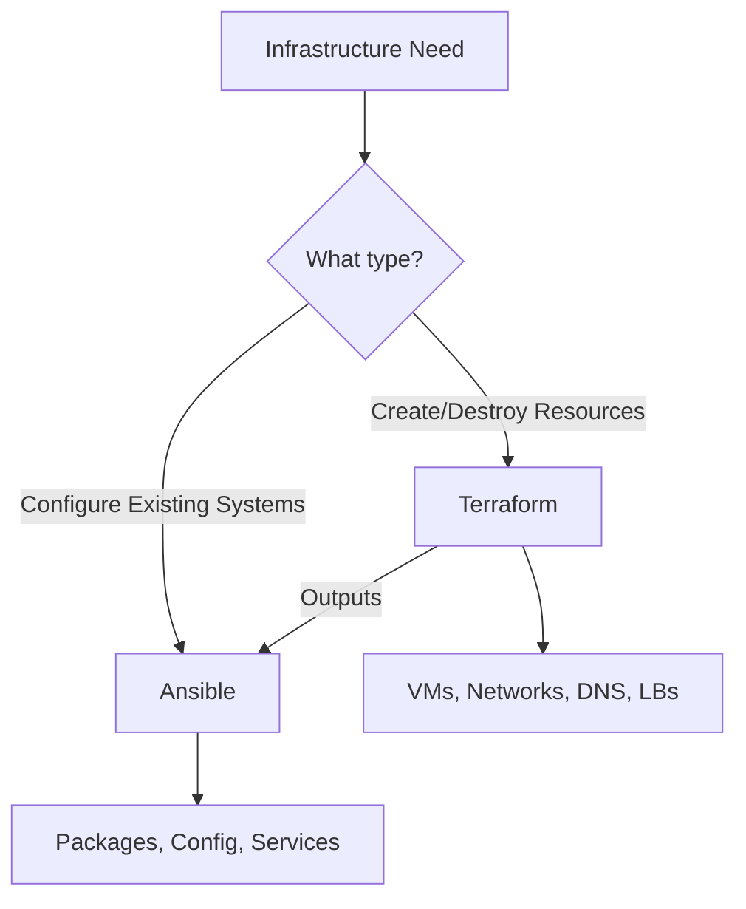

# How to Use Ansible and Terraform Together Effectively

Author: [nawazdhandala](https://www.github.com/nawazdhandala)

Tags: Ansible, Terraform, IaC, DevOps, Infrastructure

Description: Learn how to combine Terraform for infrastructure provisioning and Ansible for configuration management to build a complete IaC workflow.

---

Terraform and Ansible are complementary tools that solve different problems. Terraform excels at provisioning infrastructure: creating VMs, networks, load balancers, and cloud resources. Ansible excels at configuring those resources: installing software, deploying applications, and managing system state. Using them together gives you the best of both worlds.

## When to Use Which



## The Standard Workflow

1. Terraform creates the infrastructure (VMs, networks, security groups)
2. Terraform outputs the IP addresses and connection details
3. Ansible uses those outputs to configure the servers
4. Ansible deploys applications and manages ongoing state

## Project Structure

```
infrastructure/
  terraform/
    main.tf
    variables.tf
    outputs.tf
    terraform.tfvars
  ansible/
    inventory/
      terraform_inventory.py
    playbook.yml
    roles/
  scripts/
    deploy.sh
```

## Terraform Creates Infrastructure

```hcl
# terraform/main.tf - Create VMs
resource "aws_instance" "web" {
  count         = 3
  ami           = var.ami_id
  instance_type = var.instance_type
  key_name      = var.ssh_key_name
  subnet_id     = var.subnet_id

  vpc_security_group_ids = [aws_security_group.web.id]

  tags = {
    Name = "web-${count.index + 1}"
    Role = "webserver"
  }
}

# Output the IPs for Ansible
output "web_ips" {
  value = aws_instance.web[*].public_ip
}

output "web_private_ips" {
  value = aws_instance.web[*].private_ip
}
```

## Generate Ansible Inventory from Terraform

```bash
#!/bin/bash
# scripts/deploy.sh - Combined Terraform + Ansible workflow

# Step 1: Apply Terraform
cd terraform
terraform init
terraform apply -auto-approve

# Step 2: Generate Ansible inventory
terraform output -json web_ips | jq -r '.[]' | while read ip; do
  echo "$ip ansible_user=ubuntu ansible_ssh_private_key_file=~/.ssh/deploy.pem"
done > ../ansible/inventory/hosts.ini

# Add group header
sed -i '1i [webservers]' ../ansible/inventory/hosts.ini

# Step 3: Wait for SSH to be ready
sleep 30

# Step 4: Run Ansible
cd ../ansible
ansible-playbook -i inventory/hosts.ini playbook.yml
```

## Ansible Configures the Servers

```yaml
# ansible/playbook.yml - Configure Terraform-created servers
---
- hosts: webservers
  become: yes
  roles:
    - common
    - nginx
    - app_deploy
```

## Handling the SSH Wait Problem

New VMs take time before SSH is available:

```yaml
# In your Ansible playbook, wait for SSH
- hosts: webservers
  gather_facts: false
  tasks:
    - name: Wait for SSH to become available
      wait_for_connection:
        timeout: 300
        delay: 10

    - name: Now gather facts
      setup:
```

## Summary

Terraform and Ansible together cover the full infrastructure lifecycle. Let Terraform handle the "what" (what resources exist) and Ansible handle the "how" (how those resources are configured). Keep them in the same repository but separate directories, and use a deployment script that orchestrates both tools in sequence.

## Common Use Cases

Here are several practical scenarios where this module proves essential in real-world playbooks.

### Infrastructure Provisioning Workflow

```yaml
# Complete workflow incorporating this module
- name: Infrastructure provisioning
  hosts: all
  become: true
  gather_facts: true
  tasks:
    - name: Gather system information
      ansible.builtin.setup:
        gather_subset:
          - hardware
          - network

    - name: Display system summary
      ansible.builtin.debug:
        msg: >-
          Host {{ inventory_hostname }} has
          {{ ansible_memtotal_mb }}MB RAM,
          {{ ansible_processor_vcpus }} vCPUs,
          running {{ ansible_distribution }} {{ ansible_distribution_version }}

    - name: Install required packages
      ansible.builtin.package:
        name:
          - curl
          - wget
          - git
          - vim
          - htop
          - jq
        state: present

    - name: Configure system timezone
      ansible.builtin.timezone:
        name: "{{ system_timezone | default('UTC') }}"

    - name: Configure hostname
      ansible.builtin.hostname:
        name: "{{ inventory_hostname }}"

    - name: Update /etc/hosts
      ansible.builtin.lineinfile:
        path: /etc/hosts
        regexp: '^127\.0\.1\.1'
        line: "127.0.1.1 {{ inventory_hostname }}"

    - name: Configure SSH hardening
      ansible.builtin.lineinfile:
        path: /etc/ssh/sshd_config
        regexp: "{{ item.regexp }}"
        line: "{{ item.line }}"
      loop:
        - { regexp: '^PermitRootLogin', line: 'PermitRootLogin no' }
        - { regexp: '^PasswordAuthentication', line: 'PasswordAuthentication no' }
      notify: restart sshd

    - name: Configure firewall rules
      community.general.ufw:
        rule: allow
        port: "{{ item }}"
        proto: tcp
      loop:
        - "22"
        - "80"
        - "443"

    - name: Enable firewall
      community.general.ufw:
        state: enabled
        policy: deny

  handlers:
    - name: restart sshd
      ansible.builtin.service:
        name: sshd
        state: restarted
```

### Integration with Monitoring

```yaml
# Using gathered facts to configure monitoring thresholds
- name: Configure monitoring based on system specs
  hosts: all
  become: true
  tasks:
    - name: Set monitoring thresholds based on hardware
      ansible.builtin.template:
        src: monitoring_config.yml.j2
        dest: /etc/monitoring/config.yml
      vars:
        memory_warning_threshold: "{{ (ansible_memtotal_mb * 0.8) | int }}"
        memory_critical_threshold: "{{ (ansible_memtotal_mb * 0.95) | int }}"
        cpu_warning_threshold: 80
        cpu_critical_threshold: 95

    - name: Register host with monitoring system
      ansible.builtin.uri:
        url: "https://monitoring.example.com/api/hosts"
        method: POST
        body_format: json
        body:
          hostname: "{{ inventory_hostname }}"
          ip_address: "{{ ansible_default_ipv4.address }}"
          os: "{{ ansible_distribution }}"
          memory_mb: "{{ ansible_memtotal_mb }}"
          cpus: "{{ ansible_processor_vcpus }}"
        headers:
          Authorization: "Bearer {{ monitoring_api_token }}"
        status_code: [200, 201, 409]
```

### Error Handling Patterns

```yaml
# Robust error handling with this module
- name: Robust task execution
  hosts: all
  tasks:
    - name: Attempt primary operation
      ansible.builtin.command: /opt/app/primary-task.sh
      register: primary_result
      failed_when: false

    - name: Handle primary failure with fallback
      ansible.builtin.command: /opt/app/fallback-task.sh
      when: primary_result.rc != 0
      register: fallback_result

    - name: Report final status
      ansible.builtin.debug:
        msg: >-
          Task completed via {{ 'primary' if primary_result.rc == 0 else 'fallback' }} path.
          Return code: {{ primary_result.rc if primary_result.rc == 0 else fallback_result.rc }}

    - name: Fail if both paths failed
      ansible.builtin.fail:
        msg: "Both primary and fallback operations failed"
      when:
        - primary_result.rc != 0
        - fallback_result is defined
        - fallback_result.rc != 0
```

### Scheduling and Automation

```yaml
# Set up scheduled compliance scans using cron
- name: Configure automated scans
  hosts: all
  become: true
  tasks:
    - name: Create scan script
      ansible.builtin.copy:
        dest: /opt/scripts/compliance_scan.sh
        mode: '0755'
        content: |
          #!/bin/bash
          cd /opt/ansible
          ansible-playbook playbooks/validate.yml -i inventory/ > /var/log/compliance_scan.log 2>&1
          EXIT_CODE=$?
          if [ $EXIT_CODE -ne 0 ]; then
            curl -X POST https://hooks.example.com/alert \
              -H "Content-Type: application/json" \
              -d "{\"text\":\"Compliance scan failed on $(hostname)\"}"
          fi
          exit $EXIT_CODE

    - name: Schedule weekly compliance scan
      ansible.builtin.cron:
        name: "Weekly compliance scan"
        minute: "0"
        hour: "3"
        weekday: "1"
        job: "/opt/scripts/compliance_scan.sh"
        user: ansible
```

