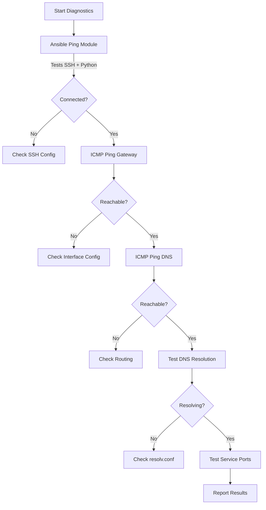

# How to Use Ansible to Test Network Connectivity with ping Module

Author: [nawazdhandala](https://www.github.com/nawazdhandala)

Tags: Ansible, Networking, Troubleshooting, DevOps, Monitoring

Description: Learn how to use Ansible ping and related modules to test network connectivity, verify host reachability, and diagnose connection issues.

---

When managing a fleet of servers, one of the first things you need to know is whether your hosts are reachable. Ansible provides several modules for testing connectivity, and they serve different purposes. The `ansible.builtin.ping` module tests Ansible's ability to connect to and execute on a remote host. The `ansible.builtin.command` module running the system `ping` command tests ICMP-level network connectivity. Understanding the difference and knowing when to use each is essential for effective troubleshooting.

## The Ansible ping Module vs System Ping

This is a common point of confusion. The Ansible `ping` module does NOT send ICMP packets. It connects to the target host via SSH (or whatever connection plugin you are using), executes a tiny Python script, and returns "pong" if successful. It tests the entire Ansible connection chain: SSH connectivity, Python availability, and basic execution capability.

If you need actual ICMP ping (like the `ping` command you run in a terminal), you use the `command` or `shell` module to run the system's ping binary.

## Basic Ansible Ping

The simplest connectivity test across your entire inventory:

```yaml
# ping_all.yml - Test Ansible connectivity to all hosts
---
- name: Test Ansible connectivity
  hosts: all
  gather_facts: false
  tasks:
    - name: Ping all hosts
      ansible.builtin.ping:
      register: ping_result

    - name: Show ping result
      ansible.builtin.debug:
        var: ping_result
```

You can also run this as an ad-hoc command, which is how most people use it day to day:

```bash
# Quick connectivity check against all hosts
ansible all -m ping

# Check specific group
ansible webservers -m ping

# Check single host
ansible db01 -m ping

# Use a specific inventory file
ansible all -i inventory.yml -m ping

# Increase verbosity for debugging connection issues
ansible all -m ping -vvv
```

## Ping with Custom Data

The ping module accepts a `data` parameter. By default it returns "pong", but you can change it:

```yaml
# custom_ping.yml - Ping with custom response data
---
- name: Custom ping test
  hosts: all
  gather_facts: false
  tasks:
    - name: Ping with custom data
      ansible.builtin.ping:
        data: "alive"
      register: result

    - name: Verify custom response
      ansible.builtin.assert:
        that:
          - result.ping == "alive"
        fail_msg: "Host did not respond with expected data"
        success_msg: "Host is alive and responding correctly"
```

## ICMP Ping Using command Module

For actual network-layer connectivity testing (ICMP ping), use the command module:

```yaml
# icmp_ping.yml - Test ICMP connectivity between hosts
---
- name: Test ICMP network connectivity
  hosts: all
  become: true
  vars:
    targets:
      - name: Gateway
        ip: 10.0.1.1
      - name: DNS Server
        ip: 8.8.8.8
      - name: Internal API
        ip: 10.0.2.50
  tasks:
    - name: Ping each target with 3 packets
      ansible.builtin.command: "ping -c 3 -W 2 {{ item.ip }}"
      loop: "{{ targets }}"
      loop_control:
        label: "{{ item.name }} ({{ item.ip }})"
      register: ping_results
      changed_when: false
      ignore_errors: true

    - name: Report connectivity status
      ansible.builtin.debug:
        msg: >
          {{ item.item.name }} ({{ item.item.ip }}):
          {{ 'REACHABLE' if item.rc == 0 else 'UNREACHABLE' }}
      loop: "{{ ping_results.results }}"
      loop_control:
        label: "{{ item.item.name }}"
```

## Testing TCP Port Connectivity

ICMP ping only tells you that the host is up. It does not tell you if a specific service is reachable. Use the `wait_for` module to test TCP port connectivity:

```yaml
# port_check.yml - Test TCP port connectivity
---
- name: Test service port connectivity
  hosts: app_servers
  gather_facts: false
  vars:
    services_to_check:
      - host: db01.internal
        port: 5432
        name: PostgreSQL
      - host: redis01.internal
        port: 6379
        name: Redis
      - host: rabbitmq01.internal
        port: 5672
        name: RabbitMQ
      - host: elasticsearch01.internal
        port: 9200
        name: Elasticsearch
  tasks:
    - name: Check TCP connectivity to each service
      ansible.builtin.wait_for:
        host: "{{ item.host }}"
        port: "{{ item.port }}"
        timeout: 5
        state: started
      loop: "{{ services_to_check }}"
      loop_control:
        label: "{{ item.name }} on {{ item.host }}:{{ item.port }}"
      register: port_results
      ignore_errors: true

    - name: Report port check results
      ansible.builtin.debug:
        msg: >
          {{ item.item.name }} ({{ item.item.host }}:{{ item.item.port }}):
          {{ 'OPEN' if item is not failed else 'CLOSED/UNREACHABLE' }}
      loop: "{{ port_results.results }}"
      loop_control:
        label: "{{ item.item.name }}"
```

## Comprehensive Network Diagnostic Playbook

Here is a more complete diagnostic playbook that tests multiple layers of connectivity:

```yaml
# network_diagnostic.yml - Full network connectivity diagnostic
---
- name: Network connectivity diagnostics
  hosts: all
  become: true
  gather_facts: true
  vars:
    gateway: "{{ ansible_default_ipv4.gateway }}"
    dns_servers:
      - 8.8.8.8
      - 1.1.1.1
    external_hosts:
      - google.com
      - github.com
  tasks:
    - name: Test Ansible connectivity
      ansible.builtin.ping:
      register: ansible_ping

    - name: Test gateway reachability
      ansible.builtin.command: "ping -c 2 -W 2 {{ gateway }}"
      register: gateway_ping
      changed_when: false
      ignore_errors: true

    - name: Test DNS server reachability
      ansible.builtin.command: "ping -c 2 -W 2 {{ item }}"
      loop: "{{ dns_servers }}"
      register: dns_ping
      changed_when: false
      ignore_errors: true

    - name: Test DNS resolution
      ansible.builtin.command: "nslookup {{ item }}"
      loop: "{{ external_hosts }}"
      register: dns_resolution
      changed_when: false
      ignore_errors: true

    - name: Test external connectivity
      ansible.builtin.command: "ping -c 2 -W 2 {{ item }}"
      loop: "{{ external_hosts }}"
      register: external_ping
      changed_when: false
      ignore_errors: true

    - name: Test HTTP connectivity
      ansible.builtin.uri:
        url: "https://{{ item }}"
        method: GET
        timeout: 5
        status_code: [200, 301, 302]
      loop: "{{ external_hosts }}"
      register: http_check
      ignore_errors: true

    - name: Compile diagnostic report
      ansible.builtin.debug:
        msg:
          - "=== Network Diagnostic Report for {{ inventory_hostname }} ==="
          - "Ansible connectivity: {{ 'OK' if ansible_ping.ping == 'pong' else 'FAILED' }}"
          - "Gateway ({{ gateway }}): {{ 'OK' if gateway_ping.rc == 0 else 'FAILED' }}"
          - "DNS resolution: {{ 'OK' if dns_resolution.results[0].rc == 0 else 'FAILED' }}"
          - "External ping: {{ 'OK' if external_ping.results[0].rc == 0 else 'FAILED' }}"
          - "HTTPS: {{ 'OK' if http_check.results[0] is not failed else 'FAILED' }}"
```

## Using wait_for_connection After Changes

When you make network changes (like reconfiguring interfaces or restarting networking), use `wait_for_connection` to wait until Ansible can reconnect:

```yaml
# reconnect_after_change.yml - Wait for host to come back after network change
---
- name: Apply network change and verify reconnection
  hosts: all
  become: true
  tasks:
    - name: Restart networking service
      ansible.builtin.service:
        name: networking
        state: restarted
      async: 30
      poll: 0

    - name: Wait for host to come back
      ansible.builtin.wait_for_connection:
        delay: 5
        timeout: 60
        sleep: 2

    - name: Verify we are reconnected
      ansible.builtin.ping:

    - name: Continue with remaining tasks
      ansible.builtin.debug:
        msg: "Host is back online and ready"
```

## Testing Cross-Host Connectivity

Sometimes you need to verify that servers in one group can reach servers in another group:

```yaml
# cross_host_ping.yml - Test connectivity between host groups
---
- name: Test app-to-database connectivity
  hosts: app_servers
  gather_facts: false
  tasks:
    - name: Ping each database server
      ansible.builtin.command: "ping -c 2 -W 2 {{ item }}"
      loop: "{{ groups['database_servers'] }}"
      register: db_ping
      changed_when: false
      ignore_errors: true

    - name: Check database port from app servers
      ansible.builtin.wait_for:
        host: "{{ item }}"
        port: 5432
        timeout: 5
      loop: "{{ groups['database_servers'] }}"
      register: db_port_check
      ignore_errors: true

    - name: Report cross-host connectivity
      ansible.builtin.debug:
        msg: "{{ inventory_hostname }} -> {{ item.item }}: {{ 'OK' if item is not failed else 'FAILED' }}"
      loop: "{{ db_port_check.results }}"
      loop_control:
        label: "{{ item.item }}"
```

## Connectivity Testing Flow



## When to Use Each Method

Use the Ansible `ping` module when you want to verify that Ansible can manage a host. Use ICMP ping (via the command module) when you need to verify network-layer connectivity. Use `wait_for` when you need to check if a specific TCP service is reachable. Use `wait_for_connection` when you need Ansible to pause and retry until a host becomes available again after a disruptive change. Each serves a distinct purpose, and combining them gives you a complete picture of your network health.
