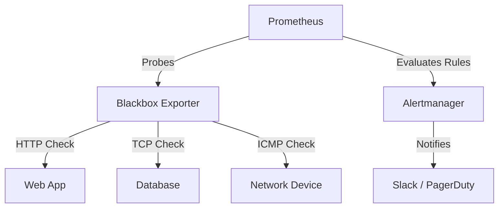

# How to Use Ansible to Set Up Uptime Monitoring

Author: [nawazdhandala](https://www.github.com/nawazdhandala)

Tags: Ansible, Monitoring, Uptime, DevOps, Observability

Description: Deploy and configure uptime monitoring for your services and endpoints using Ansible with Prometheus Blackbox Exporter and custom checks.

---

Knowing whether your services are up or down sounds like it should be simple, but getting reliable uptime monitoring across your infrastructure takes more effort than most people expect. You need HTTP checks, TCP port checks, certificate validation, and alerting that actually works. Ansible lets you deploy all of this consistently and keep the monitoring configuration in sync with your actual infrastructure.

This guide covers deploying a complete uptime monitoring solution using Ansible. We will use Prometheus with Blackbox Exporter for the checks, and set up alerting through Alertmanager. Everything gets defined in code, so your monitoring configuration lives right alongside your infrastructure definitions.

## What We Are Building



Prometheus scrapes targets through Blackbox Exporter, which performs the actual probes. When a target goes down, Prometheus fires an alert to Alertmanager, which routes notifications to the appropriate channels.

## Inventory and Variables

Define the services you want to monitor as Ansible variables.

```yaml
# group_vars/monitoring.yml
prometheus_version: "2.49.1"
blackbox_exporter_version: "0.24.0"

# HTTP endpoints to monitor
uptime_http_targets:
  - name: "Production API"
    url: "https://api.example.com/health"
    expected_status: 200
    interval: 30s
    timeout: 10s

  - name: "Customer Portal"
    url: "https://portal.example.com"
    expected_status: 200
    interval: 30s
    timeout: 10s

  - name: "Admin Dashboard"
    url: "https://admin.example.com/login"
    expected_status: 200
    interval: 60s
    timeout: 15s

# TCP endpoints to monitor
uptime_tcp_targets:
  - name: "PostgreSQL Primary"
    host: "db-primary.internal:5432"
    interval: 15s
    timeout: 5s

  - name: "Redis Cache"
    host: "redis.internal:6379"
    interval: 15s
    timeout: 5s

# ICMP ping targets
uptime_icmp_targets:
  - name: "Core Router"
    host: "10.0.0.1"
    interval: 15s

  - name: "Backup Server"
    host: "10.0.5.10"
    interval: 30s

# Alerting configuration
alert_slack_webhook: "https://hooks.slack.com/services/xxx/yyy/zzz"
alert_slack_channel: "#ops-alerts"
uptime_alert_threshold: "2m"
```

## Blackbox Exporter Role

First, deploy Blackbox Exporter, which handles the actual probe execution.

```yaml
# roles/blackbox-exporter/tasks/main.yml
---
- name: Create blackbox_exporter system user
  ansible.builtin.user:
    name: blackbox_exporter
    system: yes
    shell: /usr/sbin/nologin
    create_home: no

- name: Download blackbox_exporter binary
  ansible.builtin.get_url:
    url: "https://github.com/prometheus/blackbox_exporter/releases/download/v{{ blackbox_exporter_version }}/blackbox_exporter-{{ blackbox_exporter_version }}.linux-amd64.tar.gz"
    dest: /tmp/blackbox_exporter.tar.gz

- name: Extract blackbox_exporter
  ansible.builtin.unarchive:
    src: /tmp/blackbox_exporter.tar.gz
    dest: /usr/local/bin/
    remote_src: yes
    extra_opts:
      - --strip-components=1
      - --wildcards
      - "*/blackbox_exporter"

- name: Create configuration directory
  ansible.builtin.file:
    path: /etc/blackbox_exporter
    state: directory
    owner: blackbox_exporter
    group: blackbox_exporter
    mode: '0755'

- name: Deploy blackbox_exporter configuration
  ansible.builtin.template:
    src: blackbox.yml.j2
    dest: /etc/blackbox_exporter/blackbox.yml
    owner: blackbox_exporter
    group: blackbox_exporter
    mode: '0644'
  notify: Restart blackbox_exporter

- name: Deploy systemd service file
  ansible.builtin.template:
    src: blackbox_exporter.service.j2
    dest: /etc/systemd/system/blackbox_exporter.service
    mode: '0644'
  notify:
    - Reload systemd
    - Restart blackbox_exporter

- name: Start blackbox_exporter
  ansible.builtin.service:
    name: blackbox_exporter
    state: started
    enabled: yes
```

The Blackbox Exporter configuration defines probe types.

```jinja2
# roles/blackbox-exporter/templates/blackbox.yml.j2
# Managed by Ansible
modules:
  http_2xx:
    prober: http
    timeout: 10s
    http:
      valid_http_versions: ["HTTP/1.1", "HTTP/2.0"]
      valid_status_codes: [200]
      method: GET
      follow_redirects: true
      preferred_ip_protocol: "ip4"
      tls_config:
        insecure_skip_verify: false

  http_custom:
    prober: http
    timeout: 15s
    http:
      valid_http_versions: ["HTTP/1.1", "HTTP/2.0"]
      method: GET
      follow_redirects: true

  tcp_connect:
    prober: tcp
    timeout: 5s

  icmp_check:
    prober: icmp
    timeout: 5s
    icmp:
      preferred_ip_protocol: "ip4"
```

The systemd service file.

```jinja2
# roles/blackbox-exporter/templates/blackbox_exporter.service.j2
[Unit]
Description=Blackbox Exporter
Wants=network-online.target
After=network-online.target

[Service]
User=blackbox_exporter
Group=blackbox_exporter
Type=simple
ExecStart=/usr/local/bin/blackbox_exporter \
  --config.file=/etc/blackbox_exporter/blackbox.yml \
  --web.listen-address=:9115
Restart=always
RestartSec=5

# Allow ICMP probes
AmbientCapabilities=CAP_NET_RAW

[Install]
WantedBy=multi-user.target
```

## Prometheus Configuration for Uptime Checks

Configure Prometheus to scrape Blackbox Exporter with your target list.

```jinja2
# roles/prometheus/templates/prometheus.yml.j2 (uptime-specific scrape configs)
# Managed by Ansible

scrape_configs:
  # Scrape Prometheus itself
  - job_name: 'prometheus'
    static_configs:
      - targets: ['localhost:9090']

  # HTTP uptime checks
  - job_name: 'uptime_http'
    metrics_path: /probe
    params:
      module: [http_2xx]
    static_configs:
      - targets:

          - {{ target.url }}  # {{ target.name }}

    relabel_configs:
      - source_labels: [__address__]
        target_label: __param_target
      - source_labels: [__param_target]
        target_label: instance
      - target_label: __address__
        replacement: localhost:9115

  # TCP uptime checks
  - job_name: 'uptime_tcp'
    metrics_path: /probe
    params:
      module: [tcp_connect]
    static_configs:
      - targets:

          - {{ target.host }}  # {{ target.name }}

    relabel_configs:
      - source_labels: [__address__]
        target_label: __param_target
      - source_labels: [__param_target]
        target_label: instance
      - target_label: __address__
        replacement: localhost:9115

  # ICMP uptime checks
  - job_name: 'uptime_icmp'
    metrics_path: /probe
    params:
      module: [icmp_check]
    static_configs:
      - targets:

          - {{ target.host }}  # {{ target.name }}

    relabel_configs:
      - source_labels: [__address__]
        target_label: __param_target
      - source_labels: [__param_target]
        target_label: instance
      - target_label: __address__
        replacement: localhost:9115
```

## Alert Rules for Downtime

Define alerting rules that trigger when a target is unreachable.

```yaml
# roles/prometheus/templates/uptime-alerts.yml.j2
groups:
  - name: uptime_alerts
    rules:
      - alert: EndpointDown
        expr: probe_success == 0
        for: {{ uptime_alert_threshold }}
        labels:
          severity: critical
        annotations:
          summary: "Endpoint {{ '{{ $labels.instance }}' }} is down"
          description: "The endpoint {{ '{{ $labels.instance }}' }} has been unreachable for more than {{ uptime_alert_threshold }}."

      - alert: SSLCertExpiringSoon
        expr: probe_ssl_earliest_cert_expiry - time() < 86400 * 14
        for: 1h
        labels:
          severity: warning
        annotations:
          summary: "SSL certificate for {{ '{{ $labels.instance }}' }} expires in less than 14 days"

      - alert: HighLatency
        expr: probe_duration_seconds > 5
        for: 5m
        labels:
          severity: warning
        annotations:
          summary: "High latency on {{ '{{ $labels.instance }}' }}"
          description: "Response time is {{ '{{ $value }}' }}s, which exceeds 5 seconds."

      - alert: HTTPStatusError
        expr: probe_http_status_code != 200 and probe_http_status_code != 0
        for: 2m
        labels:
          severity: warning
        annotations:
          summary: "HTTP status {{ '{{ $value }}' }} on {{ '{{ $labels.instance }}' }}"
```

## Alertmanager Configuration

Route alerts to Slack when endpoints go down.

```jinja2
# roles/alertmanager/templates/alertmanager.yml.j2
global:
  resolve_timeout: 5m

route:
  group_by: ['alertname', 'instance']
  group_wait: 30s
  group_interval: 5m
  repeat_interval: 4h
  receiver: 'slack-ops'

  routes:
    - match:
        severity: critical
      receiver: 'slack-ops'
      repeat_interval: 1h

receivers:
  - name: 'slack-ops'
    slack_configs:
      - api_url: '{{ alert_slack_webhook }}'
        channel: '{{ alert_slack_channel }}'
        title: '{{ "{{ .GroupLabels.alertname }}" }}'
        text: >-
          {{ "{{ range .Alerts }}" }}
          *{{ "{{ .Annotations.summary }}" }}*
          {{ "{{ .Annotations.description }}" }}
          {{ "{{ end }}" }}
        send_resolved: true
```

## Main Playbook

```yaml
# site.yml
---
- name: Deploy uptime monitoring stack
  hosts: monitoring
  become: yes
  roles:
    - blackbox-exporter
    - prometheus
    - alertmanager
```

## Adding New Endpoints

The beauty of this setup is that adding a new endpoint to monitor is just adding a line to your variables file and running the playbook again.

```yaml
# Just add a new entry to group_vars/monitoring.yml
uptime_http_targets:
  # ... existing targets ...
  - name: "New Microservice"
    url: "https://new-service.example.com/healthz"
    expected_status: 200
    interval: 30s
    timeout: 10s
```

Then apply the change.

```bash
# Update monitoring configuration with new targets
ansible-playbook -i inventory/hosts.ini site.yml --tags prometheus-config
```

## Verification Playbook

After deployment, verify the monitoring stack is functioning.

```yaml
# verify-uptime.yml
---
- name: Verify uptime monitoring
  hosts: monitoring
  become: yes
  tasks:
    - name: Check Blackbox Exporter is responding
      ansible.builtin.uri:
        url: http://localhost:9115/metrics
        status_code: 200

    - name: Check Prometheus is responding
      ansible.builtin.uri:
        url: http://localhost:9090/-/healthy
        status_code: 200

    - name: Query probe results from Prometheus
      ansible.builtin.uri:
        url: "http://localhost:9090/api/v1/query?query=probe_success"
        method: GET
      register: probe_results

    - name: Show current probe status
      ansible.builtin.debug:
        msg: "{{ probe_results.json.data.result | map(attribute='metric') | list }}"
```

## Wrapping Up

With this Ansible-based approach, your uptime monitoring configuration is version-controlled, repeatable, and easy to update. When you add new services to your infrastructure, adding monitoring is just a variable change and a playbook run. The Blackbox Exporter handles HTTP, TCP, and ICMP probes out of the box, while Prometheus provides reliable alerting through Alertmanager. This setup scales well from monitoring a handful of services to hundreds of endpoints.
