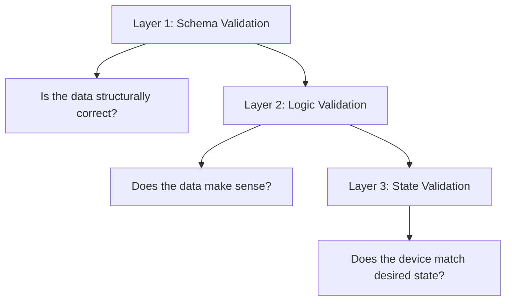

# How to Use Ansible to Validate Network Configuration Data

Author: [nawazdhandala](https://www.github.com/nawazdhandala)

Tags: Ansible, Validation, Network Automation, Data Quality

Description: Learn how to validate network configuration data with Ansible before deployment to catch errors early and prevent misconfigurations in production.

---

Every network outage caused by a configuration error has the same root cause: bad data made it into production without being validated. A typo in an IP address, a VLAN ID out of range, or a missing subnet mask can take down a network segment. Ansible gives you tools to validate your configuration data before it touches a device, turning what would have been a production incident into a pre-deployment catch.

This post covers techniques for validating network configuration data at every stage: before the playbook runs, during execution, and after deployment.

## The Validation Mindset

Think of validation in three layers:



- **Schema validation** checks that your variables have the right types, required fields are present, and values are within expected ranges.
- **Logic validation** checks that the data makes sense in context. No duplicate IPs, VLANs referenced in ports exist in the VLAN list, etc.
- **State validation** checks that the device configuration matches what you intended after deployment.

## Schema Validation with ansible.utils.validate

The `ansible.utils` collection includes a `validate` module that checks data against JSON Schema definitions.

```yaml
# validate_schema.yml - Validate variable data against JSON schemas
---
- name: Validate network configuration data
  hosts: localhost
  gather_facts: false

  vars:
    # Example network device configuration data
    device_config:
      hostname: "core-rtr01"
      management_ip: "10.1.1.1"
      interfaces:
        - name: "GigabitEthernet0/0"
          description: "WAN Uplink"
          ip_address: "203.0.113.1/30"
          enabled: true
        - name: "GigabitEthernet0/1"
          description: "LAN Segment"
          ip_address: "10.1.1.1/24"
          enabled: true
      vlans:
        - id: 10
          name: "MANAGEMENT"
        - id: 20
          name: "SERVERS"

    # JSON Schema for device configuration
    device_schema:
      type: object
      required:
        - hostname
        - management_ip
        - interfaces
      properties:
        hostname:
          type: string
          pattern: "^[a-zA-Z][a-zA-Z0-9_-]+$"
          minLength: 3
          maxLength: 63
        management_ip:
          type: string
          pattern: "^\\d{1,3}\\.\\d{1,3}\\.\\d{1,3}\\.\\d{1,3}$"
        interfaces:
          type: array
          minItems: 1
          items:
            type: object
            required:
              - name
              - ip_address
              - enabled
            properties:
              name:
                type: string
              description:
                type: string
                maxLength: 240
              ip_address:
                type: string
                pattern: "^\\d{1,3}\\.\\d{1,3}\\.\\d{1,3}\\.\\d{1,3}/\\d{1,2}$"
              enabled:
                type: boolean
        vlans:
          type: array
          items:
            type: object
            required:
              - id
              - name
            properties:
              id:
                type: integer
                minimum: 1
                maximum: 4094
              name:
                type: string
                pattern: "^[a-zA-Z][a-zA-Z0-9_-]*$"
                maxLength: 32

  tasks:
    - name: Validate device configuration against schema
      ansible.utils.validate:
        data: "{{ device_config }}"
        criteria:
          - "{{ device_schema }}"
        engine: ansible.utils.jsonschema
      register: validation_result
      ignore_errors: true

    - name: Report validation result
      ansible.builtin.debug:
        msg: "{{ 'PASS: Configuration data is valid' if validation_result is succeeded else 'FAIL: ' + validation_result.msg }}"
```

## Using assert for Logic Validation

The `assert` module is perfect for checking business logic and relationships between data elements.

```yaml
# validate_logic.yml - Check logical consistency of network configuration data
---
- name: Validate configuration logic
  hosts: localhost
  gather_facts: false

  vars:
    site_config:
      vlans:
        - id: 10
          name: MANAGEMENT
        - id: 20
          name: SERVERS
        - id: 30
          name: USERS
      access_ports:
        - name: Gi0/1
          vlan: 20
        - name: Gi0/2
          vlan: 30
        - name: Gi0/3
          vlan: 50
      l3_interfaces:
        - name: Vlan10
          ip: 10.1.10.1/24
        - name: Vlan20
          ip: 10.1.20.1/24
        - name: Loopback0
          ip: 10.255.0.1/32

  tasks:
    # Check: No duplicate VLAN IDs
    - name: Check for duplicate VLAN IDs
      ansible.builtin.assert:
        that:
          - site_config.vlans | map(attribute='id') | list | unique | length == site_config.vlans | length
        fail_msg: "Duplicate VLAN IDs detected!"
        success_msg: "No duplicate VLAN IDs"

    # Check: No duplicate VLAN names
    - name: Check for duplicate VLAN names
      ansible.builtin.assert:
        that:
          - site_config.vlans | map(attribute='name') | list | unique | length == site_config.vlans | length
        fail_msg: "Duplicate VLAN names detected!"
        success_msg: "No duplicate VLAN names"

    # Check: Access ports reference valid VLANs
    - name: Get list of defined VLAN IDs
      ansible.builtin.set_fact:
        defined_vlans: "{{ site_config.vlans | map(attribute='id') | list }}"

    - name: Verify access port VLANs exist
      ansible.builtin.assert:
        that:
          - item.vlan in defined_vlans
        fail_msg: "Port {{ item.name }} references VLAN {{ item.vlan }} which is not defined!"
        success_msg: "Port {{ item.name }} VLAN {{ item.vlan }} is valid"
      loop: "{{ site_config.access_ports }}"
      ignore_errors: true

    # Check: No duplicate IP addresses across interfaces
    - name: Check for duplicate IPs
      ansible.builtin.set_fact:
        all_ips: "{{ site_config.l3_interfaces | map(attribute='ip') | map('regex_replace', '/.*', '') | list }}"

    - name: Verify no duplicate IPs
      ansible.builtin.assert:
        that:
          - all_ips | unique | length == all_ips | length
        fail_msg: "Duplicate IP addresses found: {{ all_ips | difference(all_ips | unique) }}"
        success_msg: "No duplicate IP addresses"

    # Check: VLAN IDs are in valid range
    - name: Verify VLAN IDs in range
      ansible.builtin.assert:
        that:
          - item.id >= 1
          - item.id <= 4094
          - item.id != 1002
          - item.id != 1003
          - item.id != 1004
          - item.id != 1005
        fail_msg: "VLAN {{ item.id }} ({{ item.name }}) is out of range or reserved!"
        success_msg: "VLAN {{ item.id }} is valid"
      loop: "{{ site_config.vlans }}"
```

## IP Address Validation

Network data often includes IP addresses that need thorough validation.

```yaml
# validate_ips.yml - Comprehensive IP address validation
---
- name: Validate IP address data
  hosts: localhost
  gather_facts: false

  vars:
    interfaces:
      - name: Gi0/0
        ip: 10.1.1.1/24
        gateway: 10.1.1.254
      - name: Gi0/1
        ip: 10.1.2.1/24
        gateway: 10.1.2.254

  tasks:
    # Validate IP address format using ipaddr filter
    - name: Validate IP addresses
      ansible.builtin.assert:
        that:
          - item.ip | ansible.utils.ipaddr('address')
        fail_msg: "Invalid IP address on {{ item.name }}: {{ item.ip }}"
        success_msg: "{{ item.name }}: {{ item.ip }} is valid"
      loop: "{{ interfaces }}"

    # Verify gateway is in the same subnet as the interface
    - name: Verify gateway is in interface subnet
      ansible.builtin.assert:
        that:
          - item.gateway | ansible.utils.ipaddr(item.ip | ansible.utils.ipaddr('network/prefix'))
        fail_msg: "Gateway {{ item.gateway }} is not in the subnet of {{ item.name }} ({{ item.ip }})"
        success_msg: "Gateway {{ item.gateway }} is in subnet of {{ item.name }}"
      loop: "{{ interfaces }}"

    # Check for RFC1918 addresses on WAN interfaces
    - name: Flag public IPs on internal interfaces
      ansible.builtin.debug:
        msg: "INFO: {{ item.name }} has {{ 'private' if (item.ip | ansible.utils.ipaddr('private')) else 'PUBLIC' }} IP"
      loop: "{{ interfaces }}"
```

## Pre-Deployment Validation Playbook

Put all validations together into a single pre-deployment check.

```yaml
# pre_deploy_validate.yml - Complete pre-deployment validation suite
---
- name: Pre-deployment data validation
  hosts: network_devices
  gather_facts: false
  connection: local

  vars:
    validation_errors: []

  tasks:
    # Validate hostname format
    - name: Check hostname format
      ansible.builtin.set_fact:
        validation_errors: "{{ validation_errors + ['Invalid hostname: ' + inventory_hostname] }}"
      when: not (inventory_hostname | regex_search('^[a-zA-Z][a-zA-Z0-9_-]{2,62}$'))

    # Validate management IP is set
    - name: Check management IP is defined
      ansible.builtin.set_fact:
        validation_errors: "{{ validation_errors + ['Management IP not defined for ' + inventory_hostname] }}"
      when: ansible_host is not defined

    # Validate interface configurations
    - name: Check interface data completeness
      ansible.builtin.set_fact:
        validation_errors: "{{ validation_errors + ['Interface ' + item.name + ' on ' + inventory_hostname + ' missing IP address'] }}"
      loop: "{{ l3_interfaces | default([]) }}"
      when: item.ip is not defined

    # Validate NTP servers are defined
    - name: Check NTP configuration
      ansible.builtin.set_fact:
        validation_errors: "{{ validation_errors + ['NTP servers not defined for ' + inventory_hostname] }}"
      when: ntp_servers is not defined or ntp_servers | length == 0

    # Report all validation errors at once
    - name: Report validation results
      ansible.builtin.debug:
        msg: "VALIDATION PASSED for {{ inventory_hostname }}"
      when: validation_errors | length == 0

    - name: Report validation failures
      ansible.builtin.fail:
        msg: |
          VALIDATION FAILED for {{ inventory_hostname }}:
          
          - {{ error }}
          
      when: validation_errors | length > 0
```

## Post-Deployment State Validation

After pushing configuration, validate that the device state matches expectations.

```yaml
# validate_state.yml - Verify device state matches desired configuration
---
- name: Post-deployment state validation
  hosts: network_devices
  gather_facts: false
  connection: network_cli

  tasks:
    # Gather current device state
    - name: Gather interface state
      cisco.ios.ios_interfaces:
        state: gathered
      register: actual_interfaces

    - name: Gather VLAN state
      cisco.ios.ios_vlans:
        state: gathered
      register: actual_vlans

    # Compare actual vs desired interfaces
    - name: Validate interface descriptions
      ansible.builtin.assert:
        that:
          - actual_item.description == item.description
        fail_msg: "Interface {{ item.name }}: description mismatch (wanted '{{ item.description }}', got '{{ actual_item.description | default('none') }}')"
        success_msg: "Interface {{ item.name }}: description matches"
      loop: "{{ desired_interfaces | default([]) }}"
      vars:
        actual_item: "{{ actual_interfaces.gathered | selectattr('name', 'equalto', item.name) | first | default({}) }}"
      when: actual_item | length > 0
      ignore_errors: true

    # Validate VLANs exist
    - name: Verify required VLANs exist
      ansible.builtin.assert:
        that:
          - item.id in (actual_vlans.gathered | map(attribute='vlan_id') | list)
        fail_msg: "VLAN {{ item.id }} ({{ item.name }}) is missing from the device!"
        success_msg: "VLAN {{ item.id }} exists"
      loop: "{{ required_vlans | default([]) }}"
      ignore_errors: true

    # Verify connectivity
    - name: Ping gateway from device
      cisco.ios.ios_command:
        commands:
          - "ping {{ item }} repeat 3"
      register: ping_results
      loop: "{{ critical_destinations | default([]) }}"

    - name: Validate reachability
      ansible.builtin.assert:
        that:
          - "'Success rate is 100 percent' in item.stdout[0]"
        fail_msg: "Cannot reach {{ item.item }} from {{ inventory_hostname }}"
        success_msg: "{{ item.item }} is reachable"
      loop: "{{ ping_results.results | default([]) }}"
```

## Validation as a CI/CD Gate

Integrate validation into your CI/CD pipeline so bad data never makes it to production.

```yaml
# ci_validate.yml - Validation playbook for CI/CD pipeline
---
- name: CI/CD network config validation
  hosts: all
  gather_facts: false
  connection: local

  tasks:
    - name: Load device configuration
      ansible.builtin.include_vars:
        dir: "host_vars/{{ inventory_hostname }}"
      ignore_errors: true

    - name: Run schema validation
      ansible.utils.validate:
        data: "{{ device_config | default({}) }}"
        criteria:
          - "{{ lookup('file', 'schemas/device_schema.json') | from_json }}"
        engine: ansible.utils.jsonschema
      register: schema_result
      ignore_errors: true

    - name: Fail pipeline if validation fails
      ansible.builtin.fail:
        msg: "Configuration validation failed for {{ inventory_hostname }}: {{ schema_result.msg | default('unknown error') }}"
      when: schema_result is failed
```

Validating network configuration data before it reaches a device is the most cost-effective way to prevent outages. An error caught during validation costs nothing. The same error caught in production costs downtime, firefighting, and trust. Build validation into your workflow at every stage, and treat validation failures as blockers, not warnings.
