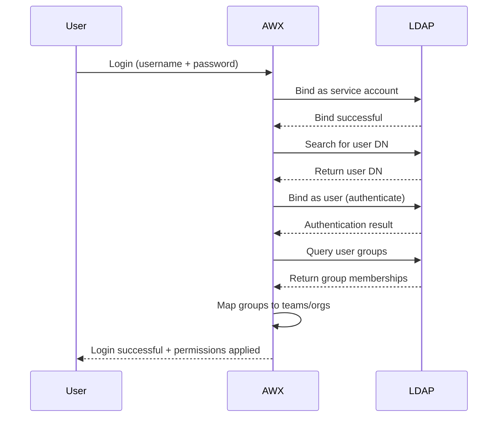

# How to Configure AWX LDAP Authentication

Author: [nawazdhandala](https://www.github.com/nawazdhandala)

Tags: Ansible, AWX, LDAP, Authentication, Active Directory

Description: Configure AWX to authenticate users against LDAP or Active Directory with group mapping, team sync, and organizational access control.

---

When your organization uses LDAP or Active Directory for user management, you do not want to maintain a separate set of users in AWX. LDAP authentication lets users log into AWX with their existing corporate credentials, and you can map LDAP groups to AWX organizations and teams automatically. This post covers the full LDAP configuration for AWX, including Active Directory specifics, group mapping, and troubleshooting.

## LDAP Authentication Flow



## Basic LDAP Configuration

AWX LDAP settings are configured through the Settings API or the web UI under Settings > Authentication > LDAP.

### Using the API

```bash
# Configure LDAP authentication via API
curl -X PATCH "https://awx.example.com/api/v2/settings/ldap/" \
  -H "Content-Type: application/json" \
  -H "Authorization: Bearer $AWX_TOKEN" \
  -d '{
    "AUTH_LDAP_SERVER_URI": "ldaps://ldap.example.com:636",
    "AUTH_LDAP_BIND_DN": "CN=awx-service,OU=Service Accounts,DC=example,DC=com",
    "AUTH_LDAP_BIND_PASSWORD": "service-account-password",
    "AUTH_LDAP_START_TLS": false,
    "AUTH_LDAP_USER_SEARCH": [
      "OU=Users,DC=example,DC=com",
      "SCOPE_SUBTREE",
      "(sAMAccountName=%(user)s)"
    ],
    "AUTH_LDAP_USER_DN_TEMPLATE": null,
    "AUTH_LDAP_USER_ATTR_MAP": {
      "first_name": "givenName",
      "last_name": "sn",
      "email": "mail"
    },
    "AUTH_LDAP_GROUP_SEARCH": [
      "OU=Groups,DC=example,DC=com",
      "SCOPE_SUBTREE",
      "(objectClass=group)"
    ],
    "AUTH_LDAP_GROUP_TYPE": "MemberDNGroupType",
    "AUTH_LDAP_GROUP_TYPE_PARAMS": {
      "member_attr": "member",
      "name_attr": "cn"
    },
    "AUTH_LDAP_REQUIRE_GROUP": "CN=AWX-Users,OU=Groups,DC=example,DC=com",
    "AUTH_LDAP_DENY_GROUP": "CN=AWX-Denied,OU=Groups,DC=example,DC=com"
  }'
```

### Using Ansible

```yaml
# configure-ldap.yml
---
- name: Configure AWX LDAP Authentication
  hosts: localhost
  connection: local
  collections:
    - awx.awx

  vars:
    awx_host: "https://awx.example.com"
    awx_token: "{{ lookup('env', 'AWX_TOKEN') }}"
    ldap_bind_password: "{{ lookup('env', 'LDAP_BIND_PASSWORD') }}"

  tasks:
    - name: Configure LDAP settings
      awx.awx.settings:
        controller_host: "{{ awx_host }}"
        controller_oauthtoken: "{{ awx_token }}"
        name: "AUTH_LDAP_SERVER_URI"
        value: "ldaps://ldap.example.com:636"

    - name: Set LDAP bind credentials
      awx.awx.settings:
        controller_host: "{{ awx_host }}"
        controller_oauthtoken: "{{ awx_token }}"
        name: "AUTH_LDAP_BIND_DN"
        value: "CN=awx-service,OU=Service Accounts,DC=example,DC=com"

    - name: Set LDAP bind password
      awx.awx.settings:
        controller_host: "{{ awx_host }}"
        controller_oauthtoken: "{{ awx_token }}"
        name: "AUTH_LDAP_BIND_PASSWORD"
        value: "{{ ldap_bind_password }}"

    - name: Configure user search
      awx.awx.settings:
        controller_host: "{{ awx_host }}"
        controller_oauthtoken: "{{ awx_token }}"
        name: "AUTH_LDAP_USER_SEARCH"
        value:
          - "OU=Users,DC=example,DC=com"
          - "SCOPE_SUBTREE"
          - "(sAMAccountName=%(user)s)"

    - name: Configure user attribute mapping
      awx.awx.settings:
        controller_host: "{{ awx_host }}"
        controller_oauthtoken: "{{ awx_token }}"
        name: "AUTH_LDAP_USER_ATTR_MAP"
        value:
          first_name: "givenName"
          last_name: "sn"
          email: "mail"

    - name: Configure group search
      awx.awx.settings:
        controller_host: "{{ awx_host }}"
        controller_oauthtoken: "{{ awx_token }}"
        name: "AUTH_LDAP_GROUP_SEARCH"
        value:
          - "OU=Groups,DC=example,DC=com"
          - "SCOPE_SUBTREE"
          - "(objectClass=group)"

    - name: Set group type for Active Directory
      awx.awx.settings:
        controller_host: "{{ awx_host }}"
        controller_oauthtoken: "{{ awx_token }}"
        name: "AUTH_LDAP_GROUP_TYPE"
        value: "MemberDNGroupType"

    - name: Require group membership to log in
      awx.awx.settings:
        controller_host: "{{ awx_host }}"
        controller_oauthtoken: "{{ awx_token }}"
        name: "AUTH_LDAP_REQUIRE_GROUP"
        value: "CN=AWX-Users,OU=Groups,DC=example,DC=com"
```

## Active Directory Configuration

Active Directory uses specific attributes and group types. Here is a complete AD configuration.

```bash
# Full Active Directory LDAP configuration
curl -X PATCH "https://awx.example.com/api/v2/settings/ldap/" \
  -H "Content-Type: application/json" \
  -H "Authorization: Bearer $AWX_TOKEN" \
  -d '{
    "AUTH_LDAP_SERVER_URI": "ldaps://dc01.corp.example.com:636 ldaps://dc02.corp.example.com:636",
    "AUTH_LDAP_BIND_DN": "CN=svc-awx,OU=Service Accounts,DC=corp,DC=example,DC=com",
    "AUTH_LDAP_BIND_PASSWORD": "service-password",
    "AUTH_LDAP_START_TLS": false,
    "AUTH_LDAP_CONNECTION_OPTIONS": {
      "OPT_REFERRALS": 0,
      "OPT_NETWORK_TIMEOUT": 30
    },
    "AUTH_LDAP_USER_SEARCH": [
      "DC=corp,DC=example,DC=com",
      "SCOPE_SUBTREE",
      "(sAMAccountName=%(user)s)"
    ],
    "AUTH_LDAP_USER_ATTR_MAP": {
      "first_name": "givenName",
      "last_name": "sn",
      "email": "mail"
    },
    "AUTH_LDAP_GROUP_SEARCH": [
      "DC=corp,DC=example,DC=com",
      "SCOPE_SUBTREE",
      "(objectClass=group)"
    ],
    "AUTH_LDAP_GROUP_TYPE": "MemberDNGroupType",
    "AUTH_LDAP_GROUP_TYPE_PARAMS": {
      "member_attr": "member",
      "name_attr": "cn"
    },
    "AUTH_LDAP_REQUIRE_GROUP": "CN=AWX-Users,OU=Security Groups,DC=corp,DC=example,DC=com",
    "AUTH_LDAP_DENY_GROUP": null,
    "AUTH_LDAP_USER_FLAGS_BY_GROUP": {
      "is_superuser": ["CN=AWX-Admins,OU=Security Groups,DC=corp,DC=example,DC=com"],
      "is_system_auditor": ["CN=AWX-Auditors,OU=Security Groups,DC=corp,DC=example,DC=com"]
    },
    "AUTH_LDAP_ORGANIZATION_MAP": {
      "Engineering": {
        "admins": "CN=Eng-Admins,OU=Security Groups,DC=corp,DC=example,DC=com",
        "users": "CN=Engineering,OU=Security Groups,DC=corp,DC=example,DC=com",
        "remove_users": true,
        "remove_admins": true
      },
      "Operations": {
        "admins": "CN=Ops-Admins,OU=Security Groups,DC=corp,DC=example,DC=com",
        "users": "CN=Operations,OU=Security Groups,DC=corp,DC=example,DC=com",
        "remove_users": true,
        "remove_admins": true
      }
    },
    "AUTH_LDAP_TEAM_MAP": {
      "DevOps": {
        "organization": "Engineering",
        "users": "CN=DevOps-Team,OU=Security Groups,DC=corp,DC=example,DC=com",
        "remove": true
      },
      "SRE": {
        "organization": "Operations",
        "users": "CN=SRE-Team,OU=Security Groups,DC=corp,DC=example,DC=com",
        "remove": true
      },
      "Security": {
        "organization": "Operations",
        "users": "CN=Security-Team,OU=Security Groups,DC=corp,DC=example,DC=com",
        "remove": true
      }
    }
  }'
```

Notice the multiple LDAP URIs separated by a space. AWX will try the second server if the first is unavailable, giving you redundancy.

## Group Mapping

The organization map and team map are where LDAP becomes really powerful. They automatically assign users to AWX organizations and teams based on their LDAP group memberships.

### Organization Map

```json
{
  "Engineering": {
    "admins": "CN=Eng-Admins,OU=Groups,DC=example,DC=com",
    "users": [
      "CN=Engineering,OU=Groups,DC=example,DC=com",
      "CN=Contractors-Eng,OU=Groups,DC=example,DC=com"
    ],
    "remove_users": true,
    "remove_admins": true
  }
}
```

- `admins`: LDAP groups whose members become organization admins
- `users`: LDAP groups whose members get organization membership
- `remove_users`: Remove org membership when removed from LDAP group
- `remove_admins`: Remove admin status when removed from LDAP group

### Team Map

```json
{
  "DevOps": {
    "organization": "Engineering",
    "users": "CN=DevOps,OU=Groups,DC=example,DC=com",
    "remove": true
  }
}
```

Teams in AWX can then be granted permissions on inventories, projects, and job templates. This means you control AWX access entirely through LDAP group membership.

## User Flags by Group

Map LDAP groups to AWX superuser and auditor roles.

```json
{
  "is_superuser": [
    "CN=AWX-Admins,OU=Groups,DC=example,DC=com"
  ],
  "is_system_auditor": [
    "CN=AWX-Auditors,OU=Groups,DC=example,DC=com"
  ]
}
```

Members of `AWX-Admins` automatically get superuser access. Members of `AWX-Auditors` get read-only access to everything.

## Multiple LDAP Servers

AWX supports up to five LDAP configurations. This is useful when you need to authenticate against multiple directories (for example, corporate AD and a partner LDAP).

```bash
# Configure a second LDAP source (LDAP1 through LDAP5)
curl -X PATCH "https://awx.example.com/api/v2/settings/ldap/" \
  -H "Content-Type: application/json" \
  -H "Authorization: Bearer $AWX_TOKEN" \
  -d '{
    "AUTH_LDAP_1_SERVER_URI": "ldaps://partner-ldap.example.com:636",
    "AUTH_LDAP_1_BIND_DN": "CN=awx,OU=Services,DC=partner,DC=com",
    "AUTH_LDAP_1_BIND_PASSWORD": "partner-password",
    "AUTH_LDAP_1_USER_SEARCH": [
      "OU=Users,DC=partner,DC=com",
      "SCOPE_SUBTREE",
      "(uid=%(user)s)"
    ],
    "AUTH_LDAP_1_GROUP_TYPE": "GroupOfNamesType"
  }'
```

## OpenLDAP Configuration

If you use OpenLDAP instead of Active Directory, the configuration differs slightly.

```json
{
  "AUTH_LDAP_SERVER_URI": "ldaps://ldap.example.com:636",
  "AUTH_LDAP_BIND_DN": "cn=awx,ou=services,dc=example,dc=com",
  "AUTH_LDAP_BIND_PASSWORD": "password",
  "AUTH_LDAP_USER_SEARCH": [
    "ou=people,dc=example,dc=com",
    "SCOPE_SUBTREE",
    "(uid=%(user)s)"
  ],
  "AUTH_LDAP_USER_ATTR_MAP": {
    "first_name": "givenName",
    "last_name": "sn",
    "email": "mail"
  },
  "AUTH_LDAP_GROUP_SEARCH": [
    "ou=groups,dc=example,dc=com",
    "SCOPE_SUBTREE",
    "(objectClass=groupOfNames)"
  ],
  "AUTH_LDAP_GROUP_TYPE": "GroupOfNamesType"
}
```

The main differences from AD: use `uid` instead of `sAMAccountName` for user search, use `GroupOfNamesType` instead of `MemberDNGroupType`, and the DN format uses lowercase attribute names.

## Troubleshooting

### Test LDAP Connectivity

```bash
# From the AWX server, test LDAP connectivity
# For Kubernetes deployment
kubectl -n awx exec -it deployment/awx-web -c awx-web -- \
  python3 -c "
import ldap
conn = ldap.initialize('ldaps://ldap.example.com:636')
conn.simple_bind_s('CN=awx-service,OU=Service Accounts,DC=example,DC=com', 'password')
results = conn.search_s('DC=example,DC=com', ldap.SCOPE_SUBTREE, '(sAMAccountName=testuser)')
print(results)
"

# For Docker deployment
docker exec -it awx-web python3 -c "
import ldap
conn = ldap.initialize('ldaps://ldap.example.com:636')
conn.simple_bind_s('CN=awx-service,OU=Services,DC=example,DC=com', 'password')
print('Connection successful')
"
```

### Common Issues

1. **Connection refused**: Check firewall rules between AWX and the LDAP server. Ports 389 (LDAP) or 636 (LDAPS) need to be open.

2. **Certificate errors**: If using LDAPS, the AWX server needs to trust the LDAP server's CA certificate. Mount the CA certificate into the AWX container.

3. **User not found**: Verify the user search base DN and filter. Test the search with ldapsearch.

```bash
# Test user search with ldapsearch
ldapsearch -H ldaps://ldap.example.com:636 \
  -D "CN=awx-service,OU=Service Accounts,DC=example,DC=com" \
  -w "password" \
  -b "DC=example,DC=com" \
  "(sAMAccountName=testuser)" \
  givenName sn mail memberOf
```

4. **Groups not mapping**: Verify the group search base and filter. Check that the group type matches your LDAP server type (MemberDNGroupType for AD, GroupOfNamesType for OpenLDAP).

5. **Referral errors with AD**: Set `OPT_REFERRALS: 0` in connection options to disable LDAP referral following.

LDAP authentication in AWX is one of those things that takes some effort to configure initially but saves a lot of manual user management afterward. Once set up, users authenticate with their existing credentials, group memberships automatically control access, and you manage everything through your existing identity infrastructure.
