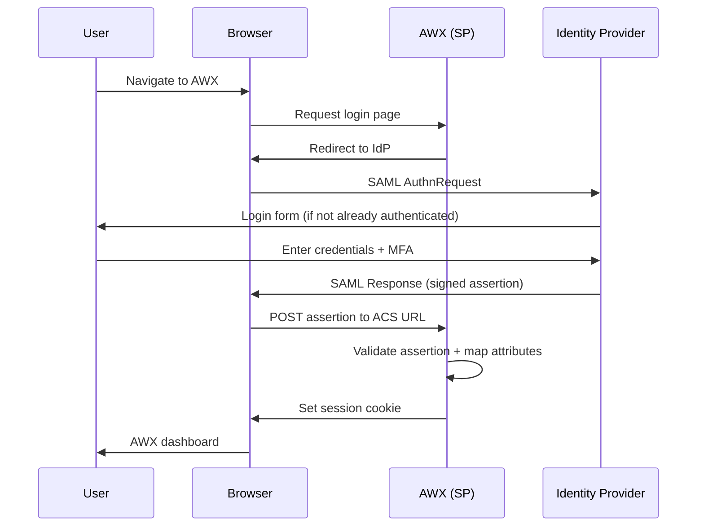

# How to Configure AWX SAML Authentication

Author: [nawazdhandala](https://www.github.com/nawazdhandala)

Tags: Ansible, AWX, SAML, SSO, Authentication

Description: Set up SAML single sign-on in AWX with identity providers like Okta, Azure AD, and Keycloak for enterprise authentication.

---

SAML (Security Assertion Markup Language) is the standard for enterprise single sign-on. If your organization uses an identity provider like Okta, Azure AD, PingFederate, or Keycloak, you can configure AWX to authenticate users through SAML. This gives you centralized authentication, multi-factor authentication support, and seamless integration with your existing SSO infrastructure. This post walks through the full SAML configuration for AWX with examples for the most popular identity providers.

## How SAML Authentication Works



AWX acts as the Service Provider (SP). Your identity provider (IdP) handles the actual authentication. Users never enter their password directly into AWX.

## AWX SAML Endpoints

Before configuring your IdP, you need to know AWX's SAML endpoints:

| Endpoint | URL |
|---|---|
| Entity ID / Audience URI | `https://awx.example.com/sso/metadata/saml/` |
| ACS URL (Assertion Consumer Service) | `https://awx.example.com/sso/complete/saml/` |
| Metadata URL | `https://awx.example.com/sso/metadata/saml/` |
| Login URL | `https://awx.example.com/sso/login/saml/` |

Replace `awx.example.com` with your actual AWX hostname.

## Configuring AWX for SAML

### Generate or Obtain Certificates

AWX needs an X.509 certificate and private key for SAML signing and encryption.

```bash
# Generate a self-signed certificate for AWX SAML
openssl req -x509 -newkey rsa:2048 \
  -keyout awx-saml.key \
  -out awx-saml.crt \
  -days 3650 \
  -nodes \
  -subj "/CN=awx.example.com"
```

### Apply SAML Settings via API

```bash
# Configure SAML authentication
curl -X PATCH "https://awx.example.com/api/v2/settings/saml/" \
  -H "Content-Type: application/json" \
  -H "Authorization: Bearer $AWX_TOKEN" \
  -d '{
    "SOCIAL_AUTH_SAML_SP_ENTITY_ID": "https://awx.example.com/sso/metadata/saml/",
    "SOCIAL_AUTH_SAML_SP_PUBLIC_CERT": "'"$(cat awx-saml.crt)"'",
    "SOCIAL_AUTH_SAML_SP_PRIVATE_KEY": "'"$(cat awx-saml.key)"'",
    "SOCIAL_AUTH_SAML_ORG_INFO": {
      "en-US": {
        "name": "Example Corp",
        "displayname": "Example Corporation",
        "url": "https://example.com"
      }
    },
    "SOCIAL_AUTH_SAML_TECHNICAL_CONTACT": {
      "givenName": "DevOps Team",
      "emailAddress": "devops@example.com"
    },
    "SOCIAL_AUTH_SAML_SUPPORT_CONTACT": {
      "givenName": "IT Support",
      "emailAddress": "support@example.com"
    },
    "SOCIAL_AUTH_SAML_ENABLED_IDPS": {
      "okta": {
        "entity_id": "http://www.okta.com/exk12345",
        "url": "https://company.okta.com/app/ansible_awx/exk12345/sso/saml",
        "x509cert": "MIIDpDCCAoygAwIBAgI...(IdP certificate)...",
        "attr_user_permanent_id": "name_id",
        "attr_first_name": "first_name",
        "attr_last_name": "last_name",
        "attr_username": "username",
        "attr_email": "email"
      }
    }
  }'
```

### Apply SAML Settings with Ansible

```yaml
# configure-saml.yml
---
- name: Configure AWX SAML Authentication
  hosts: localhost
  connection: local
  collections:
    - awx.awx

  vars:
    awx_host: "https://awx.example.com"
    awx_token: "{{ lookup('env', 'AWX_TOKEN') }}"
    saml_cert: "{{ lookup('file', 'awx-saml.crt') }}"
    saml_key: "{{ lookup('file', 'awx-saml.key') }}"
    idp_cert: "{{ lookup('file', 'idp-certificate.crt') }}"

  tasks:
    - name: Set SAML SP Entity ID
      awx.awx.settings:
        controller_host: "{{ awx_host }}"
        controller_oauthtoken: "{{ awx_token }}"
        name: "SOCIAL_AUTH_SAML_SP_ENTITY_ID"
        value: "https://awx.example.com/sso/metadata/saml/"

    - name: Set SAML SP certificate
      awx.awx.settings:
        controller_host: "{{ awx_host }}"
        controller_oauthtoken: "{{ awx_token }}"
        name: "SOCIAL_AUTH_SAML_SP_PUBLIC_CERT"
        value: "{{ saml_cert }}"

    - name: Set SAML SP private key
      awx.awx.settings:
        controller_host: "{{ awx_host }}"
        controller_oauthtoken: "{{ awx_token }}"
        name: "SOCIAL_AUTH_SAML_SP_PRIVATE_KEY"
        value: "{{ saml_key }}"

    - name: Set SAML organization info
      awx.awx.settings:
        controller_host: "{{ awx_host }}"
        controller_oauthtoken: "{{ awx_token }}"
        name: "SOCIAL_AUTH_SAML_ORG_INFO"
        value:
          en-US:
            name: "Example Corp"
            displayname: "Example Corporation"
            url: "https://example.com"

    - name: Set SAML technical contact
      awx.awx.settings:
        controller_host: "{{ awx_host }}"
        controller_oauthtoken: "{{ awx_token }}"
        name: "SOCIAL_AUTH_SAML_TECHNICAL_CONTACT"
        value:
          givenName: "DevOps Team"
          emailAddress: "devops@example.com"

    - name: Set SAML support contact
      awx.awx.settings:
        controller_host: "{{ awx_host }}"
        controller_oauthtoken: "{{ awx_token }}"
        name: "SOCIAL_AUTH_SAML_SUPPORT_CONTACT"
        value:
          givenName: "IT Support"
          emailAddress: "support@example.com"

    - name: Configure Identity Provider
      awx.awx.settings:
        controller_host: "{{ awx_host }}"
        controller_oauthtoken: "{{ awx_token }}"
        name: "SOCIAL_AUTH_SAML_ENABLED_IDPS"
        value:
          corporate_sso:
            entity_id: "http://www.okta.com/exk12345"
            url: "https://company.okta.com/app/ansible_awx/exk12345/sso/saml"
            x509cert: "{{ idp_cert }}"
            attr_user_permanent_id: "name_id"
            attr_first_name: "first_name"
            attr_last_name: "last_name"
            attr_username: "username"
            attr_email: "email"
```

## Okta Configuration

In Okta, create a new SAML 2.0 application.

1. Go to Applications > Create App Integration > SAML 2.0
2. Set the following values:

| Field | Value |
|---|---|
| Single sign-on URL | `https://awx.example.com/sso/complete/saml/` |
| Audience URI (SP Entity ID) | `https://awx.example.com/sso/metadata/saml/` |
| Name ID format | EmailAddress |
| Application username | Email |

3. Add attribute statements:

| Name | Value |
|---|---|
| username | user.login |
| email | user.email |
| first_name | user.firstName |
| last_name | user.lastName |

4. Download the IdP metadata or certificate from Okta's setup instructions.

Then configure AWX with Okta-specific settings.

```json
{
  "SOCIAL_AUTH_SAML_ENABLED_IDPS": {
    "okta": {
      "entity_id": "http://www.okta.com/exk12345abcdef",
      "url": "https://company.okta.com/app/ansible_awx/exk12345abcdef/sso/saml",
      "x509cert": "MIIDpDCCAoygAwIBAgIGAX...(from Okta)...",
      "attr_user_permanent_id": "name_id",
      "attr_first_name": "first_name",
      "attr_last_name": "last_name",
      "attr_username": "username",
      "attr_email": "email"
    }
  }
}
```

## Azure AD Configuration

In Azure AD (Entra ID), create an enterprise application.

1. Go to Enterprise Applications > New Application > Create your own
2. Select "Integrate any other application (non-gallery)"
3. Go to Single sign-on > SAML
4. Set Basic SAML Configuration:

| Field | Value |
|---|---|
| Identifier (Entity ID) | `https://awx.example.com/sso/metadata/saml/` |
| Reply URL (ACS URL) | `https://awx.example.com/sso/complete/saml/` |
| Sign-on URL | `https://awx.example.com/sso/login/saml/?idp=azure_ad` |

5. Configure claims:

| Claim | Source Attribute |
|---|---|
| emailaddress | user.mail |
| givenname | user.givenname |
| surname | user.surname |
| name | user.userprincipalname |

6. Download the Federation Metadata XML or Certificate (Base64).

AWX configuration for Azure AD:

```json
{
  "SOCIAL_AUTH_SAML_ENABLED_IDPS": {
    "azure_ad": {
      "entity_id": "https://sts.windows.net/your-tenant-id/",
      "url": "https://login.microsoftonline.com/your-tenant-id/saml2",
      "x509cert": "MIIDBTCCAe2gAwIBAgIQ...(from Azure AD)...",
      "attr_user_permanent_id": "name_id",
      "attr_first_name": "http://schemas.xmlsoap.org/ws/2005/05/identity/claims/givenname",
      "attr_last_name": "http://schemas.xmlsoap.org/ws/2005/05/identity/claims/surname",
      "attr_username": "http://schemas.xmlsoap.org/ws/2005/05/identity/claims/name",
      "attr_email": "http://schemas.xmlsoap.org/ws/2005/05/identity/claims/emailaddress"
    }
  }
}
```

Note that Azure AD uses full URIs for attribute names, unlike Okta which uses short names.

## Keycloak Configuration

For Keycloak, create a SAML client.

1. In Keycloak, go to Clients > Create
2. Set Client ID to `https://awx.example.com/sso/metadata/saml/`
3. Set Client Protocol to `saml`
4. Configure:

| Setting | Value |
|---|---|
| Client Signature Required | OFF |
| Valid Redirect URIs | `https://awx.example.com/*` |
| Master SAML Processing URL | `https://awx.example.com/sso/complete/saml/` |
| Name ID Format | email |

5. Add mappers for attributes (first_name, last_name, email, username).

## SAML Organization and Team Mapping

Map SAML attributes to AWX organizations and teams.

```bash
curl -X PATCH "https://awx.example.com/api/v2/settings/saml/" \
  -H "Content-Type: application/json" \
  -H "Authorization: Bearer $AWX_TOKEN" \
  -d '{
    "SOCIAL_AUTH_SAML_ORGANIZATION_MAP": {
      "Engineering": {
        "admins": {
          "attr": "groups",
          "value": ["AWX-Eng-Admins"]
        },
        "users": {
          "attr": "groups",
          "value": ["Engineering", "DevOps"]
        },
        "remove_users": true,
        "remove_admins": true
      },
      "Operations": {
        "admins": {
          "attr": "groups",
          "value": ["AWX-Ops-Admins"]
        },
        "users": true,
        "remove_users": false
      }
    },
    "SOCIAL_AUTH_SAML_TEAM_MAP": {
      "DevOps": {
        "organization": "Engineering",
        "users": {
          "attr": "groups",
          "value": ["DevOps-Team"]
        },
        "remove": true
      },
      "SRE": {
        "organization": "Operations",
        "users": {
          "attr": "groups",
          "value": ["SRE-Team"]
        },
        "remove": true
      }
    },
    "SOCIAL_AUTH_SAML_ORGANIZATION_ATTR": {
      "name": "groups",
      "remove": true,
      "remove_admins": true
    },
    "SOCIAL_AUTH_SAML_TEAM_ATTR": {
      "name": "groups",
      "remove": true
    }
  }'
```

For this mapping to work, your IdP needs to send group membership as an attribute in the SAML assertion. In Okta, add a group attribute statement. In Azure AD, configure a group claim.

## Troubleshooting

### Check SAML Response

Enable debug logging to see the raw SAML assertion.

```bash
# Check AWX logs for SAML debug information
# Kubernetes
kubectl -n awx logs deployment/awx-web -c awx-web | grep -i saml

# Docker
docker logs awx-web 2>&1 | grep -i saml
```

### Common Issues

1. **Certificate mismatch**: The `x509cert` in AWX must match exactly what the IdP uses to sign assertions. Download a fresh copy from your IdP.

2. **Wrong ACS URL**: The ACS URL in your IdP must match exactly: `https://awx.example.com/sso/complete/saml/` (trailing slash matters).

3. **Attribute name mismatch**: The `attr_*` values in your AWX config must match the attribute names in the SAML assertion exactly. Use a SAML debugging tool to inspect the assertion.

4. **Clock skew**: SAML assertions have timestamps. If the AWX server clock is off by more than a few minutes, assertions will be rejected. Use NTP.

5. **HTTPS required**: SAML requires HTTPS. Make sure AWX is accessible via HTTPS and the URLs in your configuration use HTTPS.

### SAML Debugging Tools

Use browser developer tools or a SAML debugging extension to inspect the SAML response.

```bash
# Decode a base64 SAML response (from browser network tab)
echo "PHNhbWxwOl..." | base64 --decode | xmllint --format -
```

### Test Login

After configuration, test by navigating to:

```
https://awx.example.com/sso/login/saml/?idp=your_idp_name
```

Replace `your_idp_name` with the key you used in `SOCIAL_AUTH_SAML_ENABLED_IDPS` (for example, `okta`, `azure_ad`, or `corporate_sso`).

SAML authentication in AWX integrates your automation platform with your organization's identity infrastructure. Users get seamless SSO with multi-factor authentication, and you manage access through your IdP's group management. The initial setup requires coordination between the AWX and IdP configurations, but once working, it provides a secure and user-friendly authentication experience.
