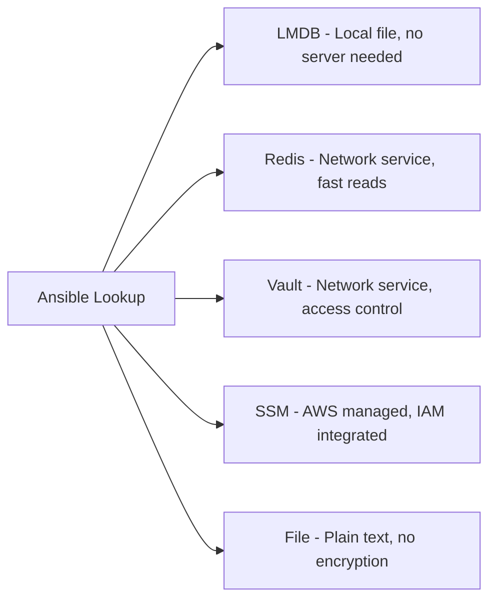

# How to Use the community.general.lmdb_kv Lookup Plugin

Author: [nawazdhandala](https://www.github.com/nawazdhandala)

Tags: Ansible, LMDB, Lookup Plugins, Key-Value Store

Description: Learn how to use the community.general.lmdb_kv lookup plugin to read data from LMDB key-value databases directly in your Ansible playbooks.

---

LMDB (Lightning Memory-Mapped Database) is a compact, fast, and embeddable key-value store that is used by software like OpenLDAP, PowerDNS, and various caching systems. If your infrastructure includes services that store their data in LMDB databases, the `community.general.lmdb_kv` lookup plugin lets you read those values directly from your Ansible playbooks. This is particularly handy when you need to pull configuration or state from an LMDB-backed application without writing custom scripts.

## What Is LMDB?

LMDB is a B+ tree-based, memory-mapped key-value store. Unlike Redis or Memcached, it is not a network service. It is an embedded database stored as a file on disk. Programs open the LMDB file directly and read or write data through a C library (or Python bindings). LMDB databases are commonly found at paths like `/var/lib/myapp/data.mdb`.

Key characteristics of LMDB:
- Single-writer, multiple-reader concurrency model
- Memory-mapped, so reads are very fast
- ACID compliant with crash recovery
- No separate server process needed

## Prerequisites

Install the required collection and Python library:

```bash
# Install the community.general Ansible collection
ansible-galaxy collection install community.general

# Install the lmdb Python library
pip install lmdb
```

## Basic Usage

The simplest form reads a key from an LMDB database.

This playbook reads a configuration value from an LMDB store:

```yaml
# playbook.yml - Read a value from an LMDB database
---
- name: Fetch data from LMDB
  hosts: localhost
  tasks:
    - name: Read a key from LMDB
      ansible.builtin.debug:
        msg: "Value: {{ lookup('community.general.lmdb_kv', 'my_config_key', db='/var/lib/myapp/data.mdb') }}"
```

## How LMDB Databases Work

Before diving into examples, it helps to understand LMDB's file structure. An LMDB environment consists of two files:

```
/var/lib/myapp/
  data.mdb    # The main database file
  lock.mdb    # The lock file for concurrency
```

When specifying the database path in the lookup, you point to the directory containing these files, or directly to the `.mdb` file depending on the plugin version.

## Creating Test Data

To try this out, you can create a test LMDB database with Python:

```python
# create_test_db.py - Create a test LMDB database
import lmdb

# Create/open LMDB environment (creates data.mdb and lock.mdb)
env = lmdb.open('/tmp/test_lmdb', map_size=10485760)  # 10MB

with env.begin(write=True) as txn:
    txn.put(b'app_version', b'2.5.1')
    txn.put(b'db_host', b'db.internal.example.com')
    txn.put(b'db_port', b'5432')
    txn.put(b'max_connections', b'200')
    txn.put(b'log_level', b'info')
    txn.put(b'feature_dark_mode', b'enabled')
    txn.put(b'feature_beta_api', b'disabled')

print("Test LMDB database created at /tmp/test_lmdb/")
```

Run it:

```bash
python create_test_db.py
```

## Reading Configuration from LMDB

Once you have data in LMDB, reading it from Ansible is straightforward:

```yaml
# playbook.yml - Read multiple LMDB values
---
- name: Read application config from LMDB
  hosts: localhost
  vars:
    lmdb_path: "/tmp/test_lmdb"
  tasks:
    - name: Read application version
      ansible.builtin.debug:
        msg: "App version: {{ lookup('community.general.lmdb_kv', 'app_version', db=lmdb_path) }}"

    - name: Read database configuration
      ansible.builtin.set_fact:
        db_host: "{{ lookup('community.general.lmdb_kv', 'db_host', db=lmdb_path) }}"
        db_port: "{{ lookup('community.general.lmdb_kv', 'db_port', db=lmdb_path) }}"
        max_connections: "{{ lookup('community.general.lmdb_kv', 'max_connections', db=lmdb_path) }}"

    - name: Display resolved configuration
      ansible.builtin.debug:
        msg: |
          Database: {{ db_host }}:{{ db_port }}
          Max connections: {{ max_connections }}
```

## Practical Example: PowerDNS Configuration

PowerDNS can use LMDB as its backend storage. You might need to read DNS zone data or configuration from its LMDB database.

```yaml
# playbook.yml - Read PowerDNS data from LMDB
---
- name: Audit PowerDNS LMDB configuration
  hosts: dns_servers
  vars:
    pdns_lmdb: "/var/lib/powerdns/pdns.lmdb"
  tasks:
    - name: Read PowerDNS configuration from LMDB
      ansible.builtin.set_fact:
        pdns_config: "{{ lookup('community.general.lmdb_kv', 'config_key', db=pdns_lmdb) }}"
      ignore_errors: true

    - name: Display configuration
      ansible.builtin.debug:
        msg: "PowerDNS config: {{ pdns_config | default('not available') }}"
```

## OpenLDAP Integration

OpenLDAP uses LMDB (via the `mdb` backend) to store its directory data. You can read LDAP configuration from its LMDB store:

```yaml
# playbook.yml - Check OpenLDAP LMDB state
---
- name: Verify OpenLDAP LMDB configuration
  hosts: ldap_servers
  vars:
    slapd_db_path: "/var/lib/ldap"
  tasks:
    - name: Check if LMDB database exists
      ansible.builtin.stat:
        path: "{{ slapd_db_path }}/data.mdb"
      register: lmdb_file

    - name: Report LMDB database status
      ansible.builtin.debug:
        msg: "LMDB database size: {{ lmdb_file.stat.size | human_readable }}"
      when: lmdb_file.stat.exists

    - name: Read LMDB data if available
      ansible.builtin.debug:
        msg: "{{ lookup('community.general.lmdb_kv', 'some_key', db=slapd_db_path) }}"
      when: lmdb_file.stat.exists
      ignore_errors: true
```

## Building a Configuration Cache

You can use LMDB as a local configuration cache that Ansible reads from. This is useful in air-gapped environments or when you want to avoid network calls during playbook runs.

First, create the cache with a preparation script:

```python
# prepare_config_cache.py - Build LMDB config cache from API
import lmdb
import requests
import json

# Fetch config from API
response = requests.get('https://config.example.com/api/v1/all')
config = response.json()

# Store in LMDB
env = lmdb.open('/opt/ansible/config_cache', map_size=10485760)
with env.begin(write=True) as txn:
    for key, value in config.items():
        if isinstance(value, (dict, list)):
            txn.put(key.encode(), json.dumps(value).encode())
        else:
            txn.put(key.encode(), str(value).encode())

print(f"Cached {len(config)} configuration values to LMDB")
```

Then read from the cache in your playbook:

```yaml
# playbook.yml - Read from LMDB config cache
---
- name: Deploy from cached configuration
  hosts: appservers
  vars:
    cache_db: "/opt/ansible/config_cache"
    app_port: "{{ lookup('community.general.lmdb_kv', 'app_port', db=cache_db) }}"
    app_workers: "{{ lookup('community.general.lmdb_kv', 'app_workers', db=cache_db) }}"
    db_connection: "{{ lookup('community.general.lmdb_kv', 'database_url', db=cache_db) }}"
  tasks:
    - name: Template application configuration from cache
      ansible.builtin.template:
        src: app.conf.j2
        dest: /etc/myapp/app.conf
        mode: '0644'
      notify: restart myapp
```

## Reading Multiple Keys

You can look up multiple keys in a single call:

```yaml
# playbook.yml - Fetch multiple LMDB keys
---
- name: Read multiple values from LMDB
  hosts: localhost
  vars:
    lmdb_path: "/tmp/test_lmdb"
  tasks:
    - name: Get multiple values at once
      ansible.builtin.debug:
        msg: "{{ lookup('community.general.lmdb_kv', 'db_host', 'db_port', 'max_connections', db=lmdb_path, wantlist=True) }}"

    - name: Store multiple values
      ansible.builtin.set_fact:
        config_values: "{{ lookup('community.general.lmdb_kv', 'db_host', 'db_port', 'log_level', db=lmdb_path, wantlist=True) }}"

    - name: Use the values
      ansible.builtin.debug:
        msg: "Host={{ config_values[0] }}, Port={{ config_values[1] }}, Log={{ config_values[2] }}"
```

## Comparing LMDB to Other Lookup Sources

Here is how the LMDB lookup compares to other data source lookups:



When to choose LMDB:
- Your application already stores data in LMDB
- You need a local, serverless key-value store
- You want fast reads without network overhead
- You are working in an air-gapped or restricted network environment

## Error Handling

Handle missing keys and missing databases:

```yaml
# playbook.yml - Handle LMDB errors
---
- name: Resilient LMDB lookups
  hosts: localhost
  vars:
    lmdb_path: "/var/lib/myapp/data"
  tasks:
    # Check if the database exists first
    - name: Verify LMDB database exists
      ansible.builtin.stat:
        path: "{{ lmdb_path }}/data.mdb"
      register: db_exists

    - name: Read from LMDB if available
      block:
        - name: Fetch configuration value
          ansible.builtin.set_fact:
            config_val: "{{ lookup('community.general.lmdb_kv', 'my_key', db=lmdb_path) }}"
      rescue:
        - name: Handle missing key or database error
          ansible.builtin.set_fact:
            config_val: "default_value"
        - name: Warn about fallback
          ansible.builtin.debug:
            msg: "LMDB lookup failed, using default value"
      when: db_exists.stat.exists
```

## Performance Characteristics

LMDB is extremely fast for reads because it uses memory-mapped files. The operating system handles caching through the page cache, so frequently accessed data is served from memory. Some things to keep in mind:

1. **Read-only access**: The Ansible lookup opens LMDB in read-only mode. It will not modify the database.
2. **Concurrent access**: LMDB supports concurrent readers, so the lookup will not block other processes that are reading or writing to the same database.
3. **File locking**: LMDB uses file locks. Make sure the Ansible controller user has appropriate permissions to read the database files and the lock file.
4. **Map size**: LMDB pre-allocates virtual address space. On 32-bit systems, this can be a limitation. Modern 64-bit systems handle this fine.

## Tips

1. **Database path**: The `db` parameter should point to the directory containing `data.mdb`, not to the `data.mdb` file itself (depending on the plugin version). Test both if one does not work.

2. **Binary data**: LMDB stores binary data. The lookup returns values as strings. If your data is not UTF-8 text (for example, serialized binary data), you may need additional processing.

3. **Permissions**: The Ansible controller user must have read access to both the `data.mdb` and `lock.mdb` files. LMDB creates the lock file even for read-only access.

4. **File system support**: LMDB requires a file system that supports memory-mapped files and file locking. Network file systems like NFS can be problematic.

5. **Stale data**: Since LMDB is a local file, the data you read is only as fresh as the last write. If another process updates the database while Ansible is running, the lookup might see the old data depending on transaction isolation.

The `community.general.lmdb_kv` lookup plugin is a niche tool, but it fills an important gap for teams working with LMDB-backed applications. Instead of writing wrapper scripts to extract data from LMDB files, you get direct, inline access from your Ansible playbooks.
