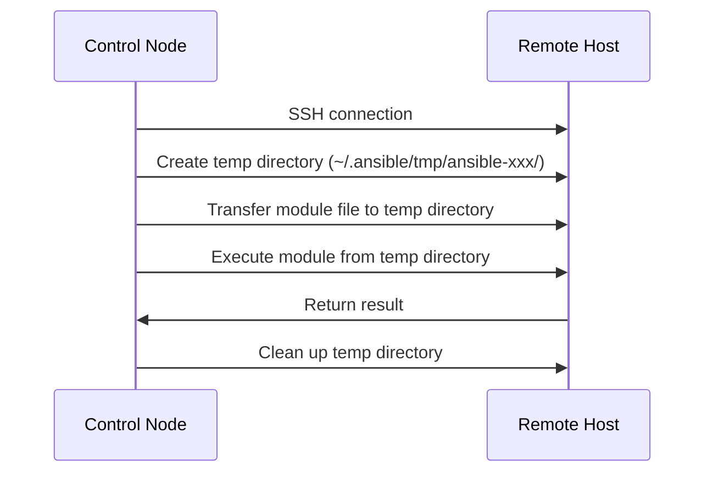

# How to Configure Ansible Remote Temp Directory

Author: [nawazdhandala](https://www.github.com/nawazdhandala)

Tags: Ansible, Configuration, Linux, DevOps

Description: Learn how to configure and troubleshoot the Ansible remote temp directory for different environments including restricted and shared systems.

---

When Ansible executes a task on a remote host, it needs a temporary directory to store module files before running them. By default, this directory is `~/.ansible/tmp/` on the remote host, created under the connecting user's home directory. In most cases, this works fine. But there are scenarios where the default location causes problems: restricted home directories, noexec mount options on /home, shared user accounts, or disk space constraints. This guide covers how to change the remote temp directory and troubleshoot related issues.

## How Ansible Uses the Remote Temp Directory

Here is what happens during a typical Ansible task execution:



Ansible creates a unique subdirectory for each task, transfers the compiled module code there, executes it, and then cleans it up. If any of these steps fail because of directory permissions or disk space issues, the task fails.

## Changing the Remote Temp Directory

### Method 1: ansible.cfg

The most common approach is setting `remote_tmp` in your ansible.cfg file:

```ini
# ansible.cfg
[defaults]
# Change the remote temp directory to /tmp/ansible
remote_tmp = /tmp/.ansible-${USER}/tmp
```

The `${USER}` variable expands to the remote user's username, which prevents collisions when multiple users run Ansible against the same host.

### Method 2: Environment Variable

Override the remote temp directory for a single command:

```bash
# Set via environment variable for one run
ANSIBLE_REMOTE_TMP=/var/tmp/ansible ansible-playbook deploy.yml
```

### Method 3: Inventory Variable

Set it per host or per group in your inventory:

```ini
# inventory.ini
[restricted_servers]
server01 ansible_host=10.0.0.50
server02 ansible_host=10.0.0.51

[restricted_servers:vars]
ansible_remote_tmp=/var/tmp/.ansible-{{ ansible_user }}/tmp
```

### Method 4: Play-Level Variable

Set it directly in a playbook for specific plays:

```yaml
# playbook.yml
---
- name: Deploy to restricted servers
  hosts: restricted_servers
  vars:
    ansible_remote_tmp: /var/tmp/.ansible-{{ ansible_user }}/tmp

  tasks:
    - name: Ensure temp directory exists
      ansible.builtin.file:
        path: /var/tmp/.ansible-{{ ansible_user }}/tmp
        state: directory
        mode: '0700'

    - name: Run your actual tasks
      ansible.builtin.command: hostname
```

## Common Scenarios That Require Custom Temp Directories

### Scenario 1: noexec on /home

Some security-hardened systems mount /home with the `noexec` flag, which prevents execution of any files stored there. Since Ansible needs to execute module files from the temp directory, the default `~/.ansible/tmp/` location will fail.

Check if this is your issue:

```bash
# Check mount options on the remote host
mount | grep home
# Look for "noexec" in the output
```

The fix is to point the temp directory to a location that allows execution, typically /tmp or /var/tmp:

```ini
# ansible.cfg
[defaults]
remote_tmp = /tmp/.ansible-${USER}/tmp
```

### Scenario 2: Shared User Accounts

If multiple people or CI/CD pipelines connect to remote hosts using the same system account, they might step on each other's temp directories. Avoid this by including a unique identifier:

```ini
# ansible.cfg
[defaults]
# Include the PID or a random element to avoid collisions
remote_tmp = /tmp/.ansible-${USER}-${RANDOM}/tmp
```

Or, better yet, ensure each pipeline or user connects with a different remote user.

### Scenario 3: Disk Space Constraints

The default home directory might be on a small partition. Module files are typically small (a few hundred KB), but if you are running many tasks in parallel with high forks, the temp files can add up.

Move the temp directory to a partition with more space:

```ini
# ansible.cfg
[defaults]
remote_tmp = /var/tmp/.ansible-${USER}/tmp
```

### Scenario 4: Running as a Different User with become

When Ansible uses privilege escalation (become), the behavior of the temp directory changes. Ansible creates the temp directory as the connecting user, then escalates to the become user (typically root) to execute the module. If the become user cannot access the temp directory created by the connecting user, tasks fail.

The solution is to configure `become_allow_same_user` or adjust the temp directory permissions:

```yaml
# playbook.yml
---
- name: Handle become with custom temp
  hosts: all
  become: true
  become_user: root
  vars:
    # This directory must be accessible by both the connection user
    # and the become user
    ansible_remote_tmp: /tmp/.ansible-remote/tmp

  tasks:
    - name: Create the shared temp directory
      ansible.builtin.file:
        path: /tmp/.ansible-remote/tmp
        state: directory
        mode: '0777'
      become: true

    - name: Proceed with other tasks
      ansible.builtin.package:
        name: vim
        state: present
```

## The Local Temp Directory

There is also a local temp directory on the control node, controlled by the `local_tmp` setting:

```ini
# ansible.cfg
[defaults]
# Local temp directory on the control node
local_tmp = ~/.ansible/tmp

# Remote temp directory on managed nodes
remote_tmp = /tmp/.ansible-${USER}/tmp
```

The local temp directory is used when running tasks with `connection: local` or when Ansible needs to stage files locally before transferring them.

## Cleaning Up Stale Temp Files

Ansible is supposed to clean up temp directories after each task, but if a playbook is interrupted (Ctrl+C, network drop, etc.), temp files can be left behind. Over time, these can accumulate and waste disk space.

Create a simple playbook to clean up stale temp directories:

```yaml
# cleanup-temp.yml
---
- name: Clean up stale Ansible temp files
  hosts: all
  become: true
  gather_facts: false

  tasks:
    - name: Find Ansible temp directories older than 1 day
      ansible.builtin.find:
        paths:
          - /tmp
          - /var/tmp
        patterns: ".ansible-*"
        age: 1d
        file_type: directory
        recurse: false
      register: old_temp_dirs

    - name: Remove stale temp directories
      ansible.builtin.file:
        path: "{{ item.path }}"
        state: absent
      loop: "{{ old_temp_dirs.files }}"
      when: old_temp_dirs.files | length > 0
```

Run this periodically, or set up a cron job on your managed hosts:

```bash
# Cron entry to clean up Ansible temp files daily at 3 AM
0 3 * * * find /tmp -maxdepth 1 -name '.ansible-*' -mtime +1 -exec rm -rf {} \;
```

## Debugging Temp Directory Issues

If you suspect the temp directory is causing task failures, increase Ansible's verbosity to see what is happening:

```bash
# Run with high verbosity to see temp directory operations
ansible-playbook -vvvv deploy.yml
```

In the output, look for lines containing "AnsiballZ" or "tmp" to trace the temp directory creation and cleanup process.

You can also check the remote temp directory manually:

```bash
# SSH to the remote host and look for Ansible temp dirs
ssh deploy@server01 "ls -la /tmp/.ansible-*"
```

## Summary

The Ansible remote temp directory is a behind-the-scenes detail that most people never think about until it breaks. If you are working with security-hardened systems, shared accounts, or constrained disk space, setting `remote_tmp` to an appropriate location in your ansible.cfg is a quick fix. Remember to use `${USER}` or `{{ ansible_user }}` in the path to prevent collisions, and periodically clean up stale temp files to keep your hosts tidy.
