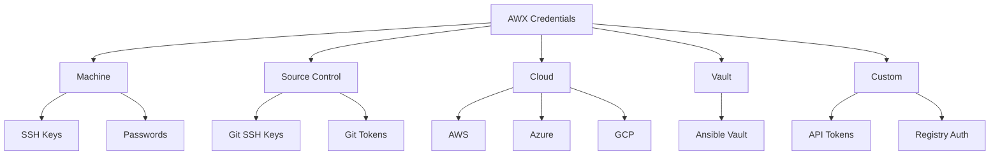

# How to Create Credentials in AWX

Author: [nawazdhandala](https://www.github.com/nawazdhandala)

Tags: Ansible, AWX, Credentials, Security, Secrets Management

Description: Create and manage AWX credentials for SSH, cloud providers, vault passwords, and custom credential types with secure practices.

---

Credentials in AWX store the authentication details that Ansible needs to connect to managed hosts, cloud APIs, source control systems, and vault passwords. AWX encrypts credential secrets in the database, so they never appear in plain text in the UI or API responses. This post covers creating different credential types, managing them securely, and building custom credential types for your specific needs.

## Credential Types Overview

AWX supports many built-in credential types. The most commonly used ones are:



## Machine Credentials (SSH)

Machine credentials are used to connect to managed hosts via SSH.

### SSH Key Authentication

```yaml
# create-credentials.yml
---
- name: Configure AWX Credentials
  hosts: localhost
  connection: local
  collections:
    - awx.awx

  vars:
    awx_host: "https://awx.example.com"
    awx_token: "{{ lookup('env', 'AWX_TOKEN') }}"

  tasks:
    - name: Create SSH key credential
      awx.awx.credential:
        controller_host: "{{ awx_host }}"
        controller_oauthtoken: "{{ awx_token }}"
        name: "Production SSH Key"
        description: "SSH key for production server access"
        organization: "Default"
        credential_type: "Machine"
        inputs:
          username: deploy
          ssh_key_data: "{{ lookup('file', '~/.ssh/production_key') }}"
          # Optional: passphrase for the SSH key
          ssh_key_unlock: "{{ lookup('env', 'SSH_KEY_PASSPHRASE') }}"
          # Optional: become method
          become_method: sudo
          become_username: root
          become_password: ""
        state: present
```

### Password Authentication

```yaml
    - name: Create password-based credential
      awx.awx.credential:
        controller_host: "{{ awx_host }}"
        controller_oauthtoken: "{{ awx_token }}"
        name: "Windows Server Credential"
        description: "WinRM credential for Windows servers"
        organization: "Default"
        credential_type: "Machine"
        inputs:
          username: "Administrator"
          password: "{{ lookup('env', 'WIN_ADMIN_PASSWORD') }}"
        state: present
```

### Via the API

```bash
# Create an SSH key credential via API
curl -X POST "https://awx.example.com/api/v2/credentials/" \
  -H "Content-Type: application/json" \
  -H "Authorization: Bearer $AWX_TOKEN" \
  -d '{
    "name": "Production SSH Key",
    "description": "SSH key for production access",
    "organization": 1,
    "credential_type": 1,
    "inputs": {
      "username": "deploy",
      "ssh_key_data": "'"$(cat ~/.ssh/production_key)"'",
      "become_method": "sudo"
    }
  }'
```

## Source Control Credentials

Used for accessing private Git repositories in AWX projects.

```yaml
    - name: Create GitHub SSH credential
      awx.awx.credential:
        controller_host: "{{ awx_host }}"
        controller_oauthtoken: "{{ awx_token }}"
        name: "GitHub SSH Key"
        description: "Deploy key for GitHub repositories"
        organization: "Default"
        credential_type: "Source Control"
        inputs:
          username: git
          ssh_key_data: "{{ lookup('file', '~/.ssh/github_deploy_key') }}"
        state: present

    - name: Create GitHub Personal Access Token credential
      awx.awx.credential:
        controller_host: "{{ awx_host }}"
        controller_oauthtoken: "{{ awx_token }}"
        name: "GitHub PAT"
        description: "Personal access token for GitHub"
        organization: "Default"
        credential_type: "Source Control"
        inputs:
          username: "oauth2"
          password: "{{ lookup('env', 'GITHUB_TOKEN') }}"
        state: present
```

## Cloud Credentials

### AWS Credentials

```yaml
    - name: Create AWS credential
      awx.awx.credential:
        controller_host: "{{ awx_host }}"
        controller_oauthtoken: "{{ awx_token }}"
        name: "AWS Production"
        description: "AWS access for production account"
        organization: "Default"
        credential_type: "Amazon Web Services"
        inputs:
          username: "{{ lookup('env', 'AWS_ACCESS_KEY_ID') }}"
          password: "{{ lookup('env', 'AWS_SECRET_ACCESS_KEY') }}"
          # Optional: for cross-account access
          security_token: ""
        state: present
```

### Azure Credentials

```yaml
    - name: Create Azure credential
      awx.awx.credential:
        controller_host: "{{ awx_host }}"
        controller_oauthtoken: "{{ awx_token }}"
        name: "Azure Service Principal"
        description: "Azure SP for production subscription"
        organization: "Default"
        credential_type: "Microsoft Azure Resource Manager"
        inputs:
          subscription: "{{ lookup('env', 'AZURE_SUBSCRIPTION_ID') }}"
          tenant: "{{ lookup('env', 'AZURE_TENANT_ID') }}"
          client: "{{ lookup('env', 'AZURE_CLIENT_ID') }}"
          secret: "{{ lookup('env', 'AZURE_CLIENT_SECRET') }}"
        state: present
```

### GCP Credentials

```yaml
    - name: Create GCP credential
      awx.awx.credential:
        controller_host: "{{ awx_host }}"
        controller_oauthtoken: "{{ awx_token }}"
        name: "GCP Service Account"
        description: "GCP SA for production project"
        organization: "Default"
        credential_type: "Google Compute Engine"
        inputs:
          username: "{{ lookup('env', 'GCP_SERVICE_ACCOUNT_EMAIL') }}"
          project: "{{ lookup('env', 'GCP_PROJECT_ID') }}"
          ssh_key_data: "{{ lookup('file', '/path/to/gcp-sa-key.json') }}"
        state: present
```

## Vault Credentials

For decrypting Ansible Vault encrypted files.

```yaml
    - name: Create vault credential
      awx.awx.credential:
        controller_host: "{{ awx_host }}"
        controller_oauthtoken: "{{ awx_token }}"
        name: "Ansible Vault Password"
        description: "Vault password for encrypted variables"
        organization: "Default"
        credential_type: "Vault"
        inputs:
          vault_password: "{{ lookup('env', 'ANSIBLE_VAULT_PASSWORD') }}"
          # Optional: vault ID for multi-vault setups
          vault_id: "production"
        state: present
```

## Custom Credential Types

When the built-in types do not cover your needs, create custom credential types. This is useful for API tokens, registry credentials, or application-specific secrets.

### Define the Custom Type

```yaml
    - name: Create custom credential type for Datadog
      awx.awx.credential_type:
        controller_host: "{{ awx_host }}"
        controller_oauthtoken: "{{ awx_token }}"
        name: "Datadog API"
        description: "Datadog API and application keys"
        kind: cloud
        inputs:
          fields:
            - id: api_key
              type: string
              label: "API Key"
              secret: true
            - id: app_key
              type: string
              label: "Application Key"
              secret: true
            - id: site
              type: string
              label: "Datadog Site"
              default: "datadoghq.com"
          required:
            - api_key
            - app_key
        injectors:
          env:
            DD_API_KEY: "{{ '{{' }} api_key {{ '}}' }}"
            DD_APP_KEY: "{{ '{{' }} app_key {{ '}}' }}"
            DD_SITE: "{{ '{{' }} site {{ '}}' }}"
        state: present

    - name: Create Datadog credential
      awx.awx.credential:
        controller_host: "{{ awx_host }}"
        controller_oauthtoken: "{{ awx_token }}"
        name: "Datadog Production"
        description: "Datadog keys for production monitoring"
        organization: "Default"
        credential_type: "Datadog API"
        inputs:
          api_key: "{{ lookup('env', 'DD_API_KEY') }}"
          app_key: "{{ lookup('env', 'DD_APP_KEY') }}"
          site: "datadoghq.com"
        state: present
```

### Custom Type for Container Registry

```yaml
    - name: Create container registry credential type
      awx.awx.credential_type:
        controller_host: "{{ awx_host }}"
        controller_oauthtoken: "{{ awx_token }}"
        name: "Container Registry"
        kind: cloud
        inputs:
          fields:
            - id: registry_url
              type: string
              label: "Registry URL"
            - id: registry_username
              type: string
              label: "Username"
            - id: registry_password
              type: string
              label: "Password"
              secret: true
          required:
            - registry_url
            - registry_username
            - registry_password
        injectors:
          env:
            REGISTRY_URL: "{{ '{{' }} registry_url {{ '}}' }}"
            REGISTRY_USERNAME: "{{ '{{' }} registry_username {{ '}}' }}"
            REGISTRY_PASSWORD: "{{ '{{' }} registry_password {{ '}}' }}"
          extra_vars:
            docker_registry_url: "{{ '{{' }} registry_url {{ '}}' }}"
            docker_registry_username: "{{ '{{' }} registry_username {{ '}}' }}"
            docker_registry_password: "{{ '{{' }} registry_password {{ '}}' }}"
        state: present
```

The injectors section is crucial. It defines how credential values get passed to playbooks. You can inject them as:

- **Environment variables** (`env`): Available as shell environment variables
- **Extra variables** (`extra_vars`): Available as Ansible variables
- **File** (`file`): Written to a temporary file, path passed as a variable

## Credential Lookup from External Vaults

AWX supports external credential lookups from HashiCorp Vault, CyberArk, and Azure Key Vault.

```yaml
    - name: Create HashiCorp Vault lookup credential
      awx.awx.credential:
        controller_host: "{{ awx_host }}"
        controller_oauthtoken: "{{ awx_token }}"
        name: "HashiCorp Vault Lookup"
        description: "Lookup secrets from HashiCorp Vault"
        organization: "Default"
        credential_type: "HashiCorp Vault Secret Lookup"
        inputs:
          url: "https://vault.example.com"
          token: "{{ lookup('env', 'VAULT_TOKEN') }}"
          api_version: "v2"
        state: present
```

Then link other credentials to use this lookup.

```yaml
    - name: Create machine credential with vault lookup
      awx.awx.credential:
        controller_host: "{{ awx_host }}"
        controller_oauthtoken: "{{ awx_token }}"
        name: "Server SSH Key (from Vault)"
        organization: "Default"
        credential_type: "Machine"
        inputs:
          username: deploy
          ssh_key_data: "{{ lookup('env', 'SSH_KEY_PLACEHOLDER') }}"
        credential_input_sources:
          - source_credential: "HashiCorp Vault Lookup"
            target_field: "ssh_key_data"
            metadata:
              secret_path: "secret/data/ansible/ssh-keys"
              secret_key: "production_key"
        state: present
```

## Best Practices

1. **Use organizations to scope credentials.** Do not share production credentials with development teams.

2. **Rotate credentials regularly.** Use the API to update credential inputs without disrupting job templates.

3. **Audit credential usage.** AWX logs which jobs use which credentials. Review these logs periodically.

4. **Use external vault lookups for production.** Instead of storing secrets directly in AWX, pull them from HashiCorp Vault or similar systems.

5. **Name credentials descriptively.** Include the environment and purpose in the name: "AWS Production - Deploy Role" is better than "AWS Keys".

6. **Limit credential access.** Use AWX's RBAC to restrict who can use or view each credential.

```bash
# Grant a team permission to use a credential
curl -X POST "https://awx.example.com/api/v2/credentials/1/object_roles/" \
  -H "Content-Type: application/json" \
  -H "Authorization: Bearer $AWX_TOKEN" \
  -d '{"id": 1, "content_type": "credential", "role_field": "use_role"}'
```

Credentials are the most security-sensitive objects in AWX. Take the time to set them up properly with appropriate access controls, use external vault lookups for production environments, and create custom credential types for anything that does not fit the built-in types.
