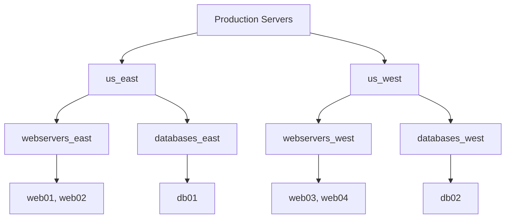

# How to Create Inventories in AWX

Author: [nawazdhandala](https://www.github.com/nawazdhandala)

Tags: Ansible, AWX, Inventory, Dynamic Inventory, Infrastructure

Description: Create static and dynamic inventories in AWX including smart inventories, constructed inventories, and cloud-sourced host lists.

---

Inventories in AWX define which hosts your playbooks run against. Unlike command-line Ansible where you point to an inventory file, AWX manages inventories as database objects with a web interface and API. You can create static inventories with manually added hosts, dynamic inventories that pull from cloud providers, and smart inventories that filter hosts based on criteria. This post covers all of these approaches.

## Static Inventories

Static inventories are the simplest type. You define hosts and groups manually.

### Creating via the API

```bash
# Create an inventory
curl -X POST "https://awx.example.com/api/v2/inventories/" \
  -H "Content-Type: application/json" \
  -H "Authorization: Bearer $AWX_TOKEN" \
  -d '{
    "name": "Production Servers",
    "description": "All production infrastructure",
    "organization": 1
  }'

# Add a group to the inventory
curl -X POST "https://awx.example.com/api/v2/inventories/1/groups/" \
  -H "Content-Type: application/json" \
  -H "Authorization: Bearer $AWX_TOKEN" \
  -d '{
    "name": "webservers",
    "description": "Web server group"
  }'

# Add a host to the group
curl -X POST "https://awx.example.com/api/v2/groups/1/hosts/" \
  -H "Content-Type: application/json" \
  -H "Authorization: Bearer $AWX_TOKEN" \
  -d '{
    "name": "web01.example.com",
    "description": "Primary web server",
    "variables": "ansible_host: 10.0.1.10\nhttp_port: 8080"
  }'
```

### Creating with Ansible

```yaml
# create-inventories.yml
---
- name: Configure AWX Inventories
  hosts: localhost
  connection: local
  collections:
    - awx.awx

  vars:
    awx_host: "https://awx.example.com"
    awx_token: "{{ lookup('env', 'AWX_TOKEN') }}"

  tasks:
    - name: Create production inventory
      awx.awx.inventory:
        controller_host: "{{ awx_host }}"
        controller_oauthtoken: "{{ awx_token }}"
        name: "Production Servers"
        description: "Production infrastructure inventory"
        organization: "Default"
        state: present

    - name: Create web servers group
      awx.awx.group:
        controller_host: "{{ awx_host }}"
        controller_oauthtoken: "{{ awx_token }}"
        name: "webservers"
        inventory: "Production Servers"
        description: "Web server tier"
        variables:
          http_port: 80
          https_port: 443
        state: present

    - name: Create database servers group
      awx.awx.group:
        controller_host: "{{ awx_host }}"
        controller_oauthtoken: "{{ awx_token }}"
        name: "databases"
        inventory: "Production Servers"
        description: "Database tier"
        variables:
          postgres_port: 5432
        state: present

    - name: Add web hosts
      awx.awx.host:
        controller_host: "{{ awx_host }}"
        controller_oauthtoken: "{{ awx_token }}"
        name: "{{ item.name }}"
        inventory: "Production Servers"
        variables:
          ansible_host: "{{ item.ip }}"
          datacenter: "{{ item.dc }}"
        state: present
      loop:
        - { name: "web01.example.com", ip: "10.0.1.10", dc: "us-east" }
        - { name: "web02.example.com", ip: "10.0.1.11", dc: "us-east" }
        - { name: "web03.example.com", ip: "10.0.2.10", dc: "us-west" }

    - name: Add hosts to web servers group
      awx.awx.group:
        controller_host: "{{ awx_host }}"
        controller_oauthtoken: "{{ awx_token }}"
        name: "webservers"
        inventory: "Production Servers"
        hosts:
          - "web01.example.com"
          - "web02.example.com"
          - "web03.example.com"
        state: present

    - name: Add database hosts
      awx.awx.host:
        controller_host: "{{ awx_host }}"
        controller_oauthtoken: "{{ awx_token }}"
        name: "{{ item.name }}"
        inventory: "Production Servers"
        variables:
          ansible_host: "{{ item.ip }}"
          postgres_role: "{{ item.role }}"
        state: present
      loop:
        - { name: "db01.example.com", ip: "10.0.3.10", role: "primary" }
        - { name: "db02.example.com", ip: "10.0.3.11", role: "replica" }
```

## Dynamic Inventories

Dynamic inventories automatically discover hosts from external sources like AWS, Azure, GCP, or VMware.

### AWS EC2 Dynamic Inventory

```yaml
- name: Create AWS dynamic inventory
  awx.awx.inventory:
    controller_host: "{{ awx_host }}"
    controller_oauthtoken: "{{ awx_token }}"
    name: "AWS Production"
    description: "Dynamic inventory from AWS EC2"
    organization: "Default"
    state: present

- name: Add AWS inventory source
  awx.awx.inventory_source:
    controller_host: "{{ awx_host }}"
    controller_oauthtoken: "{{ awx_token }}"
    name: "AWS EC2 Source"
    inventory: "AWS Production"
    source: "ec2"
    credential: "AWS Access Keys"
    source_vars:
      regions:
        - us-east-1
        - us-west-2
      filters:
        tag:Environment:
          - production
        instance-state-name:
          - running
      keyed_groups:
        - key: tags.Role
          prefix: role
          separator: "_"
        - key: placement.region
          prefix: region
      hostnames:
        - tag:Name
        - private-ip-address
      compose:
        ansible_host: private_ip_address
    update_on_launch: true
    overwrite: true
    state: present
```

### Azure Dynamic Inventory

```yaml
- name: Create Azure dynamic inventory
  awx.awx.inventory:
    controller_host: "{{ awx_host }}"
    controller_oauthtoken: "{{ awx_token }}"
    name: "Azure Production"
    organization: "Default"
    state: present

- name: Add Azure inventory source
  awx.awx.inventory_source:
    controller_host: "{{ awx_host }}"
    controller_oauthtoken: "{{ awx_token }}"
    name: "Azure VMs"
    inventory: "Azure Production"
    source: "azure_rm"
    credential: "Azure Service Principal"
    source_vars:
      include_vm_resource_groups:
        - production-rg
      keyed_groups:
        - key: tags.role | default('untagged')
          prefix: role
        - key: location
          prefix: location
      hostnames:
        - name
        - private_ipv4_addresses | first
      compose:
        ansible_host: private_ipv4_addresses | first
    update_on_launch: true
    state: present
```

## Inventory Hierarchy

AWX inventories support nested groups, which is useful for organizing complex infrastructure.



```yaml
- name: Create parent group
  awx.awx.group:
    controller_host: "{{ awx_host }}"
    controller_oauthtoken: "{{ awx_token }}"
    name: "us_east"
    inventory: "Production Servers"
    state: present

- name: Create child group
  awx.awx.group:
    controller_host: "{{ awx_host }}"
    controller_oauthtoken: "{{ awx_token }}"
    name: "webservers_east"
    inventory: "Production Servers"
    children:
      - "us_east"
    state: present
```

## Smart Inventories

Smart inventories use filters to dynamically group hosts from other inventories. They do not own hosts; they reference them.

```yaml
- name: Create smart inventory for patching
  awx.awx.inventory:
    controller_host: "{{ awx_host }}"
    controller_oauthtoken: "{{ awx_token }}"
    name: "Servers Needing Patches"
    description: "All servers tagged for patching"
    organization: "Default"
    kind: "smart"
    host_filter: "groups__name=patch_tuesday and ansible_facts__os_family=Debian"
    state: present
```

Smart inventory filters support:

- `name__contains=web` - Hosts with "web" in the name
- `groups__name=databases` - Hosts in the "databases" group
- `ansible_facts__os_family=RedHat` - Hosts running RedHat family OS
- Multiple filters combined with `and` / `or`

## Constructed Inventories

Constructed inventories combine multiple inventories and apply grouping logic.

```yaml
- name: Create constructed inventory
  awx.awx.inventory:
    controller_host: "{{ awx_host }}"
    controller_oauthtoken: "{{ awx_token }}"
    name: "All Environments"
    description: "Constructed inventory from all environment inventories"
    organization: "Default"
    kind: "constructed"
    state: present
```

Configure the constructed inventory source.

```yaml
- name: Configure constructed inventory source
  awx.awx.inventory_source:
    controller_host: "{{ awx_host }}"
    controller_oauthtoken: "{{ awx_token }}"
    name: "Constructed Source"
    inventory: "All Environments"
    source: "constructed"
    source_vars:
      strict: false
      groups:
        # Create a group of all web servers across all inventories
        all_webservers: "'webservers' in group_names"
        # Create a group based on OS
        linux_servers: "ansible_os_family == 'Debian' or ansible_os_family == 'RedHat'"
      compose:
        # Set variables based on existing data
        env: "inventory_name | regex_replace(' .*', '') | lower"
    limit: ""
    update_on_launch: true
    state: present
```

## Inventory Variables

Set variables at different levels of the inventory hierarchy.

```yaml
# Inventory-level variables (apply to all hosts)
- name: Set inventory variables
  awx.awx.inventory:
    controller_host: "{{ awx_host }}"
    controller_oauthtoken: "{{ awx_token }}"
    name: "Production Servers"
    organization: "Default"
    variables:
      ansible_user: deploy
      ansible_become: true
      ntp_server: time.example.com
    state: present

# Group-level variables
- name: Set group variables
  awx.awx.group:
    controller_host: "{{ awx_host }}"
    controller_oauthtoken: "{{ awx_token }}"
    name: "webservers"
    inventory: "Production Servers"
    variables:
      nginx_worker_processes: auto
      max_open_files: 65535
    state: present

# Host-level variables (highest precedence)
- name: Set host variables
  awx.awx.host:
    controller_host: "{{ awx_host }}"
    controller_oauthtoken: "{{ awx_token }}"
    name: "web01.example.com"
    inventory: "Production Servers"
    variables:
      ansible_host: 10.0.1.10
      is_primary: true
      custom_port: 8443
    state: present
```

## Syncing Inventory Sources

Trigger manual syncs for dynamic inventories.

```bash
# Sync an inventory source via API
curl -X POST "https://awx.example.com/api/v2/inventory_sources/1/update/" \
  -H "Authorization: Bearer $AWX_TOKEN"

# Check sync status
curl -s "https://awx.example.com/api/v2/inventory_sources/1/" \
  -H "Authorization: Bearer $AWX_TOKEN" | jq '.status, .last_job_run'
```

AWX inventories give you a central, auditable record of what infrastructure you manage. Static inventories work for stable environments, dynamic inventories keep your host list current with cloud infrastructure, and smart/constructed inventories let you slice and dice hosts across multiple sources. Start with static inventories to learn the system, then move to dynamic sources as your infrastructure grows.
