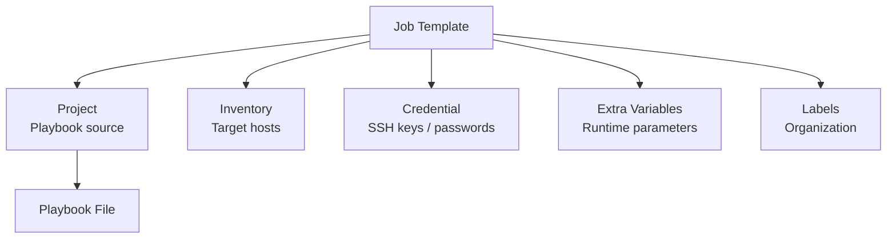

# How to Create Job Templates in AWX

Author: [nawazdhandala](https://www.github.com/nawazdhandala)

Tags: Ansible, AWX, Job Templates, Automation, Playbooks

Description: Create and configure AWX job templates to run Ansible playbooks with inventories, credentials, and extra variables.

---

Job templates are the core building block of AWX. They combine a project (your playbooks), an inventory (your hosts), credentials (authentication), and configuration into a runnable unit. When someone clicks "Launch" on a job template, AWX runs the specified playbook against the specified inventory with the specified credentials. This post covers creating job templates through the UI, API, and Ansible, along with advanced configuration options.

## Job Template Anatomy

A job template ties together several AWX objects.



At minimum, you need a project, a playbook from that project, and an inventory. Credentials are optional but needed for anything beyond localhost.

## Creating a Job Template via the API

Here is how to create a basic job template using the AWX API.

```bash
# Create a job template
curl -X POST "https://awx.example.com/api/v2/job_templates/" \
  -H "Content-Type: application/json" \
  -H "Authorization: Bearer $AWX_TOKEN" \
  -d '{
    "name": "Deploy Web Application",
    "description": "Deploys the web application to production servers",
    "job_type": "run",
    "inventory": 1,
    "project": 1,
    "playbook": "playbooks/deploy-web.yml",
    "credential": 1,
    "verbosity": 0,
    "forks": 5,
    "limit": "",
    "extra_vars": "---\napp_version: latest\nforce_restart: false",
    "ask_variables_on_launch": true,
    "ask_limit_on_launch": true,
    "ask_credential_on_launch": false,
    "become_enabled": true
  }'
```

## Creating Job Templates with Ansible

Using the `awx.awx` collection is the best way to manage job templates as code.

```yaml
# create-job-templates.yml
---
- name: Configure AWX Job Templates
  hosts: localhost
  connection: local
  collections:
    - awx.awx

  vars:
    awx_host: "https://awx.example.com"
    awx_token: "{{ lookup('env', 'AWX_TOKEN') }}"

  tasks:
    - name: Create web deployment job template
      awx.awx.job_template:
        controller_host: "{{ awx_host }}"
        controller_oauthtoken: "{{ awx_token }}"
        name: "Deploy Web Application"
        description: "Deploy the web app to target servers"
        organization: "Default"
        project: "Infrastructure Playbooks"
        playbook: "playbooks/deploy-web.yml"
        inventory: "Production Servers"
        credential: "SSH Production Key"
        job_type: "run"
        verbosity: 0
        forks: 10
        become_enabled: true
        ask_variables_on_launch: true
        ask_limit_on_launch: true
        extra_vars:
          app_version: "latest"
          force_restart: false
          deploy_environment: "production"
        state: present

    - name: Create database backup job template
      awx.awx.job_template:
        controller_host: "{{ awx_host }}"
        controller_oauthtoken: "{{ awx_token }}"
        name: "Backup Databases"
        description: "Run database backup across all database servers"
        organization: "Default"
        project: "Infrastructure Playbooks"
        playbook: "playbooks/backup-databases.yml"
        inventory: "Database Servers"
        credential: "SSH Production Key"
        job_type: "run"
        forks: 3
        become_enabled: true
        ask_variables_on_launch: false
        extra_vars:
          backup_retention_days: 30
          backup_path: "/backups/postgres"
        state: present

    - name: Create server patching job template
      awx.awx.job_template:
        controller_host: "{{ awx_host }}"
        controller_oauthtoken: "{{ awx_token }}"
        name: "Patch Servers"
        description: "Apply OS patches and security updates"
        organization: "Default"
        project: "Infrastructure Playbooks"
        playbook: "playbooks/patch-servers.yml"
        inventory: "All Servers"
        credential: "SSH Production Key"
        job_type: "run"
        forks: 5
        become_enabled: true
        ask_limit_on_launch: true
        ask_variables_on_launch: true
        extra_vars:
          reboot_if_required: false
          exclude_packages: []
        state: present
```

## Job Template Configuration Options

### Job Type

```yaml
# "run" - Normal execution
job_type: "run"

# "check" - Dry run (like ansible-playbook --check)
job_type: "check"
```

### Verbosity Levels

```yaml
# 0 - Normal (default)
# 1 - Verbose (-v)
# 2 - More verbose (-vv)
# 3 - Debug (-vvv)
# 4 - Connection debug (-vvvv)
# 5 - WinRM debug (-vvvvv)
verbosity: 1
```

### Forks

Controls how many hosts Ansible manages in parallel.

```yaml
# Default is 5, increase for large inventories
forks: 20
```

### Limit

Restrict execution to specific hosts or groups.

```yaml
# Can be set at template level or asked at launch time
limit: "web_servers:&us_east"
ask_limit_on_launch: true
```

### Extra Variables

Pass variables to the playbook at launch time.

```yaml
extra_vars:
  app_version: "2.5.0"
  deploy_environment: "staging"
  enable_debug: false
  server_list:
    - web01
    - web02
    - web03
```

## Prompt on Launch Settings

These settings control what users can override when launching a job.

```yaml
- name: Job template with launch prompts
  awx.awx.job_template:
    controller_host: "{{ awx_host }}"
    controller_oauthtoken: "{{ awx_token }}"
    name: "Flexible Deployment"
    project: "Infrastructure Playbooks"
    playbook: "playbooks/deploy.yml"
    inventory: "All Servers"

    # What can be changed at launch time
    ask_variables_on_launch: true     # User can add/modify extra vars
    ask_limit_on_launch: true         # User can specify host limit
    ask_credential_on_launch: true    # User can change credentials
    ask_inventory_on_launch: true     # User can choose different inventory
    ask_scm_branch_on_launch: true    # User can specify a different branch
    ask_job_type_on_launch: true      # User can switch between run/check
    ask_verbosity_on_launch: true     # User can change verbosity

    state: present
```

This creates a flexible template that different team members can customize at runtime without creating separate templates for each variation.

## Multiple Credentials

Job templates can use multiple credentials of different types.

```yaml
- name: Job template with multiple credentials
  awx.awx.job_template:
    controller_host: "{{ awx_host }}"
    controller_oauthtoken: "{{ awx_token }}"
    name: "Deploy to Cloud"
    project: "Cloud Automation"
    playbook: "playbooks/deploy-cloud.yml"
    inventory: "AWS Inventory"
    credentials:
      - "SSH Production Key"      # Machine credential for SSH
      - "AWS Access Keys"          # Cloud credential for AWS API
      - "Ansible Vault Password"   # Vault credential for secrets
    state: present
```

## Surveys

Surveys provide a form-based interface for users to input variables at launch time. They are more user-friendly than raw extra variables.

```yaml
- name: Job template with survey
  awx.awx.job_template:
    controller_host: "{{ awx_host }}"
    controller_oauthtoken: "{{ awx_token }}"
    name: "Deploy Application"
    project: "Infrastructure Playbooks"
    playbook: "playbooks/deploy-app.yml"
    inventory: "Production Servers"
    credential: "SSH Production Key"
    survey_enabled: true
    survey_spec:
      name: "Deployment Parameters"
      description: "Configure the deployment"
      spec:
        - question_name: "Application Version"
          question_description: "Version to deploy (e.g., 2.5.0)"
          variable: "app_version"
          type: "text"
          required: true
          default: "latest"

        - question_name: "Environment"
          question_description: "Target environment"
          variable: "deploy_env"
          type: "multiplechoice"
          required: true
          choices:
            - "staging"
            - "production"
          default: "staging"

        - question_name: "Force Restart"
          question_description: "Restart services even if no changes"
          variable: "force_restart"
          type: "multiplechoice"
          required: true
          choices:
            - "true"
            - "false"
          default: "false"

        - question_name: "Notification Email"
          question_description: "Email for deployment notification"
          variable: "notify_email"
          type: "text"
          required: false
          default: ""

    state: present
```

## Launching a Job Template

Launch a job template via the API.

```bash
# Launch with default settings
curl -X POST "https://awx.example.com/api/v2/job_templates/1/launch/" \
  -H "Content-Type: application/json" \
  -H "Authorization: Bearer $AWX_TOKEN"

# Launch with extra variables
curl -X POST "https://awx.example.com/api/v2/job_templates/1/launch/" \
  -H "Content-Type: application/json" \
  -H "Authorization: Bearer $AWX_TOKEN" \
  -d '{
    "extra_vars": {"app_version": "2.5.0", "force_restart": true},
    "limit": "web_servers"
  }'
```

Launch with Ansible.

```yaml
- name: Launch the deployment
  awx.awx.job_launch:
    controller_host: "{{ awx_host }}"
    controller_oauthtoken: "{{ awx_token }}"
    job_template: "Deploy Web Application"
    extra_vars:
      app_version: "2.5.0"
    wait: true
    timeout: 600
  register: job_result

- name: Show job result
  ansible.builtin.debug:
    msg: "Job {{ job_result.id }} finished with status: {{ job_result.status }}"
```

## Scheduling Job Templates

Add schedules to run templates automatically.

```yaml
- name: Schedule nightly backup
  awx.awx.schedule:
    controller_host: "{{ awx_host }}"
    controller_oauthtoken: "{{ awx_token }}"
    name: "Nightly Database Backup"
    unified_job_template: "Backup Databases"
    rrule: "DTSTART:20260221T020000Z RRULE:FREQ=DAILY;INTERVAL=1"
    enabled: true
    state: present

- name: Schedule weekly patching
  awx.awx.schedule:
    controller_host: "{{ awx_host }}"
    controller_oauthtoken: "{{ awx_token }}"
    name: "Weekly Patching - Staging"
    unified_job_template: "Patch Servers"
    rrule: "DTSTART:20260222T060000Z RRULE:FREQ=WEEKLY;BYDAY=SU"
    enabled: true
    extra_data:
      reboot_if_required: true
    state: present
```

Job templates are how you expose Ansible automation to your team in a controlled, repeatable way. Take time to set up surveys for templates that non-technical users will run, use launch prompts for templates that need flexibility, and configure multiple credentials when your playbooks interact with different systems.
